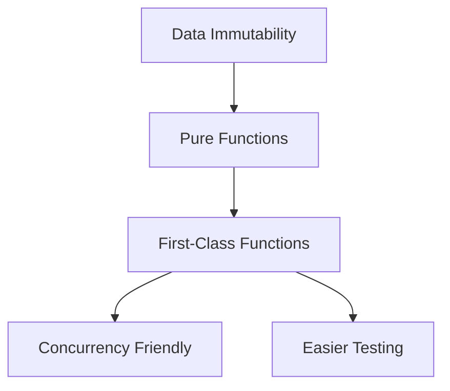

## 10.1 Introduction to Functional Programming in Dart

Functional programming (FP) is a paradigm that treats computation as the evaluation of mathematical functions and avoids changing state or mutable data. In Dart, a language primarily known for its object-oriented features, functional programming can be a powerful tool to write clean, efficient, and maintainable code. This section will guide you through the core concepts of functional programming in Dart, including immutability, pure functions, and first-class functions, and explain how these principles can benefit your software development process.

### Core Concepts of Functional Programming

#### Immutability

Immutability is a cornerstone of functional programming. It refers to the idea that once a data structure is created, it cannot be changed. Instead of modifying existing data, you create new data structures with the desired changes. This approach can lead to safer and more predictable code, as it eliminates side effects caused by shared mutable state.

**Example: Immutable Data Structures in Dart**

```dart
void main() {
  final List<int> originalList = [1, 2, 3];
  final List<int> newList = List.from(originalList)..add(4);

  print('Original List: $originalList'); // Output: Original List: [1, 2, 3]
  print('New List: $newList'); // Output: New List: [1, 2, 3, 4]
}
```

In this example, `originalList` remains unchanged, demonstrating immutability. We create a new list, `newList`, by copying `originalList` and adding a new element.

#### Pure Functions

A pure function is a function where the output value is determined only by its input values, without observable side effects. This means that calling a pure function with the same arguments will always produce the same result, making them predictable and easier to test.

**Example: Pure Functions in Dart**

```dart
int add(int a, int b) {
  return a + b;
}

void main() {
  print(add(2, 3)); // Output: 5
  print(add(2, 3)); // Output: 5
}
```

The `add` function is pure because it consistently returns the same result for the same inputs and does not modify any external state.

#### First-Class Functions

In Dart, functions are first-class citizens, meaning they can be assigned to variables, passed as arguments, and returned from other functions. This feature allows for higher-order functions and more flexible code design.

**Example: First-Class Functions in Dart**

```dart
void main() {
  Function multiply = (int a, int b) => a * b;
  print(multiply(3, 4)); // Output: 12

  List<int> numbers = [1, 2, 3];
  numbers.forEach((number) => print(number * 2)); // Output: 2, 4, 6
}
```

Here, `multiply` is a function assigned to a variable, and we use a function as an argument in `forEach`.

### Benefits of Functional Programming in Dart

#### Easier Testing

Functional programming promotes the use of pure functions, which are inherently easier to test due to their predictable outputs. This predictability reduces the complexity of unit tests and improves code reliability.

#### Concurrency Friendly

Immutability and pure functions reduce issues related to shared state, making functional programming naturally suited for concurrent and parallel execution. This can lead to more efficient and safer concurrent applications.

### Visualizing Functional Programming Concepts

To better understand these concepts, let's visualize the relationship between data immutability, pure functions, and first-class functions.



**Figure 1**: This diagram illustrates how data immutability supports the creation of pure functions, which in turn leverage first-class functions to enhance concurrency and testing.

### Applying Functional Programming in Dart

#### Using Immutability

To embrace immutability in Dart, prefer using `final` and `const` keywords to declare variables and data structures that should not change. Use immutable collections and avoid modifying existing objects.

#### Writing Pure Functions

Focus on writing functions that do not rely on or modify external state. Ensure that functions return values based solely on their input parameters.

#### Leveraging First-Class Functions

Take advantage of Dart's support for first-class functions by using higher-order functions, callbacks, and closures to create flexible and reusable code.

### Code Examples and Exercises

Let's explore more examples and exercises to solidify your understanding of functional programming in Dart.

**Example: Higher-Order Functions**

```dart
List<int> applyFunction(List<int> numbers, Function(int) operation) {
  return numbers.map(operation).toList();
}

void main() {
  List<int> numbers = [1, 2, 3];
  List<int> doubled = applyFunction(numbers, (n) => n * 2);
  print(doubled); // Output: [2, 4, 6]
}
```

In this example, `applyFunction` is a higher-order function that takes another function as an argument and applies it to each element in a list.

**Try It Yourself**

Modify the `applyFunction` example to filter out even numbers from the list instead of doubling them. Experiment with different operations to see how higher-order functions can be used in various scenarios.

### Knowledge Check

To ensure you've grasped the core concepts of functional programming in Dart, consider the following questions:

- What is immutability, and why is it important in functional programming?
- How do pure functions differ from impure functions?
- What are first-class functions, and how do they enhance code flexibility?

### Embrace the Journey

Remember, mastering functional programming in Dart is a journey. As you continue to explore and apply these concepts, you'll discover new ways to write more efficient and maintainable code. Keep experimenting, stay curious, and enjoy the process!

### References and Further Reading

For more information on functional programming and its application in Dart, consider exploring the following resources:

- [Dart Language Tour](https://dart.dev/guides/language/language-tour)
- [Functional Programming in Dart](https://dart.dev/guides/language/language-tour#functions)
- [MDN Web Docs on Functional Programming](https://developer.mozilla.org/en-US/docs/Glossary/Functional_programming)

## Quiz Time!



### What is a key characteristic of immutability in functional programming?

- [x] Data structures cannot be changed once created.
- [ ] Functions can modify global variables.
- [ ] Variables can be reassigned freely.
- [ ] State changes are encouraged.

> **Explanation:** Immutability means that once a data structure is created, it cannot be changed, which helps prevent side effects.

### What defines a pure function?

- [x] It returns the same result for the same inputs without side effects.
- [ ] It can modify external state.
- [ ] It relies on global variables.
- [ ] It produces different outputs for the same inputs.

> **Explanation:** A pure function consistently returns the same result for the same inputs and does not cause side effects.

### How are functions treated in Dart?

- [x] As first-class citizens.
- [ ] As second-class citizens.
- [ ] As immutable objects.
- [ ] As global variables.

> **Explanation:** In Dart, functions are first-class citizens, meaning they can be assigned to variables, passed as arguments, and returned from other functions.

### What is a benefit of using pure functions?

- [x] Easier testing due to predictable outputs.
- [ ] Increased complexity in code.
- [ ] More side effects.
- [ ] Unpredictable behavior.

> **Explanation:** Pure functions have predictable outputs, making them easier to test and debug.

### Which concept helps in reducing issues with shared state in concurrent programming?

- [x] Immutability
- [ ] Mutable state
- [ ] Global variables
- [ ] Side effects

> **Explanation:** Immutability reduces issues with shared state, making concurrent programming safer and more efficient.

### What is a higher-order function?

- [x] A function that takes another function as an argument or returns a function.
- [ ] A function that modifies global variables.
- [ ] A function that cannot be passed as an argument.
- [ ] A function that is always pure.

> **Explanation:** A higher-order function is one that takes another function as an argument or returns a function.

### What is the role of the `final` keyword in Dart?

- [x] It declares a variable that cannot be reassigned.
- [ ] It allows a variable to be mutable.
- [ ] It makes a function pure.
- [ ] It creates a global variable.

> **Explanation:** The `final` keyword in Dart declares a variable that cannot be reassigned, promoting immutability.

### What is a common use of first-class functions?

- [x] Creating flexible and reusable code.
- [ ] Increasing code complexity.
- [ ] Modifying external state.
- [ ] Reducing code readability.

> **Explanation:** First-class functions allow for flexible and reusable code design by enabling higher-order functions and callbacks.

### How can you ensure a function is pure?

- [x] By ensuring it does not modify external state and returns consistent results for the same inputs.
- [ ] By using global variables.
- [ ] By allowing side effects.
- [ ] By changing its output based on external factors.

> **Explanation:** A pure function does not modify external state and consistently returns the same results for the same inputs.

### True or False: Functional programming in Dart can enhance code maintainability.

- [x] True
- [ ] False

> **Explanation:** Functional programming principles like immutability and pure functions can enhance code maintainability by reducing side effects and making code more predictable.




