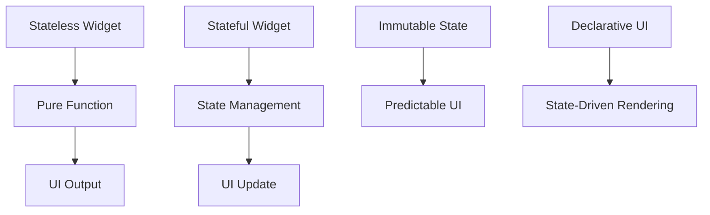

## 10.10 Using Functional Programming in Flutter Apps

Functional programming (FP) is a paradigm that treats computation as the evaluation of mathematical functions and avoids changing state and mutable data. In the context of Flutter, a UI toolkit for building natively compiled applications for mobile, web, and desktop from a single codebase, functional programming can lead to more predictable, maintainable, and testable code. This section explores how to apply functional programming concepts in Flutter apps, focusing on building pure widgets, promoting immutable state, and implementing functional patterns for efficient UI development.

### Applying Functional Concepts to UI Development

Functional programming in Flutter involves applying concepts such as pure functions, immutability, and declarative UI design. Let's delve into these concepts and see how they can be applied to Flutter development.

#### Building Pure Widgets

In functional programming, a pure function is a function where the output value is determined only by its input values, without observable side effects. In Flutter, stateless widgets can be considered pure functions of their configuration and state.

##### Stateless Widgets as Pure Functions

Stateless widgets are immutable and do not hold any state that changes over time. They are ideal for representing UI components that do not change once they are built. This immutability aligns with the functional programming principle of avoiding side effects.

```dart
import 'package:flutter/material.dart';

// A simple stateless widget that displays a greeting message.
class GreetingWidget extends StatelessWidget {
  final String name;

  GreetingWidget({required this.name});

  @override
  Widget build(BuildContext context) {
    return Text('Hello, $name!');
  }
}
```

In the example above, `GreetingWidget` is a pure function of its input `name`. It always produces the same output for the same input, making it predictable and easy to test.

#### Immutable State

Immutability is a core concept in functional programming. It ensures that data does not change over time, which can lead to more predictable and less error-prone code. In Flutter, using immutable data structures for state management can help maintain a predictable UI.

##### Promoting Predictable UI Updates

When state changes are predictable, UI updates become more manageable. By using immutable data structures, we can ensure that state changes are explicit and controlled.

```dart
import 'package:flutter/material.dart';

// A simple immutable data class representing a user.
class User {
  final String name;
  final int age;

  User(this.name, this.age);
}

// A widget that displays user information.
class UserInfo extends StatelessWidget {
  final User user;

  UserInfo({required this.user});

  @override
  Widget build(BuildContext context) {
    return Column(
      children: [
        Text('Name: ${user.name}'),
        Text('Age: ${user.age}'),
      ],
    );
  }
}
```

In this example, the `User` class is immutable, meaning once a `User` instance is created, its `name` and `age` cannot be changed. This immutability ensures that the `UserInfo` widget always displays consistent data.

### Implementing Functional Patterns

Functional programming patterns can be implemented in Flutter to avoid side effects and promote a declarative UI design.

#### Avoiding Side Effects

Side effects occur when a function modifies some state outside its scope or interacts with the outside world. In Flutter, side effects can be avoided by ensuring that widget construction and state changes are pure.

```dart
import 'package:flutter/material.dart';

// A widget that displays a counter and a button to increment it.
class CounterWidget extends StatefulWidget {
  @override
  _CounterWidgetState createState() => _CounterWidgetState();
}

class _CounterWidgetState extends State<CounterWidget> {
  int _counter = 0;

  void _incrementCounter() {
    setState(() {
      _counter++;
    });
  }

  @override
  Widget build(BuildContext context) {
    return Column(
      children: [
        Text('Counter: $_counter'),
        ElevatedButton(
          onPressed: _incrementCounter,
          child: Text('Increment'),
        ),
      ],
    );
  }
}
```

In the `CounterWidget` example, the `_incrementCounter` method is a side effect because it modifies the `_counter` state. To avoid side effects, consider using immutable state management solutions like the `Provider` package or `BLoC` pattern.

### Use Cases and Examples

Functional programming can be applied to various use cases in Flutter, such as declarative UI design and state management with immutable data.

#### Declarative UI

In a declarative UI, the UI is defined based on the current state, rather than imperatively describing how to change the UI over time. Flutter's widget tree is inherently declarative, making it a natural fit for functional programming.

```dart
import 'package:flutter/material.dart';

// A widget that displays a list of items.
class ItemList extends StatelessWidget {
  final List<String> items;

  ItemList({required this.items});

  @override
  Widget build(BuildContext context) {
    return ListView.builder(
      itemCount: items.length,
      itemBuilder: (context, index) {
        return ListTile(
          title: Text(items[index]),
        );
      },
    );
  }
}
```

In the `ItemList` example, the UI is declared based on the `items` list. Any change to the `items` list will automatically update the UI, promoting a clear separation between state and UI.

#### State Management with Immutable Data

State management is a crucial aspect of Flutter development. Using immutable data structures for state management can lead to more predictable and maintainable code.

```dart
import 'package:flutter/material.dart';
import 'package:provider/provider.dart';

// A simple immutable data class representing a counter state.
class CounterState {
  final int counter;

  CounterState(this.counter);
}

// A ChangeNotifier that manages the counter state.
class CounterNotifier extends ChangeNotifier {
  CounterState _state = CounterState(0);

  CounterState get state => _state;

  void increment() {
    _state = CounterState(_state.counter + 1);
    notifyListeners();
  }
}

// A widget that displays the counter and a button to increment it.
class CounterApp extends StatelessWidget {
  @override
  Widget build(BuildContext context) {
    return ChangeNotifierProvider(
      create: (_) => CounterNotifier(),
      child: Consumer<CounterNotifier>(
        builder: (context, counterNotifier, child) {
          return Column(
            children: [
              Text('Counter: ${counterNotifier.state.counter}'),
              ElevatedButton(
                onPressed: counterNotifier.increment,
                child: Text('Increment'),
              ),
            ],
          );
        },
      ),
    );
  }
}
```

In the `CounterApp` example, the `CounterState` is immutable, and the `CounterNotifier` manages the state changes. This approach ensures that state changes are explicit and controlled, leading to a more predictable UI.

### Visualizing Functional Programming in Flutter

To better understand how functional programming concepts apply to Flutter, let's visualize the relationship between widgets, state, and UI updates.



**Diagram Description:** This diagram illustrates the flow of functional programming concepts in Flutter. Stateless widgets act as pure functions, producing UI output based on input. Stateful widgets manage state changes, leading to UI updates. Immutable state promotes predictable UI, and declarative UI design ensures state-driven rendering.

### References and Links

- [Flutter Documentation](https://flutter.dev/docs)
- [Dart Language Tour](https://dart.dev/guides/language/language-tour)
- [Functional Programming in Dart](https://dart.dev/guides/language/language-tour#functions)
- [Provider Package](https://pub.dev/packages/provider)
- [BLoC Pattern](https://bloclibrary.dev/#/)

### Knowledge Check

To reinforce your understanding of functional programming in Flutter, consider the following questions and exercises:

1. What are the benefits of using stateless widgets as pure functions in Flutter?
2. How does immutability contribute to predictable UI updates?
3. Implement a simple Flutter app using immutable state management with the `Provider` package.
4. Describe how declarative UI design differs from imperative UI design.
5. Experiment with the `CounterApp` example by adding a reset button that sets the counter back to zero.

### Embrace the Journey

Remember, this is just the beginning. As you progress, you'll build more complex and interactive Flutter apps using functional programming concepts. Keep experimenting, stay curious, and enjoy the journey!

## Quiz Time!



### What is a pure function in the context of functional programming?

- [x] A function where the output is determined only by its input values, without observable side effects.
- [ ] A function that modifies global state.
- [ ] A function that relies on external data sources.
- [ ] A function that performs I/O operations.

> **Explanation:** A pure function is one where the output is determined solely by its input values and does not cause any side effects, such as modifying global state or performing I/O operations.

### How does immutability benefit Flutter applications?

- [x] It ensures that data does not change over time, leading to more predictable and less error-prone code.
- [ ] It allows for dynamic changes to the UI without rebuilding widgets.
- [ ] It makes it easier to perform I/O operations.
- [ ] It reduces the need for state management.

> **Explanation:** Immutability ensures that data remains constant, which leads to predictable UI updates and reduces the likelihood of errors.

### What is the role of stateless widgets in Flutter?

- [x] They are immutable and do not hold any state that changes over time.
- [ ] They manage complex state changes.
- [ ] They perform network requests.
- [ ] They handle user input.

> **Explanation:** Stateless widgets are immutable and do not hold any state that changes over time, making them ideal for representing UI components that do not change once built.

### What is the primary advantage of using declarative UI in Flutter?

- [x] The UI is defined based on the current state, promoting a clear separation between state and UI.
- [ ] It allows for direct manipulation of UI elements.
- [ ] It simplifies the use of global variables.
- [ ] It reduces the need for state management.

> **Explanation:** Declarative UI design defines the UI based on the current state, ensuring a clear separation between state and UI, which simplifies state management.

### Which package is commonly used for immutable state management in Flutter?

- [x] Provider
- [ ] HTTP
- [ ] Dio
- [ ] SharedPreferences

> **Explanation:** The `Provider` package is commonly used for state management in Flutter, allowing for immutable state management and predictable UI updates.

### What is a side effect in the context of functional programming?

- [x] A function that modifies some state outside its scope or interacts with the outside world.
- [ ] A function that returns a value based on its input.
- [ ] A function that performs calculations.
- [ ] A function that reads local variables.

> **Explanation:** A side effect occurs when a function modifies some state outside its scope or interacts with the outside world, which is avoided in functional programming.

### How can you avoid side effects in Flutter widget construction?

- [x] By ensuring that widget construction and state changes are pure.
- [ ] By using global variables.
- [ ] By performing I/O operations within the widget.
- [ ] By modifying external state directly.

> **Explanation:** Avoiding side effects in Flutter involves ensuring that widget construction and state changes are pure, without modifying external state or performing I/O operations.

### What is the benefit of using immutable data structures in state management?

- [x] They ensure that state changes are explicit and controlled, leading to a more predictable UI.
- [ ] They allow for dynamic changes to the UI without rebuilding widgets.
- [ ] They simplify the use of global variables.
- [ ] They reduce the need for state management.

> **Explanation:** Immutable data structures ensure that state changes are explicit and controlled, leading to a more predictable UI and reducing the likelihood of errors.

### What is the primary purpose of the `ChangeNotifier` class in Flutter?

- [x] To manage state changes and notify listeners of updates.
- [ ] To perform network requests.
- [ ] To handle user input.
- [ ] To manage global variables.

> **Explanation:** The `ChangeNotifier` class in Flutter is used to manage state changes and notify listeners of updates, making it a key component in state management.

### True or False: Functional programming in Flutter can lead to more maintainable and testable code.

- [x] True
- [ ] False

> **Explanation:** Functional programming in Flutter can lead to more maintainable and testable code by promoting immutability, avoiding side effects, and using declarative UI design.


