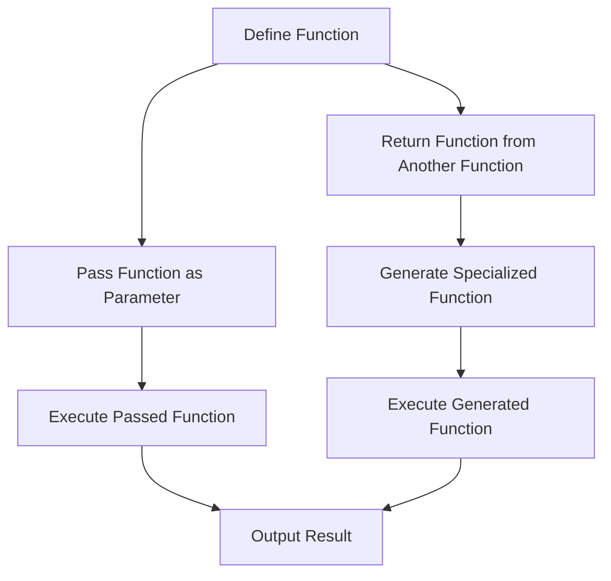

## 10.2 Higher-Order Functions and Closures

In the realm of Dart programming, higher-order functions and closures are powerful tools that enable developers to write more expressive, flexible, and reusable code. These concepts are fundamental to functional programming and can significantly enhance your Flutter development skills. In this section, we will delve into the intricacies of higher-order functions and closures, exploring their applications, benefits, and best practices.

### Functions as First-Class Citizens

In Dart, functions are first-class citizens, meaning they can be treated like any other variable. This allows you to pass functions as parameters, return them from other functions, and assign them to variables. This capability is the cornerstone of higher-order functions.

#### Passing Functions as Parameters

One of the most common uses of higher-order functions is passing functions as parameters. This allows you to create flexible APIs and customize behavior without modifying the underlying code.

```dart
void main() {
  // Define a function that takes another function as a parameter
  void performOperation(int a, int b, Function operation) {
    print('Result: ${operation(a, b)}');
  }

  // Define some operations
  int add(int x, int y) => x + y;
  int multiply(int x, int y) => x * y;

  // Pass the functions as parameters
  performOperation(3, 4, add); // Output: Result: 7
  performOperation(3, 4, multiply); // Output: Result: 12
}
```

In this example, `performOperation` is a higher-order function that takes another function `operation` as a parameter. This allows you to pass different operations (e.g., `add`, `multiply`) to customize the behavior.

#### Returning Functions from Other Functions

Another powerful feature of higher-order functions is the ability to return functions from other functions. This can be used to create function generators or to encapsulate behavior.

```dart
void main() {
  // Define a function that returns another function
  Function createMultiplier(int factor) {
    return (int x) => x * factor;
  }

  // Create a multiplier function
  var triple = createMultiplier(3);

  // Use the generated function
  print(triple(5)); // Output: 15
}
```

Here, `createMultiplier` returns a function that multiplies its input by a specified factor. This allows you to generate specialized functions on the fly.

### Implementing Closures

Closures are functions that capture variables from their surrounding scope. This means that a closure can "remember" the environment in which it was created, even after that environment has exited.

#### Capturing Variables from Enclosing Scopes

Closures are particularly useful for maintaining state across function calls. They can capture and retain access to variables from their enclosing scope.

```dart
void main() {
  // Define a function that returns a closure
  Function counter() {
    int count = 0;
    return () {
      count++;
      return count;
    };
  }

  // Create a counter closure
  var myCounter = counter();

  // Use the closure
  print(myCounter()); // Output: 1
  print(myCounter()); // Output: 2
  print(myCounter()); // Output: 3
}
```

In this example, the closure returned by `counter` captures the `count` variable from its enclosing scope. Each time the closure is called, it increments and returns the `count`, maintaining its state across calls.

### Use Cases and Examples

Higher-order functions and closures have numerous applications in Dart and Flutter development. Let's explore some common use cases.

#### Event Handlers: Customizing Callbacks

In Flutter, higher-order functions are often used to customize event handlers and callbacks. This allows you to define flexible and reusable UI components.

```dart
import 'package:flutter/material.dart';

void main() {
  runApp(MyApp());
}

class MyApp extends StatelessWidget {
  @override
  Widget build(BuildContext context) {
    return MaterialApp(
      home: Scaffold(
        appBar: AppBar(title: Text('Higher-Order Functions')),
        body: Center(
          child: CustomButton(
            onPressed: () {
              print('Button pressed!');
            },
          ),
        ),
      ),
    );
  }
}

class CustomButton extends StatelessWidget {
  final VoidCallback onPressed;

  CustomButton({required this.onPressed});

  @override
  Widget build(BuildContext context) {
    return ElevatedButton(
      onPressed: onPressed,
      child: Text('Press Me'),
    );
  }
}
```

In this Flutter example, `CustomButton` takes a `VoidCallback` as a parameter, allowing you to customize the button's behavior when pressed.

#### Function Generators: Creating Specialized Functions

Higher-order functions can be used to create function generators, which produce specialized functions based on input parameters.

```dart
void main() {
  // Define a function generator
  Function createGreeting(String greeting) {
    return (String name) => '$greeting, $name!';
  }

  // Generate specialized functions
  var sayHello = createGreeting('Hello');
  var sayGoodbye = createGreeting('Goodbye');

  // Use the generated functions
  print(sayHello('Alice')); // Output: Hello, Alice!
  print(sayGoodbye('Bob')); // Output: Goodbye, Bob!
}
```

Here, `createGreeting` generates functions that produce personalized greetings based on the input parameter.

### Visualizing Higher-Order Functions and Closures

To better understand the flow of higher-order functions and closures, let's visualize the process using a flowchart.



**Figure 1: Flowchart of Higher-Order Functions and Closures**

This flowchart illustrates the process of defining, passing, and returning functions, as well as executing them to produce results.

### Best Practices for Using Higher-Order Functions and Closures

When working with higher-order functions and closures, consider the following best practices:

- **Keep Functions Small and Focused**: Write small, focused functions that do one thing well. This makes them easier to test and reuse.
- **Use Descriptive Names**: Give your functions descriptive names that clearly indicate their purpose and behavior.
- **Avoid Side Effects**: Strive to write pure functions that do not produce side effects. This makes your code more predictable and easier to debug.
- **Document Your Code**: Use comments and documentation to explain the purpose and behavior of your functions, especially when using closures.
- **Test Thoroughly**: Write unit tests for your functions to ensure they behave as expected in different scenarios.

### Try It Yourself

To solidify your understanding of higher-order functions and closures, try modifying the code examples provided. Here are some suggestions:

- **Modify the `performOperation` function** to support additional operations, such as subtraction and division.
- **Create a closure that maintains a list of items** and provides methods to add, remove, and list items.
- **Experiment with different event handlers in the Flutter example** to customize the button's behavior.

### References and Further Reading

For more information on higher-order functions and closures in Dart, consider exploring the following resources:

- [Dart Language Tour](https://dart.dev/guides/language/language-tour#functions)
- [Flutter Documentation](https://flutter.dev/docs)
- [Functional Programming in Dart](https://dart.dev/guides/language/language-tour#functions)

### Knowledge Check

Before we wrap up, let's review some key takeaways:

- **Higher-order functions** are functions that can take other functions as parameters or return them as results.
- **Closures** are functions that capture variables from their enclosing scope, allowing them to maintain state across calls.
- **Use cases** for higher-order functions and closures include event handlers, function generators, and more.

Remember, mastering higher-order functions and closures is just the beginning. As you continue your journey in Dart and Flutter development, you'll discover even more powerful ways to leverage these concepts. Keep experimenting, stay curious, and enjoy the journey!

## Quiz Time!



### What is a higher-order function in Dart?

- [x] A function that takes another function as a parameter or returns a function
- [ ] A function that performs complex calculations
- [ ] A function that is only used in Flutter
- [ ] A function that cannot be passed as a parameter

> **Explanation:** A higher-order function is one that can take another function as a parameter or return a function as a result.

### What is a closure in Dart?

- [x] A function that captures variables from its enclosing scope
- [ ] A function that is defined inside another function
- [ ] A function that cannot be returned from another function
- [ ] A function that is only used for event handling

> **Explanation:** A closure is a function that captures variables from its surrounding scope, allowing it to maintain state across calls.

### How can you pass a function as a parameter in Dart?

- [x] By specifying the function type in the parameter list
- [ ] By using a special keyword
- [ ] By converting the function to a string
- [ ] By using a global variable

> **Explanation:** You can pass a function as a parameter by specifying the function type in the parameter list.

### What is the purpose of returning a function from another function?

- [x] To create specialized functions or encapsulate behavior
- [ ] To make the code more complex
- [ ] To avoid using variables
- [ ] To reduce the number of lines of code

> **Explanation:** Returning a function from another function allows you to create specialized functions or encapsulate behavior.

### Which of the following is a use case for closures?

- [x] Maintaining state across function calls
- [ ] Performing asynchronous operations
- [ ] Handling exceptions
- [ ] Defining global variables

> **Explanation:** Closures are useful for maintaining state across function calls by capturing variables from their enclosing scope.

### What is a common best practice when using higher-order functions?

- [x] Keep functions small and focused
- [ ] Use complex logic within functions
- [ ] Avoid using descriptive names
- [ ] Write functions without parameters

> **Explanation:** Keeping functions small and focused makes them easier to test and reuse.

### How can closures be used in Flutter development?

- [x] For customizing event handlers and callbacks
- [ ] For defining global styles
- [ ] For managing application state
- [ ] For creating animations

> **Explanation:** Closures can be used to customize event handlers and callbacks in Flutter development.

### What is a function generator?

- [x] A function that returns another function based on input parameters
- [ ] A function that generates random numbers
- [ ] A function that creates new variables
- [ ] A function that modifies global state

> **Explanation:** A function generator is a function that returns another function based on input parameters.

### How can you test higher-order functions effectively?

- [x] By writing unit tests for different scenarios
- [ ] By using global variables
- [ ] By avoiding function parameters
- [ ] By using only synchronous code

> **Explanation:** Writing unit tests for different scenarios ensures that higher-order functions behave as expected.

### True or False: Closures can only capture variables that are defined globally.

- [ ] True
- [x] False

> **Explanation:** Closures can capture variables from their enclosing scope, not just globally defined variables.


