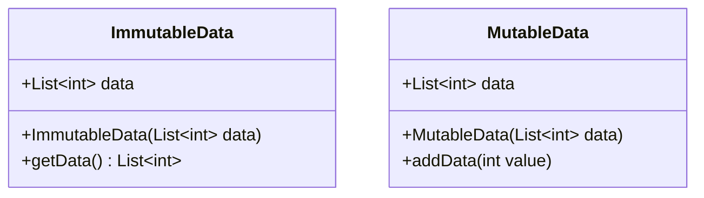

## 10.3 Immutable Data Structures

In the realm of functional programming, immutability is a cornerstone concept that helps prevent unintended side effects, making your code more predictable and easier to reason about. In Dart, embracing immutable data structures can significantly enhance your application's robustness, especially when dealing with state management and concurrency. Let's delve into the world of immutability in Dart, exploring how to implement it effectively and examining its numerous benefits.

### Understanding Immutability

**Immutability** refers to the inability to change an object after it has been created. This concept is crucial in functional programming, where functions are expected to produce the same output given the same input, without altering any external state. By ensuring that data structures remain unchanged, we can avoid side effects that often lead to bugs and unpredictable behavior.

#### Why Immutability Matters

- **Predictability**: Immutable data structures ensure that once a value is set, it cannot be altered, leading to more predictable code behavior.
- **Thread Safety**: In concurrent programming, immutability eliminates the need for locks or synchronization, as immutable objects can be shared across threads without risk.
- **Ease of Debugging**: With immutable data, you can trace the flow of data through your application more easily, as you don't have to track changes to state over time.

### Implementing Immutability in Dart

Dart provides several mechanisms to implement immutability, primarily through the use of `final` and `const` keywords, as well as immutable collections.

#### Using `final` and `const`

- **`final`**: A `final` variable can only be set once. Once initialized, its value cannot be changed, but the object it refers to can be mutable.
  
  ```dart
  final List<int> numbers = [1, 2, 3];
  numbers.add(4); // This is allowed, as the list itself is mutable.
  ```

- **`const`**: A `const` variable is a compile-time constant. Both the variable and the object it refers to are immutable.
  
  ```dart
  const List<int> numbers = [1, 2, 3];
  // numbers.add(4); // This will result in a compile-time error.
  ```

#### Immutable Collections

Dart does not provide built-in immutable collections, but you can use packages like `built_value` to create immutable data structures.

- **`built_value` Package**: This package provides a way to define immutable value types with a builder pattern, ensuring that objects are deeply immutable.

  ```dart
  import 'package:built_value/built_value.dart';
  import 'package:built_collection/built_collection.dart';

  part 'example.g.dart';

  abstract class Example implements Built<Example, ExampleBuilder> {
    BuiltList<int> get numbers;

    Example._();
    factory Example([void Function(ExampleBuilder) updates]) = _$Example;
  }
  ```

### Use Cases and Examples

#### State Management

In Flutter, managing state is a critical aspect of application development. Immutable data structures ensure that state transitions are explicit and predictable.

- **Predictable State**: By using immutable state objects, you can ensure that state changes are intentional and traceable.

  ```dart
  class AppState {
    final int counter;
    AppState(this.counter);
  }

  AppState incrementCounter(AppState state) {
    return AppState(state.counter + 1);
  }
  ```

#### Concurrency

Immutable data structures shine in concurrent programming, where multiple threads or isolates may access shared data.

- **Reduced Synchronization Needs**: Since immutable objects cannot be altered, they can be safely shared between threads without the need for locks.

  ```dart
  void main() {
    final data = ImmutableData([1, 2, 3]);
    // Pass data to multiple isolates without synchronization concerns.
  }
  ```

### Visualizing Immutability in Dart

To better understand how immutability works in Dart, let's visualize the concept using a class diagram.



- **ImmutableData**: Represents an immutable data structure where the list cannot be modified after creation.
- **MutableData**: Represents a mutable data structure where the list can be altered.

### Design Considerations

When implementing immutability in Dart, consider the following:

- **Performance**: Immutable data structures can lead to increased memory usage and performance overhead due to the creation of new objects. Use them judiciously, especially in performance-critical applications.
- **Complexity**: Introducing immutability can add complexity to your codebase, particularly when dealing with deeply nested data structures. Consider using libraries like `built_value` to manage this complexity.

### Differences and Similarities

- **`final` vs `const`**: Both keywords prevent reassignment, but `const` also ensures that the object itself is immutable.
- **Immutable vs Mutable Collections**: Immutable collections cannot be changed after creation, while mutable collections can be modified.

### Try It Yourself

Experiment with the following code snippet to understand how immutability works in Dart:

```dart
void main() {
  final List<int> mutableList = [1, 2, 3];
  mutableList.add(4); // This works because the list is mutable.

  const List<int> immutableList = [1, 2, 3];
  // immutableList.add(4); // Uncommenting this line will cause a compile-time error.

  print('Mutable List: $mutableList');
  print('Immutable List: $immutableList');
}
```

**Try modifying the `mutableList` and observe the changes. Then, attempt to modify the `immutableList` and note the error.**

### Knowledge Check

- **What is the primary benefit of using immutable data structures in concurrent programming?**
- **How does the `built_value` package help in implementing immutability in Dart?**

### Embrace the Journey

Remember, immutability is a powerful tool in your Dart programming arsenal. By preventing unintended side effects, you can create more robust and maintainable applications. As you continue your journey, keep experimenting with different patterns and techniques to find what works best for your projects. Stay curious and enjoy the process of mastering Dart and Flutter development!

## Quiz Time!



### What is immutability in programming?

- [x] The inability to change an object after it has been created
- [ ] The ability to change an object at any time
- [ ] A feature that allows objects to be modified in place
- [ ] A method of optimizing memory usage

> **Explanation:** Immutability refers to the inability to change an object after it has been created, which is a key concept in functional programming.

### Which keyword in Dart ensures that a variable can only be set once?

- [x] final
- [ ] var
- [ ] dynamic
- [ ] mutable

> **Explanation:** The `final` keyword in Dart ensures that a variable can only be set once, making it immutable.

### What is the difference between `final` and `const` in Dart?

- [x] `final` allows mutable objects, `const` ensures immutability
- [ ] `final` is used for variables, `const` is used for functions
- [ ] `final` is a compile-time constant, `const` is not
- [ ] There is no difference

> **Explanation:** `final` allows the object to be mutable, while `const` ensures that both the variable and the object are immutable.

### How do immutable data structures benefit concurrency?

- [x] They eliminate the need for locks or synchronization
- [ ] They increase the need for synchronization
- [ ] They make data sharing impossible
- [ ] They reduce memory usage

> **Explanation:** Immutable data structures can be shared across threads without risk, eliminating the need for locks or synchronization.

### Which package in Dart helps create immutable value types?

- [x] built_value
- [ ] dart:core
- [ ] flutter
- [ ] immutable

> **Explanation:** The `built_value` package provides a way to define immutable value types with a builder pattern in Dart.

### What is a potential downside of using immutable data structures?

- [x] Increased memory usage
- [ ] Decreased predictability
- [ ] Increased risk of side effects
- [ ] Reduced performance overhead

> **Explanation:** Immutable data structures can lead to increased memory usage due to the creation of new objects.

### How can you ensure a list in Dart is immutable?

- [x] Use the `const` keyword
- [ ] Use the `var` keyword
- [ ] Use the `dynamic` keyword
- [ ] Use the `mutable` keyword

> **Explanation:** Using the `const` keyword ensures that a list in Dart is immutable.

### What is a common use case for immutable data structures in Flutter?

- [x] State management
- [ ] UI rendering
- [ ] Network requests
- [ ] Animation

> **Explanation:** Immutable data structures are commonly used in state management to ensure predictable state transitions.

### What is the primary advantage of using `built_value` for immutability?

- [x] It provides a builder pattern for creating immutable objects
- [ ] It allows for mutable objects
- [ ] It reduces code complexity
- [ ] It increases performance

> **Explanation:** `built_value` provides a builder pattern for creating deeply immutable objects in Dart.

### True or False: Immutable data structures can be modified after creation.

- [ ] True
- [x] False

> **Explanation:** Immutable data structures cannot be modified after creation, which is the essence of immutability.


