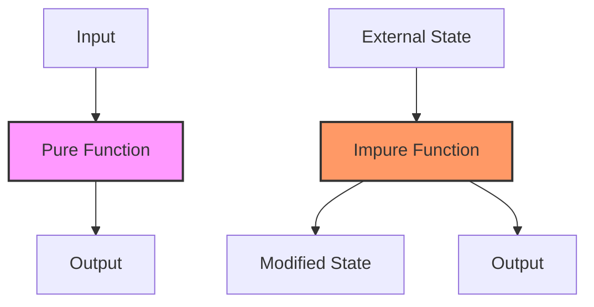

## 10.4 Pure Functions and Avoiding Side Effects

In the realm of software development, especially when working with Dart and Flutter, understanding and implementing pure functions is crucial for creating predictable, maintainable, and testable code. This section delves into the concept of pure functions, the importance of avoiding side effects, and how these practices can enhance code predictability. We will explore practical examples, use cases, and best practices to help you master these concepts.

### Enhancing Code Predictability

#### No Side Effects

A pure function is a function where the output value is determined only by its input values, without observable side effects. This means that the function does not alter any external state or rely on any external state that may change. The absence of side effects is a cornerstone of functional programming, promoting code that is easier to understand and debug.

**Key Characteristics of Pure Functions:**

- **Deterministic Behavior**: Given the same inputs, a pure function will always return the same output.
- **No External State Modification**: Pure functions do not modify variables or states outside their scope.
- **No I/O Operations**: They do not perform any input/output operations, such as reading from or writing to files or databases.

#### Referential Transparency

Referential transparency is a property of pure functions where an expression can be replaced with its corresponding value without changing the program's behavior. This concept is essential for reasoning about code and optimizing it.

**Example of Referential Transparency:**

```dart
int add(int a, int b) {
  return a + b;
}

void main() {
  // Referentially transparent
  int result = add(2, 3); // Can be replaced with 5
  print(result); // Outputs: 5
}
```

In the above example, the call to `add(2, 3)` can be replaced with `5` anywhere in the code without affecting the program's behavior.

### Implementing Pure Functions

#### Avoiding Global Variables

To ensure functions remain pure, avoid using global variables. Instead, use local variables and parameters to pass data into functions. This practice confines the function's scope and prevents unintended side effects.

**Example of Avoiding Global Variables:**

```dart
// Impure function using a global variable
int globalCounter = 0;

void incrementCounter() {
  globalCounter++;
}

// Pure function using parameters
int increment(int counter) {
  return counter + 1;
}

void main() {
  int localCounter = 0;
  localCounter = increment(localCounter);
  print(localCounter); // Outputs: 1
}
```

In the above example, `increment` is a pure function because it does not rely on or modify any external state.

### Use Cases and Examples

#### Mathematical Computations

Pure functions are ideal for mathematical computations where consistent results are crucial. They ensure that calculations are repeatable and predictable.

**Example of Mathematical Computation:**

```dart
double calculateArea(double radius) {
  return 3.14159 * radius * radius;
}

void main() {
  double area = calculateArea(5.0);
  print(area); // Outputs: 78.53975
}
```

The `calculateArea` function is pure because it consistently returns the same result for the same input.

#### Data Transformation

Pure functions excel at transforming data, such as processing collections. They can be used to map, filter, and reduce data structures without altering the original data.

**Example of Data Transformation:**

```dart
List<int> doubleValues(List<int> values) {
  return values.map((value) => value * 2).toList();
}

void main() {
  List<int> numbers = [1, 2, 3, 4];
  List<int> doubled = doubleValues(numbers);
  print(doubled); // Outputs: [2, 4, 6, 8]
}
```

The `doubleValues` function is pure because it transforms the input list without modifying it.

### Visualizing Pure Functions and Side Effects

To better understand the concept of pure functions and side effects, let's visualize the flow of data and state in a program using a flowchart.



**Diagram Description:**

- **Pure Function Flow**: The input is processed by a pure function, resulting in an output without modifying any external state.
- **Impure Function Flow**: The impure function takes input and external state, modifies the state, and produces an output.

### Practical Considerations

#### When to Use Pure Functions

- **Predictability**: Use pure functions when you need predictable and consistent behavior.
- **Testing**: Pure functions are easier to test because they do not depend on external state.
- **Concurrency**: Pure functions are inherently thread-safe, making them suitable for concurrent programming.

#### Design Considerations

- **Performance**: While pure functions are beneficial, consider performance implications, especially with large data transformations.
- **State Management**: In applications like Flutter, manage state carefully to maintain purity where possible.

### Differences and Similarities

Pure functions are often confused with other functional programming concepts like higher-order functions and closures. While they share some similarities, pure functions are distinct in their focus on determinism and lack of side effects.

### Try It Yourself

Experiment with the following code by modifying the input values and observing the output. Try creating your own pure functions for different use cases.

```dart
List<int> squareValues(List<int> values) {
  return values.map((value) => value * value).toList();
}

void main() {
  List<int> numbers = [1, 2, 3, 4];
  List<int> squared = squareValues(numbers);
  print(squared); // Outputs: [1, 4, 9, 16]
}
```

### References and Links

For further reading on pure functions and functional programming, consider the following resources:

- [MDN Web Docs on Functional Programming](https://developer.mozilla.org/en-US/docs/Glossary/Functional_programming)
- [W3Schools Functional Programming Tutorial](https://www.w3schools.com/functional_programming/)

### Knowledge Check

- **What is a pure function?**
- **How do pure functions enhance code predictability?**
- **What are the benefits of avoiding side effects?**

### Embrace the Journey

Remember, mastering pure functions and avoiding side effects is just the beginning. As you progress, you'll build more complex and interactive applications. Keep experimenting, stay curious, and enjoy the journey!

### Quiz Time!



### What is a key characteristic of a pure function?

- [x] It does not modify external state.
- [ ] It always performs I/O operations.
- [ ] It relies on global variables.
- [ ] It produces different outputs for the same inputs.

> **Explanation:** A pure function does not modify external state and always produces the same output for the same inputs.

### What does referential transparency mean?

- [x] An expression can be replaced with its value without changing the program's behavior.
- [ ] A function can modify global variables.
- [ ] A function performs side effects.
- [ ] An expression always returns null.

> **Explanation:** Referential transparency means an expression can be replaced with its value without affecting the program's behavior.

### Why should global variables be avoided in pure functions?

- [x] They can lead to side effects.
- [ ] They make functions faster.
- [ ] They improve code readability.
- [ ] They enhance security.

> **Explanation:** Global variables can lead to side effects, making functions impure.

### Which of the following is a use case for pure functions?

- [x] Data transformation
- [ ] Database updates
- [ ] File I/O operations
- [ ] Network requests

> **Explanation:** Pure functions are ideal for data transformation as they do not alter external state.

### How do pure functions benefit testing?

- [x] They are easier to test due to their deterministic nature.
- [ ] They require complex test setups.
- [ ] They depend on external state.
- [ ] They need integration tests.

> **Explanation:** Pure functions are easier to test because they are deterministic and do not depend on external state.

### What is the result of calling a pure function with the same inputs multiple times?

- [x] The same output each time.
- [ ] Different outputs each time.
- [ ] A runtime error.
- [ ] A null value.

> **Explanation:** Pure functions always produce the same output for the same inputs.

### What is a potential downside of pure functions?

- [x] Performance implications with large data transformations.
- [ ] They are difficult to test.
- [ ] They require global variables.
- [ ] They cannot be used in concurrent programming.

> **Explanation:** Pure functions can have performance implications, especially with large data transformations.

### Which of the following is NOT a characteristic of pure functions?

- [x] They perform I/O operations.
- [ ] They are deterministic.
- [ ] They do not modify external state.
- [ ] They have no side effects.

> **Explanation:** Pure functions do not perform I/O operations as they can lead to side effects.

### How can pure functions aid in concurrency?

- [x] They are inherently thread-safe.
- [ ] They require locks and synchronization.
- [ ] They modify shared state.
- [ ] They depend on global variables.

> **Explanation:** Pure functions are inherently thread-safe because they do not modify shared state.

### True or False: Pure functions can modify external state.

- [ ] True
- [x] False

> **Explanation:** Pure functions cannot modify external state; they are defined by their lack of side effects.


