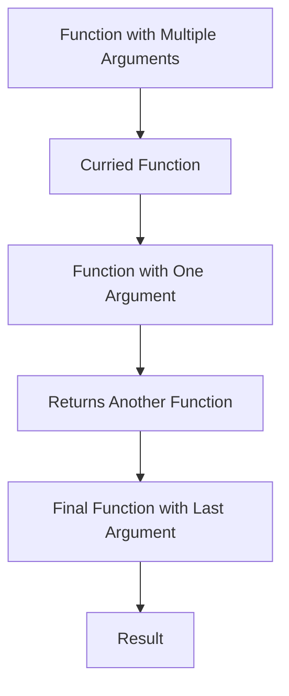
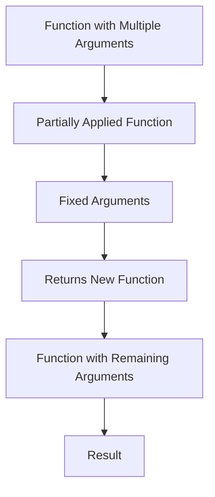

## 10.5 Currying and Partial Application

In the realm of functional programming, currying and partial application are two powerful techniques that transform how we think about and use functions. These concepts allow us to break down complex functions into simpler, more manageable pieces, making our code more flexible and reusable. In this section, we will delve into the intricacies of currying and partial application, explore how to implement these techniques in Dart using function closures, and examine practical use cases and examples to enhance your Flutter development skills.

### Transforming Functions into Chains

#### Currying: Breaking Down Functions with Multiple Arguments

Currying is a functional programming technique that involves transforming a function with multiple arguments into a sequence of functions, each taking a single argument. This process allows us to create more flexible and reusable functions by enabling partial application of arguments.

**Example of Currying:**

Consider a simple function that adds two numbers:

```dart
int add(int a, int b) {
  return a + b;
}
```

Using currying, we can transform this function into a series of functions, each taking one argument:

```dart
Function(int) addCurried(int a) {
  return (int b) => a + b;
}

void main() {
  var addFive = addCurried(5);
  print(addFive(10)); // Output: 15
}
```

In this example, `addCurried` is a curried version of the `add` function. It takes one argument `a` and returns a new function that takes the second argument `b`. This allows us to create specialized functions like `addFive`, which adds 5 to any given number.

#### Partial Application: Fixing Some Arguments to Create New Functions

Partial application is a technique where we fix a few arguments of a function, producing another function of smaller arity (fewer arguments). This is particularly useful when we want to create specialized versions of a function without having to rewrite the entire function logic.

**Example of Partial Application:**

Let's revisit the `add` function:

```dart
int add(int a, int b) {
  return a + b;
}
```

We can create a partially applied version of this function:

```dart
Function(int) addPartial(int a) {
  return (int b) => add(a, b);
}

void main() {
  var addTen = addPartial(10);
  print(addTen(5)); // Output: 15
}
```

Here, `addPartial` fixes the first argument `a` and returns a new function that takes the remaining argument `b`. This allows us to create a function `addTen` that adds 10 to any given number.

### Implementing Currying and Partial Application in Dart

#### Function Closures: Returning Functions from Functions

In Dart, closures are a powerful feature that allows us to return functions from other functions. This is a key aspect of implementing currying and partial application, as it enables us to create new functions with fixed arguments.

**Implementing Currying with Closures:**

Let's implement a curried version of a function that multiplies three numbers:

```dart
Function(int) multiplyCurried(int a) {
  return (int b) {
    return (int c) => a * b * c;
  };
}

void main() {
  var multiplyByTwo = multiplyCurried(2);
  var multiplyByTwoAndThree = multiplyByTwo(3);
  print(multiplyByTwoAndThree(4)); // Output: 24
}
```

In this example, `multiplyCurried` is a curried function that takes one argument `a` and returns a function that takes the next argument `b`. This returned function further returns another function that takes the final argument `c`. This chain of functions allows us to fix arguments one at a time, creating specialized versions like `multiplyByTwo` and `multiplyByTwoAndThree`.

**Implementing Partial Application with Closures:**

Let's implement a partially applied version of a function that concatenates strings:

```dart
String concatenate(String a, String b, String c) {
  return '$a $b $c';
}

Function(String, String) concatenatePartial(String a) {
  return (String b, String c) => concatenate(a, b, c);
}

void main() {
  var greet = concatenatePartial('Hello');
  print(greet('World', '!')); // Output: Hello World !
}
```

In this example, `concatenatePartial` fixes the first argument `a` and returns a new function that takes the remaining arguments `b` and `c`. This allows us to create a function `greet` that concatenates "Hello" with any two additional strings.

### Use Cases and Examples

#### Customized Functions: Creating Specialized Versions

Currying and partial application are particularly useful for creating customized functions that can be reused in different contexts. By fixing certain arguments, we can create specialized versions of a function that are tailored to specific use cases.

**Example: Customized Logging Function**

Consider a logging function that logs messages with different severity levels:

```dart
void log(String level, String message) {
  print('[$level] $message');
}

Function(String) logInfo = (String message) => log('INFO', message);
Function(String) logError = (String message) => log('ERROR', message);

void main() {
  logInfo('This is an informational message.');
  logError('This is an error message.');
}
```

In this example, `logInfo` and `logError` are specialized versions of the `log` function, created using partial application. They fix the `level` argument to "INFO" and "ERROR", respectively, allowing us to log messages with specific severity levels.

#### Configuration: Pre-setting Parameters

Another common use case for currying and partial application is configuration. By pre-setting certain parameters, we can create functions that are pre-configured for specific tasks.

**Example: Configuring HTTP Requests**

Consider a function that makes HTTP requests with different methods:

```dart
void httpRequest(String method, String url) {
  print('Making $method request to $url');
}

Function(String) getRequest = (String url) => httpRequest('GET', url);
Function(String) postRequest = (String url) => httpRequest('POST', url);

void main() {
  getRequest('https://api.example.com/data');
  postRequest('https://api.example.com/data');
}
```

In this example, `getRequest` and `postRequest` are pre-configured versions of the `httpRequest` function, created using partial application. They fix the `method` argument to "GET" and "POST", respectively, allowing us to make HTTP requests with specific methods.

### Visualizing Currying and Partial Application

To better understand the flow of currying and partial application, let's visualize these concepts using Hugo-compatible Mermaid.js diagrams.

#### Currying Flow Diagram



**Description:** This diagram illustrates the flow of currying, where a function with multiple arguments is transformed into a series of functions, each taking one argument, ultimately producing the final result.

#### Partial Application Flow Diagram



**Description:** This diagram illustrates the flow of partial application, where a function with multiple arguments is transformed into a new function with fixed arguments, allowing the remaining arguments to be supplied later to produce the final result.

### Practical Considerations and Best Practices

When implementing currying and partial application in Dart, there are several practical considerations and best practices to keep in mind:

1. **Readability and Maintainability:** While currying and partial application can make your code more flexible, they can also make it harder to read and understand. Use these techniques judiciously and ensure that your code remains clear and maintainable.

2. **Performance:** Currying and partial application can introduce additional function calls, which may impact performance. Consider the performance implications of using these techniques, especially in performance-critical code.

3. **Use Cases:** Currying and partial application are most beneficial in scenarios where you need to create specialized versions of functions or pre-configure functions for specific tasks. Identify use cases where these techniques can provide the most value.

4. **Testing:** Ensure that your curried and partially applied functions are thoroughly tested. This will help catch any issues early and ensure that your functions behave as expected.

### Try It Yourself

To reinforce your understanding of currying and partial application, try modifying the code examples provided in this section. Experiment with different functions and arguments to see how currying and partial application can be applied in various contexts. Consider creating your own curried and partially applied functions for tasks you commonly perform in your Dart and Flutter projects.

### References and Further Reading

For more information on currying and partial application, consider exploring the following resources:

- [MDN Web Docs: Currying](https://developer.mozilla.org/en-US/docs/Glossary/Currying)
- [Wikipedia: Currying](https://en.wikipedia.org/wiki/Currying)
- [Functional Programming in Dart](https://dart.dev/guides/language/language-tour#functions)

### Knowledge Check

Before we conclude this section, let's summarize the key takeaways:

- **Currying** transforms a function with multiple arguments into a series of functions, each taking one argument.
- **Partial Application** fixes some arguments of a function, creating a new function with fewer arguments.
- **Function Closures** in Dart enable the implementation of currying and partial application by allowing functions to return other functions.
- **Use Cases** for currying and partial application include creating customized functions and pre-setting parameters for configuration.

Remember, mastering currying and partial application is just the beginning. As you continue to explore functional programming in Dart, you'll discover even more powerful techniques to enhance your code. Keep experimenting, stay curious, and enjoy the journey!

## Quiz Time!



### What is currying in functional programming?

- [x] Transforming a function with multiple arguments into a series of functions, each taking one argument.
- [ ] Combining multiple functions into a single function.
- [ ] Transforming a function into a higher-order function.
- [ ] Fixing some arguments of a function to create a new function.

> **Explanation:** Currying involves transforming a function with multiple arguments into a series of functions, each taking one argument.

### What is partial application in functional programming?

- [ ] Transforming a function with multiple arguments into a series of functions, each taking one argument.
- [x] Fixing some arguments of a function to create a new function with fewer arguments.
- [ ] Combining multiple functions into a single function.
- [ ] Transforming a function into a higher-order function.

> **Explanation:** Partial application involves fixing some arguments of a function to create a new function with fewer arguments.

### How can currying be implemented in Dart?

- [ ] By using classes and inheritance.
- [x] By using function closures to return functions from functions.
- [ ] By using mixins and extensions.
- [ ] By using asynchronous programming techniques.

> **Explanation:** Currying can be implemented in Dart using function closures, which allow functions to return other functions.

### What is a common use case for partial application?

- [ ] Creating complex data structures.
- [x] Creating specialized versions of a function.
- [ ] Implementing asynchronous programming.
- [ ] Managing state in Flutter applications.

> **Explanation:** Partial application is commonly used to create specialized versions of a function by fixing certain arguments.

### Which of the following is a benefit of currying?

- [x] It allows for more flexible and reusable functions.
- [ ] It improves the performance of function calls.
- [ ] It simplifies the implementation of asynchronous programming.
- [ ] It reduces the need for error handling.

> **Explanation:** Currying allows for more flexible and reusable functions by transforming a function with multiple arguments into a series of functions, each taking one argument.

### What is a closure in Dart?

- [x] A function that captures variables from its surrounding scope.
- [ ] A class that implements a specific interface.
- [ ] A method that overrides a superclass method.
- [ ] A data structure used for asynchronous programming.

> **Explanation:** A closure in Dart is a function that captures variables from its surrounding scope, allowing it to access those variables even after the scope has exited.

### How does partial application differ from currying?

- [x] Partial application fixes some arguments of a function, while currying transforms a function into a series of functions.
- [ ] Partial application transforms a function into a series of functions, while currying fixes some arguments of a function.
- [ ] Partial application and currying are the same concept.
- [ ] Partial application is used for asynchronous programming, while currying is used for synchronous programming.

> **Explanation:** Partial application fixes some arguments of a function, creating a new function with fewer arguments, while currying transforms a function with multiple arguments into a series of functions, each taking one argument.

### What is a practical consideration when using currying and partial application?

- [ ] They always improve code performance.
- [x] They can make code harder to read and understand.
- [ ] They eliminate the need for error handling.
- [ ] They simplify the implementation of asynchronous programming.

> **Explanation:** While currying and partial application can make code more flexible, they can also make it harder to read and understand, so it's important to use them judiciously.

### What is a key takeaway from this section?

- [ ] Currying and partial application are only useful for asynchronous programming.
- [x] Currying and partial application are powerful techniques for creating flexible and reusable functions.
- [ ] Currying and partial application are only applicable to Dart.
- [ ] Currying and partial application are outdated techniques.

> **Explanation:** Currying and partial application are powerful techniques for creating flexible and reusable functions, applicable in various programming languages, including Dart.

### True or False: Currying and partial application are the same concept.

- [ ] True
- [x] False

> **Explanation:** Currying and partial application are related but distinct concepts. Currying transforms a function with multiple arguments into a series of functions, each taking one argument, while partial application fixes some arguments of a function to create a new function with fewer arguments.


