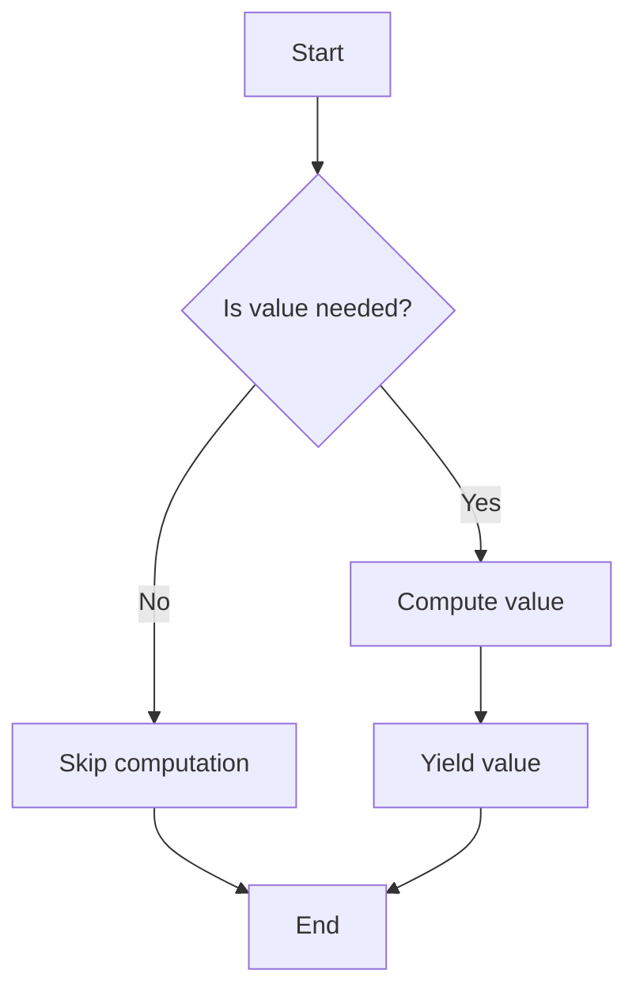

## 10.6 Lazy Evaluation and Generator Functions

In the realm of software development, especially when dealing with large data sets or complex computations, efficiency is key. Dart, with its robust language features, offers powerful tools like lazy evaluation and generator functions to help developers optimize performance and manage resources effectively. In this section, we will delve into these concepts, exploring how they can be leveraged to enhance your Dart applications.

### Deferring Computations

#### Lazy Evaluation

Lazy evaluation is a strategy that delays the execution of an expression until its value is actually needed. This can significantly improve performance by avoiding unnecessary calculations and reducing memory usage. In Dart, lazy evaluation is not built into the language in the same way as in some functional languages like Haskell, but it can be mimicked using certain techniques.

**Key Benefits of Lazy Evaluation:**

- **Performance Optimization**: By deferring computations, you can avoid unnecessary processing, which is particularly beneficial when dealing with large data sets.
- **Memory Efficiency**: Only the necessary data is loaded into memory, reducing the application's memory footprint.
- **Improved Responsiveness**: Applications can remain responsive by performing computations only when needed.

#### Generator Functions

Generator functions in Dart are a powerful feature that allows you to produce a sequence of values on the fly. They are defined using the `sync*` and `async*` keywords, enabling you to create iterable sequences that are computed lazily.

**Types of Generator Functions:**

- **Synchronous Generators (`sync*`)**: These are used to generate synchronous sequences of values.
- **Asynchronous Generators (`async*`)**: These are used to generate asynchronous sequences, often involving I/O operations or other asynchronous tasks.

### Implementing Generators in Dart

#### Yielding Values

The `yield` keyword is used within generator functions to produce values one at a time. When a generator function is called, it returns an iterable object that can be iterated over to retrieve the values.

**Example of a Synchronous Generator:**

```dart
Iterable<int> generateNumbers(int n) sync* {
  for (int i = 0; i < n; i++) {
    yield i;
  }
}

void main() {
  var numbers = generateNumbers(5);
  for (var number in numbers) {
    print(number); // Outputs: 0, 1, 2, 3, 4
  }
}
```

In this example, the `generateNumbers` function yields numbers from 0 to `n-1`. The values are generated one at a time as they are requested.

**Example of an Asynchronous Generator:**

```dart
Stream<int> generateNumbersAsync(int n) async* {
  for (int i = 0; i < n; i++) {
    await Future.delayed(Duration(seconds: 1)); // Simulate a delay
    yield i;
  }
}

void main() async {
  var numbers = generateNumbersAsync(5);
  await for (var number in numbers) {
    print(number); // Outputs: 0, 1, 2, 3, 4 with a delay
  }
}
```

Here, the `generateNumbersAsync` function yields numbers asynchronously, simulating a delay with `Future.delayed`.

### Use Cases and Examples

#### Working with Large Data Sets

When dealing with large data sets, loading all data into memory at once can be inefficient and impractical. Generator functions allow you to process data items as they are needed, reducing memory consumption and improving performance.

**Example: Processing a Large File Line by Line**

```dart
import 'dart:io';

Stream<String> readLargeFile(String filePath) async* {
  var file = File(filePath);
  var lines = file.openRead().transform(utf8.decoder).transform(LineSplitter());
  await for (var line in lines) {
    yield line;
  }
}

void main() async {
  var filePath = 'large_file.txt';
  var lines = readLargeFile(filePath);
  await for (var line in lines) {
    print(line); // Process each line as needed
  }
}
```

In this example, the `readLargeFile` function reads a large file line by line, yielding each line as it is read. This approach is memory efficient and suitable for processing large files.

#### Infinite Sequences

Generator functions can also be used to create infinite sequences, which are sequences that continue indefinitely. This is useful for scenarios where you need a continuous stream of data, such as generating timestamps or random numbers.

**Example: Generating an Infinite Sequence of Timestamps**

```dart
Stream<DateTime> generateTimestamps() async* {
  while (true) {
    yield DateTime.now();
    await Future.delayed(Duration(seconds: 1));
  }
}

void main() async {
  var timestamps = generateTimestamps();
  await for (var timestamp in timestamps) {
    print(timestamp); // Outputs the current timestamp every second
  }
}
```

This example demonstrates an infinite sequence of timestamps, where a new timestamp is generated every second.

### Visualizing Lazy Evaluation and Generators

To better understand how lazy evaluation and generator functions work, let's visualize the process using a flowchart.



**Diagram Description:** This flowchart illustrates the lazy evaluation process. When a value is needed, it is computed and yielded. If not needed, the computation is skipped, optimizing performance.

### Design Considerations

When implementing lazy evaluation and generator functions in Dart, consider the following:

- **Use Cases**: Identify scenarios where lazy evaluation and generators can provide significant performance benefits, such as processing large data sets or creating infinite sequences.
- **Memory Usage**: Ensure that your application benefits from reduced memory usage by deferring computations and generating values on demand.
- **Complexity**: While generators can simplify code by handling sequences, they may introduce complexity in understanding the flow of data. Ensure that your code remains readable and maintainable.
- **Concurrency**: When using asynchronous generators, be mindful of potential concurrency issues, especially when dealing with shared resources.

### Differences and Similarities

Lazy evaluation and generator functions are often confused with other similar concepts. Here's how they differ:

- **Lazy Evaluation vs. Eager Evaluation**: Lazy evaluation defers computations until needed, while eager evaluation computes values immediately.
- **Generators vs. Iterators**: Generators produce values on the fly, while iterators are objects that traverse collections. Generators can be seen as a way to create iterators.
- **Synchronous vs. Asynchronous Generators**: Synchronous generators (`sync*`) produce values immediately, while asynchronous generators (`async*`) can involve delays or I/O operations.

### Try It Yourself

To solidify your understanding of lazy evaluation and generator functions, try modifying the code examples provided:

- **Experiment with Different Data Sets**: Modify the `generateNumbers` function to yield different types of data, such as strings or custom objects.
- **Create a Custom Infinite Sequence**: Implement a generator function that produces an infinite sequence of random numbers or other data.
- **Combine Generators**: Create a generator that combines values from multiple other generators, yielding a merged sequence.

### Knowledge Check

To ensure you've grasped the concepts covered in this section, consider the following questions:

- How does lazy evaluation improve performance in Dart applications?
- What are the differences between synchronous and asynchronous generators?
- How can generator functions be used to process large data sets efficiently?

### Embrace the Journey

Remember, mastering lazy evaluation and generator functions is just one step in your journey to becoming a proficient Dart developer. As you continue to explore and experiment with these concepts, you'll discover new ways to optimize your applications and enhance their performance. Keep experimenting, stay curious, and enjoy the journey!

### References and Links

For further reading and exploration, consider the following resources:

- [Dart Language Tour](https://dart.dev/guides/language/language-tour)
- [Asynchronous Programming: Streams](https://dart.dev/tutorials/language/streams)
- [Generator Functions in Dart](https://dart.dev/guides/language/language-tour#generators)

## Quiz Time!



### What is lazy evaluation?

- [x] A strategy that delays the execution of an expression until its value is needed
- [ ] A method to execute all expressions immediately
- [ ] A technique to store all data in memory
- [ ] A way to optimize network requests

> **Explanation:** Lazy evaluation defers computations until their results are needed, optimizing performance and memory usage.

### Which keyword is used in Dart to create a synchronous generator?

- [x] sync*
- [ ] async*
- [ ] yield
- [ ] await

> **Explanation:** The `sync*` keyword is used to define synchronous generator functions in Dart.

### What does the `yield` keyword do in a generator function?

- [x] Produces a value and pauses the function
- [ ] Ends the generator function
- [ ] Starts a new iteration
- [ ] Executes a loop

> **Explanation:** The `yield` keyword produces a value and pauses the generator function, allowing it to resume later.

### How can generator functions help with large data sets?

- [x] By processing items as needed, reducing memory usage
- [ ] By loading all data into memory at once
- [ ] By increasing the application's memory footprint
- [ ] By executing all computations immediately

> **Explanation:** Generator functions process items as needed, which reduces memory usage and improves performance with large data sets.

### What is the difference between `sync*` and `async*` in Dart?

- [x] `sync*` is for synchronous sequences, `async*` is for asynchronous sequences
- [ ] `sync*` is for asynchronous sequences, `async*` is for synchronous sequences
- [ ] Both are used for synchronous sequences
- [ ] Both are used for asynchronous sequences

> **Explanation:** `sync*` is used for synchronous sequences, while `async*` is used for asynchronous sequences in Dart.

### What is an infinite sequence in the context of generator functions?

- [x] A sequence that continues indefinitely
- [ ] A sequence with a fixed number of elements
- [ ] A sequence that stops after a certain condition
- [ ] A sequence that repeats values

> **Explanation:** An infinite sequence is one that continues indefinitely, often used for continuous data streams.

### How does lazy evaluation affect memory usage?

- [x] It reduces memory usage by loading only necessary data
- [ ] It increases memory usage by storing all data
- [ ] It has no effect on memory usage
- [ ] It duplicates data in memory

> **Explanation:** Lazy evaluation reduces memory usage by loading only the necessary data when needed.

### What is a common use case for asynchronous generators?

- [x] Handling I/O operations or delays
- [ ] Performing immediate calculations
- [ ] Storing data in memory
- [ ] Executing synchronous tasks

> **Explanation:** Asynchronous generators are commonly used for handling I/O operations or tasks that involve delays.

### Can generator functions be used to create iterators?

- [x] Yes
- [ ] No

> **Explanation:** Generator functions can be used to create iterators by producing values on the fly.

### True or False: Lazy evaluation is built into Dart like in Haskell.

- [ ] True
- [x] False

> **Explanation:** Lazy evaluation is not built into Dart like in Haskell, but it can be mimicked using certain techniques.


