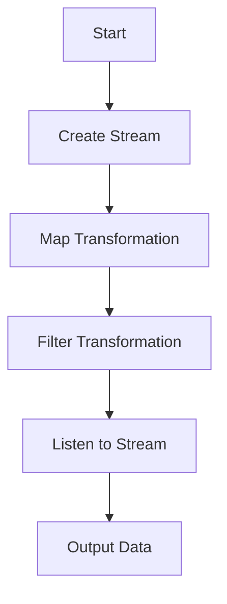

## 10.7 Functional Reactive Programming

Functional Reactive Programming (FRP) is a powerful paradigm that combines the best of functional programming and reactive programming. In the context of Dart and Flutter, FRP allows developers to create applications that are both responsive and maintainable. This section will delve into the core concepts of FRP, how to implement it in Dart using streams and RxDart, and practical use cases such as reactive UIs and event processing.

### Combining Functional and Reactive Paradigms

Functional Reactive Programming is about treating data as a continuous flow and applying functional transformations to it. Let's break down these concepts:

#### Streams as Data Flows

In Dart, streams are a fundamental part of handling asynchronous data. A stream is essentially a sequence of asynchronous events. You can think of it as a pipe through which data flows. Streams can be finite or infinite, and they are perfect for modeling data that changes over time, such as user inputs, network requests, or sensor data.

```dart
import 'dart:async';

void main() {
  // Create a stream controller
  final controller = StreamController<int>();

  // Listen to the stream
  controller.stream.listen((data) {
    print('Received: $data');
  });

  // Add data to the stream
  controller.add(1);
  controller.add(2);
  controller.add(3);

  // Close the stream
  controller.close();
}
```

In this example, we create a stream of integers and listen for incoming data. The `StreamController` is used to manage the stream, allowing us to add data and close the stream when done.

#### Transformation Functions

Transformation functions are used to manipulate data as it flows through a stream. Common transformations include mapping, filtering, and reducing. These functions allow you to apply functional programming principles to streams, making your code more declarative and easier to understand.

- **Mapping**: Transform each element in a stream.
- **Filtering**: Remove elements that don't meet a condition.
- **Reducing**: Combine elements into a single result.

```dart
void main() {
  final controller = StreamController<int>();

  // Transform the stream using map, filter, and reduce
  controller.stream
    .map((data) => data * 2) // Double each element
    .where((data) => data > 2) // Filter elements greater than 2
    .listen((data) {
      print('Transformed: $data');
    });

  controller.add(1);
  controller.add(2);
  controller.add(3);
  controller.close();
}
```

In this example, we use `map` to double each element and `where` to filter out elements less than or equal to 2. The transformed data is then printed.

### Implementing FRP in Dart

To effectively implement Functional Reactive Programming in Dart, we can leverage the RxDart package, which extends Dart's native stream capabilities.

#### Using RxDart

RxDart is a reactive extension for Dart that provides additional operators and functionality for working with streams. It allows for more complex stream transformations and compositions, making it easier to implement FRP patterns.

To get started with RxDart, add it to your `pubspec.yaml`:

```yaml
dependencies:
  rxdart: ^0.27.0
```

With RxDart, you can use subjects, which are both a stream and a sink, allowing you to listen to and emit data.

```dart
import 'package:rxdart/rxdart.dart';

void main() {
  // Create a BehaviorSubject
  final subject = BehaviorSubject<int>();

  // Listen to the subject
  subject.listen((data) {
    print('Received: $data');
  });

  // Add data to the subject
  subject.add(1);
  subject.add(2);
  subject.add(3);

  // Close the subject
  subject.close();
}
```

A `BehaviorSubject` is a type of subject that emits the most recent item to new subscribers, making it ideal for state management in reactive UIs.

### Use Cases and Examples

Functional Reactive Programming is particularly useful in scenarios where you need to handle asynchronous data and events. Let's explore some common use cases.

#### Reactive UIs

In Flutter, reactive UIs are built by responding to changes in data. With FRP, you can create UIs that automatically update when the underlying data changes.

Consider a simple counter app where the UI updates whenever the counter value changes:

```dart
import 'package:flutter/material.dart';
import 'package:rxdart/rxdart.dart';

void main() {
  runApp(MyApp());
}

class MyApp extends StatelessWidget {
  @override
  Widget build(BuildContext context) {
    return MaterialApp(
      home: CounterPage(),
    );
  }
}

class CounterPage extends StatelessWidget {
  final BehaviorSubject<int> _counter = BehaviorSubject<int>.seeded(0);

  @override
  Widget build(BuildContext context) {
    return Scaffold(
      appBar: AppBar(title: Text('Reactive Counter')),
      body: Center(
        child: StreamBuilder<int>(
          stream: _counter.stream,
          builder: (context, snapshot) {
            if (!snapshot.hasData) return CircularProgressIndicator();
            return Text('Count: ${snapshot.data}', style: TextStyle(fontSize: 24));
          },
        ),
      ),
      floatingActionButton: FloatingActionButton(
        onPressed: () => _counter.add(_counter.value + 1),
        child: Icon(Icons.add),
      ),
    );
  }
}
```

In this example, we use a `BehaviorSubject` to manage the counter state. The `StreamBuilder` widget listens to the stream and rebuilds the UI whenever the counter value changes.

#### Event Processing

FRP is also effective for handling complex asynchronous workflows, such as processing a series of events or actions.

```dart
import 'package:rxdart/rxdart.dart';

void main() {
  final subject = PublishSubject<String>();

  subject
    .debounceTime(Duration(milliseconds: 300)) // Debounce events
    .distinct() // Emit only distinct items
    .listen((data) {
      print('Processed: $data');
    });

  subject.add('event1');
  subject.add('event2');
  subject.add('event2'); // Duplicate, will be ignored
  subject.add('event3');

  subject.close();
}
```

Here, we use `debounceTime` to ignore rapid successive events and `distinct` to filter out duplicate events. This pattern is useful for scenarios like search input handling, where you want to process only unique and stable inputs.

### Visualizing Functional Reactive Programming

To better understand how data flows through streams and how transformations are applied, let's visualize the process using a flowchart.



**Description**: This flowchart illustrates the process of creating a stream, applying map and filter transformations, and listening to the transformed data.

### References and Links

- [Dart Streams](https://dart.dev/tutorials/language/streams) - Official Dart documentation on streams.
- [RxDart](https://pub.dev/packages/rxdart) - RxDart package documentation and examples.
- [Functional Reactive Programming](https://en.wikipedia.org/wiki/Functional_reactive_programming) - Wikipedia article on FRP.

### Knowledge Check

- Explain how streams can be used to handle asynchronous data in Dart.
- Demonstrate the use of transformation functions like map and filter on a stream.
- Provide an example of using RxDart to manage state in a Flutter application.

### Embrace the Journey

Remember, mastering Functional Reactive Programming in Dart is a journey. As you explore these concepts, you'll find new ways to build responsive and maintainable applications. Keep experimenting with streams and RxDart, and enjoy the process of creating dynamic and interactive UIs.

## Quiz Time!



### What is a stream in Dart?

- [x] A sequence of asynchronous events
- [ ] A synchronous data structure
- [ ] A type of widget in Flutter
- [ ] A Dart package for reactive programming

> **Explanation:** A stream in Dart is a sequence of asynchronous events, allowing you to handle data that changes over time.

### Which transformation function is used to change each element in a stream?

- [x] map
- [ ] filter
- [ ] reduce
- [ ] debounce

> **Explanation:** The `map` function is used to transform each element in a stream.

### What does the `distinct` operator do in RxDart?

- [x] Emits only distinct items
- [ ] Combines elements into a single result
- [ ] Delays events by a specified duration
- [ ] Filters elements based on a condition

> **Explanation:** The `distinct` operator emits only distinct items, filtering out duplicates.

### How can you create a reactive UI in Flutter using FRP?

- [x] By using streams and StreamBuilder
- [ ] By using synchronous functions
- [ ] By using only stateful widgets
- [ ] By using Dart's Future API

> **Explanation:** Reactive UIs in Flutter can be created using streams and the `StreamBuilder` widget to listen for data changes.

### What is the purpose of the `debounceTime` operator in RxDart?

- [x] To ignore rapid successive events
- [ ] To transform each element in a stream
- [ ] To combine elements into a single result
- [ ] To emit only distinct items

> **Explanation:** The `debounceTime` operator is used to ignore rapid successive events, useful for scenarios like search input handling.

### Which package extends Dart's native stream capabilities for FRP?

- [x] RxDart
- [ ] Flutter
- [ ] Dart Streams
- [ ] Async

> **Explanation:** RxDart is a reactive extension for Dart that extends native stream capabilities.

### What is a `BehaviorSubject` in RxDart?

- [x] A subject that emits the most recent item to new subscribers
- [ ] A subject that only emits distinct items
- [ ] A subject that combines elements into a single result
- [ ] A subject that delays events by a specified duration

> **Explanation:** A `BehaviorSubject` emits the most recent item to new subscribers, making it ideal for state management.

### What is the main advantage of using FRP in Dart?

- [x] It allows for responsive and maintainable applications
- [ ] It simplifies synchronous programming
- [ ] It eliminates the need for streams
- [ ] It is only useful for UI development

> **Explanation:** FRP allows for responsive and maintainable applications by combining functional and reactive programming paradigms.

### Which operator is used to filter elements in a stream?

- [x] where
- [ ] map
- [ ] reduce
- [ ] debounce

> **Explanation:** The `where` operator is used to filter elements in a stream based on a condition.

### True or False: RxDart is only used for UI development in Flutter.

- [ ] True
- [x] False

> **Explanation:** False. RxDart is used for various reactive programming scenarios, not just UI development in Flutter.


