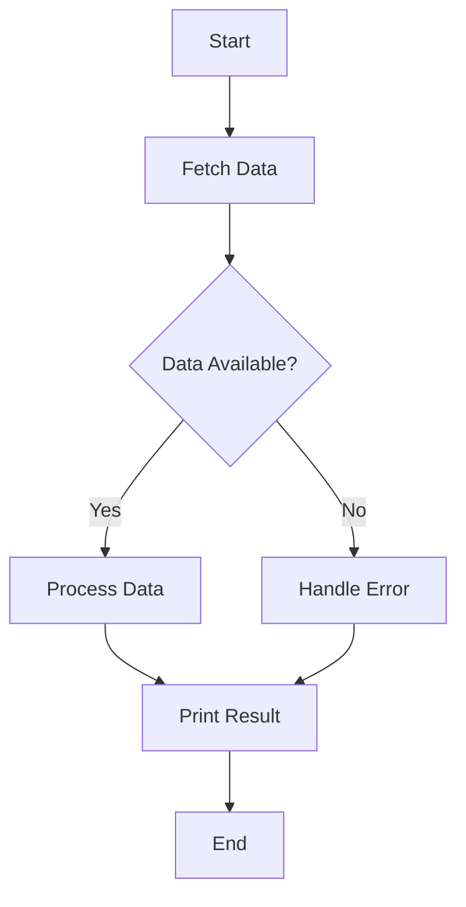

## 10.8 Monad Pattern

In the realm of functional programming, the Monad Pattern stands out as a powerful abstraction that simplifies complex operations and computations. This section delves into the Monad Pattern in Dart, focusing on its role in abstracting computation and operations. We will explore common monads such as `Future` and `Option/Maybe`, and demonstrate how to implement and use them effectively in Dart and Flutter development.

### Abstracting Computation and Operations

Monads are a fundamental concept in functional programming, providing a way to wrap values and computations in a consistent interface. They allow developers to chain operations seamlessly, handling side effects and asynchronous computations with ease.

#### Understanding Monads

At its core, a monad is a design pattern used to handle program-wide concerns in a functional way. It provides a way to wrap values and computations, enabling developers to build pipelines of operations that can be executed in a controlled manner.

- **Definition**: A monad is a type that implements two primary operations: `bind` (often represented as `flatMap` or `then`) and `unit` (also known as `return` or `pure`).
- **Purpose**: Monads abstract the process of chaining operations, allowing developers to focus on the logic rather than the mechanics of handling side effects or asynchronous operations.

#### Common Monads in Dart

Dart, with its support for asynchronous programming and functional constructs, provides several monads that are commonly used in Flutter development.

##### Future Monad

The `Future` monad is a cornerstone of asynchronous programming in Dart. It represents a computation that will complete at some point in the future, either with a result or an error.

- **Usage**: Futures are used to handle asynchronous operations, such as network requests or file I/O.
- **Chaining**: Futures can be chained using the `then` method, allowing developers to sequence operations that depend on the completion of a previous task.

```dart
Future<int> fetchData() async {
  // Simulate a network request
  return Future.delayed(Duration(seconds: 2), () => 42);
}

void main() {
  fetchData().then((value) {
    print('Fetched data: $value');
  }).catchError((error) {
    print('Error: $error');
  });
}
```

##### Option/Maybe Monad

The `Option` or `Maybe` monad is used to handle nullable values safely, avoiding null reference errors.

- **Usage**: It encapsulates a value that may or may not be present, providing methods to handle both cases gracefully.
- **Chaining**: Operations can be chained using methods like `map` or `flatMap`, ensuring that computations are only performed if a value is present.

```dart
class Option<T> {
  final T? _value;

  Option(this._value);

  bool get isPresent => _value != null;

  T get value {
    if (_value == null) {
      throw StateError('No value present');
    }
    return _value!;
  }

  Option<U> map<U>(U Function(T) transform) {
    if (isPresent) {
      return Option(transform(_value!));
    }
    return Option(null);
  }
}

void main() {
  Option<int> someValue = Option(42);
  Option<int> noValue = Option(null);

  someValue.map((value) => value * 2).map((value) => print('Value: $value'));
  noValue.map((value) => value * 2).map((value) => print('Value: $value'));
}
```

### Implementing Monads

Implementing monads in Dart involves defining a class that encapsulates a value and provides methods for chaining operations.

#### Chaining Operations

Chaining operations is a key feature of monads, allowing developers to build pipelines of computations that can be executed in sequence.

- **Bind Operation**: The `bind` operation, often represented as `flatMap` or `then`, is used to chain operations. It takes a function that returns a monad and applies it to the encapsulated value.
- **Unit Operation**: The `unit` operation, also known as `return` or `pure`, is used to wrap a value in a monad.

```dart
class Monad<T> {
  final T _value;

  Monad(this._value);

  Monad<U> flatMap<U>(Monad<U> Function(T) transform) {
    return transform(_value);
  }

  static Monad<T> pure<T>(T value) {
    return Monad(value);
  }
}

void main() {
  Monad<int> monad = Monad.pure(42);
  monad.flatMap((value) => Monad.pure(value * 2)).flatMap((value) => Monad.pure(value + 1));
}
```

### Use Cases and Examples

Monads are versatile and can be used in various scenarios to simplify complex operations.

#### Error Handling

Monads provide a structured way to handle errors without breaking the chain of operations. This is particularly useful in asynchronous programming, where exceptions can occur at any point in the pipeline.

```dart
Future<int> fetchDataWithError() async {
  // Simulate a network request with an error
  return Future.delayed(Duration(seconds: 2), () => throw Exception('Network error'));
}

void main() {
  fetchDataWithError().then((value) {
    print('Fetched data: $value');
  }).catchError((error) {
    print('Error: $error');
  });
}
```

#### Asynchronous Programming

Monads like `Future` simplify asynchronous programming by providing a consistent interface for handling operations that complete at a later time.

```dart
Future<int> fetchData() async {
  // Simulate a network request
  return Future.delayed(Duration(seconds: 2), () => 42);
}

Future<int> processData(int data) async {
  // Simulate data processing
  return Future.delayed(Duration(seconds: 1), () => data * 2);
}

void main() {
  fetchData()
      .then((data) => processData(data))
      .then((result) => print('Processed data: $result'))
      .catchError((error) => print('Error: $error'));
}
```

### Visualizing Monad Operations

To better understand how monads work, let's visualize the chaining of operations using a flowchart.



**Figure 1**: This flowchart illustrates the process of fetching and processing data using monads. The operations are chained, and errors are handled gracefully without breaking the flow.

### Design Considerations

When using monads in Dart, consider the following:

- **Error Handling**: Use monads to encapsulate error handling, ensuring that exceptions do not disrupt the flow of operations.
- **Asynchronous Operations**: Leverage the `Future` monad to manage asynchronous tasks, simplifying the handling of operations that complete at a later time.
- **Nullable Values**: Use the `Option/Maybe` monad to handle nullable values safely, avoiding null reference errors.

### Differences and Similarities

Monads are often compared to other functional programming constructs, such as functors and applicatives. While they share similarities, monads provide a more powerful abstraction for chaining operations.

- **Functors**: Functors provide a way to apply a function to a wrapped value, but they do not support chaining operations.
- **Applicatives**: Applicatives extend functors by allowing functions that take multiple arguments to be applied to wrapped values, but they still lack the chaining capabilities of monads.

### Try It Yourself

To deepen your understanding of monads, try modifying the code examples provided:

- **Experiment with Error Handling**: Introduce different types of errors and see how the monad pattern handles them.
- **Chain Additional Operations**: Add more operations to the monad chain and observe how the flow of data is managed.
- **Create Custom Monads**: Implement your own monad class and explore how it can be used to simplify complex operations.

### Knowledge Check

Before we conclude, let's reinforce what we've learned about the Monad Pattern in Dart.

- **What is a monad, and how does it differ from a functor?**
- **How can the `Future` monad be used to simplify asynchronous programming?**
- **What are the benefits of using the `Option/Maybe` monad for handling nullable values?**

### Embrace the Journey

Remember, mastering the Monad Pattern is just the beginning of your journey into functional programming in Dart. As you continue to explore and experiment, you'll discover new ways to simplify complex operations and build more robust applications. Keep experimenting, stay curious, and enjoy the journey!

## Quiz Time!



### What is a monad?

- [x] A design pattern that wraps values and computations
- [ ] A type of data structure
- [ ] A method for error handling
- [ ] A Dart-specific feature

> **Explanation:** A monad is a design pattern used to wrap values and computations, providing a consistent interface for chaining operations.

### Which monad is commonly used for asynchronous programming in Dart?

- [x] Future
- [ ] Option
- [ ] Maybe
- [ ] List

> **Explanation:** The `Future` monad is commonly used for asynchronous programming in Dart, representing computations that complete at a later time.

### What is the purpose of the `Option/Maybe` monad?

- [x] To handle nullable values safely
- [ ] To manage asynchronous operations
- [ ] To encapsulate error handling
- [ ] To optimize performance

> **Explanation:** The `Option/Maybe` monad is used to handle nullable values safely, avoiding null reference errors.

### How does the `bind` operation work in a monad?

- [x] It chains operations by applying a function to the encapsulated value
- [ ] It wraps a value in a monad
- [ ] It handles errors in the monad chain
- [ ] It optimizes performance

> **Explanation:** The `bind` operation, often represented as `flatMap` or `then`, chains operations by applying a function to the encapsulated value.

### What is the `unit` operation in a monad?

- [x] It wraps a value in a monad
- [ ] It chains operations
- [ ] It handles errors
- [ ] It optimizes performance

> **Explanation:** The `unit` operation, also known as `return` or `pure`, wraps a value in a monad.

### What is the main benefit of using monads for error handling?

- [x] They allow errors to be handled without breaking the chain of operations
- [ ] They optimize performance
- [ ] They simplify code structure
- [ ] They enhance security

> **Explanation:** Monads allow errors to be handled without breaking the chain of operations, providing a structured way to manage exceptions.

### How can monads simplify asynchronous programming?

- [x] By providing a consistent interface for handling operations that complete at a later time
- [ ] By optimizing performance
- [ ] By enhancing security
- [ ] By simplifying code structure

> **Explanation:** Monads like `Future` provide a consistent interface for handling operations that complete at a later time, simplifying asynchronous programming.

### What is a key feature of monads?

- [x] Chaining operations
- [ ] Optimizing performance
- [ ] Enhancing security
- [ ] Simplifying code structure

> **Explanation:** A key feature of monads is their ability to chain operations, allowing developers to build pipelines of computations.

### What is the difference between a monad and a functor?

- [x] Monads support chaining operations, while functors do not
- [ ] Functors support chaining operations, while monads do not
- [ ] Monads and functors are the same
- [ ] Functors are a type of monad

> **Explanation:** Monads support chaining operations, while functors only provide a way to apply a function to a wrapped value.

### True or False: Monads are specific to Dart.

- [ ] True
- [x] False

> **Explanation:** Monads are not specific to Dart; they are a fundamental concept in functional programming used in many languages.


