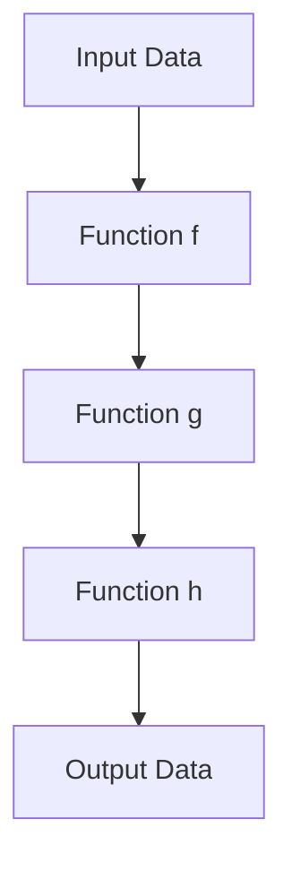

## 10.9 Function Composition in Dart

Function composition is a fundamental concept in functional programming that allows developers to build complex functions by combining simpler ones. In Dart, function composition can be a powerful tool for creating clean, modular, and reusable code. This section will guide you through the principles of function composition, demonstrate how to implement it using helper functions, and explore practical use cases such as data pipelines and middleware patterns.

### Combining Simple Functions

Function composition is akin to assembling a puzzle where each piece is a simple function. By combining these pieces, we can create a more complex function that performs a series of operations. This approach promotes code reusability and modularity, making it easier to maintain and extend your codebase.

#### Function Composition: Building Complex Functions from Simpler Ones

At its core, function composition involves taking two or more functions and combining them to form a new function. The output of one function becomes the input of the next. This chaining of functions allows us to create a pipeline of operations that transform data in a step-by-step manner.

Consider the following mathematical example:

- Let \\( f(x) = x + 2 \\)
- Let \\( g(x) = x \times 3 \\)

The composition of these functions, denoted as \\( g(f(x)) \\), would first add 2 to \\( x \\) and then multiply the result by 3.

In Dart, we can implement this concept using higher-order functions, which are functions that take other functions as arguments or return them as results.

### Implementing Function Composition

To implement function composition in Dart, we can use helper functions that facilitate the chaining of operations. Let's explore how to create a simple function composition utility.

#### Using Helper Functions to Compose Functions

We can define a `compose` function that takes two functions as arguments and returns a new function representing their composition. Here's how we can implement this in Dart:

```dart
// Define a function that composes two functions
Function compose(Function f, Function g) {
  return (x) => g(f(x));
}

// Example functions
int addTwo(int x) => x + 2;
int multiplyByThree(int x) => x * 3;

void main() {
  // Compose the functions
  var composedFunction = compose(addTwo, multiplyByThree);

  // Test the composed function
  print(composedFunction(4)); // Output: 18
}
```

In this example, the `compose` function takes two functions, `f` and `g`, and returns a new function that applies `f` to its input and then applies `g` to the result. The `composedFunction` is a combination of `addTwo` and `multiplyByThree`, demonstrating how function composition can be used to build more complex operations.

### Use Cases and Examples

Function composition is not just a theoretical concept; it has practical applications in real-world programming. Let's explore some common use cases where function composition can be particularly useful.

#### Data Pipelines: Transforming Data Through Successive Functions

In data processing, it's common to transform data through a series of operations. Function composition allows us to create data pipelines where each function represents a step in the transformation process.

Consider a scenario where we need to process a list of numbers by first filtering out even numbers, then doubling the remaining numbers, and finally summing them up. We can achieve this using function composition:

```dart
List<int> filterEvenNumbers(List<int> numbers) {
  return numbers.where((n) => n.isOdd).toList();
}

List<int> doubleNumbers(List<int> numbers) {
  return numbers.map((n) => n * 2).toList();
}

int sumNumbers(List<int> numbers) {
  return numbers.reduce((a, b) => a + b);
}

void main() {
  List<int> numbers = [1, 2, 3, 4, 5, 6];

  // Compose the data pipeline
  var processNumbers = compose(
    compose(filterEvenNumbers, doubleNumbers),
    sumNumbers
  );

  // Execute the pipeline
  print(processNumbers(numbers)); // Output: 18
}
```

In this example, we define three functions: `filterEvenNumbers`, `doubleNumbers`, and `sumNumbers`. By composing these functions, we create a data pipeline that processes the list of numbers in a structured and modular way.

#### Middleware Patterns: Applying Layers of Processing

In software architecture, middleware refers to a series of processing layers that handle requests and responses. Function composition can be used to implement middleware patterns, where each function represents a layer of processing.

Consider a web server that processes HTTP requests. We can use function composition to apply middleware functions that handle authentication, logging, and response formatting:

```dart
typedef Middleware = Function(Map<String, dynamic> request);

Middleware authenticate(Middleware next) {
  return (request) {
    if (request['authenticated'] == true) {
      next(request);
    } else {
      print('Authentication failed');
    }
  };
}

Middleware logRequest(Middleware next) {
  return (request) {
    print('Request: ${request['url']}');
    next(request);
  };
}

Middleware formatResponse(Middleware next) {
  return (request) {
    next(request);
    print('Response formatted');
  };
}

void handleRequest(Map<String, dynamic> request) {
  print('Handling request: ${request['url']}');
}

void main() {
  // Compose the middleware
  var middleware = compose(
    compose(authenticate, logRequest),
    formatResponse
  );

  // Execute the middleware with the request handler
  middleware(handleRequest)({'url': '/api/data', 'authenticated': true});
}
```

In this example, we define three middleware functions: `authenticate`, `logRequest`, and `formatResponse`. By composing these functions, we create a middleware pipeline that processes HTTP requests in a structured manner.

### Visualizing Function Composition

To better understand function composition, let's visualize the process using a flowchart. This diagram illustrates how data flows through a series of composed functions.



In this flowchart, the input data is processed by a series of functions (`f`, `g`, `h`), with each function transforming the data before passing it to the next. The final output is the result of the composed functions.

### Design Considerations

When using function composition in Dart, there are several design considerations to keep in mind:

- **Function Signatures**: Ensure that the output type of one function matches the input type of the next function in the composition chain.
- **Error Handling**: Consider how errors are propagated through the composed functions and implement appropriate error handling mechanisms.
- **Performance**: Be mindful of the performance implications of composing multiple functions, especially in performance-critical applications.
- **Readability**: While function composition can lead to concise code, ensure that the resulting code remains readable and maintainable.

### Differences and Similarities

Function composition is often compared to other programming paradigms, such as object-oriented programming (OOP). While both paradigms aim to promote code reuse and modularity, function composition focuses on combining functions, whereas OOP emphasizes the use of objects and classes.

In Dart, function composition can be seamlessly integrated with other programming paradigms, allowing developers to leverage the strengths of each approach.

### Try It Yourself

To deepen your understanding of function composition, try modifying the code examples provided in this section. Experiment with different functions and compositions to see how they affect the output. Consider creating your own data pipelines or middleware patterns using function composition.

### Knowledge Check

Before moving on, let's review some key concepts:

- What is function composition, and how does it promote code modularity?
- How can helper functions be used to implement function composition in Dart?
- What are some practical use cases for function composition, such as data pipelines and middleware patterns?

### Embrace the Journey

Remember, mastering function composition is just one step in your journey to becoming a proficient Dart developer. As you continue to explore functional programming patterns, you'll discover new ways to write clean, efficient, and maintainable code. Keep experimenting, stay curious, and enjoy the process of learning and growing as a developer.

## Quiz Time!



### What is function composition?

- [x] Combining simple functions to build complex functions
- [ ] Dividing complex functions into simpler ones
- [ ] Using classes to organize functions
- [ ] Creating functions without parameters

> **Explanation:** Function composition involves combining simple functions to build more complex ones, allowing for modular and reusable code.

### How do you implement function composition in Dart?

- [x] Using helper functions to chain operations
- [ ] Using classes and objects
- [ ] Using inheritance and polymorphism
- [ ] Using global variables

> **Explanation:** In Dart, function composition can be implemented using helper functions that chain operations together.

### What is a practical use case for function composition?

- [x] Data pipelines
- [ ] Object-oriented design
- [ ] Memory management
- [ ] Network communication

> **Explanation:** Function composition is commonly used in data pipelines, where data is transformed through successive functions.

### What is a middleware pattern?

- [x] A series of processing layers applied to requests and responses
- [ ] A design pattern for database access
- [ ] A method for handling exceptions
- [ ] A way to manage memory allocation

> **Explanation:** Middleware patterns involve applying a series of processing layers to requests and responses, often implemented using function composition.

### What should you consider when using function composition?

- [x] Function signatures and error handling
- [ ] Class hierarchies and inheritance
- [ ] Memory allocation and garbage collection
- [ ] Network latency and bandwidth

> **Explanation:** When using function composition, it's important to consider function signatures, error handling, and performance implications.

### What is the output of the composed function in the provided example?

- [x] 18
- [ ] 12
- [ ] 24
- [ ] 6

> **Explanation:** The composed function first adds 2 to the input and then multiplies the result by 3, resulting in an output of 18 for the input 4.

### What is the purpose of the `compose` function in Dart?

- [x] To create a new function by combining two functions
- [ ] To split a function into two separate functions
- [ ] To convert a function into a class
- [ ] To remove parameters from a function

> **Explanation:** The `compose` function in Dart is used to create a new function by combining two functions, allowing for function composition.

### How can function composition improve code readability?

- [x] By creating modular and reusable code
- [ ] By using global variables
- [ ] By increasing the number of lines of code
- [ ] By using complex algorithms

> **Explanation:** Function composition improves code readability by creating modular and reusable code, making it easier to understand and maintain.

### What is a key benefit of using function composition?

- [x] Code reusability and modularity
- [ ] Increased memory usage
- [ ] Faster execution times
- [ ] Simplified error handling

> **Explanation:** A key benefit of function composition is code reusability and modularity, allowing for cleaner and more maintainable code.

### True or False: Function composition is only applicable in functional programming.

- [ ] True
- [x] False

> **Explanation:** While function composition is a fundamental concept in functional programming, it can be applied in other programming paradigms, including object-oriented programming.



By mastering function composition in Dart, you unlock the potential to write more efficient, modular, and maintainable code. This powerful concept is a cornerstone of functional programming and can greatly enhance your development skills. Keep exploring and experimenting with function composition to discover new ways to improve your codebase.


