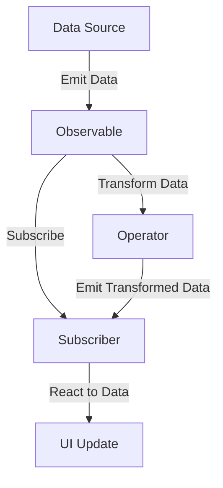

## 11.1 Introduction to Reactive Programming

Reactive programming is a programming paradigm that focuses on building systems that react to changes in data. This approach is particularly useful in modern software development, where applications need to handle asynchronous data streams and provide a responsive user experience. In this section, we will explore the core concepts of reactive programming, its benefits, and how it can be effectively implemented in Dart and Flutter applications.

### Understanding Reactive Programming

Reactive programming is centered around the concept of data streams and the propagation of change. It allows developers to build applications that can respond to changes in data in real-time, making it an ideal choice for applications that require high interactivity and responsiveness.

#### Key Concepts of Reactive Programming

1. **Data Streams**: In reactive programming, data is represented as streams that can be observed and manipulated over time. These streams can emit data, errors, or completion signals.

2. **Observables**: An observable is a data source that emits a stream of events. Observables can be subscribed to, allowing the application to react to new data as it becomes available.

3. **Subscribers**: Subscribers are entities that listen to observables and react to the data they emit. They define how the application should respond to changes in the data stream.

4. **Operators**: Operators are functions that allow developers to transform, filter, and combine data streams. They provide a powerful way to manipulate data as it flows through the application.

5. **Schedulers**: Schedulers control the execution context of data streams, determining when and where the data processing occurs.

### Reactivity in Dart and Flutter

Dart and Flutter provide robust support for reactive programming through the use of `Streams` and the widget tree architecture. Let's explore how these features enable reactive programming in Dart and Flutter applications.

#### Dart Streams

Dart's `Stream` class is a core component of its asynchronous programming model. Streams represent a sequence of asynchronous events, which can be processed using a variety of built-in methods and operators.

```dart
import 'dart:async';

void main() {
  // Create a stream controller
  final controller = StreamController<int>();

  // Add data to the stream
  controller.add(1);
  controller.add(2);
  controller.add(3);

  // Listen to the stream
  controller.stream.listen((data) {
    print('Received: $data');
  });

  // Close the stream
  controller.close();
}
```

In this example, we create a `StreamController` to manage a stream of integer data. We add data to the stream using the `add` method and listen to the stream using the `listen` method. The stream emits data asynchronously, allowing the application to react to new data as it becomes available.

#### Flutter's Widget Tree

Flutter's widget tree architecture is inherently reactive, allowing developers to build UI components that respond to changes in data. Widgets in Flutter are immutable, meaning that they cannot be changed once created. Instead, when data changes, Flutter rebuilds the widget tree to reflect the new state.

```dart
import 'package:flutter/material.dart';

void main() {
  runApp(MyApp());
}

class MyApp extends StatelessWidget {
  @override
  Widget build(BuildContext context) {
    return MaterialApp(
      home: Scaffold(
        appBar: AppBar(
          title: Text('Reactive Flutter App'),
        ),
        body: CounterWidget(),
      ),
    );
  }
}

class CounterWidget extends StatefulWidget {
  @override
  _CounterWidgetState createState() => _CounterWidgetState();
}

class _CounterWidgetState extends State<CounterWidget> {
  int _counter = 0;

  void _incrementCounter() {
    setState(() {
      _counter++;
    });
  }

  @override
  Widget build(BuildContext context) {
    return Center(
      child: Column(
        mainAxisAlignment: MainAxisAlignment.center,
        children: <Widget>[
          Text(
            'You have pushed the button this many times:',
          ),
          Text(
            '$_counter',
            style: Theme.of(context).textTheme.headline4,
          ),
          ElevatedButton(
            onPressed: _incrementCounter,
            child: Text('Increment'),
          ),
        ],
      ),
    );
  }
}
```

In this Flutter example, we create a simple counter application. The `CounterWidget` uses a `StatefulWidget` to manage its state. When the button is pressed, the `_incrementCounter` method is called, which updates the state and triggers a rebuild of the widget tree. This reactive approach ensures that the UI is always in sync with the underlying data.

### Benefits of Reactive Programming

Reactive programming offers several benefits that make it an attractive choice for modern software development:

1. **Simplified Asynchronous Code**: Reactive programming provides a declarative approach to handling asynchronous data, reducing the complexity of managing callbacks and promises.

2. **Enhanced Responsiveness**: By reacting to changes in data in real-time, reactive programming enables applications to provide a more responsive user experience.

3. **Improved UI Synchronization**: Reactive programming ensures that the UI is always in sync with the underlying data, reducing the likelihood of inconsistencies and bugs.

4. **Scalability**: Reactive programming allows applications to handle large volumes of data and complex interactions efficiently, making it suitable for scalable applications.

### Visualizing Reactive Programming

To better understand the flow of data in reactive programming, let's visualize the process using a Mermaid.js diagram.



**Diagram Description**: This diagram illustrates the flow of data in a reactive programming model. The data source emits data to an observable, which can be subscribed to by a subscriber. The subscriber reacts to the data by updating the UI. Operators can be used to transform the data before it reaches the subscriber.

### Try It Yourself

To deepen your understanding of reactive programming, try modifying the code examples provided in this section. Experiment with different types of data streams, operators, and UI components to see how they affect the behavior of the application. Consider implementing additional features, such as error handling and data transformation, to enhance the functionality of your reactive applications.

### References and Links

- [Dart Streams Documentation](https://dart.dev/tutorials/language/streams)
- [Flutter Widget Tree](https://flutter.dev/docs/development/ui/widgets-intro)
- [ReactiveX](http://reactivex.io/)

### Knowledge Check

To reinforce your understanding of reactive programming, consider the following questions:

1. What is the primary purpose of reactive programming?
2. How do Dart streams facilitate reactive programming?
3. What role do operators play in reactive programming?
4. How does Flutter's widget tree architecture support reactivity?
5. What are the benefits of using reactive programming in application development?

### Embrace the Journey

Remember, this is just the beginning of your journey into reactive programming. As you continue to explore this paradigm, you'll discover new ways to build responsive and interactive applications. Keep experimenting, stay curious, and enjoy the journey!

## Quiz Time!



### What is the primary purpose of reactive programming?

- [x] To build systems that react to changes in data
- [ ] To simplify synchronous programming
- [ ] To replace object-oriented programming
- [ ] To eliminate the need for UI updates

> **Explanation:** Reactive programming focuses on building systems that react to changes in data, allowing for real-time updates and responsiveness.

### How do Dart streams facilitate reactive programming?

- [x] By representing sequences of asynchronous events
- [ ] By providing synchronous data handling
- [ ] By eliminating the need for callbacks
- [ ] By simplifying synchronous code

> **Explanation:** Dart streams represent sequences of asynchronous events, enabling reactive programming by allowing applications to respond to data changes over time.

### What role do operators play in reactive programming?

- [x] They transform, filter, and combine data streams
- [ ] They manage the execution context of data streams
- [ ] They provide synchronous data handling
- [ ] They eliminate the need for subscribers

> **Explanation:** Operators are functions that transform, filter, and combine data streams, providing a powerful way to manipulate data in reactive programming.

### How does Flutter's widget tree architecture support reactivity?

- [x] By rebuilding the widget tree in response to data changes
- [ ] By eliminating the need for state management
- [ ] By providing synchronous UI updates
- [ ] By simplifying asynchronous code

> **Explanation:** Flutter's widget tree architecture supports reactivity by rebuilding the widget tree in response to data changes, ensuring the UI is always in sync with the underlying data.

### What are the benefits of using reactive programming in application development?

- [x] Simplified asynchronous code
- [x] Enhanced responsiveness
- [x] Improved UI synchronization
- [ ] Increased code complexity

> **Explanation:** Reactive programming simplifies asynchronous code, enhances responsiveness, and improves UI synchronization, making it an attractive choice for modern application development.

### What is an observable in reactive programming?

- [x] A data source that emits a stream of events
- [ ] A function that transforms data streams
- [ ] A subscriber that listens to data streams
- [ ] A scheduler that controls data execution

> **Explanation:** An observable is a data source that emits a stream of events, which can be subscribed to by subscribers in reactive programming.

### What is the role of a subscriber in reactive programming?

- [x] To listen to observables and react to data
- [ ] To transform data streams
- [ ] To control the execution context of data streams
- [ ] To eliminate the need for UI updates

> **Explanation:** A subscriber listens to observables and reacts to the data they emit, defining how the application should respond to changes in the data stream.

### What is the purpose of a scheduler in reactive programming?

- [x] To control the execution context of data streams
- [ ] To transform data streams
- [ ] To provide synchronous data handling
- [ ] To eliminate the need for subscribers

> **Explanation:** Schedulers control the execution context of data streams, determining when and where the data processing occurs in reactive programming.

### How do operators enhance the functionality of reactive programming?

- [x] By allowing data transformation and combination
- [ ] By providing synchronous data handling
- [ ] By eliminating the need for subscribers
- [ ] By simplifying synchronous code

> **Explanation:** Operators enhance the functionality of reactive programming by allowing data transformation, filtering, and combination, providing a powerful way to manipulate data streams.

### Reactive programming is particularly useful for applications that require:

- [x] High interactivity and responsiveness
- [ ] Synchronous data handling
- [ ] Elimination of UI updates
- [ ] Simplified synchronous code

> **Explanation:** Reactive programming is particularly useful for applications that require high interactivity and responsiveness, as it allows for real-time updates and data handling.


