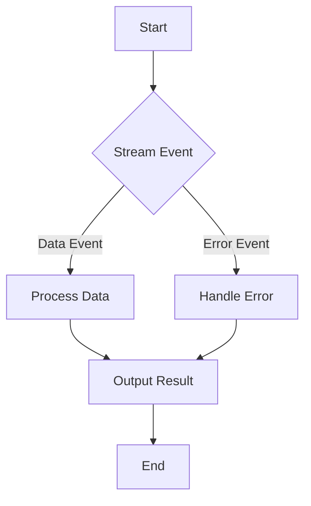

## 11.10 Reactive Programming Best Practices

Reactive programming is a powerful paradigm that allows developers to build responsive and resilient applications. In Dart and Flutter, reactive programming is often implemented using streams, which provide a way to handle asynchronous data flows. In this section, we will explore best practices for implementing reactive programming in Dart and Flutter, focusing on error handling, resource management, and scalability.

### Introduction to Reactive Programming

Reactive programming is a programming paradigm oriented around data flows and the propagation of change. This means that it is particularly well-suited for applications that require real-time updates, such as user interfaces, data streams, and network communications. In Dart, reactive programming is primarily facilitated through the use of streams, which allow developers to work with asynchronous sequences of data.

#### Key Concepts

- **Streams**: A sequence of asynchronous events. Streams can be single-subscription or broadcast, depending on whether they allow multiple listeners.
- **Stream Controllers**: Objects that allow you to control the behavior of a stream, including adding data, errors, and closing the stream.
- **Stream Subscriptions**: Represent the connection between a stream and a listener. Subscriptions can be paused, resumed, or canceled.

### Error Handling in Reactive Programming

Error handling is a critical aspect of any programming paradigm, and reactive programming is no exception. In Dart, errors in streams are propagated as events, which means they can be handled in a similar way to data events.

#### Propagating Errors Effectively

When working with streams, it's important to handle errors gracefully to ensure that your application remains robust and user-friendly. Here are some best practices for error handling in reactive programming:

1. **Use Try-Catch Blocks**: Wrap your stream operations in try-catch blocks to catch and handle errors as they occur.

   ```dart
   Stream<int> numberStream = Stream.fromIterable([1, 2, 3, 4, 5]);

   numberStream.listen(
     (number) {
       print('Received: $number');
     },
     onError: (error) {
       print('Error occurred: $error');
     },
     onDone: () {
       print('Stream closed');
     },
   );
   ```

2. **Provide Meaningful Error Messages**: When an error occurs, provide a meaningful error message that helps the user understand what went wrong and how to fix it.

3. **Use the `onError` Callback**: The `onError` callback allows you to handle errors directly within the stream subscription. This is a convenient way to manage errors without interrupting the flow of data.

4. **Implement Fallback Strategies**: In some cases, you may want to implement fallback strategies to recover from errors. For example, if a network request fails, you might retry the request or use cached data.

5. **Log Errors for Debugging**: Logging errors can be invaluable for debugging and monitoring your application. Use a logging library to capture and store error information.

### Resource Management in Reactive Programming

Proper resource management is essential for building efficient and scalable applications. In the context of reactive programming, this often involves managing stream subscriptions and ensuring that resources are released when they are no longer needed.

#### Properly Disposing of Streams

To prevent memory leaks and ensure that your application runs smoothly, it's important to dispose of streams and their subscriptions when they are no longer needed. Here are some best practices for managing resources in reactive programming:

1. **Cancel Stream Subscriptions**: Always cancel stream subscriptions when they are no longer needed. This can be done using the `cancel` method on the subscription object.

   ```dart
   StreamSubscription<int> subscription = numberStream.listen((number) {
     print('Received: $number');
   });

   // Cancel the subscription when it's no longer needed
   subscription.cancel();
   ```

2. **Use `StreamController.close()`**: If you are using a `StreamController` to manage your stream, be sure to call the `close` method when the stream is no longer needed.

   ```dart
   StreamController<int> controller = StreamController<int>();

   // Add data to the stream
   controller.add(1);
   controller.add(2);

   // Close the stream when done
   controller.close();
   ```

3. **Leverage `dispose()` in Flutter**: In Flutter, use the `dispose` method to clean up resources when a widget is removed from the widget tree. This is particularly important for stateful widgets that manage their own stream subscriptions.

   ```dart
   class MyWidget extends StatefulWidget {
     @override
     _MyWidgetState createState() => _MyWidgetState();
   }

   class _MyWidgetState extends State<MyWidget> {
     StreamSubscription<int> _subscription;

     @override
     void initState() {
       super.initState();
       _subscription = numberStream.listen((number) {
         print('Received: $number');
       });
     }

     @override
     void dispose() {
       _subscription.cancel();
       super.dispose();
     }

     @override
     Widget build(BuildContext context) {
       return Container();
     }
   }
   ```

4. **Use `StreamBuilder` in Flutter**: The `StreamBuilder` widget in Flutter automatically manages stream subscriptions and disposes of them when the widget is removed from the tree. This can simplify resource management in your application.

   ```dart
   StreamBuilder<int>(
     stream: numberStream,
     builder: (context, snapshot) {
       if (snapshot.hasData) {
         return Text('Received: ${snapshot.data}');
       } else if (snapshot.hasError) {
         return Text('Error: ${snapshot.error}');
       } else {
         return CircularProgressIndicator();
       }
     },
   );
   ```

### Scalability in Reactive Programming

Scalability is a key consideration when designing applications that use reactive programming. As your application grows in complexity, it's important to ensure that it can handle increasing amounts of data and users without degrading performance.

#### Designing for Scalability

Here are some best practices for designing scalable reactive applications:

1. **Use Broadcast Streams for Multiple Listeners**: If you have multiple listeners for a single stream, use a broadcast stream to allow multiple subscriptions.

   ```dart
   StreamController<int> controller = StreamController<int>.broadcast();

   // Add data to the stream
   controller.add(1);
   controller.add(2);

   // Multiple listeners can subscribe to the broadcast stream
   controller.stream.listen((number) {
     print('Listener 1 received: $number');
   });

   controller.stream.listen((number) {
     print('Listener 2 received: $number');
   });
   ```

2. **Optimize Data Processing**: Use efficient data processing techniques to minimize the impact of large data sets on your application's performance. This might include using lazy evaluation, batching, or filtering data before processing it.

3. **Leverage Asynchronous Programming**: Use asynchronous programming techniques, such as futures and async/await, to keep your application responsive and prevent blocking the main thread.

4. **Implement Caching Strategies**: Caching can help reduce the load on your application's backend and improve performance by storing frequently accessed data locally.

5. **Monitor and Optimize Performance**: Use performance monitoring tools to identify bottlenecks and optimize your application's performance. This might include profiling your code, analyzing memory usage, and optimizing network requests.

### Visualizing Reactive Programming Concepts

To better understand the flow of data and events in reactive programming, let's visualize a simple stream processing workflow using Mermaid.js.



**Diagram Description**: This diagram represents a basic stream processing workflow. It starts with a stream event, which can be either a data event or an error event. Data events are processed, and the result is output. Error events are handled, and the process continues until the end.

### Try It Yourself

To reinforce your understanding of reactive programming best practices, try modifying the code examples provided in this section. Experiment with different error handling strategies, resource management techniques, and scalability optimizations. Consider how these changes impact the performance and robustness of your application.

### References and Links

For further reading on reactive programming and related topics, consider the following resources:

- [Dart Streams](https://dart.dev/tutorials/language/streams)
- [Flutter StreamBuilder](https://api.flutter.dev/flutter/widgets/StreamBuilder-class.html)
- [ReactiveX](http://reactivex.io/)

### Knowledge Check

To test your understanding of the concepts covered in this section, try answering the following questions:

## Quiz Time!



### What is the primary purpose of using streams in Dart?

- [x] To handle asynchronous sequences of data
- [ ] To manage synchronous data processing
- [ ] To replace traditional loops
- [ ] To simplify error handling

> **Explanation:** Streams in Dart are used to handle asynchronous sequences of data, allowing developers to work with data flows in a non-blocking manner.

### How can you handle errors in a Dart stream?

- [x] Use the `onError` callback in the stream subscription
- [ ] Use a try-catch block around the stream
- [ ] Ignore errors and let the stream handle them automatically
- [ ] Use a separate error handling library

> **Explanation:** The `onError` callback in the stream subscription allows you to handle errors directly within the stream, providing a convenient way to manage errors.

### What is the benefit of using a broadcast stream?

- [x] It allows multiple listeners to subscribe to the same stream
- [ ] It improves the performance of the stream
- [ ] It automatically handles errors
- [ ] It simplifies resource management

> **Explanation:** A broadcast stream allows multiple listeners to subscribe to the same stream, making it suitable for scenarios where multiple parts of an application need to react to the same data events.

### Why is it important to cancel stream subscriptions?

- [x] To prevent memory leaks
- [ ] To improve application performance
- [ ] To simplify error handling
- [ ] To ensure data integrity

> **Explanation:** Canceling stream subscriptions is important to prevent memory leaks, as it ensures that resources are released when they are no longer needed.

### What is the role of the `dispose` method in Flutter?

- [x] To clean up resources when a widget is removed from the widget tree
- [ ] To initialize a widget's state
- [ ] To handle user interactions
- [ ] To render the widget's UI

> **Explanation:** The `dispose` method in Flutter is used to clean up resources, such as stream subscriptions, when a widget is removed from the widget tree.

### How can you optimize data processing in a reactive application?

- [x] Use lazy evaluation and batching
- [ ] Use synchronous loops
- [ ] Ignore performance considerations
- [ ] Use a single-threaded approach

> **Explanation:** Optimizing data processing in a reactive application can be achieved by using techniques such as lazy evaluation and batching, which minimize the impact of large data sets on performance.

### What is a common strategy for handling network request failures in a reactive application?

- [x] Implementing retry logic or using cached data
- [ ] Ignoring the failure and proceeding with the next request
- [ ] Logging the error and terminating the application
- [ ] Using synchronous network requests

> **Explanation:** A common strategy for handling network request failures is to implement retry logic or use cached data, ensuring that the application remains responsive and user-friendly.

### What is the advantage of using `StreamBuilder` in Flutter?

- [x] It automatically manages stream subscriptions and disposes of them
- [ ] It simplifies error handling
- [ ] It improves application performance
- [ ] It replaces the need for stateful widgets

> **Explanation:** `StreamBuilder` in Flutter automatically manages stream subscriptions and disposes of them when the widget is removed from the tree, simplifying resource management.

### How can you monitor and optimize the performance of a reactive application?

- [x] Use performance monitoring tools and profiling
- [ ] Ignore performance considerations
- [ ] Use synchronous data processing
- [ ] Avoid using streams

> **Explanation:** Monitoring and optimizing the performance of a reactive application can be achieved by using performance monitoring tools and profiling to identify bottlenecks and optimize code.

### True or False: Reactive programming is only suitable for small applications.

- [ ] True
- [x] False

> **Explanation:** Reactive programming is suitable for applications of all sizes, including large and complex applications, as it provides a scalable way to handle asynchronous data flows.



Remember, mastering reactive programming is a journey. As you continue to explore and experiment with these concepts, you'll gain a deeper understanding of how to build responsive and resilient applications using Dart and Flutter. Keep experimenting, stay curious, and enjoy the journey!
