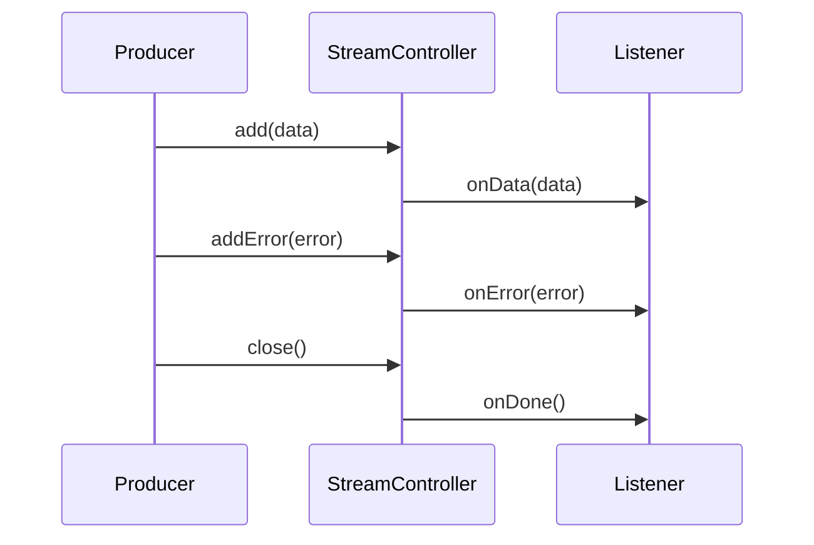

## 11.2 Working with Streams and Stream Controllers

In the world of Dart and Flutter development, understanding streams and stream controllers is pivotal for mastering reactive programming. Streams provide a powerful way to handle asynchronous data flows, making them indispensable for building responsive and efficient applications. In this section, we will delve into the core concepts of Dart streams, explore the use of stream controllers, and discuss best practices for managing subscriptions and handling errors.

### Understanding Dart Streams

Streams in Dart are sequences of asynchronous events. They are similar to futures, but while a future represents a single asynchronous computation, a stream is a sequence of asynchronous events. Streams are particularly useful for handling data that changes over time, such as user inputs, network responses, or file I/O.

#### Types of Streams

Dart provides two main types of streams: single-subscription streams and broadcast streams.

- **Single-Subscription Streams**: These streams allow only one listener at a time. Once a listener is attached, no other listener can be added until the first one is canceled. Single-subscription streams are ideal for handling data that is consumed once, such as reading a file or making an HTTP request.

- **Broadcast Streams**: These streams allow multiple listeners to be attached simultaneously. They are suitable for scenarios where multiple parts of an application need to react to the same data, such as a chat application where multiple users receive the same message.

```dart
// Example of a single-subscription stream
Stream<int> singleSubscriptionStream = Stream.fromIterable([1, 2, 3]);

// Example of a broadcast stream
Stream<int> broadcastStream = Stream.fromIterable([1, 2, 3]).asBroadcastStream();
```

### Stream Controllers

Stream controllers are the backbone of custom streams in Dart. They allow you to create streams and control the flow of data, including adding data, errors, and closing the stream.

#### Creating a Stream Controller

To create a stream controller, use the `StreamController` class. You can specify whether the stream should be single-subscription or broadcast by setting the `sync` parameter.

```dart
// Creating a single-subscription stream controller
StreamController<int> controller = StreamController<int>();

// Creating a broadcast stream controller
StreamController<int> broadcastController = StreamController<int>.broadcast();
```

#### Adding Data to a Stream

Once you have a stream controller, you can add data to the stream using the `add` method. You can also add errors using the `addError` method and close the stream using the `close` method.

```dart
controller.add(1);
controller.add(2);
controller.addError('An error occurred');
controller.close();
```

### Managing Subscriptions

Managing subscriptions is crucial for ensuring that your application handles streams efficiently and avoids memory leaks. Dart provides several methods for managing subscriptions, including pausing, resuming, and canceling them.

#### Listening to a Stream

To listen to a stream, use the `listen` method. This method returns a `StreamSubscription` object, which you can use to manage the subscription.

```dart
StreamSubscription<int> subscription = controller.stream.listen(
  (data) {
    print('Data received: $data');
  },
  onError: (error) {
    print('Error: $error');
  },
  onDone: () {
    print('Stream closed');
  },
);
```

#### Pausing and Resuming a Subscription

You can pause a subscription to temporarily stop receiving events and resume it later.

```dart
subscription.pause();
subscription.resume();
```

#### Canceling a Subscription

To stop receiving events and free up resources, cancel the subscription.

```dart
subscription.cancel();
```

### Error Handling in Streams

Proper error handling is essential for building robust applications. Dart streams provide several mechanisms for handling errors, including propagating errors to listeners and cleaning up resources.

#### Propagating Errors

When an error occurs in a stream, it is propagated to all listeners. You can handle errors using the `onError` callback in the `listen` method.

```dart
controller.stream.listen(
  (data) {
    print('Data received: $data');
  },
  onError: (error) {
    print('Error: $error');
  },
);
```

#### Resource Cleanup

Ensure that you close streams and cancel subscriptions to free up resources and prevent memory leaks.

```dart
controller.close();
subscription.cancel();
```

### Visualizing Stream Flow

To better understand how streams work, let's visualize the flow of data through a stream using a sequence diagram.



This diagram illustrates the interaction between a producer, a stream controller, and a listener. The producer adds data and errors to the stream, which are then propagated to the listener. When the stream is closed, the `onDone` callback is triggered.

### Best Practices for Working with Streams

1. **Choose the Right Stream Type**: Use single-subscription streams for one-time data consumption and broadcast streams for multiple listeners.

2. **Manage Subscriptions**: Always cancel subscriptions when they are no longer needed to free up resources.

3. **Handle Errors Gracefully**: Use the `onError` callback to handle errors and prevent them from crashing your application.

4. **Close Streams**: Always close streams when they are no longer needed to prevent memory leaks.

5. **Use Stream Transformers**: Stream transformers allow you to modify the data flowing through a stream. Use them to apply transformations, such as mapping or filtering, to your data.

### Try It Yourself

To solidify your understanding of streams and stream controllers, try modifying the following code example. Experiment with different types of streams, manage subscriptions, and handle errors.

```dart
import 'dart:async';

void main() {
  // Create a broadcast stream controller
  StreamController<int> controller = StreamController<int>.broadcast();

  // Listen to the stream
  StreamSubscription<int> subscription1 = controller.stream.listen(
    (data) {
      print('Listener 1 received: $data');
    },
    onError: (error) {
      print('Listener 1 error: $error');
    },
    onDone: () {
      print('Listener 1 done');
    },
  );

  // Add another listener
  StreamSubscription<int> subscription2 = controller.stream.listen(
    (data) {
      print('Listener 2 received: $data');
    },
    onError: (error) {
      print('Listener 2 error: $error');
    },
    onDone: () {
      print('Listener 2 done');
    },
  );

  // Add data and errors to the stream
  controller.add(1);
  controller.add(2);
  controller.addError('An error occurred');
  controller.close();

  // Cancel subscriptions
  subscription1.cancel();
  subscription2.cancel();
}
```

### Knowledge Check

- What are the two main types of streams in Dart, and when should you use each?
- How do you add data, errors, and close a stream using a stream controller?
- What is the purpose of the `StreamSubscription` object, and how do you manage it?
- How can you handle errors in a Dart stream, and why is it important?
- What are some best practices for working with streams in Dart?

### Embrace the Journey

Remember, mastering streams and stream controllers is a journey. As you continue to explore Dart and Flutter, you'll discover new ways to leverage streams for building responsive and efficient applications. Keep experimenting, stay curious, and enjoy the journey!

## Quiz Time!



### What are the two main types of streams in Dart?

- [x] Single-subscription and broadcast streams
- [ ] Synchronous and asynchronous streams
- [ ] Data and error streams
- [ ] Input and output streams

> **Explanation:** Dart provides single-subscription streams for one-time data consumption and broadcast streams for multiple listeners.

### How do you create a broadcast stream controller in Dart?

- [x] `StreamController<int>.broadcast()`
- [ ] `StreamController<int>.sync()`
- [ ] `StreamController<int>.single()`
- [ ] `StreamController<int>.multi()`

> **Explanation:** Use `StreamController<int>.broadcast()` to create a broadcast stream controller that allows multiple listeners.

### What method is used to add data to a stream?

- [x] `add()`
- [ ] `insert()`
- [ ] `push()`
- [ ] `send()`

> **Explanation:** The `add()` method is used to add data to a stream in Dart.

### How can you handle errors in a Dart stream?

- [x] Use the `onError` callback in the `listen` method
- [ ] Use a try-catch block
- [ ] Use the `catchError` method
- [ ] Use the `handleError` method

> **Explanation:** Errors in a Dart stream can be handled using the `onError` callback in the `listen` method.

### What is the purpose of the `StreamSubscription` object?

- [x] To manage the subscription to a stream
- [ ] To create a new stream
- [ ] To transform data in a stream
- [ ] To handle errors in a stream

> **Explanation:** The `StreamSubscription` object is used to manage the subscription to a stream, including pausing, resuming, and canceling it.

### How do you pause a stream subscription?

- [x] `subscription.pause()`
- [ ] `subscription.stop()`
- [ ] `subscription.halt()`
- [ ] `subscription.wait()`

> **Explanation:** Use `subscription.pause()` to temporarily stop receiving events from a stream.

### Why is it important to cancel a stream subscription?

- [x] To free up resources and prevent memory leaks
- [ ] To stop receiving data permanently
- [ ] To handle errors more effectively
- [ ] To transform data in the stream

> **Explanation:** Canceling a stream subscription frees up resources and prevents memory leaks in your application.

### What method is used to close a stream?

- [x] `close()`
- [ ] `end()`
- [ ] `finish()`
- [ ] `terminate()`

> **Explanation:** The `close()` method is used to close a stream and signal that no more data will be added.

### What is a best practice when working with streams in Dart?

- [x] Always close streams when they are no longer needed
- [ ] Use only single-subscription streams
- [ ] Avoid handling errors in streams
- [ ] Never use stream controllers

> **Explanation:** Always close streams when they are no longer needed to prevent memory leaks and free up resources.

### Streams in Dart are similar to futures, but they represent:

- [x] A sequence of asynchronous events
- [ ] A single asynchronous computation
- [ ] A synchronous data flow
- [ ] A static data structure

> **Explanation:** Streams in Dart represent a sequence of asynchronous events, unlike futures, which represent a single asynchronous computation.


