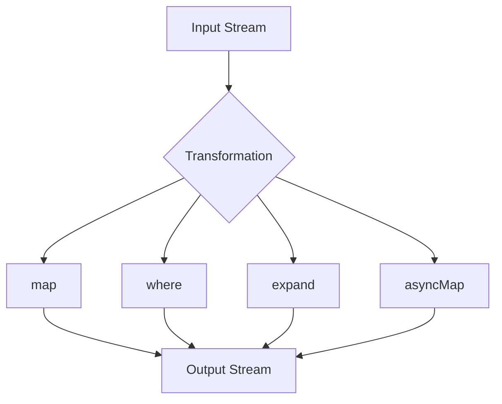

## 11.3 Transforming Streams

In the world of reactive programming, streams are a fundamental concept that allows us to work with asynchronous data sequences. Dart, with its robust support for streams, provides a powerful set of tools for transforming these streams to suit our application's needs. In this section, we will delve into the various techniques for transforming streams using operators like `map`, `where`, `expand`, and `asyncMap`. We will also explore how to combine multiple streams, filter data, and implement debouncing and throttling to control data flow. By the end of this section, you'll have a comprehensive understanding of how to apply these transformations in real-world scenarios, such as handling search inputs and managing event streams in Flutter applications.

### Understanding Stream Transformers

Stream transformers in Dart allow us to modify the data emitted by a stream before it reaches its listeners. This is achieved through a variety of operators that can be chained together to create complex data processing pipelines. Let's explore some of the most commonly used stream transformation operators.

#### The `map` Operator

The `map` operator is used to transform each element of a stream by applying a function to it. This is similar to the `map` function in collections, where each item is transformed individually.

```dart
Stream<int> numbers = Stream.fromIterable([1, 2, 3, 4, 5]);
Stream<int> squaredNumbers = numbers.map((number) => number * number);

squaredNumbers.listen((number) {
  print(number); // Output: 1, 4, 9, 16, 25
});
```

In this example, we create a stream of numbers and use the `map` operator to square each number before printing it.

#### The `where` Operator

The `where` operator filters the elements of a stream based on a predicate function. Only elements that satisfy the predicate are emitted to the listeners.

```dart
Stream<int> numbers = Stream.fromIterable([1, 2, 3, 4, 5]);
Stream<int> evenNumbers = numbers.where((number) => number.isEven);

evenNumbers.listen((number) {
  print(number); // Output: 2, 4
});
```

Here, we filter the stream to only include even numbers using the `where` operator.

#### The `expand` Operator

The `expand` operator allows us to transform each element of a stream into a sequence of elements. This is useful when you want to flatten a stream of collections into a single stream of elements.

```dart
Stream<List<int>> numberLists = Stream.fromIterable([
  [1, 2],
  [3, 4],
  [5]
]);
Stream<int> numbers = numberLists.expand((list) => list);

numbers.listen((number) {
  print(number); // Output: 1, 2, 3, 4, 5
});
```

In this example, we have a stream of lists, and we use `expand` to flatten it into a stream of individual numbers.

#### The `asyncMap` Operator

The `asyncMap` operator is similar to `map`, but it allows for asynchronous transformations. This is particularly useful when the transformation involves asynchronous operations, such as network requests or database queries.

```dart
Stream<int> numbers = Stream.fromIterable([1, 2, 3, 4, 5]);
Stream<String> numberDescriptions = numbers.asyncMap((number) async {
  await Future.delayed(Duration(seconds: 1));
  return 'Number $number';
});

numberDescriptions.listen((description) {
  print(description); // Output: Number 1, Number 2, ..., Number 5
});
```

In this example, we simulate an asynchronous operation by delaying each transformation by one second.

### Combining Streams

In many applications, you may need to work with multiple streams simultaneously. Dart provides several techniques for combining streams, such as `zip`, `merge`, and `combineLatest`.

#### The `zip` Operator

The `zip` operator combines multiple streams into a single stream by pairing elements from each stream. The resulting stream emits tuples containing one element from each input stream.

```dart
import 'package:rxdart/rxdart.dart';

Stream<int> stream1 = Stream.fromIterable([1, 2, 3]);
Stream<String> stream2 = Stream.fromIterable(['a', 'b', 'c']);
Stream<List<dynamic>> zippedStream = Rx.zip2(stream1, stream2, (a, b) => [a, b]);

zippedStream.listen((pair) {
  print(pair); // Output: [1, a], [2, b], [3, c]
});
```

Here, we use the `zip` operator from the `rxdart` package to combine two streams into a stream of pairs.

#### The `merge` Operator

The `merge` operator combines multiple streams into a single stream by interleaving their elements. The resulting stream emits elements from all input streams as they arrive.

```dart
import 'package:rxdart/rxdart.dart';

Stream<int> stream1 = Stream.fromIterable([1, 3, 5]);
Stream<int> stream2 = Stream.fromIterable([2, 4, 6]);
Stream<int> mergedStream = Rx.merge([stream1, stream2]);

mergedStream.listen((number) {
  print(number); // Output: 1, 2, 3, 4, 5, 6
});
```

In this example, we merge two streams of numbers into a single stream that emits numbers in the order they arrive.

#### The `combineLatest` Operator

The `combineLatest` operator combines multiple streams into a single stream by emitting the latest values from each stream whenever any of the input streams emit a new value.

```dart
import 'package:rxdart/rxdart.dart';

Stream<int> stream1 = Stream.periodic(Duration(seconds: 1), (count) => count);
Stream<String> stream2 = Stream.periodic(Duration(seconds: 2), (count) => 'Value $count');
Stream<String> combinedStream = Rx.combineLatest2(stream1, stream2, (a, b) => '$a - $b');

combinedStream.listen((value) {
  print(value); // Output: 0 - Value 0, 1 - Value 0, 2 - Value 1, ...
});
```

Here, we combine two periodic streams into a single stream that emits the latest values from both streams.

### Filtering and Debouncing Streams

Filtering and debouncing are essential techniques for controlling the flow of data in streams, especially in user interface applications where you want to limit the frequency of updates.

#### Filtering Streams

Filtering streams involves selectively emitting elements based on certain criteria. We've already seen the `where` operator for filtering, but there are other techniques as well.

#### Debouncing Streams

Debouncing is a technique used to limit the rate at which a stream emits values. This is particularly useful in scenarios like handling search inputs, where you want to wait for the user to stop typing before sending a request.

```dart
import 'package:rxdart/rxdart.dart';

Stream<String> searchInput = Stream.fromIterable(['f', 'fl', 'flu', 'flut', 'flutt', 'flutter']);
Stream<String> debouncedInput = searchInput.debounceTime(Duration(milliseconds: 300));

debouncedInput.listen((input) {
  print('Search for: $input'); // Output: Search for: flutter
});
```

In this example, we debounce a stream of search inputs to only emit the final input after the user has stopped typing for 300 milliseconds.

### Practical Examples of Stream Transformations

Let's explore some practical examples of how stream transformations can be applied in real-world scenarios.

#### Handling Search Inputs

In a search feature, you may want to transform user input into search queries and debounce the input to avoid sending too many requests.

```dart
import 'package:rxdart/rxdart.dart';

Stream<String> searchInput = Stream.fromIterable(['f', 'fl', 'flu', 'flut', 'flutt', 'flutter']);
Stream<String> debouncedInput = searchInput.debounceTime(Duration(milliseconds: 300));
Stream<String> searchQueries = debouncedInput.map((input) => 'Search query: $input');

searchQueries.listen((query) {
  print(query); // Output: Search query: flutter
});
```

Here, we transform the debounced input into search queries.

#### Event Handling in Flutter

In Flutter applications, you often need to handle events such as button clicks or form submissions. Stream transformations can help manage these events efficiently.

```dart
import 'package:flutter/material.dart';
import 'package:rxdart/rxdart.dart';

void main() {
  runApp(MyApp());
}

class MyApp extends StatelessWidget {
  @override
  Widget build(BuildContext context) {
    return MaterialApp(
      home: Scaffold(
        appBar: AppBar(title: Text('Stream Transformation')),
        body: StreamExample(),
      ),
    );
  }
}

class StreamExample extends StatefulWidget {
  @override
  _StreamExampleState createState() => _StreamExampleState();
}

class _StreamExampleState extends State<StreamExample> {
  final _controller = StreamController<String>();
  final _debouncedStream = BehaviorSubject<String>();

  @override
  void initState() {
    super.initState();
    _controller.stream.debounceTime(Duration(milliseconds: 300)).listen((event) {
      _debouncedStream.add(event);
    });
  }

  @override
  void dispose() {
    _controller.close();
    _debouncedStream.close();
    super.dispose();
  }

  @override
  Widget build(BuildContext context) {
    return Column(
      children: [
        TextField(
          onChanged: (value) => _controller.add(value),
          decoration: InputDecoration(labelText: 'Type something'),
        ),
        StreamBuilder<String>(
          stream: _debouncedStream,
          builder: (context, snapshot) {
            return Text(snapshot.hasData ? 'Debounced: ${snapshot.data}' : '');
          },
        ),
      ],
    );
  }
}
```

In this Flutter example, we use a `StreamController` to handle text input changes and debounce the input before displaying it.

### Visualizing Stream Transformations

To better understand how stream transformations work, let's visualize the process using a flowchart.



**Figure 1:** This flowchart illustrates how an input stream can be transformed using various operators like `map`, `where`, `expand`, and `asyncMap` to produce an output stream.

### Key Takeaways

- **Stream Transformers**: Use operators like `map`, `where`, `expand`, and `asyncMap` to modify stream data.
- **Combining Streams**: Techniques like `zip`, `merge`, and `combineLatest` allow you to work with multiple streams.
- **Filtering and Debouncing**: Implement filters and control data flow with debounce and throttle.
- **Practical Applications**: Apply transformations in real-world scenarios such as search inputs and event handling.

### Try It Yourself

Experiment with the code examples provided in this section. Try modifying the transformation functions, changing the debounce duration, or combining different streams to see how the output changes. This hands-on approach will deepen your understanding of stream transformations in Dart.

### References and Further Reading

- [Dart Streams](https://dart.dev/tutorials/language/streams)
- [ReactiveX - RxDart](https://pub.dev/packages/rxdart)
- [Flutter Streams and StreamBuilder](https://flutter.dev/docs/cookbook/networking/using-streams)

## Quiz Time!



### What does the `map` operator do in Dart streams?

- [x] Transforms each element of a stream by applying a function to it.
- [ ] Filters elements based on a predicate.
- [ ] Combines multiple streams into one.
- [ ] Limits the rate of emitted values.

> **Explanation:** The `map` operator is used to transform each element of a stream by applying a function to it.

### Which operator would you use to filter elements in a stream?

- [ ] map
- [x] where
- [ ] expand
- [ ] asyncMap

> **Explanation:** The `where` operator filters elements based on a predicate function.

### How does the `expand` operator work?

- [ ] It combines multiple streams into one.
- [ ] It transforms each element into a sequence of elements.
- [x] It flattens a stream of collections into a single stream of elements.
- [ ] It applies an asynchronous transformation.

> **Explanation:** The `expand` operator flattens a stream of collections into a single stream of elements.

### What is the purpose of the `asyncMap` operator?

- [ ] To filter elements based on a predicate.
- [ ] To combine multiple streams.
- [x] To apply an asynchronous transformation to each element.
- [ ] To limit the rate of emitted values.

> **Explanation:** The `asyncMap` operator allows for asynchronous transformations of each element in a stream.

### Which operator is used to combine streams by pairing elements from each stream?

- [ ] merge
- [x] zip
- [ ] combineLatest
- [ ] map

> **Explanation:** The `zip` operator combines streams by pairing elements from each stream.

### What does the `debounceTime` operator do?

- [ ] Filters elements based on a predicate.
- [ ] Combines multiple streams.
- [ ] Applies an asynchronous transformation.
- [x] Limits the rate of emitted values by waiting for a specified duration.

> **Explanation:** The `debounceTime` operator limits the rate of emitted values by waiting for a specified duration.

### How does the `merge` operator work?

- [x] It combines multiple streams by interleaving their elements.
- [ ] It pairs elements from each stream.
- [ ] It emits the latest values from each stream.
- [ ] It applies a transformation to each element.

> **Explanation:** The `merge` operator combines multiple streams by interleaving their elements.

### What is the result of using the `combineLatest` operator?

- [ ] A stream of paired elements.
- [ ] A stream of interleaved elements.
- [x] A stream emitting the latest values from each input stream.
- [ ] A stream of transformed elements.

> **Explanation:** The `combineLatest` operator emits the latest values from each input stream whenever any of them emit a new value.

### In which scenario is debouncing particularly useful?

- [ ] When filtering elements.
- [ ] When combining streams.
- [x] When handling search inputs to avoid sending too many requests.
- [ ] When applying asynchronous transformations.

> **Explanation:** Debouncing is useful in scenarios like handling search inputs to avoid sending too many requests.

### True or False: The `asyncMap` operator can be used for synchronous transformations.

- [ ] True
- [x] False

> **Explanation:** The `asyncMap` operator is specifically designed for asynchronous transformations.



Remember, mastering stream transformations in Dart is a journey. As you continue to explore and experiment with these concepts, you'll become more adept at building efficient and responsive applications. Keep experimenting, stay curious, and enjoy the journey!
