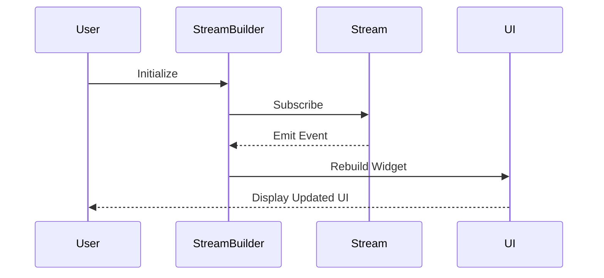

## 11.4 Stream Builders and Reactive Widgets

In the world of modern application development, creating dynamic and responsive user interfaces is crucial. Flutter, with its reactive programming capabilities, provides powerful tools to achieve this. One such tool is the `StreamBuilder` widget, which allows developers to build widgets that automatically react to stream events. In this section, we will delve deep into the concept of Stream Builders and Reactive Widgets, exploring how they can be used to create efficient, real-time applications.

### Understanding Streams in Dart

Before we dive into Stream Builders, it's essential to understand what streams are in Dart. Streams are a sequence of asynchronous events. They are similar to futures, but instead of handling a single asynchronous result, streams can deliver multiple results over time. This makes them perfect for handling real-time data, such as user inputs, network responses, or any other asynchronous data source.

#### Key Characteristics of Streams

- **Asynchronous**: Streams handle asynchronous data, allowing your application to remain responsive while waiting for data.
- **Multiple Events**: Unlike futures, streams can emit multiple events over time.
- **Broadcasting**: Streams can be single-subscription or broadcast. Single-subscription streams allow only one listener, while broadcast streams can have multiple listeners.

### The Role of StreamBuilder in Flutter

The `StreamBuilder` widget in Flutter is a powerful tool that listens to a stream and rebuilds its child widget whenever a new event is emitted. This makes it ideal for creating dynamic UIs that need to update in real-time based on data changes.

#### Anatomy of a StreamBuilder

The `StreamBuilder` widget takes several key parameters:

- **stream**: The stream that the builder will listen to.
- **builder**: A function that builds the widget tree based on the current snapshot of the stream.
- **initialData**: Optional initial data to be used before the first event is emitted.

Here's a basic example of a `StreamBuilder` in action:

```dart
StreamBuilder<int>(
  stream: myNumberStream,
  initialData: 0,
  builder: (BuildContext context, AsyncSnapshot<int> snapshot) {
    if (snapshot.connectionState == ConnectionState.waiting) {
      return CircularProgressIndicator();
    } else if (snapshot.hasError) {
      return Text('Error: ${snapshot.error}');
    } else {
      return Text('Current number: ${snapshot.data}');
    }
  },
)
```

In this example, the `StreamBuilder` listens to `myNumberStream` and updates the UI with the current number whenever a new event is emitted.

### Efficient Usage of StreamBuilder

To make the most out of `StreamBuilder`, it's important to use it efficiently. Here are some best practices:

#### Avoiding Unnecessary Rebuilds

- **Minimize Widget Tree**: Keep the widget tree inside the `builder` function as small as possible. Only include widgets that need to be rebuilt when the stream emits a new event.
- **Use Keys**: Use keys to preserve the state of widgets that don't need to be rebuilt.

#### Optimizing Performance

- **Debounce Streams**: If your stream emits events too frequently, consider debouncing it to reduce the number of rebuilds.
- **Use Initial Data**: Provide initial data to avoid unnecessary loading indicators when the stream is first subscribed to.

### Creating Dynamic UIs with StreamBuilder

StreamBuilder is particularly useful for creating dynamic UIs that need to update in real-time. Here are some common use cases:

#### Real-Time Data Displays

StreamBuilder can be used to display real-time data, such as chat messages or live updates. Here's an example of a chat application using `StreamBuilder`:

```dart
StreamBuilder<List<Message>>(
  stream: chatMessageStream,
  builder: (BuildContext context, AsyncSnapshot<List<Message>> snapshot) {
    if (snapshot.connectionState == ConnectionState.waiting) {
      return CircularProgressIndicator();
    } else if (snapshot.hasError) {
      return Text('Error: ${snapshot.error}');
    } else {
      return ListView.builder(
        itemCount: snapshot.data.length,
        itemBuilder: (context, index) {
          final message = snapshot.data[index];
          return ListTile(
            title: Text(message.sender),
            subtitle: Text(message.content),
          );
        },
      );
    }
  },
)
```

In this example, the `StreamBuilder` listens to a stream of chat messages and updates the UI whenever a new message is received.

#### Live Updates

StreamBuilder can also be used for live updates, such as stock prices or weather data. By listening to a stream of data updates, you can create a UI that reflects the latest information in real-time.

### Use Cases for StreamBuilder

StreamBuilder is versatile and can be used in various scenarios:

- **Chat Applications**: Displaying real-time chat messages.
- **Live Scores**: Updating sports scores in real-time.
- **Stock Market Apps**: Showing live stock prices.
- **Weather Apps**: Displaying current weather conditions.

### Design Considerations for StreamBuilder

When using `StreamBuilder`, consider the following design aspects:

- **Error Handling**: Always handle errors in the stream to prevent your application from crashing.
- **Connection State**: Use the `connectionState` property of the snapshot to determine the current state of the stream (e.g., waiting, active, done).
- **Resource Management**: Ensure that streams are properly closed or canceled when no longer needed to avoid memory leaks.

### Differences and Similarities with Other Patterns

StreamBuilder is often compared to other reactive patterns, such as `FutureBuilder` and `ChangeNotifier`. Here's how they differ:

- **StreamBuilder vs. FutureBuilder**: `StreamBuilder` is used for multiple asynchronous events, while `FutureBuilder` is for a single asynchronous result.
- **StreamBuilder vs. ChangeNotifier**: `ChangeNotifier` is used for state management, while `StreamBuilder` is for handling streams of data.

### Visualizing StreamBuilder Workflow

To better understand how `StreamBuilder` works, let's visualize its workflow using a sequence diagram:



This diagram illustrates the flow of data from the stream to the `StreamBuilder` and finally to the UI, resulting in a dynamic and responsive application.

### Try It Yourself

To get hands-on experience with `StreamBuilder`, try modifying the code examples provided. Experiment with different types of streams, such as `Stream<int>`, `Stream<String>`, or even custom data types. Observe how the UI updates in response to different events.

### Knowledge Check

- What is the primary purpose of `StreamBuilder` in Flutter?
- How does `StreamBuilder` differ from `FutureBuilder`?
- What are some common use cases for `StreamBuilder`?
- How can you optimize the performance of a `StreamBuilder`?

### Embrace the Journey

Remember, mastering `StreamBuilder` and reactive widgets is just the beginning of creating dynamic and responsive applications in Flutter. As you continue to explore these concepts, you'll unlock new possibilities for building real-time, data-driven UIs. Keep experimenting, stay curious, and enjoy the journey!

## Quiz Time!



### What is the primary role of a `StreamBuilder` in Flutter?

- [x] To build widgets that react to stream events.
- [ ] To manage application state.
- [ ] To handle HTTP requests.
- [ ] To manage database connections.

> **Explanation:** The `StreamBuilder` widget is used to build widgets that automatically react to stream events, updating the UI in response to data changes.

### How does `StreamBuilder` differ from `FutureBuilder`?

- [x] `StreamBuilder` handles multiple events, while `FutureBuilder` handles a single result.
- [ ] `StreamBuilder` is used for HTTP requests, while `FutureBuilder` is for database queries.
- [ ] `StreamBuilder` is for synchronous data, while `FutureBuilder` is for asynchronous data.
- [ ] `StreamBuilder` is for managing state, while `FutureBuilder` is for building widgets.

> **Explanation:** `StreamBuilder` is designed to handle multiple asynchronous events over time, whereas `FutureBuilder` is used for a single asynchronous result.

### Which of the following is a common use case for `StreamBuilder`?

- [x] Real-time chat applications.
- [ ] Static image galleries.
- [ ] Offline data storage.
- [ ] File system operations.

> **Explanation:** `StreamBuilder` is ideal for real-time applications like chat apps, where the UI needs to update dynamically based on incoming data.

### What should you consider when using `StreamBuilder`?

- [x] Error handling and connection state.
- [ ] Database schema design.
- [ ] Network latency.
- [ ] File system permissions.

> **Explanation:** When using `StreamBuilder`, it's important to handle errors and manage the connection state to ensure a smooth user experience.

### What is the benefit of using initial data in `StreamBuilder`?

- [x] It avoids unnecessary loading indicators.
- [ ] It increases network speed.
- [ ] It reduces memory usage.
- [ ] It simplifies database queries.

> **Explanation:** Providing initial data to `StreamBuilder` can prevent the display of loading indicators when the stream is first subscribed to, improving the user experience.

### How can you optimize the performance of a `StreamBuilder`?

- [x] Minimize the widget tree inside the builder function.
- [ ] Use synchronous streams.
- [ ] Increase the stream's buffer size.
- [ ] Disable error handling.

> **Explanation:** Keeping the widget tree inside the builder function minimal helps reduce unnecessary rebuilds, optimizing performance.

### What is the purpose of debouncing a stream?

- [x] To reduce the frequency of events and rebuilds.
- [ ] To increase the speed of data processing.
- [ ] To handle errors more effectively.
- [ ] To simplify the widget tree.

> **Explanation:** Debouncing a stream helps reduce the number of events and rebuilds, which can improve performance in scenarios where events are emitted frequently.

### What is a broadcast stream?

- [x] A stream that allows multiple listeners.
- [ ] A stream that emits a single event.
- [ ] A stream that handles synchronous data.
- [ ] A stream that requires authentication.

> **Explanation:** A broadcast stream is a type of stream that can have multiple listeners, allowing multiple parts of an application to react to the same events.

### What is the connection state of a stream?

- [x] The current status of the stream's connection.
- [ ] The speed at which data is transmitted.
- [ ] The size of the data buffer.
- [ ] The type of data being transmitted.

> **Explanation:** The connection state of a stream indicates the current status of the stream's connection, such as waiting, active, or done.

### True or False: `StreamBuilder` can be used to manage application state.

- [ ] True
- [x] False

> **Explanation:** `StreamBuilder` is not used for managing application state; it is used for building widgets that react to stream events.


