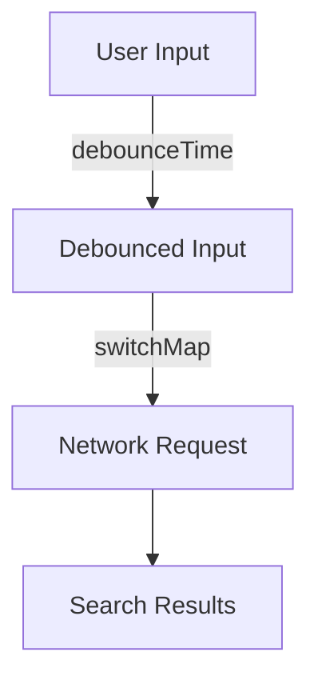

## 11.5 Reactive Extensions (RxDart)

Reactive programming is a powerful paradigm that allows developers to build responsive and resilient applications. In the Dart ecosystem, RxDart extends the capabilities of Dart's native streams, providing a rich set of tools for managing asynchronous data flows. This section will guide you through the essentials of RxDart, from understanding its core components to applying advanced operators for effective state and event management in your Flutter applications.

### Introduction to RxDart

RxDart is a reactive programming library that builds upon Dart's native stream API, adding a plethora of operators and utilities that make it easier to work with asynchronous data streams. By leveraging RxDart, developers can create more maintainable and scalable applications, particularly when dealing with complex data flows and state management.

#### Why Use RxDart?

- **Enhanced Stream Capabilities**: RxDart provides additional operators that are not available in Dart's standard library, such as `flatMap`, `debounceTime`, and `combineLatest`.
- **Declarative Data Flow**: With RxDart, you can describe how data flows through your application in a clear and concise manner, making it easier to reason about and debug.
- **Efficient State Management**: RxDart is well-suited for managing application state, especially in Flutter, where UI components need to react to changes in data.

### Observables and Subjects

At the heart of RxDart are Observables and Subjects, which are key components for implementing reactive programming patterns.

#### Observables

An Observable is a data source that emits a sequence of values over time. Observables are the primary building blocks in RxDart, allowing you to create, transform, and combine data streams.

```dart
import 'package:rxdart/rxdart.dart';

void main() {
  // Create an Observable from a list
  final observable = Observable.fromIterable([1, 2, 3, 4, 5]);

  // Subscribe to the Observable
  observable.listen((value) {
    print('Received: $value');
  });
}
```

In this example, we create an Observable from a list of integers and subscribe to it, printing each value as it is emitted.

#### Subjects

Subjects are a special type of Observable that can act as both an Observable and an Observer. This means they can emit new values to their subscribers and also listen to other Observables.

```dart
import 'package:rxdart/rxdart.dart';

void main() {
  // Create a Subject
  final subject = BehaviorSubject<int>();

  // Subscribe to the Subject
  subject.listen((value) {
    print('Subject received: $value');
  });

  // Add values to the Subject
  subject.add(1);
  subject.add(2);
  subject.add(3);
}
```

In this example, a `BehaviorSubject` is used, which emits the most recent item to new subscribers. Subjects are particularly useful for managing state in Flutter applications, as they can be used to broadcast changes to multiple listeners.

### Advanced Operators

RxDart provides a wide range of operators that allow you to manipulate and transform data streams. Here, we will explore some of the most commonly used operators.

#### `flatMap`

The `flatMap` operator is used to transform each item emitted by an Observable into a new Observable, and then flatten the emissions from those into a single Observable.

```dart
import 'package:rxdart/rxdart.dart';

void main() {
  final observable = Observable.fromIterable([1, 2, 3]);

  observable.flatMap((value) {
    return Observable.fromIterable([value * 10, value * 20]);
  }).listen((value) {
    print('FlatMap emitted: $value');
  });
}
```

In this example, `flatMap` is used to transform each integer into two new integers, effectively flattening the resulting Observables into a single stream.

#### `switchMap`

The `switchMap` operator is similar to `flatMap`, but it cancels the previous Observable when a new one is emitted. This is useful for scenarios where you only care about the latest data, such as search queries.

```dart
import 'package:rxdart/rxdart.dart';

void main() {
  final observable = Observable.fromIterable([1, 2, 3]);

  observable.switchMap((value) {
    return Observable.fromIterable([value * 10, value * 20]);
  }).listen((value) {
    print('SwitchMap emitted: $value');
  });
}
```

#### `debounceTime`

The `debounceTime` operator is used to emit items from an Observable only after a specified time has passed without another emission. This is particularly useful for handling rapid events, such as user input.

```dart
import 'package:rxdart/rxdart.dart';

void main() {
  final observable = Observable.fromIterable([1, 2, 3]);

  observable.debounceTime(Duration(seconds: 1)).listen((value) {
    print('DebounceTime emitted: $value');
  });
}
```

### Patterns and Practices

RxDart is a powerful tool for managing complex state and event flows in Flutter applications. Here are some patterns and best practices to consider when using RxDart.

#### State Management with RxDart

RxDart can be used to implement various state management patterns, such as BLoC (Business Logic Component) and Redux. By using Subjects, you can create reactive data sources that your UI components can subscribe to.

```dart
import 'package:rxdart/rxdart.dart';

class CounterBloc {
  final _counterSubject = BehaviorSubject<int>.seeded(0);

  Stream<int> get counterStream => _counterSubject.stream;

  void increment() {
    _counterSubject.add(_counterSubject.value + 1);
  }

  void dispose() {
    _counterSubject.close();
  }
}

void main() {
  final bloc = CounterBloc();

  bloc.counterStream.listen((value) {
    print('Counter value: $value');
  });

  bloc.increment();
  bloc.increment();
}
```

In this example, a simple BLoC is implemented using a `BehaviorSubject` to manage a counter's state. The UI can subscribe to the `counterStream` to react to changes in the counter's value.

#### Handling Events with RxDart

RxDart is also well-suited for handling events, such as user interactions or network responses. By using operators like `debounceTime` and `switchMap`, you can efficiently manage event streams.

```dart
import 'package:rxdart/rxdart.dart';

void main() {
  final searchSubject = PublishSubject<String>();

  searchSubject
      .debounceTime(Duration(milliseconds: 300))
      .switchMap((query) => performSearch(query))
      .listen((results) {
    print('Search results: $results');
  });

  searchSubject.add('flutter');
  searchSubject.add('flutter reactive programming');
}

Stream<List<String>> performSearch(String query) async* {
  // Simulate a network request
  await Future.delayed(Duration(seconds: 1));
  yield ['Result 1 for $query', 'Result 2 for $query'];
}
```

In this example, a search feature is implemented using RxDart. The `debounceTime` operator is used to prevent unnecessary network requests, and `switchMap` ensures that only the latest search results are processed.

### Visualizing RxDart Streams

To better understand how data flows through RxDart streams, let's visualize a simple data flow using a Mermaid.js diagram.



This diagram illustrates a common pattern in RxDart, where user input is debounced to prevent rapid emissions, and a network request is made for the latest input using `switchMap`.

### Try It Yourself

To get hands-on experience with RxDart, try modifying the code examples provided in this section. Experiment with different operators and see how they affect the data flow. For instance, try replacing `switchMap` with `flatMap` in the search example and observe the differences in behavior.

### Knowledge Check

Before moving on, let's summarize the key takeaways from this section:

- RxDart extends Dart's native streams with additional capabilities, making it easier to manage asynchronous data flows.
- Observables and Subjects are core components of RxDart, providing powerful tools for creating and managing data streams.
- Advanced operators like `flatMap`, `switchMap`, and `debounceTime` allow for complex data transformations and event handling.
- RxDart is well-suited for state management and event handling in Flutter applications, enabling more responsive and maintainable code.

### Embrace the Journey

Remember, mastering RxDart is a journey. As you continue to explore and experiment with reactive programming patterns, you'll discover new ways to enhance your applications. Stay curious, keep experimenting, and enjoy the process of building more responsive and resilient applications with RxDart.

## Quiz Time!



### What is the primary purpose of RxDart?

- [x] To extend Dart's native streams with additional capabilities
- [ ] To replace Dart's native streams entirely
- [ ] To provide a UI framework for Flutter
- [ ] To manage database connections

> **Explanation:** RxDart extends Dart's native streams by adding additional operators and utilities, enhancing their capabilities for reactive programming.

### Which RxDart component can act as both an Observable and an Observer?

- [x] Subject
- [ ] Stream
- [ ] Future
- [ ] Operator

> **Explanation:** Subjects in RxDart can act as both an Observable and an Observer, allowing them to emit new values and listen to other Observables.

### What operator would you use to transform each item emitted by an Observable into a new Observable?

- [x] flatMap
- [ ] map
- [ ] filter
- [ ] reduce

> **Explanation:** The `flatMap` operator is used to transform each item emitted by an Observable into a new Observable and flatten the emissions into a single Observable.

### Which operator would you use to emit items from an Observable only after a specified time has passed without another emission?

- [x] debounceTime
- [ ] throttleTime
- [ ] delay
- [ ] bufferTime

> **Explanation:** The `debounceTime` operator emits items from an Observable only after a specified time has passed without another emission, useful for handling rapid events.

### What is the main advantage of using `switchMap` over `flatMap`?

- [x] It cancels the previous Observable when a new one is emitted
- [ ] It combines multiple Observables into one
- [ ] It delays the emissions of an Observable
- [ ] It filters items based on a condition

> **Explanation:** The `switchMap` operator cancels the previous Observable when a new one is emitted, ensuring that only the latest data is processed.

### In the context of RxDart, what is a common use case for the `debounceTime` operator?

- [x] To prevent unnecessary network requests during rapid user input
- [ ] To delay the start of an Observable
- [ ] To combine multiple streams into one
- [ ] To filter out duplicate values

> **Explanation:** The `debounceTime` operator is commonly used to prevent unnecessary network requests during rapid user input by emitting items only after a specified time has passed without another emission.

### How does a `BehaviorSubject` differ from a regular `Subject`?

- [x] It emits the most recent item to new subscribers
- [ ] It can only emit a single value
- [ ] It does not allow new subscribers
- [ ] It automatically completes after emitting a value

> **Explanation:** A `BehaviorSubject` emits the most recent item to new subscribers, making it useful for state management where the latest state needs to be available to new listeners.

### What is the role of the `performSearch` function in the RxDart search example?

- [x] To simulate a network request and return search results
- [ ] To debounce user input
- [ ] To combine search queries
- [ ] To filter search results

> **Explanation:** The `performSearch` function simulates a network request and returns search results, demonstrating how to handle asynchronous operations with RxDart.

### Which operator would you use to ensure that only the latest search results are processed in a search feature?

- [x] switchMap
- [ ] flatMap
- [ ] map
- [ ] filter

> **Explanation:** The `switchMap` operator ensures that only the latest search results are processed by canceling previous Observables when a new one is emitted.

### True or False: RxDart is only useful for managing state in Flutter applications.

- [ ] True
- [x] False

> **Explanation:** False. While RxDart is particularly useful for managing state in Flutter applications, it is also valuable for handling complex data flows and event management in any Dart application.




