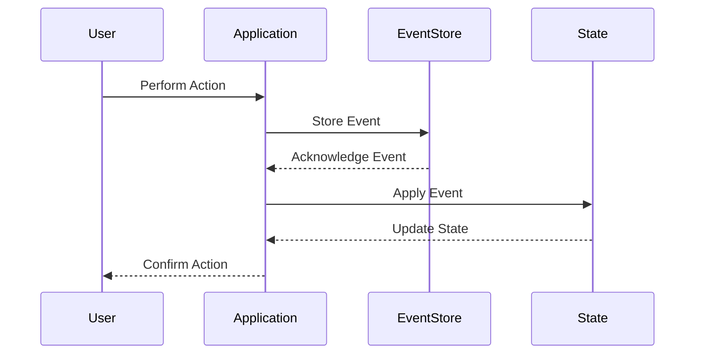

## 11.6 Event Sourcing Pattern

In the world of software development, capturing and managing state changes efficiently is crucial for building robust applications. The Event Sourcing Pattern is a powerful design pattern that allows developers to capture state changes as events, offering a reliable way to reconstruct application state. This pattern is particularly useful in scenarios where audit logs, undo functionality, and debugging are essential. In this section, we will delve into the intricacies of the Event Sourcing Pattern, explore its implementation in Dart, and understand its applicability in Flutter development.

### Understanding Event Sourcing

**Event Sourcing** is a design pattern that involves capturing all changes to an application's state as a sequence of events. Instead of storing the current state directly, the application records each state change as an event. These events are then stored in an event store, allowing the application to reconstruct the current state by replaying the events from the beginning.

#### Key Concepts

1. **Event**: A record of a change in state. Each event represents a specific change, such as a user action or a system update.

2. **Event Store**: A database or storage system that holds all the events. It acts as the source of truth for the application's state.

3. **State Reconstruction**: The process of rebuilding the current state by replaying the events from the event store.

4. **Event Handler**: A component that processes events and updates the application state accordingly.

5. **Command**: An instruction to perform an action that results in one or more events.

### Benefits of Event Sourcing

- **Auditability**: Every change is recorded as an event, providing a complete audit trail of all state changes.

- **Undo Functionality**: By replaying events, the application can easily revert to a previous state.

- **Debugging**: Developers can replay events to understand how a particular state was reached, aiding in debugging.

- **Scalability**: Event sourcing can be scaled horizontally by distributing events across multiple nodes.

### Implementing Event Sourcing in Dart

Let's explore how to implement the Event Sourcing Pattern in Dart, focusing on key components such as event stores and state reconstruction.

#### Event Stores

An event store is a critical component of event sourcing. It is responsible for storing events in a durable and reliable manner. In Dart, we can implement an event store using various storage solutions, such as databases or file systems.

```dart
// Define an Event class to represent state changes
class Event {
  final String type;
  final DateTime timestamp;
  final Map<String, dynamic> data;

  Event(this.type, this.timestamp, this.data);
}

// Implement an EventStore class to manage events
class EventStore {
  final List<Event> _events = [];

  // Add an event to the store
  void addEvent(Event event) {
    _events.add(event);
  }

  // Retrieve all events
  List<Event> getEvents() {
    return _events;
  }
}
```

In this example, we define an `Event` class to represent state changes and an `EventStore` class to manage events. The `EventStore` class provides methods to add and retrieve events.

#### State Reconstruction

State reconstruction involves replaying events from the event store to build the current state. This process is crucial for applications that rely on event sourcing.

```dart
// Define a State class to represent the application state
class State {
  int counter = 0;

  // Apply an event to update the state
  void apply(Event event) {
    if (event.type == 'increment') {
      counter += event.data['value'];
    } else if (event.type == 'decrement') {
      counter -= event.data['value'];
    }
  }
}

// Reconstruct the state by replaying events
State reconstructState(EventStore eventStore) {
  final state = State();
  for (var event in eventStore.getEvents()) {
    state.apply(event);
  }
  return state;
}
```

In this example, we define a `State` class to represent the application state and a `reconstructState` function to rebuild the state by replaying events from the event store.

### Use Cases of Event Sourcing

Event sourcing is particularly useful in scenarios where audit logs, undo functionality, and debugging are essential. Let's explore some common use cases:

#### Audit Logs

Event sourcing provides a complete audit trail of all state changes, making it ideal for applications that require detailed logging and auditing. By storing events, developers can track every change and understand the sequence of actions that led to a particular state.

#### Undo Functionality

With event sourcing, implementing undo functionality becomes straightforward. By replaying events, the application can revert to a previous state, allowing users to undo actions seamlessly.

#### Debugging

Event sourcing aids in debugging by providing a clear history of state changes. Developers can replay events to understand how a particular state was reached, making it easier to identify and fix issues.

### Visualizing Event Sourcing

To better understand the flow of event sourcing, let's visualize the process using a sequence diagram.



In this diagram, we see the interaction between the user, application, event store, and state. The user performs an action, which the application records as an event in the event store. The application then applies the event to update the state and confirms the action to the user.

### Design Considerations

When implementing event sourcing, consider the following design considerations:

- **Event Granularity**: Determine the level of detail for events. Fine-grained events provide more information but may increase storage requirements.

- **Event Versioning**: Plan for changes in event structure over time. Implement versioning to handle backward compatibility.

- **Performance**: Consider the performance implications of replaying events. Optimize the event store and state reconstruction process for efficiency.

- **Consistency**: Ensure consistency between the event store and the application state. Implement mechanisms to handle potential inconsistencies.

### Differences and Similarities with Other Patterns

Event sourcing is often compared to other patterns, such as Command Query Responsibility Segregation (CQRS) and Change Data Capture (CDC). While these patterns share similarities, they have distinct differences:

- **CQRS**: Separates read and write operations, often used in conjunction with event sourcing to optimize performance.

- **CDC**: Captures changes in data, similar to event sourcing, but focuses on database-level changes rather than application-level events.

### Try It Yourself

To gain hands-on experience with event sourcing, try modifying the code examples provided. Experiment with different event types, implement additional state changes, and explore the impact on state reconstruction. Consider integrating event sourcing into a Flutter application to see how it enhances state management and debugging capabilities.

### References and Further Reading

For more information on event sourcing and related patterns, consider exploring the following resources:

- [Martin Fowler's Event Sourcing](https://martinfowler.com/eaaDev/EventSourcing.html)
- [Event Sourcing in Microservices](https://microservices.io/patterns/data/event-sourcing.html)
- [CQRS and Event Sourcing](https://docs.microsoft.com/en-us/azure/architecture/patterns/cqrs)

### Knowledge Check

To reinforce your understanding of event sourcing, consider the following questions:

1. What is the primary purpose of event sourcing?
2. How does an event store differ from a traditional database?
3. What are some common use cases for event sourcing?
4. How can event sourcing aid in debugging applications?
5. What are the key design considerations when implementing event sourcing?

### Embrace the Journey

Remember, mastering the Event Sourcing Pattern is just one step in your journey to becoming a proficient Dart and Flutter developer. As you continue to explore design patterns and best practices, you'll gain the skills needed to build high-performance, scalable applications. Keep experimenting, stay curious, and enjoy the journey!

## Quiz Time!



### What is the primary purpose of event sourcing?

- [x] To capture all changes to an application's state as a sequence of events
- [ ] To store the current state directly
- [ ] To optimize database queries
- [ ] To separate read and write operations

> **Explanation:** Event sourcing captures all changes to an application's state as a sequence of events, allowing for state reconstruction and auditability.

### How does an event store differ from a traditional database?

- [x] It stores events rather than the current state
- [ ] It uses a different query language
- [ ] It requires more storage space
- [ ] It is faster than a traditional database

> **Explanation:** An event store records events that represent state changes, unlike a traditional database that stores the current state.

### What are some common use cases for event sourcing?

- [x] Audit logs, undo functionality, and debugging
- [ ] Real-time data processing
- [ ] Machine learning model training
- [ ] Image processing

> **Explanation:** Event sourcing is commonly used for audit logs, undo functionality, and debugging due to its ability to track state changes.

### How can event sourcing aid in debugging applications?

- [x] By providing a clear history of state changes
- [ ] By optimizing code execution
- [ ] By reducing memory usage
- [ ] By improving user interface design

> **Explanation:** Event sourcing aids in debugging by providing a clear history of state changes, allowing developers to understand how a particular state was reached.

### What are the key design considerations when implementing event sourcing?

- [x] Event granularity, event versioning, performance, and consistency
- [ ] User interface design, color schemes, and animations
- [ ] Network protocols, encryption, and authentication
- [ ] File formats, compression, and storage media

> **Explanation:** Key design considerations for event sourcing include event granularity, event versioning, performance, and consistency.

### What is the role of an event handler in event sourcing?

- [x] To process events and update the application state
- [ ] To store events in the event store
- [ ] To generate events from user actions
- [ ] To optimize database queries

> **Explanation:** An event handler processes events and updates the application state accordingly.

### How does state reconstruction work in event sourcing?

- [x] By replaying events from the event store
- [ ] By querying the current state from a database
- [ ] By generating new events based on user actions
- [ ] By optimizing code execution

> **Explanation:** State reconstruction involves replaying events from the event store to build the current state.

### What is the difference between event sourcing and CQRS?

- [x] Event sourcing captures state changes as events, while CQRS separates read and write operations
- [ ] Event sourcing optimizes database queries, while CQRS captures state changes
- [ ] Event sourcing is faster than CQRS
- [ ] Event sourcing requires more storage space than CQRS

> **Explanation:** Event sourcing captures state changes as events, while CQRS separates read and write operations to optimize performance.

### How can event sourcing enhance undo functionality?

- [x] By replaying events to revert to a previous state
- [ ] By storing the current state directly
- [ ] By optimizing code execution
- [ ] By improving user interface design

> **Explanation:** Event sourcing enhances undo functionality by replaying events to revert to a previous state.

### True or False: Event sourcing can be scaled horizontally by distributing events across multiple nodes.

- [x] True
- [ ] False

> **Explanation:** Event sourcing can be scaled horizontally by distributing events across multiple nodes, improving scalability.


