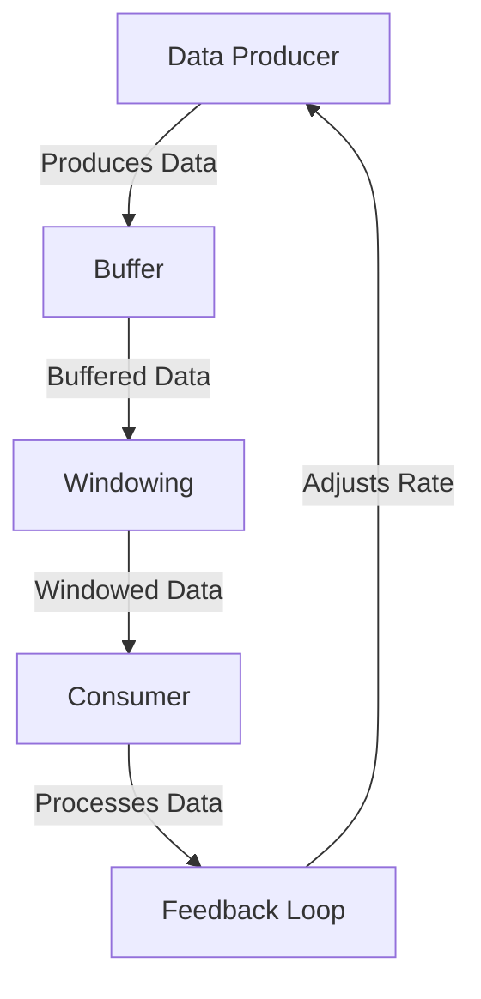

## 11.7 Backpressure Handling

In the realm of reactive programming, managing data flow efficiently is crucial to ensure that consumers are not overwhelmed by the volume of data being produced. This is where backpressure handling comes into play. In this section, we will delve into the concept of backpressure, explore various techniques to manage it, and provide practical examples to illustrate these concepts in Dart and Flutter development.

### Understanding Backpressure

Backpressure refers to the mechanism of controlling the flow of data between producers and consumers to prevent the latter from being overwhelmed. In reactive systems, data is often produced at a rate that exceeds the consumer's ability to process it, leading to potential bottlenecks, memory issues, or even application crashes. Effective backpressure handling ensures that data flows smoothly and efficiently, maintaining system stability and performance.

#### Key Concepts

- **Producer**: The source of data, which can be anything from a sensor emitting data to a server sending updates.
- **Consumer**: The entity that processes or uses the data produced.
- **Flow Control**: Techniques used to manage the rate of data production and consumption.

### Techniques for Handling Backpressure

There are several techniques to handle backpressure effectively in Dart, each with its own use cases and benefits. Let's explore these techniques in detail.

#### Buffering

Buffering involves temporarily storing excess data in a buffer until the consumer is ready to process it. This technique is useful when there is a temporary mismatch between the production and consumption rates.

**Example:**

```dart
import 'dart:async';

void main() {
  final controller = StreamController<int>();
  final bufferedStream = controller.stream.asBroadcastStream();

  bufferedStream.listen((data) {
    print('Consumer 1 received: $data');
  });

  bufferedStream.listen((data) {
    print('Consumer 2 received: $data');
  });

  for (int i = 0; i < 5; i++) {
    controller.add(i);
  }

  controller.close();
}
```

In this example, the `StreamController` acts as a buffer, allowing multiple consumers to receive the data at their own pace.

#### Windowing

Windowing involves dividing the data stream into manageable chunks or "windows" for processing. This technique is particularly useful when dealing with continuous data streams, such as sensor data or user input events.

**Example:**

```dart
import 'dart:async';

void main() {
  final controller = StreamController<int>();
  final windowedStream = controller.stream.transform(window(2));

  windowedStream.listen((window) {
    print('Window received: $window');
  });

  for (int i = 0; i < 5; i++) {
    controller.add(i);
  }

  controller.close();
}

StreamTransformer<int, List<int>> window(int size) {
  List<int> buffer = [];
  return StreamTransformer.fromHandlers(
    handleData: (data, sink) {
      buffer.add(data);
      if (buffer.length == size) {
        sink.add(List.from(buffer));
        buffer.clear();
      }
    },
    handleDone: (sink) {
      if (buffer.isNotEmpty) {
        sink.add(List.from(buffer));
      }
      sink.close();
    },
  );
}
```

In this example, the `window` transformer collects data into lists of a specified size before passing them to the consumer.

#### Pausing Streams

Pausing streams allows you to temporarily halt data production, giving the consumer time to catch up. This technique is useful when the consumer needs to perform time-consuming operations on the data.

**Example:**

```dart
import 'dart:async';

void main() {
  final controller = StreamController<int>();
  final stream = controller.stream;

  final subscription = stream.listen((data) {
    print('Received: $data');
  });

  for (int i = 0; i < 5; i++) {
    controller.add(i);
    if (i == 2) {
      subscription.pause(Future.delayed(Duration(seconds: 1)));
    }
  }

  controller.close();
}
```

In this example, the stream is paused after receiving the third data item, allowing the consumer to process the data without being overwhelmed.

### Use Cases for Backpressure Handling

Backpressure handling is essential in various scenarios, including:

- **Rapid Input Events**: Handling user input events that occur at a high frequency, such as mouse movements or touch gestures.
- **Streaming Data from Sensors**: Managing data from sensors that produce continuous streams of data, such as temperature or motion sensors.
- **Network Data Streams**: Processing data received from network sources, such as live video or audio streams.

### Visualizing Backpressure Handling

To better understand the flow of data and the application of backpressure techniques, let's visualize the process using a flowchart.



**Diagram Description**: This flowchart illustrates the process of handling backpressure. Data is produced and buffered, then processed in windows before being consumed. A feedback loop adjusts the production rate based on the consumer's capacity.

### Implementing Backpressure Handling in Flutter

In Flutter applications, managing backpressure is crucial for maintaining smooth user experiences, especially when dealing with animations, network requests, or real-time data updates.

#### Example: Handling Backpressure in a Flutter App

Consider a Flutter app that displays a list of items fetched from a network source. To prevent overwhelming the UI with data, we can implement backpressure handling using buffering and windowing techniques.

**Code Example:**

```dart
import 'package:flutter/material.dart';
import 'dart:async';

void main() => runApp(MyApp());

class MyApp extends StatelessWidget {
  @override
  Widget build(BuildContext context) {
    return MaterialApp(
      home: Scaffold(
        appBar: AppBar(title: Text('Backpressure Handling')),
        body: ItemList(),
      ),
    );
  }
}

class ItemList extends StatefulWidget {
  @override
  _ItemListState createState() => _ItemListState();
}

class _ItemListState extends State<ItemList> {
  final StreamController<int> _controller = StreamController<int>();
  final List<int> _items = [];

  @override
  void initState() {
    super.initState();
    _controller.stream.transform(window(10)).listen((window) {
      setState(() {
        _items.addAll(window);
      });
    });

    // Simulate network data fetching
    Timer.periodic(Duration(milliseconds: 100), (timer) {
      if (_items.length >= 50) {
        timer.cancel();
        _controller.close();
      } else {
        _controller.add(_items.length);
      }
    });
  }

  @override
  Widget build(BuildContext context) {
    return ListView.builder(
      itemCount: _items.length,
      itemBuilder: (context, index) {
        return ListTile(title: Text('Item ${_items[index]}'));
      },
    );
  }
}

StreamTransformer<int, List<int>> window(int size) {
  List<int> buffer = [];
  return StreamTransformer.fromHandlers(
    handleData: (data, sink) {
      buffer.add(data);
      if (buffer.length == size) {
        sink.add(List.from(buffer));
        buffer.clear();
      }
    },
    handleDone: (sink) {
      if (buffer.isNotEmpty) {
        sink.add(List.from(buffer));
      }
      sink.close();
    },
  );
}
```

In this example, the app fetches items from a simulated network source and displays them in a list. The `window` transformer ensures that items are processed in batches of 10, preventing the UI from being overwhelmed.

### Design Considerations

When implementing backpressure handling, consider the following:

- **Consumer Capacity**: Ensure that the consumer can handle the data rate without being overwhelmed.
- **System Resources**: Be mindful of memory and CPU usage when buffering data.
- **Latency**: Consider the impact of buffering and windowing on data latency.

### Differences and Similarities with Other Patterns

Backpressure handling shares similarities with other flow control patterns, such as throttling and debouncing. However, backpressure specifically focuses on managing the rate of data flow between producers and consumers, while throttling and debouncing are more concerned with limiting the frequency of events.

### Try It Yourself

Experiment with the provided code examples by modifying the buffer size or window size to see how it affects data flow. Try implementing backpressure handling in a real-world Flutter application to gain hands-on experience.

### References and Further Reading

- [ReactiveX Documentation](http://reactivex.io/documentation/operators/backpressure.html)
- [Dart Streams](https://dart.dev/tutorials/language/streams)
- [Flutter Streams and Reactive Programming](https://flutter.dev/docs/cookbook/networking/streams)

### Knowledge Check

- What is backpressure, and why is it important in reactive programming?
- How does buffering help in managing backpressure?
- What are the benefits of windowing in data streams?
- How can you pause a stream in Dart to handle backpressure?

### Embrace the Journey

Remember, mastering backpressure handling is a journey. As you explore these techniques, you'll gain a deeper understanding of reactive programming and how to build efficient, responsive applications. Keep experimenting, stay curious, and enjoy the process!

## Quiz Time!



### What is backpressure in reactive programming?

- [x] A mechanism to control data flow between producers and consumers
- [ ] A method to increase data production rate
- [ ] A technique to reduce memory usage
- [ ] A way to enhance user interface responsiveness

> **Explanation:** Backpressure is a mechanism to control the flow of data between producers and consumers to prevent the latter from being overwhelmed.

### Which technique involves temporarily storing excess data?

- [x] Buffering
- [ ] Windowing
- [ ] Pausing Streams
- [ ] Throttling

> **Explanation:** Buffering involves temporarily storing excess data in a buffer until the consumer is ready to process it.

### What is the purpose of windowing in data streams?

- [x] To divide data into manageable chunks for processing
- [ ] To pause data production
- [ ] To increase data consumption rate
- [ ] To reduce data latency

> **Explanation:** Windowing divides the data stream into manageable chunks or "windows" for processing.

### How can you pause a stream in Dart?

- [x] Using the `pause` method on a stream subscription
- [ ] By closing the stream
- [ ] By buffering the data
- [ ] By using a window transformer

> **Explanation:** You can pause a stream in Dart by using the `pause` method on a stream subscription.

### What is a key consideration when implementing backpressure handling?

- [x] Consumer capacity
- [ ] Increasing data production rate
- [ ] Reducing memory usage
- [ ] Enhancing user interface design

> **Explanation:** When implementing backpressure handling, it's important to ensure that the consumer can handle the data rate without being overwhelmed.

### What is the main difference between backpressure and throttling?

- [x] Backpressure manages data flow rate, while throttling limits event frequency
- [ ] Backpressure increases data production, while throttling decreases it
- [ ] Backpressure is used for UI, while throttling is for network
- [ ] Backpressure is a design pattern, while throttling is not

> **Explanation:** Backpressure specifically focuses on managing the rate of data flow between producers and consumers, while throttling limits the frequency of events.

### Which technique is useful for handling rapid input events?

- [x] Buffering
- [ ] Windowing
- [ ] Pausing Streams
- [ ] Debouncing

> **Explanation:** Buffering is useful for handling rapid input events by temporarily storing excess data.

### What is the role of a feedback loop in backpressure handling?

- [x] To adjust the production rate based on consumer capacity
- [ ] To increase data consumption rate
- [ ] To reduce data latency
- [ ] To enhance user interface responsiveness

> **Explanation:** A feedback loop adjusts the production rate based on the consumer's capacity to handle data.

### How does windowing affect data latency?

- [x] It can increase latency by processing data in chunks
- [ ] It reduces latency by speeding up processing
- [ ] It has no effect on latency
- [ ] It eliminates latency completely

> **Explanation:** Windowing can increase latency by processing data in chunks, which may delay the delivery of individual data items.

### True or False: Backpressure handling is only relevant for network data streams.

- [ ] True
- [x] False

> **Explanation:** Backpressure handling is relevant for various scenarios, including rapid input events, streaming data from sensors, and network data streams.


