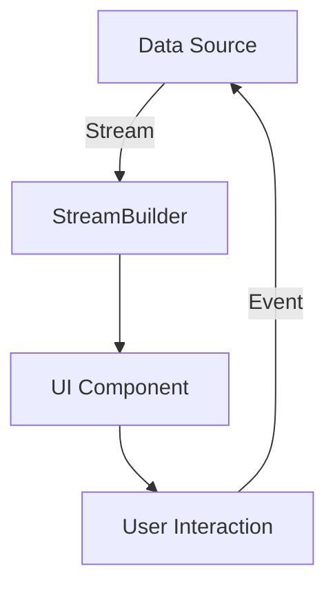
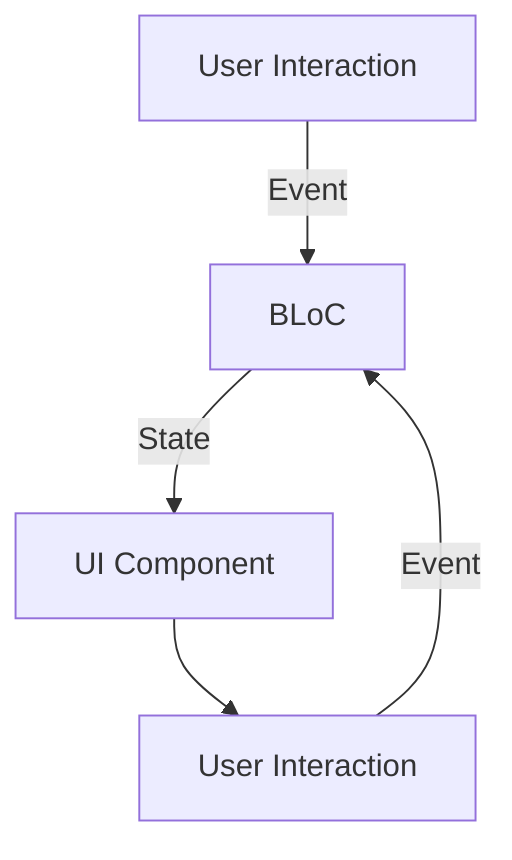

## 11.8 Reactive UI Development

In the world of modern application development, creating responsive and interactive user interfaces is crucial. Reactive UI development in Flutter, powered by Dart, leverages the concept of streams to build dynamic and efficient UIs. This section will guide you through the process of building UIs with streams, integrating state management patterns like BLoC, and adhering to best practices for scalable and maintainable reactive UIs.

### Building UIs with Streams

Streams in Dart are a powerful tool for handling asynchronous data. They allow you to listen to a sequence of events and react to them as they occur. In Flutter, streams can be directly connected to UI components, enabling real-time updates and interactions.

#### Understanding Streams

A stream is a sequence of asynchronous events. It can be thought of as a pipe that carries data from a source to a listener. Streams can be single-subscription or broadcast, depending on whether they allow multiple listeners.

- **Single-subscription streams**: These streams can only be listened to once. They are suitable for tasks that involve a single sequence of events, such as reading a file.
- **Broadcast streams**: These streams can have multiple listeners and are ideal for scenarios where you need to share the same data with multiple parts of your application.

#### Connecting Streams to UI Components

To connect a stream to a UI component in Flutter, you typically use a `StreamBuilder` widget. The `StreamBuilder` listens to a stream and rebuilds its widget tree whenever a new event is emitted.

```dart
import 'package:flutter/material.dart';

class StreamExample extends StatelessWidget {
  final Stream<int> numberStream = Stream.periodic(
    Duration(seconds: 1),
    (count) => count,
  );

  @override
  Widget build(BuildContext context) {
    return Scaffold(
      appBar: AppBar(
        title: Text('Stream Example'),
      ),
      body: Center(
        child: StreamBuilder<int>(
          stream: numberStream,
          builder: (context, snapshot) {
            if (snapshot.connectionState == ConnectionState.waiting) {
              return CircularProgressIndicator();
            } else if (snapshot.hasError) {
              return Text('Error: ${snapshot.error}');
            } else if (!snapshot.hasData) {
              return Text('No data');
            } else {
              return Text('Current count: ${snapshot.data}');
            }
          },
        ),
      ),
    );
  }
}
```

In this example, a `StreamBuilder` is used to listen to a stream that emits an integer every second. The UI updates to display the current count.

#### Visualizing Stream Connections

To better understand how streams connect to UI components, consider the following diagram:



This diagram illustrates the flow of data from a source through a stream to a UI component, with user interactions feeding back into the data source.

### State Management Integration

Integrating streams with state management patterns like BLoC (Business Logic Component) allows for a more organized and scalable approach to managing application state.

#### The BLoC Pattern

The BLoC pattern separates business logic from UI components, making it easier to manage and test. It uses streams to handle input and output, providing a reactive way to manage state.

- **Input**: User interactions are converted into events that are added to a stream.
- **Output**: The BLoC processes these events and emits new states through another stream.

#### Implementing BLoC with Streams

To implement a BLoC, you typically define events, states, and the BLoC itself. Here's a simple example:

```dart
import 'dart:async';

enum CounterEvent { increment, decrement }

class CounterBloc {
  int _counter = 0;
  final _counterStateController = StreamController<int>();
  StreamSink<int> get _inCounter => _counterStateController.sink;
  Stream<int> get counter => _counterStateController.stream;

  final _counterEventController = StreamController<CounterEvent>();
  Sink<CounterEvent> get counterEventSink => _counterEventController.sink;

  CounterBloc() {
    _counterEventController.stream.listen(_mapEventToState);
  }

  void _mapEventToState(CounterEvent event) {
    if (event == CounterEvent.increment) {
      _counter++;
    } else {
      _counter--;
    }
    _inCounter.add(_counter);
  }

  void dispose() {
    _counterStateController.close();
    _counterEventController.close();
  }
}
```

In this example, the `CounterBloc` manages a simple counter. It listens for `CounterEvent` events and updates the counter state accordingly.

#### Using BLoC in a Flutter App

To use the `CounterBloc` in a Flutter app, you can connect it to UI components using a `StreamBuilder`.

```dart
import 'package:flutter/material.dart';

class CounterApp extends StatelessWidget {
  final CounterBloc _bloc = CounterBloc();

  @override
  Widget build(BuildContext context) {
    return MaterialApp(
      home: Scaffold(
        appBar: AppBar(
          title: Text('BLoC Counter'),
        ),
        body: Center(
          child: StreamBuilder<int>(
            stream: _bloc.counter,
            initialData: 0,
            builder: (context, snapshot) {
              return Text('Counter: ${snapshot.data}');
            },
          ),
        ),
        floatingActionButton: Column(
          mainAxisAlignment: MainAxisAlignment.end,
          children: [
            FloatingActionButton(
              onPressed: () => _bloc.counterEventSink.add(CounterEvent.increment),
              child: Icon(Icons.add),
            ),
            SizedBox(height: 10),
            FloatingActionButton(
              onPressed: () => _bloc.counterEventSink.add(CounterEvent.decrement),
              child: Icon(Icons.remove),
            ),
          ],
        ),
      ),
    );
  }
}
```

This app uses the `CounterBloc` to manage the counter state, updating the UI in response to user interactions.

### Best Practices for Reactive UIs

Building reactive UIs requires careful consideration of scalability and maintainability. Here are some best practices to follow:

#### Ensure Scalability

- **Modularize your code**: Break down your application into smaller, reusable components. This makes it easier to manage and scale.
- **Use streams judiciously**: While streams are powerful, overusing them can lead to complex and hard-to-maintain code. Use them where they provide clear benefits.

#### Maintainability

- **Follow the BLoC pattern**: Separating business logic from UI components makes your codebase easier to maintain and test.
- **Document your code**: Clear documentation helps others (and your future self) understand your code and its purpose.
- **Write tests**: Ensure your application behaves as expected by writing unit and integration tests.

#### Performance Considerations

- **Avoid unnecessary rebuilds**: Use `StreamBuilder` and other widgets efficiently to prevent unnecessary UI rebuilds.
- **Optimize stream usage**: Close streams when they are no longer needed to free up resources.

### Try It Yourself

To deepen your understanding of reactive UI development, try modifying the code examples provided:

- **Experiment with different types of streams**: Create a broadcast stream and connect multiple listeners to it.
- **Extend the BLoC example**: Add new events and states to the `CounterBloc`, such as resetting the counter.
- **Build a more complex UI**: Use streams to manage the state of a more complex UI, such as a to-do list or a chat application.

### Visualizing BLoC Architecture

To better understand the BLoC architecture, consider the following diagram:



This diagram illustrates the flow of events and states in a BLoC architecture, highlighting the separation of concerns between UI components and business logic.

### References and Further Reading

- [Flutter Streams Documentation](https://api.flutter.dev/flutter/dart-async/Stream-class.html)
- [BLoC Pattern in Flutter](https://bloclibrary.dev/#/)
- [Reactive Programming in Dart](https://dart.dev/tutorials/language/streams)

### Knowledge Check

- **What is a stream in Dart, and how is it used in Flutter?**
- **How does the BLoC pattern help in managing application state?**
- **What are some best practices for building scalable and maintainable reactive UIs?**

### Embrace the Journey

Remember, mastering reactive UI development is a journey. As you progress, you'll build more complex and interactive applications. Keep experimenting, stay curious, and enjoy the journey!

## Quiz Time!



### What is a stream in Dart?

- [x] A sequence of asynchronous events
- [ ] A synchronous data structure
- [ ] A type of widget in Flutter
- [ ] A method for handling errors

> **Explanation:** A stream in Dart is a sequence of asynchronous events, allowing you to handle data that arrives over time.

### How does the BLoC pattern separate concerns?

- [x] By separating business logic from UI components
- [ ] By combining UI and business logic
- [ ] By using only synchronous operations
- [ ] By avoiding the use of streams

> **Explanation:** The BLoC pattern separates business logic from UI components, making the codebase easier to manage and test.

### What is the purpose of a StreamBuilder in Flutter?

- [x] To listen to a stream and rebuild the UI on new events
- [ ] To create a new stream
- [ ] To handle errors in streams
- [ ] To manage state without streams

> **Explanation:** A StreamBuilder listens to a stream and rebuilds its widget tree whenever a new event is emitted.

### What is a single-subscription stream?

- [x] A stream that can only be listened to once
- [ ] A stream that allows multiple listeners
- [ ] A stream that never closes
- [ ] A stream that handles errors automatically

> **Explanation:** A single-subscription stream can only be listened to once, suitable for tasks with a single sequence of events.

### What is a broadcast stream?

- [x] A stream that allows multiple listeners
- [ ] A stream that can only be listened to once
- [ ] A stream that never closes
- [ ] A stream that handles errors automatically

> **Explanation:** A broadcast stream allows multiple listeners, ideal for sharing data with multiple parts of an application.

### What is the role of a Sink in a BLoC?

- [x] To add events to a stream
- [ ] To listen to a stream
- [ ] To handle errors in a stream
- [ ] To close a stream

> **Explanation:** A Sink is used to add events to a stream, allowing the BLoC to process them.

### How can you optimize stream usage in Flutter?

- [x] By closing streams when they are no longer needed
- [ ] By using only single-subscription streams
- [ ] By avoiding the use of StreamBuilder
- [ ] By using synchronous operations only

> **Explanation:** Closing streams when they are no longer needed helps free up resources and optimize performance.

### What is the benefit of modularizing code in Flutter?

- [x] It makes the application easier to manage and scale
- [ ] It increases the complexity of the codebase
- [ ] It reduces the need for documentation
- [ ] It eliminates the need for testing

> **Explanation:** Modularizing code makes the application easier to manage and scale, promoting reusability and maintainability.

### What is the initial data parameter in a StreamBuilder used for?

- [x] To provide a default value before the stream emits data
- [ ] To create a new stream
- [ ] To handle errors in the stream
- [ ] To close the stream

> **Explanation:** The initial data parameter provides a default value before the stream emits data, ensuring the UI has something to display initially.

### True or False: Streams in Dart can only handle synchronous data.

- [ ] True
- [x] False

> **Explanation:** Streams in Dart are designed to handle asynchronous data, allowing you to react to events as they occur over time.


