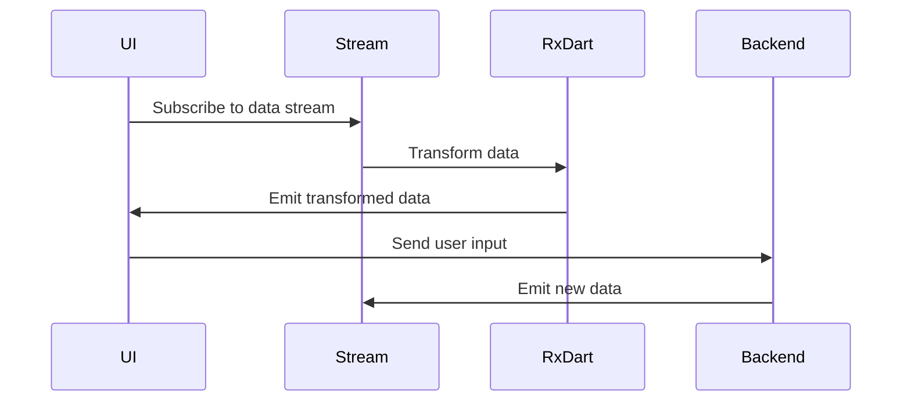

## 11.9 Integrating Reactive Patterns in Flutter Apps

Reactive programming is a powerful paradigm that allows developers to build applications that are responsive, resilient, and scalable. In the context of Flutter, integrating reactive patterns can significantly enhance the user experience by providing smooth and dynamic interfaces. This section will delve into the integration of reactive patterns in Flutter apps, focusing on Streams, RxDart, and other reactive programming techniques. We will explore when to use each approach, strategies for testing reactive code, and performance considerations to balance responsiveness with resource usage.

### Understanding Reactive Programming in Flutter

Reactive programming is a declarative programming paradigm concerned with data streams and the propagation of change. In Flutter, reactive programming is often used to manage state and handle asynchronous data flows efficiently. The core concept revolves around reacting to data changes and events, allowing the UI to update automatically in response to these changes.

#### Key Concepts

- **Data Streams**: A sequence of data elements made available over time. Streams can be finite or infinite and are a fundamental concept in reactive programming.
- **Observables**: Objects that emit data streams, allowing other components to subscribe and react to the emitted data.
- **Subscribers**: Components that listen to observables and react to the emitted data by executing specific actions.

### Combining Approaches: When to Use Streams, RxDart, or Other Patterns

Flutter provides several options for implementing reactive patterns, including native Streams and the RxDart library. Understanding when to use each approach is crucial for building efficient and maintainable applications.

#### Streams in Flutter

Streams are a core part of Dart's asynchronous programming model. They provide a way to handle asynchronous data sequences, such as user inputs, network requests, or file I/O operations.

- **Use Streams When**:
  - You need a simple and lightweight solution for handling asynchronous data.
  - You are working with finite data sequences.
  - You want to leverage Dart's built-in support for asynchronous programming.

**Example: Using Streams in Flutter**

```dart
import 'dart:async';

void main() {
  // Create a simple stream
  Stream<int> numberStream = Stream<int>.periodic(Duration(seconds: 1), (count) => count).take(5);

  // Listen to the stream
  numberStream.listen((number) {
    print('Received number: $number');
  });
}
```

In this example, a stream emits numbers every second, and the listener reacts to each emitted number by printing it to the console.

#### RxDart

RxDart is a reactive programming library that extends the capabilities of Dart Streams with additional operators and functionalities inspired by ReactiveX.

- **Use RxDart When**:
  - You need advanced stream manipulation capabilities.
  - You are building complex data flows with multiple transformations and combinations.
  - You want to leverage a rich set of operators for filtering, transforming, and combining streams.

**Example: Using RxDart in Flutter**

```dart
import 'package:rxdart/rxdart.dart';

void main() {
  // Create a BehaviorSubject
  final BehaviorSubject<int> subject = BehaviorSubject<int>();

  // Add data to the subject
  subject.add(1);
  subject.add(2);
  subject.add(3);

  // Listen to the subject
  subject.listen((value) {
    print('Received value: $value');
  });

  // Close the subject
  subject.close();
}
```

In this example, a `BehaviorSubject` from RxDart is used to emit values. The listener reacts to each value by printing it to the console.

#### Choosing the Right Approach

When deciding between Streams and RxDart, consider the complexity of your data flows and the specific requirements of your application. For simple use cases, Dart's native Streams may suffice. However, for more complex scenarios involving multiple data transformations and combinations, RxDart provides a more powerful and flexible solution.

### Testing Reactive Code: Strategies for Testing Asynchronous and Stream-Based Code

Testing reactive code can be challenging due to its asynchronous nature. However, with the right strategies, you can ensure that your reactive components are reliable and perform as expected.

#### Unit Testing Streams

Unit testing Streams involves verifying that the stream emits the expected sequence of values and that subscribers react correctly to these values.

**Example: Testing a Stream**

```dart
import 'dart:async';
import 'package:test/test.dart';

void main() {
  test('Stream emits expected values', () async {
    // Create a stream
    Stream<int> numberStream = Stream<int>.fromIterable([1, 2, 3]);

    // Collect emitted values
    List<int> emittedValues = [];
    await for (int value in numberStream) {
      emittedValues.add(value);
    }

    // Verify emitted values
    expect(emittedValues, equals([1, 2, 3]));
  });
}
```

In this test, we verify that the stream emits the expected sequence of values `[1, 2, 3]`.

#### Testing RxDart Observables

Testing RxDart observables involves similar principles, with additional considerations for the specific operators and transformations used.

**Example: Testing an RxDart Observable**

```dart
import 'package:rxdart/rxdart.dart';
import 'package:test/test.dart';

void main() {
  test('RxDart observable emits transformed values', () async {
    // Create a BehaviorSubject
    final BehaviorSubject<int> subject = BehaviorSubject<int>();

    // Transform the observable
    final transformedObservable = subject.map((value) => value * 2);

    // Collect emitted values
    List<int> emittedValues = [];
    transformedObservable.listen(emittedValues.add);

    // Add data to the subject
    subject.add(1);
    subject.add(2);
    subject.add(3);

    // Close the subject
    await subject.close();

    // Verify emitted values
    expect(emittedValues, equals([2, 4, 6]));
  });
}
```

In this test, we verify that the `BehaviorSubject` emits transformed values `[2, 4, 6]` after applying a map operation.

### Performance Considerations: Balancing Responsiveness with Resource Usage

Reactive programming can improve the responsiveness of your Flutter app, but it's essential to balance this with resource usage to avoid performance bottlenecks.

#### Optimizing Stream Performance

- **Use Lazy Evaluation**: Streams in Dart are lazily evaluated, meaning they only compute values when needed. This can help reduce unnecessary computations and improve performance.
- **Limit Stream Length**: For finite streams, use operators like `take` or `takeWhile` to limit the number of emitted values and prevent resource exhaustion.

#### Optimizing RxDart Performance

- **Use Subjects Wisely**: Subjects can be resource-intensive, so use them judiciously. Consider using simple streams or other reactive components when possible.
- **Avoid Unnecessary Transformations**: Each transformation adds overhead, so avoid unnecessary operations and combine transformations when possible.

### Visualizing Reactive Patterns in Flutter

To better understand the flow of data in reactive patterns, let's visualize a simple reactive architecture using a Mermaid.js sequence diagram.



**Diagram Description**: This sequence diagram illustrates a typical reactive data flow in a Flutter app. The UI subscribes to a data stream, which is transformed using RxDart operators. The transformed data is then emitted back to the UI, which can also send user input to the backend, triggering new data emissions.

### Try It Yourself: Experimenting with Reactive Patterns

To deepen your understanding of reactive patterns in Flutter, try modifying the provided code examples. Experiment with different stream transformations, RxDart operators, and testing strategies. Consider creating a simple Flutter app that uses reactive patterns to manage state and handle user interactions.

### References and Further Reading

- [Dart Streams Documentation](https://dart.dev/tutorials/language/streams)
- [RxDart GitHub Repository](https://github.com/ReactiveX/rxdart)
- [Flutter Asynchronous Programming](https://flutter.dev/docs/cookbook/networking/fetch-data)

### Knowledge Check

- What are the key differences between Streams and RxDart?
- How can you test a stream to ensure it emits the expected values?
- What are some performance considerations when using reactive patterns in Flutter?

### Embrace the Journey

Remember, mastering reactive patterns in Flutter is a journey. As you experiment and build more complex applications, you'll gain a deeper understanding of how to leverage these patterns to create responsive and efficient user interfaces. Keep exploring, stay curious, and enjoy the process!

## Quiz Time!



### What is a key benefit of using reactive programming in Flutter?

- [x] It allows the UI to update automatically in response to data changes.
- [ ] It simplifies the code by removing the need for asynchronous operations.
- [ ] It eliminates the need for state management.
- [ ] It increases the complexity of the application.

> **Explanation:** Reactive programming allows the UI to update automatically in response to data changes, making applications more responsive and dynamic.

### When should you consider using RxDart over native Streams in Flutter?

- [x] When you need advanced stream manipulation capabilities.
- [ ] When you are working with simple, finite data sequences.
- [ ] When you want to avoid using third-party libraries.
- [ ] When you need to handle synchronous data flows.

> **Explanation:** RxDart provides advanced stream manipulation capabilities, making it suitable for complex data flows with multiple transformations and combinations.

### What is a common strategy for testing reactive code in Flutter?

- [x] Verifying that the stream emits the expected sequence of values.
- [ ] Ignoring asynchronous operations during testing.
- [ ] Testing only the UI components without considering data flows.
- [ ] Avoiding the use of unit tests for reactive code.

> **Explanation:** A common strategy for testing reactive code is to verify that the stream emits the expected sequence of values and that subscribers react correctly.

### How can you optimize stream performance in Flutter?

- [x] Use lazy evaluation to reduce unnecessary computations.
- [ ] Emit all possible values at once to improve efficiency.
- [ ] Avoid using operators like `take` or `takeWhile`.
- [ ] Use subjects for all data flows.

> **Explanation:** Lazy evaluation helps reduce unnecessary computations, improving stream performance. Limiting stream length with operators like `take` can also prevent resource exhaustion.

### What is the role of a subscriber in reactive programming?

- [x] To listen to observables and react to emitted data.
- [ ] To emit data streams for other components.
- [ ] To transform data streams using operators.
- [ ] To manage the application's state.

> **Explanation:** Subscribers listen to observables and react to emitted data by executing specific actions, such as updating the UI.

### Which of the following is a performance consideration when using RxDart?

- [x] Avoid unnecessary transformations to reduce overhead.
- [ ] Use subjects for all data flows to simplify the architecture.
- [ ] Emit all data at once to improve responsiveness.
- [ ] Avoid using operators for stream manipulation.

> **Explanation:** Avoiding unnecessary transformations reduces overhead and improves performance. Combining transformations when possible can also optimize resource usage.

### What is a key concept of reactive programming?

- [x] Data streams and the propagation of change.
- [ ] Synchronous data processing.
- [ ] Static data management.
- [ ] Manual UI updates.

> **Explanation:** Reactive programming focuses on data streams and the propagation of change, allowing the UI to react automatically to data updates.

### How can you visualize a reactive data flow in Flutter?

- [x] Use a sequence diagram to illustrate the flow of data between components.
- [ ] Create a pie chart to represent data transformations.
- [ ] Use a bar graph to show data emissions over time.
- [ ] Draw a static diagram of the application's architecture.

> **Explanation:** A sequence diagram can effectively illustrate the flow of data between components in a reactive architecture, showing how data is emitted, transformed, and consumed.

### What is the purpose of using operators in RxDart?

- [x] To filter, transform, and combine streams.
- [ ] To create new data streams from scratch.
- [ ] To manage the application's state.
- [ ] To handle synchronous data flows.

> **Explanation:** Operators in RxDart are used to filter, transform, and combine streams, providing powerful tools for managing complex data flows.

### True or False: Reactive programming eliminates the need for state management in Flutter apps.

- [ ] True
- [x] False

> **Explanation:** False. Reactive programming complements state management by providing a way to handle asynchronous data flows, but it does not eliminate the need for managing state in Flutter apps.


