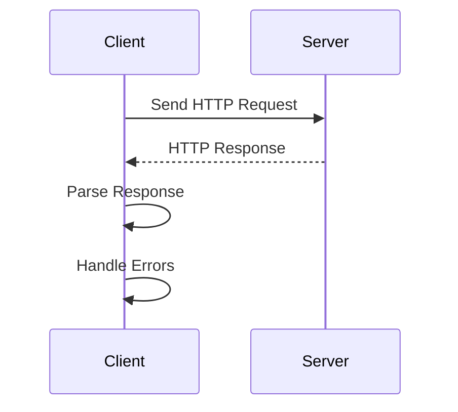

## 12.1 HTTP and RESTful API Consumption

In modern application development, interacting with web services is a fundamental requirement. Whether you're building a mobile app with Flutter or a server-side application with Dart, understanding how to consume HTTP and RESTful APIs is crucial. This section will guide you through making HTTP requests, parsing responses, handling errors, and implementing best practices for robust and efficient network interactions.

### Making HTTP Requests

To interact with RESTful APIs in Dart, we commonly use the `http` package. This package provides a simple and effective way to perform HTTP requests. Let's explore how to set up and use this package to make HTTP requests.

#### Setting Up the `http` Package

First, add the `http` package to your `pubspec.yaml` file:

```yaml
dependencies:
  http: ^0.13.3
```

Then, run `flutter pub get` to install the package.

#### Making GET Requests

A GET request is used to retrieve data from a server. Here's how you can perform a GET request using the `http` package:

```dart
import 'dart:convert';
import 'package:http/http.dart' as http;

Future<void> fetchData() async {
  final response = await http.get(Uri.parse('https://jsonplaceholder.typicode.com/posts'));

  if (response.statusCode == 200) {
    List<dynamic> data = jsonDecode(response.body);
    print('Data fetched successfully: $data');
  } else {
    print('Failed to load data');
  }
}
```

**Explanation:**

- We use `http.get` to send a GET request to the specified URL.
- The `Uri.parse` method is used to parse the URL string.
- We check the `statusCode` to ensure the request was successful (status code 200).
- The response body is decoded from JSON format using `jsonDecode`.

#### Making POST Requests

A POST request is used to send data to a server. Here's an example of making a POST request:

```dart
import 'dart:convert';
import 'package:http/http.dart' as http;

Future<void> postData() async {
  final response = await http.post(
    Uri.parse('https://jsonplaceholder.typicode.com/posts'),
    headers: <String, String>{
      'Content-Type': 'application/json; charset=UTF-8',
    },
    body: jsonEncode(<String, String>{
      'title': 'foo',
      'body': 'bar',
      'userId': '1',
    }),
  );

  if (response.statusCode == 201) {
    print('Data posted successfully: ${response.body}');
  } else {
    print('Failed to post data');
  }
}
```

**Explanation:**

- We use `http.post` to send a POST request.
- Headers are specified to indicate the content type.
- The body of the request is encoded to JSON format using `jsonEncode`.
- A successful POST request typically returns a status code of 201.

### Parsing Responses

Once you've made an HTTP request, you'll need to parse the response data. Most APIs return data in JSON format, but you might also encounter XML or other formats.

#### Parsing JSON Responses

JSON is the most common data format for APIs. Here's how to parse a JSON response:

```dart
import 'dart:convert';

void parseJson(String jsonResponse) {
  Map<String, dynamic> data = jsonDecode(jsonResponse);
  print('Title: ${data['title']}');
}
```

**Explanation:**

- `jsonDecode` is used to convert the JSON string into a Dart map.
- We can then access the data using the map's keys.

#### Parsing XML Responses

If you need to parse XML, consider using the `xml` package. Here's a basic example:

```dart
import 'package:xml/xml.dart';

void parseXml(String xmlResponse) {
  final document = XmlDocument.parse(xmlResponse);
  final title = document.findAllElements('title').map((node) => node.text).first;
  print('Title: $title');
}
```

**Explanation:**

- The `XmlDocument.parse` method is used to parse the XML string.
- We use `findAllElements` to locate elements by their tag name.

### Error Handling

Handling errors gracefully is essential for a robust application. Let's explore how to manage HTTP errors and network issues.

#### Managing HTTP Errors

When making HTTP requests, you might encounter various errors. Here's how to handle them:

```dart
import 'package:http/http.dart' as http;

Future<void> fetchDataWithErrorHandling() async {
  try {
    final response = await http.get(Uri.parse('https://jsonplaceholder.typicode.com/posts'));

    if (response.statusCode == 200) {
      print('Data fetched successfully');
    } else {
      print('Error: ${response.statusCode}');
    }
  } catch (e) {
    print('An error occurred: $e');
  }
}
```

**Explanation:**

- We use a `try-catch` block to handle exceptions.
- The `statusCode` is checked to determine if the request was successful.
- Any exceptions thrown during the request are caught and logged.

#### Handling Network Issues

Network issues can occur due to connectivity problems or server downtime. Implement retry logic to handle such scenarios:

```dart
import 'package:http/http.dart' as http;
import 'dart:async';

Future<void> fetchDataWithRetries() async {
  int retries = 3;
  while (retries > 0) {
    try {
      final response = await http.get(Uri.parse('https://jsonplaceholder.typicode.com/posts'));

      if (response.statusCode == 200) {
        print('Data fetched successfully');
        break;
      } else {
        print('Error: ${response.statusCode}');
      }
    } catch (e) {
      print('An error occurred: $e');
    }
    retries--;
    if (retries > 0) {
      print('Retrying...');
      await Future.delayed(Duration(seconds: 2));
    }
  }
}
```

**Explanation:**

- We implement a retry mechanism with a limited number of attempts.
- A delay is added between retries to prevent overwhelming the server.

### Best Practices

Implementing best practices ensures your application is efficient and reliable. Let's explore some key practices for HTTP and RESTful API consumption.

#### Implementing Retries and Exponential Backoff

Retries should be implemented with exponential backoff to avoid overwhelming the server:

```dart
import 'dart:math';

Future<void> fetchDataWithExponentialBackoff() async {
  int retries = 3;
  int delay = 1;

  while (retries > 0) {
    try {
      final response = await http.get(Uri.parse('https://jsonplaceholder.typicode.com/posts'));

      if (response.statusCode == 200) {
        print('Data fetched successfully');
        break;
      } else {
        print('Error: ${response.statusCode}');
      }
    } catch (e) {
      print('An error occurred: $e');
    }
    retries--;
    if (retries > 0) {
      print('Retrying in $delay seconds...');
      await Future.delayed(Duration(seconds: delay));
      delay *= 2; // Exponential backoff
    }
  }
}
```

**Explanation:**

- The delay between retries is doubled each time, implementing exponential backoff.
- This approach helps to reduce server load during high traffic.

#### Setting Timeouts

Setting timeouts prevents your application from waiting indefinitely for a response:

```dart
Future<void> fetchDataWithTimeout() async {
  try {
    final response = await http
        .get(Uri.parse('https://jsonplaceholder.typicode.com/posts'))
        .timeout(Duration(seconds: 5));

    if (response.statusCode == 200) {
      print('Data fetched successfully');
    } else {
      print('Error: ${response.statusCode}');
    }
  } catch (e) {
    print('An error occurred: $e');
  }
}
```

**Explanation:**

- The `timeout` method is used to specify a maximum wait time for the request.
- If the request exceeds the timeout, an exception is thrown.

#### Using Secure Connections

Always use HTTPS for secure communication. Ensure your server supports HTTPS and update your API endpoints accordingly.

### Visualizing HTTP Request Flow

To better understand the flow of an HTTP request, let's visualize it using a sequence diagram:



**Diagram Explanation:**

- The client sends an HTTP request to the server.
- The server responds with the requested data.
- The client parses the response and handles any errors that occur.

### Try It Yourself

Now that we've covered the basics, try modifying the code examples to experiment with different endpoints, request methods, and error handling strategies. For instance, you can:

- Change the API endpoint to another public API.
- Implement additional HTTP methods like PUT or DELETE.
- Experiment with different retry strategies or timeout durations.

### References and Links

For further reading and deeper dives into HTTP and RESTful API consumption, consider the following resources:

- [Dart HTTP Package Documentation](https://pub.dev/packages/http)
- [RESTful API Design Guide](https://www.restapitutorial.com/)
- [JSON Placeholder API](https://jsonplaceholder.typicode.com/)

### Knowledge Check

Let's reinforce what we've learned with some questions and exercises:

- What is the purpose of the `http` package in Dart?
- How do you handle JSON responses in Dart?
- What are some common HTTP status codes and their meanings?
- Implement a retry mechanism with exponential backoff for a POST request.
- How can you ensure secure communication with an API?

### Embrace the Journey

Remember, mastering HTTP and RESTful API consumption is just the beginning. As you progress, you'll build more complex and interactive applications. Keep experimenting, stay curious, and enjoy the journey!

## Quiz Time!



### What is the primary purpose of the `http` package in Dart?

- [x] To perform HTTP requests
- [ ] To parse XML data
- [ ] To manage state in Flutter
- [ ] To handle JSON serialization

> **Explanation:** The `http` package is used to perform HTTP requests in Dart applications.

### Which method is used to parse JSON responses in Dart?

- [ ] jsonEncode
- [x] jsonDecode
- [ ] xmlParse
- [ ] jsonParse

> **Explanation:** `jsonDecode` is used to parse JSON strings into Dart objects.

### What HTTP status code indicates a successful GET request?

- [ ] 404
- [x] 200
- [ ] 500
- [ ] 201

> **Explanation:** A status code of 200 indicates a successful GET request.

### How can you handle network errors in Dart?

- [ ] By ignoring them
- [x] By using try-catch blocks
- [ ] By logging them to the console
- [ ] By retrying indefinitely

> **Explanation:** Network errors can be handled using try-catch blocks to catch exceptions.

### What is the benefit of using exponential backoff in retries?

- [ ] It increases server load
- [x] It reduces server load during high traffic
- [ ] It speeds up requests
- [ ] It decreases response time

> **Explanation:** Exponential backoff reduces server load by increasing the delay between retries.

### Which HTTP method is used to send data to a server?

- [ ] GET
- [x] POST
- [ ] DELETE
- [ ] PUT

> **Explanation:** The POST method is used to send data to a server.

### What is the purpose of setting a timeout for HTTP requests?

- [ ] To increase response time
- [ ] To reduce server load
- [x] To prevent waiting indefinitely for a response
- [ ] To handle JSON parsing

> **Explanation:** Setting a timeout prevents the application from waiting indefinitely for a response.

### What should you use to ensure secure communication with an API?

- [ ] HTTP
- [x] HTTPS
- [ ] FTP
- [ ] SMTP

> **Explanation:** HTTPS is used to ensure secure communication with an API.

### Which package can be used to parse XML responses in Dart?

- [ ] json
- [ ] http
- [x] xml
- [ ] flutter

> **Explanation:** The `xml` package is used to parse XML responses in Dart.

### True or False: A status code of 201 indicates a successful POST request.

- [x] True
- [ ] False

> **Explanation:** A status code of 201 indicates that a POST request was successful and a resource was created.


