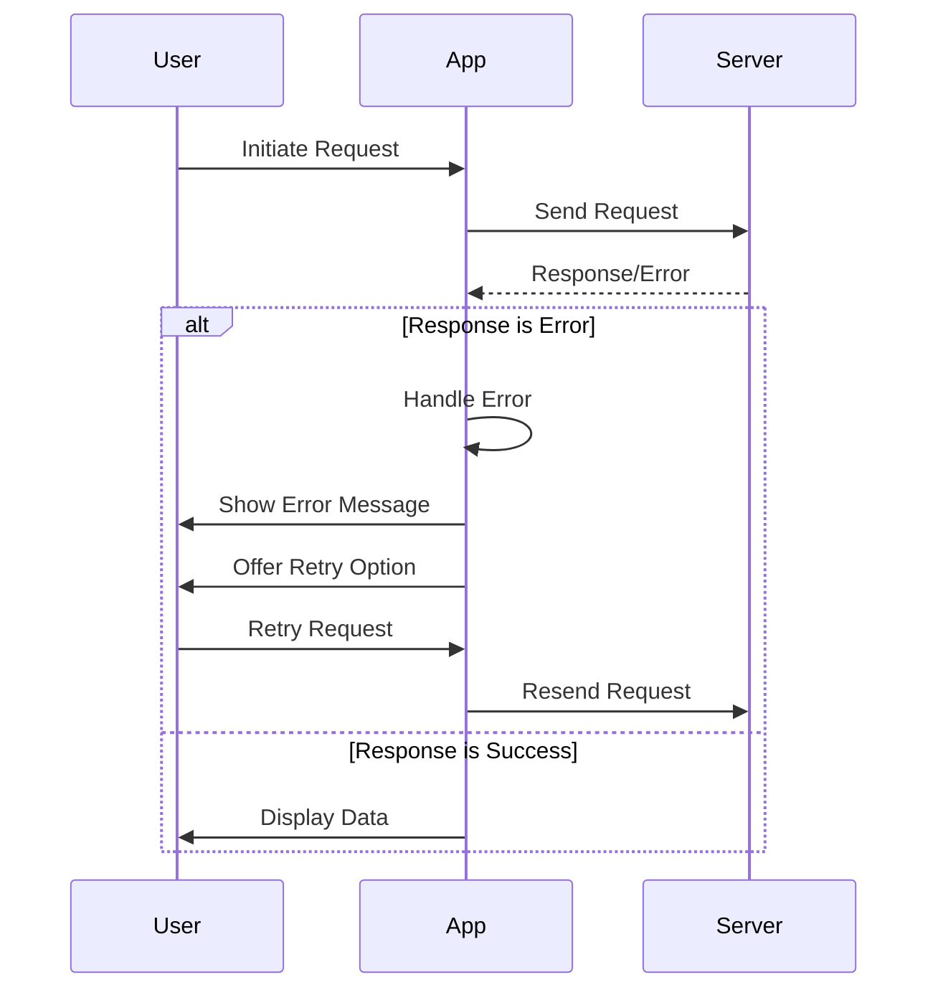

## 12.10 Error Handling and Retrying Requests

In the world of mobile and web applications, network requests are a fundamental part of interacting with external services. However, network interactions are inherently unreliable due to factors like connectivity issues, server downtime, and latency. As Dart and Flutter developers, mastering error handling and implementing retry logic is crucial for building robust applications that provide a seamless user experience even in the face of network failures.

In this section, we will explore various strategies for handling errors and retrying requests in Dart and Flutter applications. We will cover timeouts, cancellations, user experience considerations, and best practices for implementing these strategies effectively.

### Understanding Network Errors

Before diving into error handling strategies, it's important to understand the types of network errors that can occur:

1. **Connection Errors**: These occur when the device is unable to establish a connection to the server. This can be due to network unavailability, incorrect URLs, or server downtime.

2. **Timeout Errors**: These happen when a request takes too long to complete. This can be due to slow network speeds or server processing delays.

3. **HTTP Errors**: These are errors returned by the server, such as 404 (Not Found), 500 (Internal Server Error), etc.

4. **Parsing Errors**: These occur when the response data cannot be parsed correctly, often due to unexpected data formats.

### Implementing Error Handling in Dart

Error handling in Dart can be achieved using try-catch blocks, which allow us to catch exceptions and handle them gracefully. Let's look at a basic example of handling network errors using the `http` package.

```dart
import 'dart:convert';
import 'package:http/http.dart' as http;

Future<void> fetchData() async {
  final url = 'https://api.example.com/data';

  try {
    final response = await http.get(Uri.parse(url));

    if (response.statusCode == 200) {
      final data = jsonDecode(response.body);
      print('Data fetched successfully: $data');
    } else {
      print('Server error: ${response.statusCode}');
    }
  } catch (e) {
    print('Network error: $e');
  }
}
```

In this example, we use a try-catch block to handle any exceptions that may occur during the network request. We also check the HTTP status code to handle server errors.

### Retry Logic for Network Requests

Retry logic is essential for handling transient network errors that may resolve themselves after a short delay. Implementing retry logic involves defining a strategy for when and how to retry failed requests.

#### Exponential Backoff Strategy

One common retry strategy is exponential backoff, where the delay between retries increases exponentially. This helps to reduce the load on the server and network.

```dart
import 'dart:async';
import 'dart:convert';
import 'package:http/http.dart' as http;

Future<void> fetchDataWithRetry() async {
  final url = 'https://api.example.com/data';
  int retryCount = 0;
  const maxRetries = 5;

  while (retryCount < maxRetries) {
    try {
      final response = await http.get(Uri.parse(url));

      if (response.statusCode == 200) {
        final data = jsonDecode(response.body);
        print('Data fetched successfully: $data');
        return;
      } else {
        print('Server error: ${response.statusCode}');
      }
    } catch (e) {
      print('Network error: $e');
    }

    retryCount++;
    final delay = Duration(seconds: 2 * retryCount);
    print('Retrying in ${delay.inSeconds} seconds...');
    await Future.delayed(delay);
  }

  print('Failed to fetch data after $maxRetries retries.');
}
```

In this example, we retry the request up to a maximum number of times, with an increasing delay between each retry.

### Managing Timeouts and Cancellations

Timeouts and cancellations are important for managing long-running or hanging requests. Dart provides built-in support for timeouts using the `timeout` method.

#### Implementing Timeouts

```dart
import 'dart:convert';
import 'package:http/http.dart' as http;

Future<void> fetchDataWithTimeout() async {
  final url = 'https://api.example.com/data';

  try {
    final response = await http
        .get(Uri.parse(url))
        .timeout(Duration(seconds: 5));

    if (response.statusCode == 200) {
      final data = jsonDecode(response.body);
      print('Data fetched successfully: $data');
    } else {
      print('Server error: ${response.statusCode}');
    }
  } catch (e) {
    print('Request timed out or network error: $e');
  }
}
```

In this example, we set a timeout of 5 seconds for the network request. If the request takes longer than this, a `TimeoutException` is thrown.

#### Handling Cancellations

Cancellations are useful for aborting requests that are no longer needed, such as when a user navigates away from a page. Dart's `http` package does not support request cancellation directly, but you can achieve this using a combination of `Completer` and `Future`.

```dart
import 'dart:async';
import 'dart:convert';
import 'package:http/http.dart' as http;

Future<void> fetchDataWithCancellation() async {
  final url = 'https://api.example.com/data';
  final completer = Completer<void>();

  final request = http.get(Uri.parse(url)).then((response) {
    if (response.statusCode == 200) {
      final data = jsonDecode(response.body);
      print('Data fetched successfully: $data');
    } else {
      print('Server error: ${response.statusCode}');
    }
  }).catchError((e) {
    print('Network error: $e');
  });

  // Simulate a cancellation after 2 seconds
  Future.delayed(Duration(seconds: 2), () {
    if (!completer.isCompleted) {
      print('Request cancelled');
      completer.complete();
    }
  });

  await completer.future;
}
```

In this example, we use a `Completer` to simulate a cancellation after 2 seconds. This approach can be adapted to cancel requests based on user actions.

### Enhancing User Experience

Providing feedback to users during network interactions is crucial for a good user experience. Here are some strategies to enhance user experience:

1. **Loading Indicators**: Display loading indicators while waiting for network requests to complete.

2. **Error Messages**: Show user-friendly error messages when a request fails.

3. **Retry Options**: Provide users with the option to retry failed requests.

4. **Fallback Content**: Display cached or default content when a request fails.

#### Example: User Feedback with Flutter

```dart
import 'package:flutter/material.dart';
import 'dart:convert';
import 'package:http/http.dart' as http;

class DataFetcher extends StatefulWidget {
  @override
  _DataFetcherState createState() => _DataFetcherState();
}

class _DataFetcherState extends State<DataFetcher> {
  bool _isLoading = false;
  String _data = '';
  String _error = '';

  Future<void> _fetchData() async {
    setState(() {
      _isLoading = true;
      _error = '';
    });

    final url = 'https://api.example.com/data';

    try {
      final response = await http.get(Uri.parse(url));

      if (response.statusCode == 200) {
        final data = jsonDecode(response.body);
        setState(() {
          _data = data.toString();
        });
      } else {
        setState(() {
          _error = 'Server error: ${response.statusCode}';
        });
      }
    } catch (e) {
      setState(() {
        _error = 'Network error: $e';
      });
    } finally {
      setState(() {
        _isLoading = false;
      });
    }
  }

  @override
  Widget build(BuildContext context) {
    return Scaffold(
      appBar: AppBar(
        title: Text('Data Fetcher'),
      ),
      body: Center(
        child: _isLoading
            ? CircularProgressIndicator()
            : _error.isNotEmpty
                ? Column(
                    mainAxisAlignment: MainAxisAlignment.center,
                    children: [
                      Text(_error),
                      ElevatedButton(
                        onPressed: _fetchData,
                        child: Text('Retry'),
                      ),
                    ],
                  )
                : Text('Data: $_data'),
      ),
      floatingActionButton: FloatingActionButton(
        onPressed: _fetchData,
        child: Icon(Icons.refresh),
      ),
    );
  }
}
```

In this Flutter example, we provide user feedback with a loading indicator, error messages, and a retry button.

### Best Practices for Error Handling and Retrying Requests

1. **Graceful Degradation**: Ensure your application can function with limited or no network connectivity by providing offline capabilities or cached data.

2. **Logging and Monitoring**: Implement logging to track network errors and monitor application performance.

3. **Configurable Retry Policies**: Allow retry policies to be configurable, enabling different strategies for different network conditions.

4. **User Feedback**: Always provide clear and actionable feedback to users when errors occur.

5. **Testing**: Test your error handling and retry logic under various network conditions to ensure reliability.

### Visualizing Error Handling and Retry Logic

To better understand the flow of error handling and retry logic, let's visualize it using a sequence diagram.



This diagram illustrates the interaction between the user, the app, and the server during a network request, highlighting the error handling and retry logic.

### Try It Yourself

Experiment with the code examples provided in this section. Try modifying the retry logic to use different strategies, such as fixed delays or random delays. Implement additional user feedback mechanisms, such as toast notifications or snackbars, to enhance the user experience.

### References and Further Reading

- [Dart Language Tour](https://dart.dev/guides/language/language-tour)
- [Flutter Documentation](https://flutter.dev/docs)
- [HTTP Package for Dart](https://pub.dev/packages/http)

### Knowledge Check

Let's reinforce what we've learned with some questions and exercises.

1. What are the common types of network errors, and how can they be handled in Dart?
2. Implement a retry logic with a fixed delay strategy.
3. How can you provide user feedback during network interactions in a Flutter app?
4. What are the benefits of using exponential backoff for retry logic?
5. Describe how to implement a timeout for a network request in Dart.

### Embrace the Journey

Remember, mastering error handling and retry logic is just one step in building robust and reliable applications. As you continue your journey in Dart and Flutter development, keep experimenting, stay curious, and enjoy the process of learning and growing as a developer.

## Quiz Time!



### What is a common strategy for retrying network requests?

- [x] Exponential backoff
- [ ] Linear delay
- [ ] Immediate retry
- [ ] Random retry

> **Explanation:** Exponential backoff is a common strategy where the delay between retries increases exponentially, reducing load on the server and network.

### How can you handle a timeout for a network request in Dart?

- [x] Use the `timeout` method
- [ ] Use a `Completer`
- [ ] Use a `Stream`
- [ ] Use a `Future`

> **Explanation:** The `timeout` method in Dart allows you to specify a duration after which a request will be considered timed out.

### What should you provide to users when a network error occurs?

- [x] User-friendly error messages
- [ ] Technical error logs
- [ ] No feedback
- [ ] Only retry options

> **Explanation:** Providing user-friendly error messages helps users understand what went wrong and how to proceed.

### Which of the following is NOT a type of network error?

- [x] Syntax error
- [ ] Connection error
- [ ] Timeout error
- [ ] HTTP error

> **Explanation:** Syntax errors are related to code syntax, not network interactions.

### What is the purpose of using a `Completer` in Dart?

- [x] To manually complete a `Future`
- [ ] To handle HTTP requests
- [ ] To parse JSON data
- [ ] To manage state in Flutter

> **Explanation:** A `Completer` in Dart is used to manually complete a `Future`, which can be useful for handling cancellations.

### What is the benefit of providing retry options to users?

- [x] It allows users to attempt the request again
- [ ] It reduces server load
- [ ] It hides errors from users
- [ ] It speeds up the request

> **Explanation:** Providing retry options allows users to attempt the request again, which can be useful if the error was transient.

### How can you simulate a network request cancellation in Dart?

- [x] Use a `Completer` and `Future`
- [ ] Use a `Stream`
- [ ] Use a `Timer`
- [ ] Use a `List`

> **Explanation:** A `Completer` and `Future` can be used to simulate a network request cancellation by completing the `Future` manually.

### What is a best practice for handling network errors?

- [x] Logging and monitoring
- [ ] Ignoring errors
- [ ] Only retrying once
- [ ] Showing technical error details to users

> **Explanation:** Logging and monitoring network errors help track issues and improve application reliability.

### What is the role of loading indicators in network interactions?

- [x] To inform users that a request is in progress
- [ ] To display error messages
- [ ] To retry requests automatically
- [ ] To cancel requests

> **Explanation:** Loading indicators inform users that a request is in progress, enhancing user experience.

### True or False: Exponential backoff reduces server load by increasing the delay between retries.

- [x] True
- [ ] False

> **Explanation:** Exponential backoff increases the delay between retries, reducing server load and network congestion.


