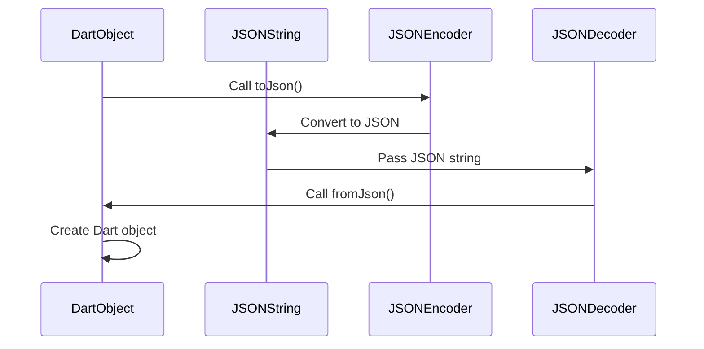

## 12.2 Handling JSON and Serialization

In the world of modern application development, JSON (JavaScript Object Notation) has become the de facto standard for data interchange. Its lightweight and human-readable format makes it ideal for transmitting data between a server and a client. In Dart, handling JSON efficiently is crucial for building robust Flutter applications. This section will guide you through the essentials of JSON encoding and decoding, creating data models, leveraging code generation with `json_serializable`, and implementing custom serialization for complex data structures.

### JSON Encoding and Decoding: Using `dart:convert` for Serialization

Dart provides a powerful library, `dart:convert`, which includes tools for encoding and decoding JSON. Let's explore how to use this library effectively.

#### Encoding JSON

To convert a Dart object into a JSON string, you use the `jsonEncode` function. This process is known as serialization. Here's a simple example:

```dart
import 'dart:convert';

void main() {
  Map<String, dynamic> user = {
    'name': 'John Doe',
    'email': 'john.doe@example.com',
    'age': 30
  };

  String jsonString = jsonEncode(user);
  print(jsonString); // Output: {"name":"John Doe","email":"john.doe@example.com","age":30}
}
```

In this example, we define a `Map` representing a user and convert it into a JSON string using `jsonEncode`.

#### Decoding JSON

Decoding is the process of converting a JSON string back into a Dart object. This is done using the `jsonDecode` function:

```dart
import 'dart:convert';

void main() {
  String jsonString = '{"name":"John Doe","email":"john.doe@example.com","age":30}';
  
  Map<String, dynamic> user = jsonDecode(jsonString);
  print(user['name']); // Output: John Doe
}
```

Here, we take a JSON string and decode it into a Dart `Map`. The `jsonDecode` function returns a `Map<String, dynamic>` or `List<dynamic>`, depending on the JSON structure.

### Data Models: Creating Classes that Represent JSON Structures

While using maps is straightforward, it is often more beneficial to work with strongly-typed classes, especially in larger applications. This approach improves code readability and maintainability.

#### Defining a Data Model

Let's create a `User` class to represent the JSON structure:

```dart
class User {
  final String name;
  final String email;
  final int age;

  User({required this.name, required this.email, required this.age});

  factory User.fromJson(Map<String, dynamic> json) {
    return User(
      name: json['name'],
      email: json['email'],
      age: json['age'],
    );
  }

  Map<String, dynamic> toJson() {
    return {
      'name': name,
      'email': email,
      'age': age,
    };
  }
}
```

In this example, we define a `User` class with a constructor and two methods: `fromJson` for decoding and `toJson` for encoding. The `fromJson` method is a factory constructor that creates a `User` instance from a JSON map, while `toJson` converts a `User` instance back into a JSON map.

#### Using the Data Model

Here's how you can use the `User` class for JSON serialization and deserialization:

```dart
void main() {
  // Decoding JSON to User object
  String jsonString = '{"name":"John Doe","email":"john.doe@example.com","age":30}';
  User user = User.fromJson(jsonDecode(jsonString));
  print(user.name); // Output: John Doe

  // Encoding User object to JSON
  String encodedJson = jsonEncode(user.toJson());
  print(encodedJson); // Output: {"name":"John Doe","email":"john.doe@example.com","age":30}
}
```

### Code Generation: Leveraging `json_serializable` for Automated Code

Manually writing `fromJson` and `toJson` methods can become tedious and error-prone, especially for complex models. The `json_serializable` package automates this process, generating the necessary code for you.

#### Setting Up `json_serializable`

To use `json_serializable`, add the following dependencies to your `pubspec.yaml`:

```yaml
dependencies:
  json_annotation: ^4.0.1

dev_dependencies:
  build_runner: ^2.0.0
  json_serializable: ^6.0.0
```

Run `flutter pub get` to install the packages.

#### Annotating Your Model

Modify your `User` class to use `json_serializable`:

```dart
import 'package:json_annotation/json_annotation.dart';

part 'user.g.dart';

@JsonSerializable()
class User {
  final String name;
  final String email;
  final int age;

  User({required this.name, required this.email, required this.age});

  factory User.fromJson(Map<String, dynamic> json) => _$UserFromJson(json);

  Map<String, dynamic> toJson() => _$UserToJson(this);
}
```

The `@JsonSerializable()` annotation indicates that the `User` class should have serialization logic generated for it. The `part 'user.g.dart';` directive includes the generated code.

#### Generating Code

Run the following command to generate the serialization code:

```bash
flutter pub run build_runner build
```

This command creates a `user.g.dart` file containing the `_$UserFromJson` and `_$UserToJson` functions.

#### Using the Generated Code

With the generated code, you can serialize and deserialize `User` objects without manually writing the conversion logic:

```dart
void main() {
  String jsonString = '{"name":"John Doe","email":"john.doe@example.com","age":30}';
  User user = User.fromJson(jsonDecode(jsonString));
  print(user.name); // Output: John Doe

  String encodedJson = jsonEncode(user.toJson());
  print(encodedJson); // Output: {"name":"John Doe","email":"john.doe@example.com","age":30}
}
```

### Custom Serialization: Handling Complex or Nested Data

In some cases, you may need to handle more complex JSON structures, such as nested objects or lists. Let's explore how to manage these scenarios.

#### Nested JSON Objects

Consider a JSON structure with nested objects:

```json
{
  "name": "John Doe",
  "email": "john.doe@example.com",
  "address": {
    "street": "123 Main St",
    "city": "Anytown",
    "zip": "12345"
  }
}
```

To handle this, define a separate class for the nested object:

```dart
class Address {
  final String street;
  final String city;
  final String zip;

  Address({required this.street, required this.city, required this.zip});

  factory Address.fromJson(Map<String, dynamic> json) {
    return Address(
      street: json['street'],
      city: json['city'],
      zip: json['zip'],
    );
  }

  Map<String, dynamic> toJson() {
    return {
      'street': street,
      'city': city,
      'zip': zip,
    };
  }
}

class User {
  final String name;
  final String email;
  final Address address;

  User({required this.name, required this.email, required this.address});

  factory User.fromJson(Map<String, dynamic> json) {
    return User(
      name: json['name'],
      email: json['email'],
      address: Address.fromJson(json['address']),
    );
  }

  Map<String, dynamic> toJson() {
    return {
      'name': name,
      'email': email,
      'address': address.toJson(),
    };
  }
}
```

#### Lists of Objects

For JSON arrays, you can use Dart's `List` type. Here's how to handle a list of users:

```json
[
  {
    "name": "John Doe",
    "email": "john.doe@example.com",
    "age": 30
  },
  {
    "name": "Jane Smith",
    "email": "jane.smith@example.com",
    "age": 25
  }
]
```

To decode this JSON into a list of `User` objects:

```dart
void main() {
  String jsonString = '''
  [
    {"name":"John Doe","email":"john.doe@example.com","age":30},
    {"name":"Jane Smith","email":"jane.smith@example.com","age":25}
  ]
  ''';

  List<dynamic> jsonList = jsonDecode(jsonString);
  List<User> users = jsonList.map((json) => User.fromJson(json)).toList();

  users.forEach((user) => print(user.name));
  // Output: John Doe
  //         Jane Smith
}
```

### Try It Yourself

Experiment with the code examples provided. Try modifying the `User` class to include additional fields, or create a new class to represent a different JSON structure. Practice encoding and decoding JSON with nested objects and lists to solidify your understanding.

### Visualizing JSON Serialization

To better understand the flow of JSON serialization and deserialization, let's visualize the process using a sequence diagram.



**Diagram Description:** This sequence diagram illustrates the process of converting a Dart object to a JSON string using a JSON encoder, and then decoding the JSON string back into a Dart object using a JSON decoder.

### References and Links

- [Dart: Convert Library](https://api.dart.dev/stable/dart-convert/dart-convert-library.html)
- [json_serializable Package](https://pub.dev/packages/json_serializable)
- [Flutter JSON and Serialization](https://flutter.dev/docs/development/data-and-backend/json)

### Knowledge Check

- What is the purpose of the `jsonEncode` function in Dart?
- How does the `json_serializable` package simplify JSON serialization?
- Describe how you would handle a nested JSON object in Dart.
- What are the benefits of using strongly-typed classes for JSON data models?

### Embrace the Journey

Remember, mastering JSON handling and serialization in Dart is a crucial skill for any Flutter developer. As you continue to explore and experiment with these concepts, you'll find yourself building more efficient and scalable applications. Keep practicing, stay curious, and enjoy the journey!

## Quiz Time!



### What is the primary purpose of the `jsonEncode` function in Dart?

- [x] To convert a Dart object into a JSON string
- [ ] To convert a JSON string into a Dart object
- [ ] To validate JSON syntax
- [ ] To format JSON strings for readability

> **Explanation:** The `jsonEncode` function is used to serialize a Dart object into a JSON string.

### Which package is commonly used for automated JSON serialization in Dart?

- [x] json_serializable
- [ ] json_annotation
- [ ] build_runner
- [ ] dart:convert

> **Explanation:** The `json_serializable` package is used for generating JSON serialization code automatically.

### How do you handle a nested JSON object in Dart?

- [x] By creating a separate class for the nested object and using factory constructors
- [ ] By using a single class with multiple constructors
- [ ] By flattening the JSON structure
- [ ] By using a map to represent the nested object

> **Explanation:** A separate class should be created for the nested object, and factory constructors are used for serialization and deserialization.

### What is the advantage of using strongly-typed classes for JSON data models?

- [x] Improved code readability and maintainability
- [ ] Faster JSON encoding and decoding
- [ ] Reduced memory usage
- [ ] Easier to write unit tests

> **Explanation:** Strongly-typed classes enhance code readability and maintainability by providing clear data structures.

### What command is used to generate code with `json_serializable`?

- [x] flutter pub run build_runner build
- [ ] flutter pub get
- [ ] dart run build_runner build
- [ ] dart pub get

> **Explanation:** The command `flutter pub run build_runner build` is used to generate code for JSON serialization.

### What does the `jsonDecode` function return when decoding a JSON array?

- [x] List<dynamic>
- [ ] Map<String, dynamic>
- [ ] String
- [ ] int

> **Explanation:** When decoding a JSON array, `jsonDecode` returns a `List<dynamic>`.

### Which of the following is a benefit of using `json_serializable`?

- [x] Reduces manual coding effort for JSON serialization
- [ ] Increases application runtime speed
- [ ] Automatically validates JSON data
- [ ] Provides built-in error handling for JSON parsing

> **Explanation:** `json_serializable` automates the generation of serialization code, reducing manual effort.

### How can you modify a generated JSON serialization code?

- [x] By editing the source class and regenerating the code
- [ ] By directly editing the generated file
- [ ] By using a JSON editor
- [ ] By modifying the `pubspec.yaml` file

> **Explanation:** You should modify the source class and regenerate the code using `build_runner`.

### What is the role of the `part` directive in a Dart class using `json_serializable`?

- [x] It includes the generated serialization code
- [ ] It defines a part of the class
- [ ] It specifies a library import
- [ ] It declares a mixin

> **Explanation:** The `part` directive is used to include the generated serialization code in the Dart class.

### True or False: JSON serialization in Dart can only be done manually.

- [ ] True
- [x] False

> **Explanation:** JSON serialization in Dart can be automated using packages like `json_serializable`.


