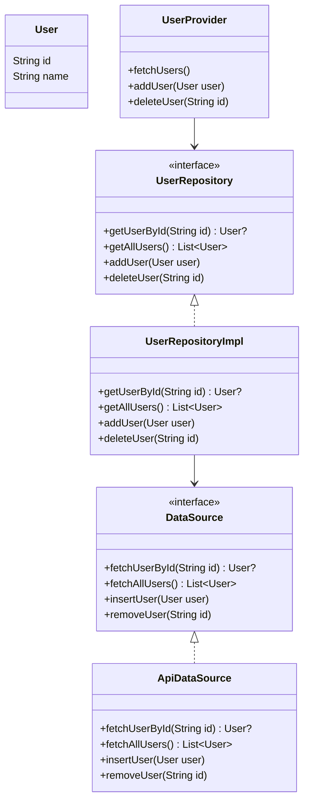

## 12.3 Data Access Patterns

In the realm of software development, particularly in Flutter applications, managing data efficiently is crucial for creating responsive and scalable applications. Data access patterns provide a structured approach to handling data operations, ensuring that your application remains maintainable and adaptable to changes. In this section, we will delve into the key data access patterns in Dart, focusing on abstracting data sources, implementing the Repository Pattern, and utilizing Data Providers. We will also explore use cases such as offline support and caching strategies to enhance your application's performance and reliability.

### Abstracting Data Sources

**Abstracting data sources** involves separating the data retrieval logic from the business logic of your application. This separation allows for greater flexibility and maintainability, as changes to the data source do not directly impact the business logic. By abstracting data sources, you can easily switch between different data providers, such as local databases, remote APIs, or in-memory data stores, without altering the core functionality of your application.

#### Key Benefits of Abstracting Data Sources

- **Flexibility**: Easily switch between different data sources without affecting the business logic.
- **Maintainability**: Simplifies code maintenance by isolating data access logic.
- **Testability**: Facilitates unit testing by allowing mock data sources to be used in place of real ones.

### Repository Pattern

The **Repository Pattern** is a popular design pattern used to abstract data access logic. It provides a consistent API for data operations, allowing the rest of the application to interact with data in a uniform manner. The Repository Pattern acts as an intermediary between the data source and the business logic, encapsulating the details of data access.

#### Intent

The primary intent of the Repository Pattern is to separate the data access logic from the business logic, providing a clean API for data operations. This separation allows for easier testing and maintenance, as well as the ability to switch data sources without affecting the rest of the application.

#### Key Participants

- **Repository**: The central component that provides a consistent API for data operations.
- **Data Source**: The underlying data storage mechanism, such as a database or remote API.
- **Business Logic**: The application logic that interacts with the repository to perform data operations.

#### Applicability

Use the Repository Pattern when you need to:

- Abstract data access logic from business logic.
- Provide a consistent API for data operations.
- Facilitate testing and maintenance by isolating data access logic.

#### Sample Code Snippet

```dart
// Define a model class
class User {
  final String id;
  final String name;

  User({required this.id, required this.name});
}

// Define an abstract repository interface
abstract class UserRepository {
  Future<User?> getUserById(String id);
  Future<List<User>> getAllUsers();
  Future<void> addUser(User user);
  Future<void> deleteUser(String id);
}

// Implement the repository interface with a concrete data source
class UserRepositoryImpl implements UserRepository {
  final DataSource dataSource;

  UserRepositoryImpl(this.dataSource);

  @override
  Future<User?> getUserById(String id) async {
    return await dataSource.fetchUserById(id);
  }

  @override
  Future<List<User>> getAllUsers() async {
    return await dataSource.fetchAllUsers();
  }

  @override
  Future<void> addUser(User user) async {
    await dataSource.insertUser(user);
  }

  @override
  Future<void> deleteUser(String id) async {
    await dataSource.removeUser(id);
  }
}

// Define a data source interface
abstract class DataSource {
  Future<User?> fetchUserById(String id);
  Future<List<User>> fetchAllUsers();
  Future<void> insertUser(User user);
  Future<void> removeUser(String id);
}

// Implement a concrete data source
class ApiDataSource implements DataSource {
  @override
  Future<User?> fetchUserById(String id) async {
    // Fetch user from API
    return User(id: id, name: 'John Doe');
  }

  @override
  Future<List<User>> fetchAllUsers() async {
    // Fetch all users from API
    return [User(id: '1', name: 'John Doe')];
  }

  @override
  Future<void> insertUser(User user) async {
    // Insert user into API
  }

  @override
  Future<void> removeUser(String id) async {
    // Remove user from API
  }
}
```

#### Design Considerations

- **Consistency**: Ensure that the repository provides a consistent API for data operations.
- **Scalability**: Design the repository to handle changes in data sources or data models.
- **Performance**: Optimize data access operations to minimize latency and resource usage.

#### Differences and Similarities

The Repository Pattern is often confused with the Data Access Object (DAO) pattern. While both patterns abstract data access logic, the Repository Pattern provides a higher-level abstraction, often encompassing multiple DAOs or data sources.

### Data Providers

**Data Providers** manage the flow of data between the UI and data layers in a Flutter application. They act as intermediaries, ensuring that data is fetched, cached, and updated efficiently. Data Providers can be implemented using various state management solutions, such as Provider, Riverpod, or BLoC.

#### Intent

The intent of Data Providers is to manage data flow and state in a Flutter application, ensuring that the UI remains responsive and up-to-date with the latest data.

#### Key Participants

- **Data Provider**: The component responsible for managing data flow and state.
- **UI**: The user interface that interacts with the data provider to display data.
- **Data Source**: The underlying data storage mechanism, such as a database or remote API.

#### Applicability

Use Data Providers when you need to:

- Manage data flow and state in a Flutter application.
- Ensure that the UI remains responsive and up-to-date with the latest data.
- Implement caching and offline support strategies.

#### Sample Code Snippet

```dart
import 'package:flutter/material.dart';
import 'package:provider/provider.dart';

// Define a model class
class User {
  final String id;
  final String name;

  User({required this.id, required this.name});
}

// Define a data provider
class UserProvider with ChangeNotifier {
  final UserRepository userRepository;
  List<User> _users = [];

  UserProvider(this.userRepository);

  List<User> get users => _users;

  Future<void> fetchUsers() async {
    _users = await userRepository.getAllUsers();
    notifyListeners();
  }

  Future<void> addUser(User user) async {
    await userRepository.addUser(user);
    _users.add(user);
    notifyListeners();
  }

  Future<void> deleteUser(String id) async {
    await userRepository.deleteUser(id);
    _users.removeWhere((user) => user.id == id);
    notifyListeners();
  }
}

// Implement the UI
void main() {
  runApp(
    ChangeNotifierProvider(
      create: (context) => UserProvider(UserRepositoryImpl(ApiDataSource())),
      child: MyApp(),
    ),
  );
}

class MyApp extends StatelessWidget {
  @override
  Widget build(BuildContext context) {
    return MaterialApp(
      home: UserListScreen(),
    );
  }
}

class UserListScreen extends StatelessWidget {
  @override
  Widget build(BuildContext context) {
    final userProvider = Provider.of<UserProvider>(context);

    return Scaffold(
      appBar: AppBar(title: Text('User List')),
      body: FutureBuilder(
        future: userProvider.fetchUsers(),
        builder: (context, snapshot) {
          if (snapshot.connectionState == ConnectionState.waiting) {
            return Center(child: CircularProgressIndicator());
          }
          return ListView.builder(
            itemCount: userProvider.users.length,
            itemBuilder: (context, index) {
              final user = userProvider.users[index];
              return ListTile(
                title: Text(user.name),
                trailing: IconButton(
                  icon: Icon(Icons.delete),
                  onPressed: () => userProvider.deleteUser(user.id),
                ),
              );
            },
          );
        },
      ),
    );
  }
}
```

#### Design Considerations

- **State Management**: Choose an appropriate state management solution for your application's needs.
- **Performance**: Optimize data fetching and caching to minimize latency and resource usage.
- **Scalability**: Design data providers to handle changes in data sources or data models.

#### Differences and Similarities

Data Providers are often used in conjunction with the Repository Pattern to manage data flow and state in a Flutter application. While the Repository Pattern abstracts data access logic, Data Providers manage the flow of data between the UI and data layers.

### Use Cases: Offline Support and Caching Strategies

Implementing offline support and caching strategies is crucial for creating responsive and reliable applications. By caching data locally, you can ensure that your application remains functional even when the device is offline. Additionally, caching can improve performance by reducing the need for repeated data fetches.

#### Offline Support

Offline support involves ensuring that your application can function without an active internet connection. This can be achieved by caching data locally and synchronizing changes with the remote data source when the connection is restored.

#### Caching Strategies

Caching strategies involve storing data locally to reduce the need for repeated data fetches. Common caching strategies include:

- **In-Memory Caching**: Storing data in memory for quick access.
- **Disk Caching**: Storing data on disk for persistent access.
- **Network Caching**: Caching network responses to reduce the need for repeated requests.

#### Sample Code Snippet

```dart
import 'dart:convert';
import 'package:shared_preferences/shared_preferences.dart';

// Define a cache manager
class CacheManager {
  final SharedPreferences sharedPreferences;

  CacheManager(this.sharedPreferences);

  Future<void> cacheUser(User user) async {
    final userJson = jsonEncode({'id': user.id, 'name': user.name});
    await sharedPreferences.setString('user_${user.id}', userJson);
  }

  Future<User?> getCachedUser(String id) async {
    final userJson = sharedPreferences.getString('user_$id');
    if (userJson != null) {
      final userMap = jsonDecode(userJson);
      return User(id: userMap['id'], name: userMap['name']);
    }
    return null;
  }

  Future<void> clearCache() async {
    await sharedPreferences.clear();
  }
}
```

#### Design Considerations

- **Consistency**: Ensure that cached data remains consistent with the remote data source.
- **Performance**: Optimize caching strategies to minimize latency and resource usage.
- **Scalability**: Design caching strategies to handle changes in data sources or data models.

### Try It Yourself

To deepen your understanding of data access patterns, try modifying the code examples provided in this section. Experiment with different data sources, caching strategies, and state management solutions to see how they affect your application's performance and reliability.

### Visualizing Data Access Patterns

To better understand the flow of data in a Flutter application using data access patterns, let's visualize the architecture using a class diagram.



### Knowledge Check

- What is the primary intent of the Repository Pattern?
- How do Data Providers manage data flow in a Flutter application?
- What are some common caching strategies for offline support?

### Embrace the Journey

Remember, mastering data access patterns is a journey. As you continue to explore and experiment with different patterns and strategies, you'll gain a deeper understanding of how to create efficient and scalable applications. Keep experimenting, stay curious, and enjoy the journey!

## Quiz Time!



### What is the primary intent of the Repository Pattern?

- [x] To separate data access logic from business logic
- [ ] To manage the flow of data between the UI and data layers
- [ ] To provide offline support and caching strategies
- [ ] To handle user authentication and authorization

> **Explanation:** The Repository Pattern aims to separate data access logic from business logic, providing a consistent API for data operations.

### Which component acts as an intermediary between the data source and the business logic in the Repository Pattern?

- [x] Repository
- [ ] Data Provider
- [ ] UI
- [ ] Cache Manager

> **Explanation:** The Repository acts as an intermediary between the data source and the business logic, encapsulating the details of data access.

### What is the role of Data Providers in a Flutter application?

- [x] To manage data flow and state
- [ ] To abstract data access logic
- [ ] To provide offline support
- [ ] To handle network requests

> **Explanation:** Data Providers manage data flow and state in a Flutter application, ensuring that the UI remains responsive and up-to-date with the latest data.

### Which of the following is a common caching strategy?

- [x] In-Memory Caching
- [ ] User Authentication
- [ ] Data Encryption
- [ ] API Rate Limiting

> **Explanation:** In-Memory Caching is a common strategy for storing data in memory for quick access.

### What is the benefit of abstracting data sources?

- [x] Flexibility
- [x] Maintainability
- [ ] Increased complexity
- [ ] Reduced performance

> **Explanation:** Abstracting data sources provides flexibility and maintainability by separating data retrieval logic from business logic.

### How can offline support be achieved in a Flutter application?

- [x] By caching data locally
- [ ] By using a faster internet connection
- [ ] By reducing the number of network requests
- [ ] By optimizing UI performance

> **Explanation:** Offline support can be achieved by caching data locally and synchronizing changes with the remote data source when the connection is restored.

### What is the purpose of the Cache Manager in the provided code example?

- [x] To cache user data locally
- [ ] To manage user authentication
- [ ] To handle network requests
- [ ] To update the UI

> **Explanation:** The Cache Manager is responsible for caching user data locally using SharedPreferences.

### Which state management solution is used in the provided Data Provider example?

- [x] Provider
- [ ] Riverpod
- [ ] BLoC
- [ ] Redux

> **Explanation:** The provided Data Provider example uses the Provider package for state management.

### What is the relationship between the Repository Pattern and Data Providers?

- [x] Data Providers manage the flow of data between the UI and data layers, while the Repository Pattern abstracts data access logic.
- [ ] Both patterns are used for user authentication.
- [ ] Data Providers are a type of Repository Pattern.
- [ ] The Repository Pattern is used to manage UI state.

> **Explanation:** Data Providers manage the flow of data between the UI and data layers, while the Repository Pattern abstracts data access logic.

### True or False: The Repository Pattern and Data Access Object (DAO) pattern are the same.

- [ ] True
- [x] False

> **Explanation:** The Repository Pattern provides a higher-level abstraction than the Data Access Object (DAO) pattern, often encompassing multiple DAOs or data sources.




