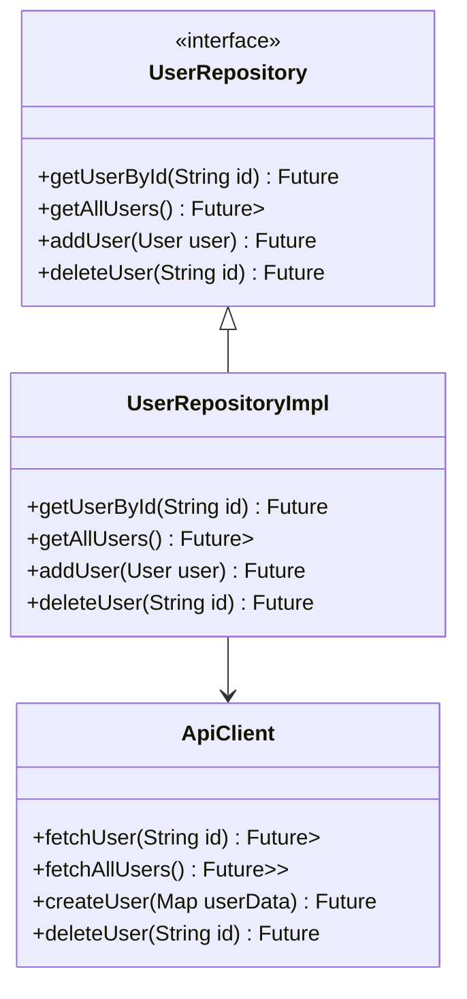

## 12.4 Repository Pattern

In the realm of software development, particularly when working with Flutter and Dart, managing data access efficiently is crucial for building scalable and maintainable applications. The Repository Pattern is a powerful design pattern that helps achieve this by decoupling data sources from the application logic. This section will guide you through understanding, implementing, and leveraging the Repository Pattern in Dart, ensuring your applications are robust and easy to test.

### Simplifying Data Access: Decoupling Data Sources from Application Logic

The Repository Pattern acts as an intermediary between the data access layer and the business logic layer of an application. By abstracting the data access logic, it allows developers to switch between different data sources without affecting the core application logic. This separation of concerns leads to cleaner, more maintainable code and simplifies testing.

#### Intent

The primary intent of the Repository Pattern is to:

- **Abstract Data Access**: Provide a consistent API for data access, regardless of the underlying data source.
- **Decouple Logic**: Separate the business logic from data access logic, promoting a clean architecture.
- **Facilitate Testing**: Enable easy mocking of data sources for unit testing.

#### Key Participants

- **Repository Interface**: Defines the contract for data operations.
- **Concrete Repository**: Implements the repository interface, handling data access logic.
- **Data Source**: The actual source of data, which could be a database, web service, or local storage.

### Implementing the Repository Pattern in Dart

Let's delve into how we can implement the Repository Pattern in Dart, focusing on defining interfaces and their concrete implementations.

#### Interfaces and Implementations

1. **Define the Repository Interface**

   Start by defining an interface that outlines the methods for data operations. This interface will serve as a contract that any concrete repository must adhere to.

   ```dart
   // repository.dart
   abstract class UserRepository {
     Future<User> getUserById(String id);
     Future<List<User>> getAllUsers();
     Future<void> addUser(User user);
     Future<void> deleteUser(String id);
   }
   ```

   In this example, `UserRepository` is an interface that defines methods for fetching, adding, and deleting users.

2. **Create a Concrete Repository**

   Implement the interface in a concrete class that handles the actual data access logic. This class will interact with the data source, such as a REST API or a local database.

   ```dart
   // user_repository_impl.dart
   import 'repository.dart';
   import 'user.dart';

   class UserRepositoryImpl implements UserRepository {
     final ApiClient apiClient;

     UserRepositoryImpl(this.apiClient);

     @override
     Future<User> getUserById(String id) async {
       final response = await apiClient.fetchUser(id);
       return User.fromJson(response);
     }

     @override
     Future<List<User>> getAllUsers() async {
       final response = await apiClient.fetchAllUsers();
       return response.map((data) => User.fromJson(data)).toList();
     }

     @override
     Future<void> addUser(User user) async {
       await apiClient.createUser(user.toJson());
     }

     @override
     Future<void> deleteUser(String id) async {
       await apiClient.deleteUser(id);
     }
   }
   ```

   Here, `UserRepositoryImpl` implements the `UserRepository` interface and uses an `ApiClient` to interact with a REST API.

3. **Data Source Interaction**

   The `ApiClient` class is responsible for making HTTP requests to the server. It abstracts the network operations, allowing the repository to focus on data transformation and business logic.

   ```dart
   // api_client.dart
   import 'dart:convert';
   import 'package:http/http.dart' as http;

   class ApiClient {
     final String baseUrl;

     ApiClient(this.baseUrl);

     Future<Map<String, dynamic>> fetchUser(String id) async {
       final response = await http.get(Uri.parse('$baseUrl/users/$id'));
       return jsonDecode(response.body);
     }

     Future<List<Map<String, dynamic>>> fetchAllUsers() async {
       final response = await http.get(Uri.parse('$baseUrl/users'));
       return List<Map<String, dynamic>>.from(jsonDecode(response.body));
     }

     Future<void> createUser(Map<String, dynamic> userData) async {
       await http.post(Uri.parse('$baseUrl/users'), body: jsonEncode(userData));
     }

     Future<void> deleteUser(String id) async {
       await http.delete(Uri.parse('$baseUrl/users/$id'));
     }
   }
   ```

   The `ApiClient` class handles HTTP requests and responses, providing a clean API for the repository to use.

### Testing the Repository Pattern

One of the significant advantages of the Repository Pattern is its testability. By abstracting data access, we can easily mock the data source during unit testing.

#### Mocking Data Sources

To test the `UserRepositoryImpl`, we can create a mock `ApiClient` that simulates network responses.

```dart
// user_repository_test.dart
import 'package:flutter_test/flutter_test.dart';
import 'package:mockito/mockito.dart';
import 'user_repository_impl.dart';
import 'api_client.dart';
import 'user.dart';

class MockApiClient extends Mock implements ApiClient {}

void main() {
  group('UserRepositoryImpl', () {
    MockApiClient mockApiClient;
    UserRepositoryImpl userRepository;

    setUp(() {
      mockApiClient = MockApiClient();
      userRepository = UserRepositoryImpl(mockApiClient);
    });

    test('should fetch user by ID', () async {
      final userId = '123';
      final userJson = {'id': userId, 'name': 'John Doe'};
      when(mockApiClient.fetchUser(userId)).thenAnswer((_) async => userJson);

      final user = await userRepository.getUserById(userId);

      expect(user.id, userId);
      expect(user.name, 'John Doe');
    });

    // Additional tests for other methods...
  });
}
```

In this test, we use the `mockito` package to create a mock `ApiClient`. This allows us to simulate different scenarios and verify that the repository behaves as expected.

### Visualizing the Repository Pattern

To better understand the flow of data and the interaction between components, let's visualize the architecture using a class diagram.



**Diagram Description**: This class diagram illustrates the relationship between the `UserRepository` interface, its implementation `UserRepositoryImpl`, and the `ApiClient`. The `UserRepositoryImpl` class implements the `UserRepository` interface and uses the `ApiClient` to perform data operations.

### Design Considerations

When implementing the Repository Pattern, consider the following:

- **Consistency**: Ensure that the repository provides a consistent API for data access, regardless of the underlying data source.
- **Scalability**: Design the repository to handle changes in data sources, such as switching from a REST API to a local database.
- **Testability**: Leverage the abstraction provided by the repository to facilitate unit testing and mock data sources easily.

### Differences and Similarities

The Repository Pattern is often confused with the Data Access Object (DAO) pattern. While both patterns abstract data access, the Repository Pattern is more focused on providing a collection-like interface for accessing domain objects, whereas the DAO pattern is more concerned with the persistence mechanism.

### Try It Yourself

To deepen your understanding of the Repository Pattern, try the following exercises:

1. **Modify the Data Source**: Change the `ApiClient` to fetch data from a local database instead of a REST API. Update the `UserRepositoryImpl` accordingly.

2. **Add Caching**: Implement a caching mechanism in the `UserRepositoryImpl` to reduce network calls and improve performance.

3. **Extend Functionality**: Add new methods to the `UserRepository` interface, such as updating a user or searching for users by name. Implement these methods in `UserRepositoryImpl`.

### Embrace the Journey

Remember, mastering design patterns like the Repository Pattern is a journey. As you continue to build and refine your applications, you'll gain a deeper understanding of how to apply these patterns effectively. Keep experimenting, stay curious, and enjoy the process of becoming a more skilled Dart and Flutter developer.

### Knowledge Check

Before moving on, take a moment to reflect on what you've learned:

- How does the Repository Pattern help in decoupling data sources from application logic?
- What are the benefits of using interfaces in the Repository Pattern?
- How can you test a repository implementation effectively?

### Summary

In this section, we've explored the Repository Pattern in Dart, focusing on its role in simplifying data access and decoupling application logic. We've covered how to implement the pattern using interfaces and concrete classes, and how it facilitates testing by allowing easy mocking of data sources. By applying the Repository Pattern, you can build scalable, maintainable, and testable Flutter applications.

## Quiz Time!



### What is the primary intent of the Repository Pattern?

- [x] To abstract data access and provide a consistent API
- [ ] To directly interact with the database
- [ ] To handle UI rendering
- [ ] To manage user authentication

> **Explanation:** The Repository Pattern abstracts data access and provides a consistent API, decoupling data sources from application logic.

### Which component defines the contract for data operations in the Repository Pattern?

- [x] Repository Interface
- [ ] Concrete Repository
- [ ] Data Source
- [ ] ApiClient

> **Explanation:** The Repository Interface defines the contract for data operations, which concrete repositories must implement.

### How does the Repository Pattern facilitate testing?

- [x] By allowing easy mocking of data sources
- [ ] By providing direct access to the database
- [ ] By simplifying UI testing
- [ ] By eliminating the need for unit tests

> **Explanation:** The Repository Pattern facilitates testing by allowing easy mocking of data sources, enabling isolated unit tests.

### What is the role of the ApiClient in the Repository Pattern example?

- [x] To handle HTTP requests and responses
- [ ] To define the repository interface
- [ ] To implement business logic
- [ ] To manage user sessions

> **Explanation:** The ApiClient handles HTTP requests and responses, providing a clean API for the repository to use.

### Which pattern is often confused with the Repository Pattern?

- [x] Data Access Object (DAO) Pattern
- [ ] Singleton Pattern
- [ ] Observer Pattern
- [ ] Factory Pattern

> **Explanation:** The Repository Pattern is often confused with the Data Access Object (DAO) Pattern, though they have different focuses.

### What is a key benefit of using interfaces in the Repository Pattern?

- [x] They provide a consistent API for data operations
- [ ] They eliminate the need for concrete classes
- [ ] They simplify UI design
- [ ] They manage network connections

> **Explanation:** Interfaces provide a consistent API for data operations, ensuring that all concrete repositories adhere to the same contract.

### How can you modify the Repository Pattern to improve performance?

- [x] Implement a caching mechanism
- [ ] Add more network calls
- [ ] Increase the number of repository interfaces
- [ ] Use synchronous data fetching

> **Explanation:** Implementing a caching mechanism can reduce network calls and improve performance in the Repository Pattern.

### What is the difference between the Repository Pattern and the DAO Pattern?

- [x] The Repository Pattern focuses on providing a collection-like interface, while the DAO Pattern focuses on persistence mechanisms.
- [ ] The Repository Pattern is used for UI rendering, while the DAO Pattern is for data access.
- [ ] The Repository Pattern is specific to Dart, while the DAO Pattern is for Java.
- [ ] There is no difference; they are the same.

> **Explanation:** The Repository Pattern focuses on providing a collection-like interface for accessing domain objects, while the DAO Pattern is more concerned with persistence mechanisms.

### What should you consider when implementing the Repository Pattern?

- [x] Consistency, scalability, and testability
- [ ] UI design, color schemes, and animations
- [ ] Network latency, bandwidth, and server load
- [ ] User authentication, session management, and encryption

> **Explanation:** When implementing the Repository Pattern, consider consistency, scalability, and testability to ensure a robust design.

### True or False: The Repository Pattern eliminates the need for a data source.

- [ ] True
- [x] False

> **Explanation:** False. The Repository Pattern does not eliminate the need for a data source; it abstracts data access to provide a consistent API.


