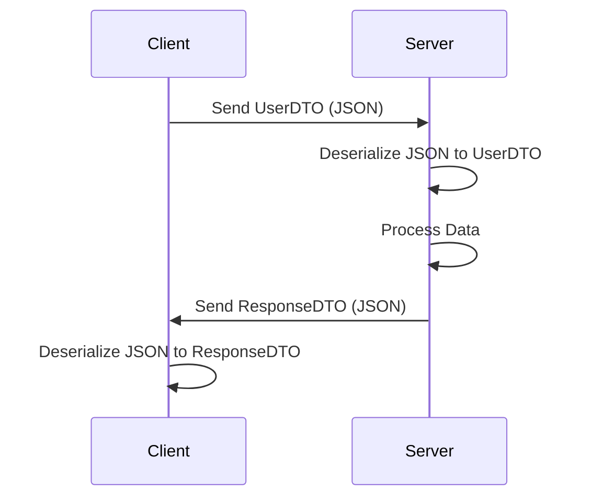

## 12.5 Data Transfer Object (DTO) Pattern

In the realm of software development, especially when dealing with complex systems, the efficient transfer of data between different layers or over a network is crucial. The Data Transfer Object (DTO) pattern is a design pattern that serves this very purpose. It encapsulates data and provides a structure for transferring it efficiently, minimizing the number of method calls and reducing the overhead associated with data transfer.

### Understanding the DTO Pattern

The DTO pattern is primarily used to transfer data between software application subsystems. It is an object that carries data between processes to reduce the number of method calls. Unlike business objects, DTOs do not contain any business logic. They are simple data containers that are used to transport data between layers or services.

#### Key Characteristics of DTOs

- **Encapsulation**: DTOs encapsulate data, making it easier to transfer between different parts of an application.
- **Immutability**: DTOs are often immutable, meaning their state cannot be changed after they are created. This ensures data consistency and thread safety.
- **No Business Logic**: DTOs do not contain any business logic. They are purely for data transfer.
- **Serialization**: DTOs can be easily serialized and deserialized, making them ideal for network communication.

### Implementing DTOs in Dart

Implementing DTOs in Dart involves creating classes that represent the data structure you wish to transfer. These classes should be immutable and should provide methods for serialization and deserialization.

#### Immutable Classes

In Dart, you can create immutable classes by using `final` fields and providing a constructor that initializes these fields. Here's an example of an immutable DTO class in Dart:

```dart
class UserDTO {
  final String id;
  final String name;
  final String email;

  UserDTO({required this.id, required this.name, required this.email});

  // Factory method to create a UserDTO from a JSON map
  factory UserDTO.fromJson(Map<String, dynamic> json) {
    return UserDTO(
      id: json['id'],
      name: json['name'],
      email: json['email'],
    );
  }

  // Method to convert a UserDTO to a JSON map
  Map<String, dynamic> toJson() {
    return {
      'id': id,
      'name': name,
      'email': email,
    };
  }
}
```

In this example, the `UserDTO` class is immutable because all its fields are `final`, and they are initialized in the constructor. The class also provides methods for converting to and from JSON, which is a common requirement for DTOs used in network communication.

#### Mapping Functions

Mapping functions are used to convert DTOs to domain models and vice versa. This separation of concerns allows you to keep your business logic separate from your data transfer logic.

```dart
class User {
  final String id;
  final String name;
  final String email;

  User({required this.id, required this.name, required this.email});
}

User mapDtoToDomain(UserDTO dto) {
  return User(
    id: dto.id,
    name: dto.name,
    email: dto.email,
  );
}

UserDTO mapDomainToDto(User user) {
  return UserDTO(
    id: user.id,
    name: user.name,
    email: user.email,
  );
}
```

These mapping functions help in converting between the DTO and the domain model, ensuring that each layer of your application remains decoupled and focused on its specific responsibilities.

### Use Cases for DTOs

DTOs are particularly useful in scenarios where you need to transfer data between different layers of an application or over a network. Some common use cases include:

- **API Communication**: DTOs are often used to send and receive data from RESTful APIs. They provide a structured way to serialize and deserialize data, ensuring that the data format is consistent across different parts of the application.
- **Separating Concerns**: By using DTOs, you can separate the data transfer logic from the business logic. This makes your codebase more modular and easier to maintain.
- **Reducing Network Overhead**: DTOs can help reduce the number of network calls by bundling multiple pieces of data into a single object. This can improve the performance of your application, especially in scenarios where network latency is a concern.

### Visualizing the DTO Pattern

To better understand how the DTO pattern works, let's visualize the process of transferring data between a client and a server using DTOs.



In this sequence diagram, the client sends a `UserDTO` to the server in JSON format. The server deserializes the JSON into a `UserDTO`, processes the data, and sends a `ResponseDTO` back to the client. The client then deserializes the JSON response into a `ResponseDTO`.

### Design Considerations

When implementing the DTO pattern, there are several design considerations to keep in mind:

- **Immutability**: Ensure that your DTOs are immutable to maintain data consistency and thread safety.
- **Serialization**: Provide methods for serializing and deserializing DTOs to and from common data formats like JSON.
- **Mapping**: Use mapping functions to convert between DTOs and domain models, keeping your business logic separate from your data transfer logic.
- **Validation**: Consider adding validation logic to ensure that the data being transferred is valid and complete.

### Differences and Similarities with Other Patterns

The DTO pattern is often confused with other patterns like the Value Object pattern and the Data Access Object (DAO) pattern. Here are some key differences and similarities:

- **DTO vs. Value Object**: While both DTOs and Value Objects are used to encapsulate data, Value Objects are often used to represent domain-specific concepts and may contain business logic. DTOs, on the other hand, are purely for data transfer and do not contain any business logic.
- **DTO vs. DAO**: The DAO pattern is used to abstract and encapsulate all access to the data source. DAOs contain methods for CRUD operations, while DTOs are used to transfer data between layers or over a network.

### Try It Yourself

To get a better understanding of the DTO pattern, try modifying the code examples provided above. Here are some suggestions:

- Add additional fields to the `UserDTO` class and update the serialization and deserialization methods accordingly.
- Create a new DTO class for a different entity, such as a `ProductDTO`, and implement mapping functions for it.
- Experiment with different data formats, such as XML, for serialization and deserialization.

### Conclusion

The Data Transfer Object (DTO) pattern is a powerful tool for encapsulating and transferring data between different layers of an application or over a network. By implementing immutable classes, mapping functions, and using DTOs in appropriate use cases, you can improve the modularity, maintainability, and performance of your Dart and Flutter applications. Remember, this is just the beginning. As you progress, you'll build more complex and interactive applications. Keep experimenting, stay curious, and enjoy the journey!

## Quiz Time!



### What is the primary purpose of a Data Transfer Object (DTO)?

- [x] To transfer data between software application subsystems
- [ ] To contain business logic
- [ ] To manage database connections
- [ ] To handle user authentication

> **Explanation:** DTOs are used to transfer data between different parts of an application, without containing any business logic.

### Which of the following is a key characteristic of a DTO?

- [x] Immutability
- [ ] Contains business logic
- [ ] Manages database connections
- [ ] Handles user authentication

> **Explanation:** DTOs are often immutable, meaning their state cannot be changed after they are created.

### What is the role of mapping functions in the DTO pattern?

- [x] To convert DTOs to domain models and vice versa
- [ ] To serialize DTOs to JSON
- [ ] To manage database connections
- [ ] To handle user authentication

> **Explanation:** Mapping functions are used to convert between DTOs and domain models, ensuring separation of concerns.

### In which scenario is the DTO pattern particularly useful?

- [x] API communication
- [ ] Database management
- [ ] User interface design
- [ ] Authentication

> **Explanation:** DTOs are often used to send and receive data from APIs, providing a structured way to serialize and deserialize data.

### What is a common data format used for serializing DTOs?

- [x] JSON
- [ ] XML
- [ ] CSV
- [ ] YAML

> **Explanation:** JSON is a common data format used for serializing and deserializing DTOs.

### How does the DTO pattern help reduce network overhead?

- [x] By bundling multiple pieces of data into a single object
- [ ] By compressing data
- [ ] By encrypting data
- [ ] By caching data

> **Explanation:** DTOs can help reduce the number of network calls by bundling multiple pieces of data into a single object.

### What is a key difference between DTOs and Value Objects?

- [x] DTOs do not contain business logic
- [ ] DTOs are mutable
- [ ] Value Objects are used for data transfer
- [ ] DTOs manage database connections

> **Explanation:** DTOs are purely for data transfer and do not contain any business logic, unlike Value Objects.

### What is a common use case for DTOs?

- [x] Separating concerns
- [ ] Managing database connections
- [ ] Handling user authentication
- [ ] Designing user interfaces

> **Explanation:** DTOs help separate data transfer logic from business logic, improving modularity and maintainability.

### What should you consider when implementing the DTO pattern?

- [x] Immutability and serialization
- [ ] Database management
- [ ] User interface design
- [ ] Authentication

> **Explanation:** When implementing the DTO pattern, consider making DTOs immutable and providing methods for serialization and deserialization.

### True or False: DTOs can contain business logic.

- [ ] True
- [x] False

> **Explanation:** DTOs are purely for data transfer and do not contain any business logic.


