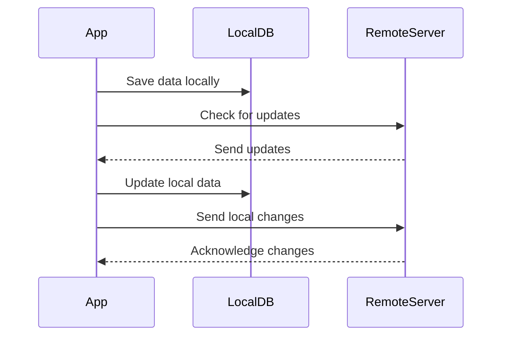

## 12.6 Offline Data Storage and Persistence

In the realm of mobile application development, ensuring that your app functions seamlessly offline is crucial. Offline data storage and persistence allow applications to remain functional without a constant internet connection, enhancing user experience and reliability. In this section, we'll delve into various strategies for implementing offline data storage in Flutter, focusing on local databases like SQLite, NoSQL storage solutions such as Hive and shared_preferences, and the critical aspect of data synchronization between local and remote sources.

### Introduction to Offline Data Storage

Offline data storage refers to the ability of an application to store data locally on a device, enabling it to function without an internet connection. This capability is essential for applications that need to provide uninterrupted service, such as note-taking apps, offline maps, and more. The primary goals of offline data storage are to ensure data availability, improve performance by reducing network calls, and provide a seamless user experience.

### Local Databases: Using `sqflite` for SQLite Databases in Flutter

SQLite is a popular choice for local databases in mobile applications due to its lightweight nature and full-featured SQL capabilities. In Flutter, the `sqflite` package is the go-to solution for integrating SQLite databases.

#### Setting Up `sqflite`

To begin using `sqflite`, you need to add it to your `pubspec.yaml` file:

```yaml
dependencies:
  flutter:
    sdk: flutter
  sqflite: ^2.0.0+3
  path: ^1.8.0
```

The `path` package is also required to help locate the database file on the device.

#### Creating a Database

Let's create a simple database to store user information. First, import the necessary packages:

```dart
import 'package:sqflite/sqflite.dart';
import 'package:path/path.dart';
```

Next, define a function to initialize the database:

```dart
Future<Database> initializeDatabase() async {
  String path = join(await getDatabasesPath(), 'user_database.db');
  return openDatabase(
    path,
    onCreate: (db, version) {
      return db.execute(
        'CREATE TABLE users(id INTEGER PRIMARY KEY, name TEXT, age INTEGER)',
      );
    },
    version: 1,
  );
}
```

#### Performing CRUD Operations

With the database initialized, you can perform CRUD (Create, Read, Update, Delete) operations. Here's how you can insert a new user:

```dart
Future<void> insertUser(Database db, User user) async {
  await db.insert(
    'users',
    user.toMap(),
    conflictAlgorithm: ConflictAlgorithm.replace,
  );
}
```

To read users from the database:

```dart
Future<List<User>> users(Database db) async {
  final List<Map<String, dynamic>> maps = await db.query('users');
  return List.generate(maps.length, (i) {
    return User(
      id: maps[i]['id'],
      name: maps[i]['name'],
      age: maps[i]['age'],
    );
  });
}
```

#### Updating and Deleting Data

Updating a user is straightforward:

```dart
Future<void> updateUser(Database db, User user) async {
  await db.update(
    'users',
    user.toMap(),
    where: 'id = ?',
    whereArgs: [user.id],
  );
}
```

Deleting a user:

```dart
Future<void> deleteUser(Database db, int id) async {
  await db.delete(
    'users',
    where: 'id = ?',
    whereArgs: [id],
  );
}
```

### NoSQL Storage: Utilizing `hive` and `shared_preferences`

While SQLite is excellent for structured data, NoSQL storage solutions like Hive and shared_preferences are better suited for unstructured or simple key-value data.

#### Hive: A Lightweight and Fast NoSQL Database

Hive is a lightweight and fast key-value database written in pure Dart. It's particularly well-suited for Flutter applications due to its simplicity and performance.

##### Setting Up Hive

Add Hive to your `pubspec.yaml`:

```yaml
dependencies:
  hive: ^2.0.0
  hive_flutter: ^1.0.0
```

Initialize Hive in your main function:

```dart
void main() async {
  await Hive.initFlutter();
  runApp(MyApp());
}
```

##### Using Hive for Data Storage

To store data in Hive, you need to define a Hive box. Here's how you can store user preferences:

```dart
var box = await Hive.openBox('preferences');
box.put('theme', 'dark');
```

To retrieve data:

```dart
var theme = box.get('theme', defaultValue: 'light');
```

#### Shared Preferences: Simple Key-Value Storage

For simple key-value storage, shared_preferences is a straightforward solution. It's ideal for storing small amounts of data, such as user settings.

##### Using Shared Preferences

Add shared_preferences to your `pubspec.yaml`:

```yaml
dependencies:
  shared_preferences: ^2.0.0
```

To store and retrieve data:

```dart
final prefs = await SharedPreferences.getInstance();
await prefs.setString('username', 'JohnDoe');

String username = prefs.getString('username') ?? 'Guest';
```

### Data Synchronization: Managing Data Between Local Storage and Remote Sources

Data synchronization is the process of ensuring that data stored locally is consistent with data stored remotely. This is crucial for applications that need to function offline and then update the server once a connection is re-established.

#### Strategies for Data Synchronization

1. **Conflict Resolution**: Implement strategies to handle conflicts when the same data is modified both locally and remotely. Common strategies include last-write-wins, manual conflict resolution, and merging changes.

2. **Data Versioning**: Use version numbers or timestamps to track changes and ensure that the latest data is synchronized.

3. **Background Synchronization**: Use background services to synchronize data periodically or when the device is connected to Wi-Fi.

#### Implementing Data Synchronization

Consider using packages like `flutter_background_service` to run background tasks for synchronization. Here's a basic example:

```dart
import 'package:flutter_background_service/flutter_background_service.dart';

void main() {
  FlutterBackgroundService.initialize(onStart);
}

void onStart() {
  WidgetsFlutterBinding.ensureInitialized();
  Timer.periodic(Duration(seconds: 30), (timer) {
    // Perform data synchronization
  });
}
```

### Visualizing Data Synchronization

Below is a sequence diagram illustrating the data synchronization process between a local database and a remote server:



### Try It Yourself

Experiment with the code examples provided by modifying them to suit your needs. For instance, try adding new fields to the SQLite database or storing additional preferences using Hive. Test how data synchronization works by simulating network disconnections and reconnections.

### Key Takeaways

- **SQLite** is ideal for structured data and complex queries, while **Hive** and **shared_preferences** are better for unstructured or simple key-value data.
- **Data synchronization** is crucial for maintaining consistency between local and remote data.
- Use background services to handle synchronization tasks efficiently.

### Further Reading

- [SQLite Documentation](https://www.sqlite.org/docs.html)
- [Hive Documentation](https://docs.hivedb.dev/)
- [Shared Preferences Documentation](https://pub.dev/packages/shared_preferences)

### Embrace the Journey

Remember, mastering offline data storage and persistence is a journey. As you progress, you'll build more robust and reliable applications. Keep experimenting, stay curious, and enjoy the process!

## Quiz Time!



### What is the primary purpose of offline data storage in mobile applications?

- [x] To ensure data availability without an internet connection
- [ ] To reduce the size of the application
- [ ] To increase the complexity of the app
- [ ] To make the app dependent on the internet

> **Explanation:** Offline data storage ensures that data is available even when there is no internet connection, enhancing user experience and reliability.

### Which package is commonly used for SQLite databases in Flutter?

- [x] sqflite
- [ ] hive
- [ ] shared_preferences
- [ ] firebase

> **Explanation:** The `sqflite` package is the standard choice for integrating SQLite databases in Flutter applications.

### What is Hive best suited for in Flutter applications?

- [x] Unstructured or simple key-value data
- [ ] Complex SQL queries
- [ ] Real-time data synchronization
- [ ] Large file storage

> **Explanation:** Hive is a lightweight NoSQL database ideal for storing unstructured or simple key-value data.

### How can you perform data synchronization in a Flutter app?

- [x] Use background services to synchronize data periodically
- [ ] Only sync data when the app is closed
- [ ] Avoid syncing data to save battery
- [ ] Use manual synchronization only

> **Explanation:** Background services can be used to perform data synchronization periodically or when the device is connected to Wi-Fi.

### What is a common strategy for conflict resolution in data synchronization?

- [x] Last-write-wins
- [ ] First-write-wins
- [ ] Ignore conflicts
- [ ] Always overwrite local data

> **Explanation:** Last-write-wins is a common strategy where the most recent change is considered the correct one.

### Which package is ideal for storing small amounts of data like user settings?

- [x] shared_preferences
- [ ] sqflite
- [ ] hive
- [ ] firebase

> **Explanation:** Shared_preferences is perfect for storing small amounts of data such as user settings.

### What is the role of data versioning in synchronization?

- [x] To track changes and ensure the latest data is synchronized
- [ ] To increase the complexity of the database
- [ ] To reduce the size of the data
- [ ] To make data retrieval slower

> **Explanation:** Data versioning helps track changes and ensures that the latest data is synchronized between local and remote sources.

### Which of the following is NOT a benefit of offline data storage?

- [ ] Improved performance by reducing network calls
- [ ] Enhanced user experience
- [x] Increased application size
- [ ] Data availability without an internet connection

> **Explanation:** Offline data storage does not inherently increase application size; it focuses on improving performance and user experience.

### What is the purpose of using the `path` package with `sqflite`?

- [x] To help locate the database file on the device
- [ ] To perform complex SQL queries
- [ ] To store large files
- [ ] To manage user authentication

> **Explanation:** The `path` package is used to help locate the database file on the device, ensuring proper database management.

### True or False: Hive is written in pure Dart.

- [x] True
- [ ] False

> **Explanation:** Hive is indeed written in pure Dart, making it a great choice for Flutter applications.


