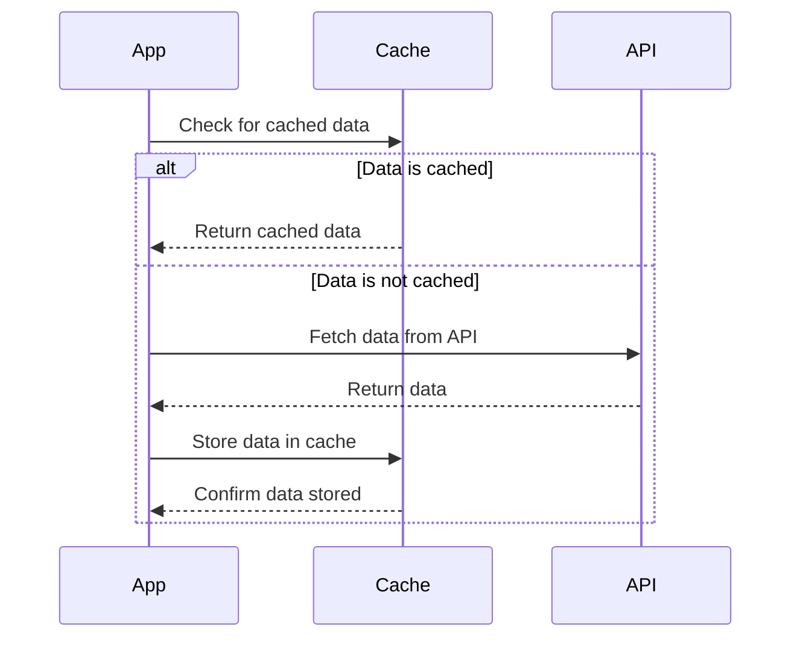

## 12.7 Fetching and Caching Data

In the world of mobile and web applications, performance is paramount. Users expect fast, responsive applications that provide seamless experiences. One of the key strategies to achieve this is through efficient data fetching and caching. In this section, we will explore how to optimize data retrieval and storage in Dart and Flutter applications, focusing on reducing network calls and improving performance through caching.

### Introduction to Data Fetching and Caching

Data fetching involves retrieving data from a remote server or database, typically over a network. This process can be time-consuming and resource-intensive, especially when dealing with large datasets or slow network connections. Caching, on the other hand, is the process of storing data locally to reduce the need for repeated network requests. By caching data, we can significantly improve the performance and responsiveness of our applications.

#### Why Cache Data?

Caching data offers several benefits:

- **Reduced Latency**: By storing data locally, we can access it faster than fetching it from a remote server.
- **Decreased Network Load**: Caching reduces the number of network requests, which can lower bandwidth usage and server load.
- **Improved User Experience**: Faster data retrieval leads to a smoother and more responsive user interface.
- **Offline Access**: Cached data can be accessed even when the device is offline, providing a better user experience in areas with poor connectivity.

### Implementing Caches in Dart and Flutter

There are two primary types of caches we can implement in Dart and Flutter applications: in-memory caches and persistent caches.

#### In-memory Caches

In-memory caches store data in the device's RAM, making them extremely fast to access. However, they are volatile and lose their data when the application is closed or the device is restarted.

##### Implementing an In-memory Cache

Let's implement a simple in-memory cache in Dart using a `Map` to store key-value pairs.

```dart
class InMemoryCache<K, V> {
  final Map<K, V> _cache = {};

  // Add data to the cache
  void add(K key, V value) {
    _cache[key] = value;
  }

  // Retrieve data from the cache
  V? get(K key) {
    return _cache[key];
  }

  // Remove data from the cache
  void remove(K key) {
    _cache.remove(key);
  }

  // Clear the cache
  void clear() {
    _cache.clear();
  }
}
```

In this example, we define a generic `InMemoryCache` class that allows us to store and retrieve data using keys. This simple cache can be used to store any type of data temporarily.

#### Persistent Caches

Persistent caches store data on the device's storage, allowing it to persist across application restarts and device reboots. Common strategies for persistent caching include using local databases, shared preferences, or file storage.

##### Implementing a Persistent Cache with Shared Preferences

`SharedPreferences` is a key-value store that persists data across sessions. It's suitable for storing small amounts of data.

```dart
import 'package:shared_preferences/shared_preferences.dart';

class PersistentCache {
  Future<void> add(String key, String value) async {
    final prefs = await SharedPreferences.getInstance();
    await prefs.setString(key, value);
  }

  Future<String?> get(String key) async {
    final prefs = await SharedPreferences.getInstance();
    return prefs.getString(key);
  }

  Future<void> remove(String key) async {
    final prefs = await SharedPreferences.getInstance();
    await prefs.remove(key);
  }

  Future<void> clear() async {
    final prefs = await SharedPreferences.getInstance();
    await prefs.clear();
  }
}
```

In this example, we use the `SharedPreferences` package to implement a persistent cache. This cache can store string data that persists across application restarts.

### Use Cases for Caching

Caching is particularly useful in scenarios where data retrieval is frequent and data changes infrequently. Let's explore some common use cases.

#### Caching API Responses

API responses are prime candidates for caching, especially when dealing with data that doesn't change often, such as configuration settings or static content.

##### Example: Caching API Responses

Consider an application that fetches weather data from an API. We can cache the API response to reduce network calls and improve performance.

```dart
import 'dart:convert';
import 'package:http/http.dart' as http;

class WeatherService {
  final InMemoryCache<String, String> _cache = InMemoryCache();

  Future<String> fetchWeather(String city) async {
    final cacheKey = 'weather_$city';
    final cachedData = _cache.get(cacheKey);

    if (cachedData != null) {
      return cachedData;
    }

    final response = await http.get(Uri.parse('https://api.weather.com/v3/wx/conditions/current?city=$city'));
    if (response.statusCode == 200) {
      final data = response.body;
      _cache.add(cacheKey, data);
      return data;
    } else {
      throw Exception('Failed to load weather data');
    }
  }
}
```

In this example, we use an in-memory cache to store weather data. If the data is already cached, we return it immediately. Otherwise, we fetch it from the API and cache the response.

#### Caching Images

Images are often large and can significantly impact performance if fetched repeatedly. Caching images locally can reduce load times and improve user experience.

##### Example: Caching Images with CachedNetworkImage

The `cached_network_image` package provides a convenient way to cache images in Flutter applications.

```dart
import 'package:flutter/material.dart';
import 'package:cached_network_image/cached_network_image.dart';

class ImageWidget extends StatelessWidget {
  final String imageUrl;

  ImageWidget({required this.imageUrl});

  @override
  Widget build(BuildContext context) {
    return CachedNetworkImage(
      imageUrl: imageUrl,
      placeholder: (context, url) => CircularProgressIndicator(),
      errorWidget: (context, url, error) => Icon(Icons.error),
    );
  }
}
```

In this example, we use the `CachedNetworkImage` widget to load and cache images. The package handles caching automatically, reducing the need for repeated network requests.

### Design Considerations for Caching

When implementing caching, it's important to consider the following:

- **Cache Expiration**: Determine how long cached data should be considered valid. Implement mechanisms to refresh or invalidate stale data.
- **Cache Size**: Limit the size of the cache to prevent excessive memory or storage usage.
- **Data Consistency**: Ensure that cached data remains consistent with the source data. Implement strategies to handle data updates.
- **Security**: Consider encrypting sensitive data stored in caches to protect user privacy.

### Differences and Similarities with Other Patterns

Caching is often used in conjunction with other design patterns, such as:

- **Repository Pattern**: The repository pattern can be used to abstract data access and caching logic, providing a clean separation of concerns.
- **Observer Pattern**: The observer pattern can be used to notify the application of changes in cached data, allowing for real-time updates.

### Visualizing the Caching Process

Let's visualize the caching process using a sequence diagram.



This diagram illustrates the process of checking for cached data, fetching data from an API if not cached, and storing the response in the cache.

### Try It Yourself

Experiment with the caching examples provided. Try modifying the cache implementation to include expiration logic or test different caching strategies for various data types.

### Knowledge Check

- What are the benefits of caching data in a Flutter application?
- How does in-memory caching differ from persistent caching?
- What are some common use cases for caching in mobile applications?
- How can you implement cache expiration in a Dart application?

### Embrace the Journey

Remember, caching is a powerful tool for optimizing performance, but it requires careful consideration and implementation. As you continue to develop your skills, explore different caching strategies and find the best fit for your applications. Keep experimenting, stay curious, and enjoy the journey!

## Quiz Time!



### What is the primary benefit of caching data in a Flutter application?

- [x] Reduced latency and improved performance
- [ ] Increased network calls
- [ ] Higher memory usage
- [ ] Slower data retrieval

> **Explanation:** Caching data reduces latency by storing data locally, leading to faster data retrieval and improved performance.

### Which type of cache is volatile and loses data when the application is closed?

- [x] In-memory cache
- [ ] Persistent cache
- [ ] Disk cache
- [ ] Cloud cache

> **Explanation:** In-memory caches store data in RAM, making them volatile and losing data when the application is closed.

### What package can be used in Flutter to cache images?

- [x] cached_network_image
- [ ] image_picker
- [ ] path_provider
- [ ] shared_preferences

> **Explanation:** The `cached_network_image` package provides a convenient way to cache images in Flutter applications.

### How can you ensure cached data remains consistent with the source data?

- [x] Implement cache expiration and refresh mechanisms
- [ ] Store data indefinitely
- [ ] Ignore data updates
- [ ] Use only in-memory caching

> **Explanation:** Implementing cache expiration and refresh mechanisms helps ensure cached data remains consistent with the source data.

### What is a common use case for caching in mobile applications?

- [x] Caching API responses
- [ ] Storing user passwords
- [ ] Logging errors
- [ ] Displaying advertisements

> **Explanation:** Caching API responses is a common use case to reduce network calls and improve performance.

### Which pattern can be used to abstract data access and caching logic?

- [x] Repository Pattern
- [ ] Observer Pattern
- [ ] Singleton Pattern
- [ ] Factory Pattern

> **Explanation:** The Repository Pattern abstracts data access and caching logic, providing a clean separation of concerns.

### What should you consider when implementing caching?

- [x] Cache expiration, size, data consistency, and security
- [ ] Only cache expiration
- [ ] Only cache size
- [ ] Only data consistency

> **Explanation:** When implementing caching, consider cache expiration, size, data consistency, and security to ensure effective caching.

### What is the role of the `SharedPreferences` package in caching?

- [x] It provides a key-value store for persistent caching
- [ ] It caches images
- [ ] It manages network requests
- [ ] It handles user authentication

> **Explanation:** The `SharedPreferences` package provides a key-value store for persistent caching in Flutter applications.

### What is the main difference between in-memory and persistent caches?

- [x] In-memory caches are volatile, while persistent caches store data on the device's storage
- [ ] In-memory caches are slower than persistent caches
- [ ] Persistent caches are volatile
- [ ] In-memory caches store data on the device's storage

> **Explanation:** In-memory caches are volatile and lose data when the application is closed, while persistent caches store data on the device's storage.

### True or False: Caching can improve offline access in mobile applications.

- [x] True
- [ ] False

> **Explanation:** True. Caching allows data to be accessed even when the device is offline, improving the user experience in areas with poor connectivity.


