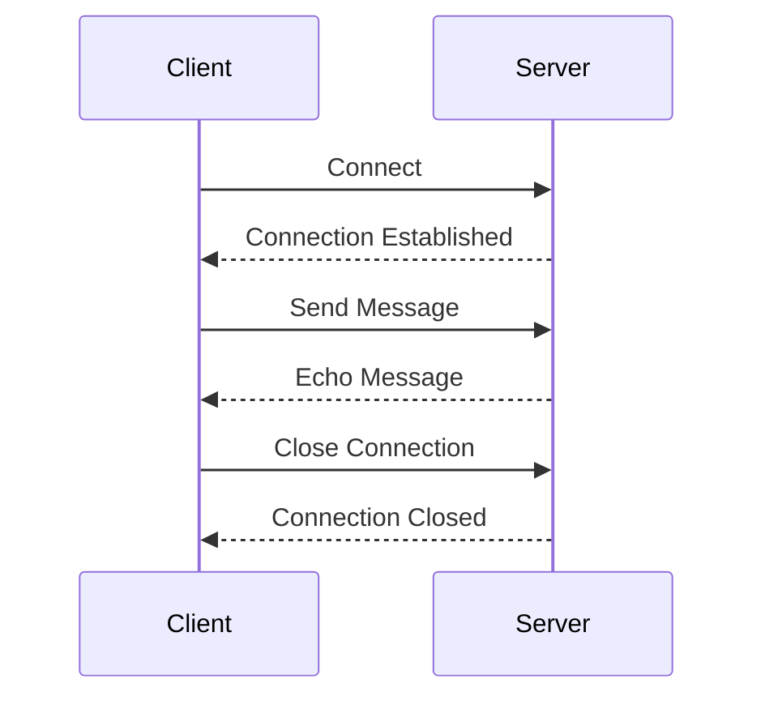

## 12.8 Handling Real-time Data with WebSockets

In today's fast-paced digital world, real-time communication is a cornerstone of modern applications. Whether it's a chat application, live sports updates, or collaborative tools, the need for instantaneous data exchange is ever-present. WebSockets provide a robust solution for real-time, bi-directional communication between clients and servers. In this section, we will explore how to handle real-time data with WebSockets in Dart, focusing on integration with Flutter applications.

### Understanding WebSockets

WebSockets are a protocol for full-duplex communication channels over a single TCP connection. Unlike HTTP, which is a request-response protocol, WebSockets allow for persistent connections where both the client and server can send messages independently. This makes WebSockets ideal for applications requiring real-time updates.

#### Key Features of WebSockets

- **Full-Duplex Communication**: Both client and server can send and receive messages simultaneously.
- **Low Latency**: Persistent connections reduce the overhead of establishing new connections, resulting in faster data exchange.
- **Efficient Data Transfer**: WebSockets use a lightweight frame format, minimizing the amount of data transferred.

### Setting Up WebSockets in Dart

To work with WebSockets in Dart, we use the `web_socket_channel` package, which provides a simple API for establishing WebSocket connections.

#### Installing the `web_socket_channel` Package

First, add the `web_socket_channel` package to your `pubspec.yaml` file:

```yaml
dependencies:
  flutter:
    sdk: flutter
  web_socket_channel: ^2.1.0
```

Run `flutter pub get` to install the package.

#### Establishing a WebSocket Connection

Let's start by establishing a WebSocket connection to a server. We'll use a public WebSocket echo server for demonstration purposes.

```dart
import 'package:web_socket_channel/web_socket_channel.dart';

void main() {
  final channel = WebSocketChannel.connect(
    Uri.parse('wss://echo.websocket.org'),
  );

  channel.sink.add('Hello WebSocket!');

  channel.stream.listen(
    (message) {
      print('Received: $message');
    },
    onDone: () {
      print('Connection closed');
    },
    onError: (error) {
      print('Error: $error');
    },
  );
}
```

In this example, we connect to a WebSocket server and send a message. The server echoes the message back, which we print to the console.

### Integrating WebSockets with Streams

Dart's `Stream` API provides a powerful way to handle asynchronous data. By integrating WebSockets with Streams, we can efficiently manage real-time data in our applications.

#### Emitting WebSocket Data Through Streams

The `web_socket_channel` package already provides a `Stream` interface for incoming WebSocket messages. This makes it easy to integrate with other Dart and Flutter components that work with Streams.

```dart
import 'package:web_socket_channel/web_socket_channel.dart';

class WebSocketService {
  final WebSocketChannel _channel;

  WebSocketService(String url)
      : _channel = WebSocketChannel.connect(Uri.parse(url));

  Stream<String> get messages => _channel.stream.map((message) => message.toString());

  void sendMessage(String message) {
    _channel.sink.add(message);
  }

  void close() {
    _channel.sink.close();
  }
}
```

In this `WebSocketService` class, we expose a `Stream<String>` for incoming messages, allowing other parts of the application to listen for updates.

### Use Cases for WebSockets

WebSockets are particularly useful in scenarios where real-time data exchange is critical. Let's explore some common use cases.

#### Chat Applications

In chat applications, messages need to be delivered instantly to all participants. WebSockets provide the perfect mechanism for this.

```dart
import 'package:flutter/material.dart';
import 'package:web_socket_channel/web_socket_channel.dart';

class ChatScreen extends StatefulWidget {
  @override
  _ChatScreenState createState() => _ChatScreenState();
}

class _ChatScreenState extends State<ChatScreen> {
  final WebSocketChannel _channel = WebSocketChannel.connect(
    Uri.parse('wss://chat.example.com'),
  );
  final TextEditingController _controller = TextEditingController();

  @override
  Widget build(BuildContext context) {
    return Scaffold(
      appBar: AppBar(title: Text('Chat')),
      body: Column(
        children: [
          Expanded(
            child: StreamBuilder(
              stream: _channel.stream,
              builder: (context, snapshot) {
                if (snapshot.hasData) {
                  return ListView(
                    children: [Text(snapshot.data)],
                  );
                }
                return Center(child: CircularProgressIndicator());
              },
            ),
          ),
          Padding(
            padding: const EdgeInsets.all(8.0),
            child: Row(
              children: [
                Expanded(
                  child: TextField(
                    controller: _controller,
                    decoration: InputDecoration(labelText: 'Send a message'),
                  ),
                ),
                IconButton(
                  icon: Icon(Icons.send),
                  onPressed: () {
                    if (_controller.text.isNotEmpty) {
                      _channel.sink.add(_controller.text);
                      _controller.clear();
                    }
                  },
                ),
              ],
            ),
          ),
        ],
      ),
    );
  }

  @override
  void dispose() {
    _channel.sink.close();
    super.dispose();
  }
}
```

In this Flutter chat application, we use a `StreamBuilder` to listen for incoming messages and update the UI accordingly.

#### Live Updates

WebSockets are also ideal for applications that require live updates, such as stock tickers or sports scores.

```dart
import 'package:flutter/material.dart';
import 'package:web_socket_channel/web_socket_channel.dart';

class StockTicker extends StatefulWidget {
  @override
  _StockTickerState createState() => _StockTickerState();
}

class _StockTickerState extends State<StockTicker> {
  final WebSocketChannel _channel = WebSocketChannel.connect(
    Uri.parse('wss://stocks.example.com'),
  );

  @override
  Widget build(BuildContext context) {
    return Scaffold(
      appBar: AppBar(title: Text('Stock Ticker')),
      body: StreamBuilder(
        stream: _channel.stream,
        builder: (context, snapshot) {
          if (snapshot.hasData) {
            return ListView(
              children: [Text('Stock Price: ${snapshot.data}')],
            );
          }
          return Center(child: CircularProgressIndicator());
        },
      ),
    );
  }

  @override
  void dispose() {
    _channel.sink.close();
    super.dispose();
  }
}
```

This example demonstrates a simple stock ticker application that updates in real-time using WebSockets.

### Design Considerations

When implementing WebSockets in your application, consider the following:

- **Connection Management**: Ensure that connections are properly opened and closed to avoid resource leaks.
- **Error Handling**: Implement robust error handling to manage connection failures and retries.
- **Security**: Use secure WebSocket connections (`wss://`) to protect data in transit.

### Visualizing WebSocket Communication

To better understand the flow of data in a WebSocket connection, let's visualize the process using a sequence diagram.



This diagram illustrates the typical sequence of events in a WebSocket communication session.

### Differences and Similarities with Other Protocols

WebSockets are often compared to other communication protocols like HTTP and MQTT. Here's a brief comparison:

- **HTTP**: Primarily request-response, not suitable for real-time updates.
- **MQTT**: Lightweight publish-subscribe protocol, often used in IoT applications.
- **WebSockets**: Full-duplex, ideal for real-time, bi-directional communication.

### Try It Yourself

To deepen your understanding, try modifying the code examples to:

- Connect to a different WebSocket server.
- Implement a simple chat room where multiple users can join and send messages.
- Add error handling to manage connection drops and retries.

### Knowledge Check

- What are the key features of WebSockets?
- How do WebSockets differ from HTTP?
- What are some common use cases for WebSockets?

### Embrace the Journey

Remember, mastering WebSockets is just one step in your journey to becoming a proficient Dart and Flutter developer. Keep experimenting, stay curious, and enjoy the process of building real-time applications.

## Quiz Time!



### What is a key feature of WebSockets?

- [x] Full-duplex communication
- [ ] Request-response model
- [ ] High latency
- [ ] Unidirectional data flow

> **Explanation:** WebSockets support full-duplex communication, allowing both client and server to send and receive messages simultaneously.

### Which package is used for WebSocket communication in Dart?

- [x] web_socket_channel
- [ ] http
- [ ] dio
- [ ] socket_io

> **Explanation:** The `web_socket_channel` package provides a simple API for WebSocket communication in Dart.

### What is the primary advantage of using WebSockets over HTTP for real-time applications?

- [x] Persistent connections with low latency
- [ ] Better security
- [ ] Easier to implement
- [ ] Higher data transfer rates

> **Explanation:** WebSockets maintain persistent connections, reducing latency and making them ideal for real-time applications.

### How can WebSocket data be integrated with Flutter applications?

- [x] Using Streams
- [ ] Using Futures
- [ ] Using Isolates
- [ ] Using HTTP requests

> **Explanation:** WebSocket data can be integrated with Flutter applications using Streams, allowing for efficient real-time data handling.

### What is a common use case for WebSockets?

- [x] Chat applications
- [ ] Static web pages
- [ ] Batch processing
- [ ] File uploads

> **Explanation:** WebSockets are commonly used in chat applications for real-time message delivery.

### What should you consider when implementing WebSockets in your application?

- [x] Connection management
- [ ] Using HTTP instead
- [ ] Avoiding error handling
- [ ] Disabling security

> **Explanation:** Proper connection management is crucial to avoid resource leaks and ensure reliable communication.

### What protocol is often compared to WebSockets for IoT applications?

- [x] MQTT
- [ ] HTTP
- [ ] FTP
- [ ] SMTP

> **Explanation:** MQTT is a lightweight publish-subscribe protocol often used in IoT applications, similar to WebSockets for real-time communication.

### Which of the following is NOT a feature of WebSockets?

- [ ] Full-duplex communication
- [ ] Low latency
- [x] Request-response model
- [ ] Efficient data transfer

> **Explanation:** WebSockets do not use a request-response model; they support full-duplex communication.

### What is the purpose of the `StreamBuilder` widget in Flutter?

- [x] To listen for and build UI based on Stream data
- [ ] To send HTTP requests
- [ ] To manage state
- [ ] To handle user input

> **Explanation:** The `StreamBuilder` widget listens for Stream data and rebuilds the UI accordingly.

### True or False: WebSockets can only be used for text-based data.

- [ ] True
- [x] False

> **Explanation:** WebSockets can handle both text and binary data, making them versatile for various applications.


