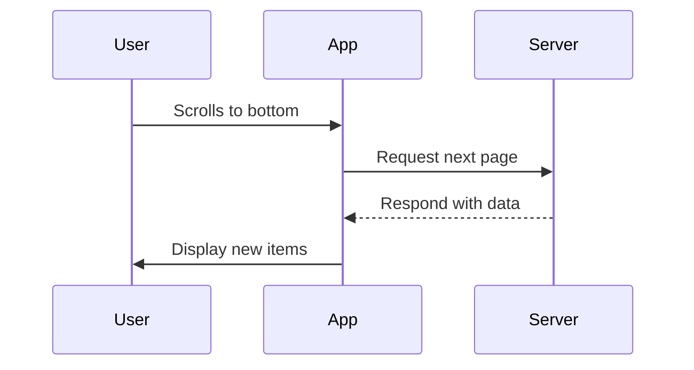

## 12.9 Dealing with Paginated Data

In the realm of modern application development, efficiently managing large datasets is crucial. Whether you're building a social media feed, an e-commerce catalog, or any application that deals with extensive data, implementing pagination is essential. This section delves into the intricacies of handling paginated data in Dart and Flutter, exploring techniques such as lazy loading, infinite scroll, and more.

### Introduction to Pagination

Pagination is a technique used to divide a large dataset into smaller, manageable chunks, or "pages." This approach enhances performance by reducing the amount of data loaded at once, thereby improving load times and user experience. In Flutter, pagination is often implemented in list views, grids, or any scrollable widget.

#### Why Use Pagination?

- **Performance Optimization**: Loading data in smaller chunks reduces memory usage and speeds up rendering.
- **Improved User Experience**: Users can access data faster without waiting for the entire dataset to load.
- **Scalability**: Applications can handle larger datasets without degrading performance.

### Techniques for Implementing Pagination

#### Lazy Loading

Lazy loading is a technique where data is fetched as needed, rather than all at once. This is particularly useful in scenarios where the entire dataset is not required immediately.

**Key Concepts**:

- **On-Demand Data Fetching**: Load data only when it is needed, such as when a user scrolls to the bottom of a list.
- **Resource Efficiency**: Reduces initial load time and memory consumption.

**Implementation Example**:

```dart
import 'package:flutter/material.dart';

class LazyLoadingList extends StatefulWidget {
  @override
  _LazyLoadingListState createState() => _LazyLoadingListState();
}

class _LazyLoadingListState extends State<LazyLoadingList> {
  final List<int> _data = [];
  final int _threshold = 5;
  bool _isLoading = false;

  @override
  void initState() {
    super.initState();
    _loadMoreData();
  }

  Future<void> _loadMoreData() async {
    if (_isLoading) return;
    setState(() => _isLoading = true);

    // Simulate network request
    await Future.delayed(Duration(seconds: 2));
    setState(() {
      _data.addAll(List.generate(10, (index) => _data.length + index));
      _isLoading = false;
    });
  }

  @override
  Widget build(BuildContext context) {
    return ListView.builder(
      itemCount: _data.length + (_isLoading ? 1 : 0),
      itemBuilder: (context, index) {
        if (index == _data.length) {
          _loadMoreData();
          return Center(child: CircularProgressIndicator());
        }
        return ListTile(title: Text('Item ${_data[index]}'));
      },
    );
  }
}
```

**Try It Yourself**: Modify the `_threshold` value to see how it affects the loading behavior. Experiment with different data sizes and loading delays.

#### Infinite Scroll

Infinite scroll is a user interface pattern where new data is loaded as the user scrolls down a list. This technique is commonly used in social media feeds and news apps.

**Key Concepts**:

- **Seamless User Experience**: Users can continuously scroll without explicit pagination controls.
- **Dynamic Data Loading**: Automatically fetches new data when the user reaches the end of the current dataset.

**Implementation Example**:

```dart
import 'package:flutter/material.dart';

class InfiniteScrollList extends StatefulWidget {
  @override
  _InfiniteScrollListState createState() => _InfiniteScrollListState();
}

class _InfiniteScrollListState extends State<InfiniteScrollList> {
  final List<int> _items = List.generate(20, (index) => index);
  final ScrollController _scrollController = ScrollController();
  bool _isLoading = false;

  @override
  void initState() {
    super.initState();
    _scrollController.addListener(() {
      if (_scrollController.position.pixels ==
          _scrollController.position.maxScrollExtent) {
        _loadMoreItems();
      }
    });
  }

  Future<void> _loadMoreItems() async {
    if (_isLoading) return;
    setState(() => _isLoading = true);

    // Simulate network request
    await Future.delayed(Duration(seconds: 2));
    setState(() {
      _items.addAll(List.generate(20, (index) => _items.length + index));
      _isLoading = false;
    });
  }

  @override
  Widget build(BuildContext context) {
    return ListView.builder(
      controller: _scrollController,
      itemCount: _items.length + (_isLoading ? 1 : 0),
      itemBuilder: (context, index) {
        if (index == _items.length) {
          return Center(child: CircularProgressIndicator());
        }
        return ListTile(title: Text('Item ${_items[index]}'));
      },
    );
  }

  @override
  void dispose() {
    _scrollController.dispose();
    super.dispose();
  }
}
```

**Try It Yourself**: Adjust the number of items loaded each time to see how it impacts the scrolling experience. Consider adding a "Load More" button for manual control.

### Use Cases for Pagination

Pagination is widely used in various applications, including:

- **Social Media Feeds**: Displaying posts, comments, or messages.
- **E-commerce Catalogs**: Browsing products or categories.
- **News Applications**: Loading articles or headlines.
- **Data-Intensive Dashboards**: Managing large datasets with filters and sorting.

### Handling Pagination in Flutter

Flutter provides several widgets and packages that facilitate pagination. Understanding these tools will help you implement efficient and user-friendly pagination in your applications.

#### Using ListView and GridView

`ListView` and `GridView` are two primary widgets for displaying scrollable lists in Flutter. They can be customized to support pagination through lazy loading or infinite scroll.

**ListView Example**:

```dart
ListView.builder(
  itemCount: _items.length,
  itemBuilder: (context, index) {
    return ListTile(title: Text('Item ${_items[index]}'));
  },
)
```

**GridView Example**:

```dart
GridView.builder(
  gridDelegate: SliverGridDelegateWithFixedCrossAxisCount(crossAxisCount: 2),
  itemCount: _items.length,
  itemBuilder: (context, index) {
    return Card(child: Center(child: Text('Item ${_items[index]}')));
  },
)
```

#### Leveraging Flutter Packages

Several packages can simplify pagination implementation in Flutter:

- **[flutter_pagination_helper](https://pub.dev/packages/flutter_pagination_helper)**: Provides utilities for paginated data fetching.
- **[infinite_scroll_pagination](https://pub.dev/packages/infinite_scroll_pagination)**: Offers widgets for infinite scrolling with pagination support.
- **[flutter_bloc](https://pub.dev/packages/flutter_bloc)**: Facilitates state management, including paginated data handling.

### Design Considerations

When implementing pagination, consider the following:

- **Network Efficiency**: Minimize data transfer by fetching only necessary data.
- **User Feedback**: Provide visual indicators (e.g., loading spinners) during data fetching.
- **Error Handling**: Gracefully handle network errors and provide retry options.
- **State Management**: Use appropriate state management techniques to manage paginated data.

### Visualizing Pagination Workflow

To better understand the pagination process, let's visualize the workflow using a sequence diagram.



**Diagram Explanation**: This sequence diagram illustrates the interaction between the user, app, and server during pagination. As the user scrolls, the app requests additional data from the server, which is then displayed to the user.

### Common Challenges and Solutions

#### Handling Large Datasets

- **Challenge**: Managing memory and performance with large datasets.
- **Solution**: Use lazy loading and efficient data structures to minimize memory usage.

#### Network Latency

- **Challenge**: Delays in data fetching due to network latency.
- **Solution**: Implement caching strategies and provide user feedback during loading.

#### State Management

- **Challenge**: Maintaining consistent state across paginated data.
- **Solution**: Use state management solutions like `Provider`, `BLoC`, or `Riverpod`.

### Best Practices for Pagination

- **Optimize Data Fetching**: Use efficient queries and APIs to minimize data transfer.
- **Provide User Feedback**: Use loading indicators and error messages to enhance user experience.
- **Test for Edge Cases**: Ensure your pagination logic handles edge cases, such as empty datasets or network errors.
- **Monitor Performance**: Use profiling tools to identify and address performance bottlenecks.

### Conclusion

Mastering pagination in Dart and Flutter is essential for building efficient and scalable applications. By implementing techniques like lazy loading and infinite scroll, you can enhance performance and user experience. Remember to consider design considerations, handle common challenges, and follow best practices to ensure a seamless pagination experience.

### Continuing Education and Resources

- [Flutter Documentation on ListView](https://flutter.dev/docs/cookbook/lists/long-lists)
- [Dart Language Tour](https://dart.dev/guides/language/language-tour)
- [Effective Dart: Performance](https://dart.dev/guides/language/effective-dart/performance)

### Quiz Time!



### What is the primary benefit of using pagination in applications?

- [x] Performance optimization
- [ ] Increased data redundancy
- [ ] Enhanced data security
- [ ] Simplified code structure

> **Explanation:** Pagination optimizes performance by loading data in smaller chunks, reducing memory usage and improving load times.

### Which technique involves fetching data only when needed?

- [x] Lazy Loading
- [ ] Eager Loading
- [ ] Preloading
- [ ] Caching

> **Explanation:** Lazy loading fetches data on-demand, reducing initial load time and memory consumption.

### What is a common use case for infinite scroll?

- [x] Social media feeds
- [ ] Static web pages
- [ ] Configuration files
- [ ] Database backups

> **Explanation:** Infinite scroll is commonly used in social media feeds to provide a seamless user experience as users scroll through content.

### Which Flutter widget is commonly used for displaying scrollable lists?

- [x] ListView
- [ ] Container
- [ ] Column
- [ ] Stack

> **Explanation:** `ListView` is a Flutter widget designed for displaying scrollable lists of items.

### What should you provide to users during data fetching?

- [x] Visual indicators
- [ ] Error messages only
- [ ] Static content
- [ ] No feedback

> **Explanation:** Visual indicators, such as loading spinners, provide feedback to users during data fetching.

### Which package offers widgets for infinite scrolling with pagination support?

- [x] infinite_scroll_pagination
- [ ] flutter_pagination_helper
- [ ] flutter_bloc
- [ ] provider

> **Explanation:** The `infinite_scroll_pagination` package provides widgets specifically designed for infinite scrolling with pagination support.

### What is a key consideration when implementing pagination?

- [x] Network efficiency
- [ ] Data duplication
- [ ] Code obfuscation
- [ ] User authentication

> **Explanation:** Network efficiency is crucial to minimize data transfer and improve performance during pagination.

### Which state management solution can be used for paginated data handling?

- [x] Provider
- [ ] HTTP
- [ ] JSON
- [ ] SQLite

> **Explanation:** `Provider` is a state management solution that can be used to manage paginated data in Flutter applications.

### What is the purpose of a sequence diagram in the context of pagination?

- [x] Visualize the interaction between user, app, and server
- [ ] Display the app's color scheme
- [ ] Illustrate the app's logo design
- [ ] Show the app's marketing strategy

> **Explanation:** A sequence diagram visualizes the interaction between the user, app, and server during pagination, helping to understand the workflow.

### True or False: Pagination is only useful for web applications.

- [ ] True
- [x] False

> **Explanation:** Pagination is useful for any application dealing with large datasets, including mobile and desktop applications.



Remember, mastering pagination is just one step in building efficient and scalable applications. Keep exploring, experimenting, and enhancing your skills to create exceptional user experiences.
