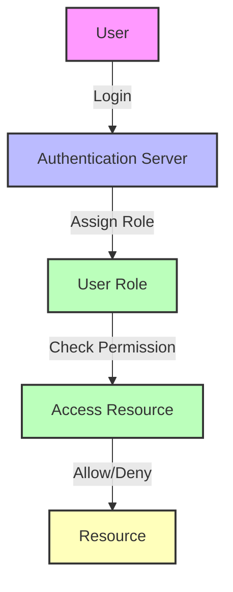

## 13.1 Authentication and Authorization in Flutter Apps

In the realm of mobile app development, ensuring the security of user data is paramount. Authentication and authorization are two critical components that safeguard user information and control access to resources. In this section, we will delve into the intricacies of implementing secure logins using OAuth 2.0 with Firebase, managing tokens effectively, and controlling user permissions through role-based access control (RBAC) in Flutter apps.

### Understanding Authentication and Authorization

Before we dive into the implementation details, let's clarify the concepts of authentication and authorization:

- **Authentication**: This is the process of verifying the identity of a user or system. In the context of a Flutter app, authentication typically involves verifying a user's credentials, such as a username and password, or using third-party services like Google or Facebook.

- **Authorization**: Once a user is authenticated, authorization determines what resources or actions the user is permitted to access. This is often managed through roles and permissions.

### Secure Logins: Implementing OAuth 2.0 with Firebase

OAuth 2.0 is a widely adopted authorization framework that enables third-party applications to access user data without exposing user credentials. Firebase Authentication provides a seamless way to integrate OAuth 2.0 in Flutter apps, supporting various providers like Google, Facebook, and Twitter.

#### Setting Up Firebase Authentication

1. **Create a Firebase Project**: Start by creating a new project in the [Firebase Console](https://console.firebase.google.com/).

2. **Add Firebase to Your Flutter App**: Follow the instructions to add Firebase to your Flutter project. This involves adding the Firebase SDK and configuring your app with the necessary credentials.

3. **Enable Authentication Providers**: In the Firebase Console, navigate to the Authentication section and enable the desired sign-in providers, such as Google or Facebook.

4. **Install Required Packages**: Add the `firebase_auth` and `google_sign_in` packages to your `pubspec.yaml` file:

   ```yaml
   dependencies:
     flutter:
       sdk: flutter
     firebase_auth: ^3.1.6
     google_sign_in: ^5.2.1
   ```

5. **Initialize Firebase**: Initialize Firebase in your Flutter app by adding the following code to your `main.dart` file:

   ```dart
   import 'package:firebase_core/firebase_core.dart';
   import 'package:flutter/material.dart';

   void main() async {
     WidgetsFlutterBinding.ensureInitialized();
     await Firebase.initializeApp();
     runApp(MyApp());
   }
   ```

#### Implementing Google Sign-In

Let's implement Google Sign-In as an example of OAuth 2.0 authentication in Flutter:

```dart
import 'package:firebase_auth/firebase_auth.dart';
import 'package:google_sign_in/google_sign_in.dart';

class AuthService {
  final FirebaseAuth _auth = FirebaseAuth.instance;
  final GoogleSignIn _googleSignIn = GoogleSignIn();

  Future<User?> signInWithGoogle() async {
    try {
      final GoogleSignInAccount? googleUser = await _googleSignIn.signIn();
      if (googleUser == null) {
        return null; // User canceled the sign-in
      }

      final GoogleSignInAuthentication googleAuth = await googleUser.authentication;
      final AuthCredential credential = GoogleAuthProvider.credential(
        accessToken: googleAuth.accessToken,
        idToken: googleAuth.idToken,
      );

      final UserCredential userCredential = await _auth.signInWithCredential(credential);
      return userCredential.user;
    } catch (e) {
      print('Error signing in with Google: $e');
      return null;
    }
  }
}
```

In this code snippet, we use the `google_sign_in` package to handle the Google sign-in process. The `signInWithGoogle` method initiates the sign-in flow, retrieves the authentication tokens, and signs in the user with Firebase Authentication.

#### Try It Yourself

Experiment with the Google Sign-In implementation by modifying the code to handle different authentication providers, such as Facebook or Twitter. You can also customize the user interface to provide a seamless login experience.

### Token Management: Safely Storing and Refreshing Tokens

Tokens are essential for maintaining user sessions and authorizing API requests. Proper token management is crucial to ensure security and prevent unauthorized access.

#### Understanding Tokens

- **Access Tokens**: These are short-lived tokens used to access protected resources. They are typically included in the headers of API requests.

- **Refresh Tokens**: These are long-lived tokens used to obtain new access tokens when the current ones expire. Refresh tokens should be stored securely and never exposed to the client-side.

#### Storing Tokens Securely

To store tokens securely in a Flutter app, consider using the `flutter_secure_storage` package, which provides a secure way to store key-value pairs:

```yaml
dependencies:
  flutter_secure_storage: ^5.0.2
```

```dart
import 'package:flutter_secure_storage/flutter_secure_storage.dart';

class TokenStorage {
  final _storage = FlutterSecureStorage();

  Future<void> saveAccessToken(String token) async {
    await _storage.write(key: 'access_token', value: token);
  }

  Future<String?> getAccessToken() async {
    return await _storage.read(key: 'access_token');
  }

  Future<void> deleteAccessToken() async {
    await _storage.delete(key: 'access_token');
  }
}
```

In this example, we use `flutter_secure_storage` to securely store, retrieve, and delete access tokens.

#### Refreshing Tokens

Implement a mechanism to refresh access tokens when they expire. This typically involves sending a request to the authentication server with the refresh token to obtain a new access token.

```dart
Future<void> refreshAccessToken() async {
  // Assume we have a method to get the refresh token
  final refreshToken = await getRefreshToken();

  // Send a request to the authentication server to refresh the access token
  final response = await http.post(
    Uri.parse('https://your-auth-server.com/refresh'),
    body: {'refresh_token': refreshToken},
  );

  if (response.statusCode == 200) {
    final newAccessToken = jsonDecode(response.body)['access_token'];
    await saveAccessToken(newAccessToken);
  } else {
    // Handle error
    print('Failed to refresh access token');
  }
}
```

### Role-Based Access: Controlling User Permissions

Role-based access control (RBAC) is a method of restricting access to resources based on user roles. In a Flutter app, you can implement RBAC to control what actions users can perform and what data they can access.

#### Defining Roles and Permissions

Start by defining the roles and permissions required for your app. For example, you might have roles like `admin`, `editor`, and `viewer`, each with different levels of access.

#### Implementing RBAC in Flutter

1. **Define User Roles**: Create a model to represent user roles and permissions.

   ```dart
   class UserRole {
     final String role;
     final List<String> permissions;

     UserRole(this.role, this.permissions);
   }
   ```

2. **Assign Roles to Users**: Assign roles to users when they sign up or log in. This information can be stored in a database or retrieved from an authentication provider.

3. **Check Permissions**: Implement a method to check if a user has the necessary permissions to perform an action.

   ```dart
   bool hasPermission(UserRole userRole, String permission) {
     return userRole.permissions.contains(permission);
   }
   ```

4. **Control Access in the UI**: Use the `hasPermission` method to control access to different parts of the app.

   ```dart
   Widget build(BuildContext context) {
     final userRole = UserRole('editor', ['edit', 'view']);

     return Scaffold(
       appBar: AppBar(title: Text('Role-Based Access Control')),
       body: Column(
         children: [
           if (hasPermission(userRole, 'edit'))
             ElevatedButton(
               onPressed: () {
                 // Perform edit action
               },
               child: Text('Edit'),
             ),
           if (hasPermission(userRole, 'view'))
             ElevatedButton(
               onPressed: () {
                 // Perform view action
               },
               child: Text('View'),
             ),
         ],
       ),
     );
   }
   ```

#### Visualizing Role-Based Access Control



In this diagram, we visualize the flow of role-based access control. The user logs in, the authentication server assigns a role, and the app checks permissions before granting access to resources.

### References and Further Reading

- [Firebase Authentication Documentation](https://firebase.google.com/docs/auth)
- [OAuth 2.0 Simplified](https://oauth.net/2/)
- [Flutter Secure Storage](https://pub.dev/packages/flutter_secure_storage)

### Knowledge Check

- What is the difference between authentication and authorization?
- How does OAuth 2.0 enhance security in Flutter apps?
- Why is token management important, and how can you store tokens securely?
- How can role-based access control be implemented in a Flutter app?

### Embrace the Journey

Remember, mastering authentication and authorization in Flutter apps is a journey. As you progress, you'll build more secure and robust applications. Keep experimenting, stay curious, and enjoy the journey!

## Quiz Time!



### What is the primary purpose of authentication in a Flutter app?

- [x] Verifying the identity of a user
- [ ] Controlling user permissions
- [ ] Storing user data
- [ ] Managing app resources

> **Explanation:** Authentication is the process of verifying the identity of a user or system.

### Which package is commonly used for Google Sign-In in Flutter?

- [x] google_sign_in
- [ ] firebase_core
- [ ] flutter_secure_storage
- [ ] http

> **Explanation:** The `google_sign_in` package is used to handle Google sign-in processes in Flutter apps.

### What is the role of access tokens in a Flutter app?

- [x] They are used to access protected resources.
- [ ] They are used to refresh user sessions.
- [ ] They store user credentials.
- [ ] They manage user roles.

> **Explanation:** Access tokens are short-lived tokens used to access protected resources.

### How can you securely store tokens in a Flutter app?

- [x] Using the flutter_secure_storage package
- [ ] Storing them in SharedPreferences
- [ ] Saving them in a text file
- [ ] Using a global variable

> **Explanation:** The `flutter_secure_storage` package provides a secure way to store key-value pairs, including tokens.

### What is the purpose of a refresh token?

- [x] To obtain new access tokens when the current ones expire
- [ ] To verify user credentials
- [ ] To store user roles
- [ ] To manage app resources

> **Explanation:** Refresh tokens are long-lived tokens used to obtain new access tokens when the current ones expire.

### Which of the following is a benefit of role-based access control?

- [x] It restricts access to resources based on user roles.
- [ ] It verifies user identities.
- [ ] It stores user data securely.
- [ ] It manages app resources.

> **Explanation:** Role-based access control restricts access to resources based on user roles and permissions.

### How can you check if a user has a specific permission in a Flutter app?

- [x] By using a method like hasPermission
- [ ] By storing permissions in a global variable
- [ ] By using a switch statement
- [ ] By checking user credentials

> **Explanation:** Implementing a method like `hasPermission` allows you to check if a user has a specific permission.

### What is the first step in setting up Firebase Authentication for a Flutter app?

- [x] Creating a Firebase project in the Firebase Console
- [ ] Installing the firebase_core package
- [ ] Enabling authentication providers
- [ ] Adding Firebase to your Flutter project

> **Explanation:** The first step is to create a Firebase project in the Firebase Console.

### True or False: OAuth 2.0 is only used for authentication.

- [ ] True
- [x] False

> **Explanation:** OAuth 2.0 is an authorization framework, not just for authentication. It allows third-party applications to access user data without exposing user credentials.

### Which of the following is NOT a common authentication provider supported by Firebase?

- [ ] Google
- [ ] Facebook
- [ ] Twitter
- [x] LinkedIn

> **Explanation:** While Google, Facebook, and Twitter are common authentication providers supported by Firebase, LinkedIn is not typically included by default.


