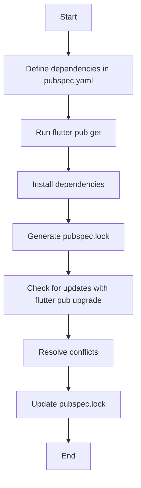

## 13.10 Third-Party Libraries and Dependency Security

In the realm of modern software development, third-party libraries are indispensable. They accelerate development, provide robust solutions to common problems, and allow developers to focus on building unique features. However, with great power comes great responsibility. The use of third-party libraries introduces potential security risks, licensing issues, and maintenance challenges. In this section, we will delve into the intricacies of managing third-party dependencies in Dart and Flutter, ensuring that your applications remain secure, compliant, and maintainable.

### Evaluating Dependencies

Before integrating a third-party library into your Dart or Flutter project, it's crucial to evaluate its reliability, security, and suitability for your needs. Here are key steps to consider:

#### 1. Assessing Library Popularity and Community Support

- **Popularity Metrics**: Check the number of downloads, stars, and forks on platforms like [pub.dev](https://pub.dev/), GitHub, or GitLab. A popular library is more likely to be well-maintained and secure.
- **Community Engagement**: Evaluate the level of community engagement. Active issue discussions, frequent commits, and responsive maintainers are positive indicators.

#### 2. Reviewing Documentation and Code Quality

- **Comprehensive Documentation**: Ensure the library has thorough documentation, including setup guides, API references, and examples.
- **Code Quality**: Examine the source code for readability, adherence to coding standards, and the presence of tests. Libraries with high code quality are generally more reliable.

#### 3. Security Audits and Vulnerability Checks

- **Security Audits**: Look for any existing security audits or reports. Libraries with known vulnerabilities should be avoided.
- **Vulnerability Databases**: Use tools like [Snyk](https://snyk.io/) or [Dependabot](https://dependabot.com/) to check for known vulnerabilities in dependencies.

#### 4. License Compatibility

- **License Type**: Verify the library's license to ensure it is compatible with your project's licensing requirements. Common licenses include MIT, Apache 2.0, and GPL.
- **Compliance**: Ensure compliance with the license terms, such as attribution requirements or restrictions on commercial use.

### Managing Licenses

Licenses dictate how you can use, modify, and distribute third-party libraries. Mismanagement of licenses can lead to legal issues. Here's how to manage licenses effectively:

#### 1. Understanding License Types

- **Permissive Licenses**: These include MIT, Apache 2.0, and BSD, which allow for wide usage with minimal restrictions.
- **Copyleft Licenses**: Such as GPL, require derivative works to be open-sourced under the same license.
- **Proprietary Licenses**: Restrict usage and modification, often requiring a purchase or subscription.

#### 2. Ensuring License Compliance

- **Attribution**: Provide proper attribution as required by the license.
- **Distribution**: Follow guidelines for distributing modified versions or including the library in your project.
- **License Tracking**: Use tools to track licenses of all dependencies, ensuring compliance across your project.

### Dependency Management in Dart and Flutter

Dart and Flutter projects use the `pub` package manager for dependency management. Understanding how to effectively manage dependencies is crucial for maintaining a secure and stable codebase.

#### 1. Using `pubspec.yaml`

- **Defining Dependencies**: List all dependencies in the `pubspec.yaml` file, specifying version constraints.
- **Version Constraints**: Use semantic versioning to specify compatible versions, e.g., `^1.0.0` for any version compatible with 1.x.x.

```yaml
dependencies:
  flutter:
    sdk: flutter
  http: ^0.13.0
  provider: ^5.0.0
```

#### 2. Locking Dependencies

- **`pubspec.lock`**: This file locks the versions of dependencies used in your project, ensuring consistency across different environments.
- **Updating Dependencies**: Use `flutter pub upgrade` to update dependencies, and `flutter pub get` to install them.

#### 3. Handling Transitive Dependencies

- **Transitive Dependencies**: These are dependencies of your dependencies. They can introduce vulnerabilities if not managed properly.
- **Conflict Resolution**: Use `flutter pub deps` to inspect dependency trees and resolve version conflicts.

### Security Best Practices for Third-Party Libraries

Security should be a top priority when integrating third-party libraries. Here are best practices to follow:

#### 1. Regularly Update Dependencies

- **Frequent Updates**: Regularly update dependencies to benefit from security patches and new features.
- **Changelog Review**: Review changelogs for breaking changes or important updates before upgrading.

#### 2. Monitor for Vulnerabilities

- **Automated Tools**: Use automated tools to monitor dependencies for vulnerabilities and receive alerts.
- **Security Bulletins**: Subscribe to security bulletins or mailing lists for libraries you use.

#### 3. Limit Dependency Usage

- **Minimal Dependencies**: Use only necessary dependencies to reduce the attack surface.
- **Custom Implementations**: Consider implementing custom solutions for simple tasks instead of relying on third-party libraries.

#### 4. Code Review and Auditing

- **Manual Code Review**: Conduct manual reviews of critical libraries to identify potential security issues.
- **Third-Party Audits**: Engage third-party security experts to audit critical dependencies.

### Try It Yourself

To solidify your understanding of dependency management and security, try the following exercises:

1. **Evaluate a Library**: Choose a library from [pub.dev](https://pub.dev/) and evaluate its popularity, documentation, and security.
2. **License Compliance**: Identify the licenses of your project's dependencies and ensure compliance with their terms.
3. **Dependency Update**: Update a project's dependencies and resolve any conflicts that arise.

### Visualizing Dependency Management

To better understand how dependencies are managed in a Dart and Flutter project, let's visualize the process using a flowchart.



**Figure 1**: This flowchart illustrates the process of managing dependencies in a Dart and Flutter project, from defining them in `pubspec.yaml` to updating and resolving conflicts.

### References and Further Reading

- [Pub.dev: Dart Package Repository](https://pub.dev/)
- [Snyk: Open Source Security Management](https://snyk.io/)
- [Dependabot: Automated Dependency Updates](https://dependabot.com/)
- [Semantic Versioning](https://semver.org/)

### Knowledge Check

1. **What are the key factors to consider when evaluating a third-party library?**
2. **How can you ensure license compliance for your project's dependencies?**
3. **What tools can be used to monitor dependencies for vulnerabilities?**

### Embrace the Journey

Remember, managing third-party libraries and dependencies is an ongoing process. As you continue to develop with Dart and Flutter, stay vigilant, keep learning, and prioritize security. By doing so, you'll build robust, secure applications that stand the test of time.

## Quiz Time!



### What is the primary purpose of evaluating third-party libraries before integration?

- [x] To ensure reliability, security, and suitability
- [ ] To reduce the number of dependencies
- [ ] To increase the application's complexity
- [ ] To avoid using any open-source software

> **Explanation:** Evaluating third-party libraries helps ensure they are reliable, secure, and suitable for your project's needs.

### Which tool can be used to check for known vulnerabilities in dependencies?

- [x] Snyk
- [ ] GitHub
- [ ] Flutter
- [ ] Dart

> **Explanation:** Snyk is a tool that helps identify known vulnerabilities in dependencies.

### What is a permissive license?

- [x] A license that allows wide usage with minimal restrictions
- [ ] A license that requires derivative works to be open-sourced
- [ ] A license that restricts usage and modification
- [ ] A license that is not compatible with commercial use

> **Explanation:** Permissive licenses, such as MIT and Apache 2.0, allow wide usage with minimal restrictions.

### How can you ensure consistency across different environments in a Dart project?

- [x] By using the `pubspec.lock` file
- [ ] By manually installing dependencies
- [ ] By avoiding third-party libraries
- [ ] By using only built-in Dart libraries

> **Explanation:** The `pubspec.lock` file locks the versions of dependencies, ensuring consistency across environments.

### What is the purpose of the `flutter pub upgrade` command?

- [x] To update dependencies to their latest compatible versions
- [ ] To install new dependencies
- [ ] To remove unused dependencies
- [ ] To downgrade dependencies

> **Explanation:** The `flutter pub upgrade` command updates dependencies to their latest compatible versions.

### What should you do before upgrading a dependency?

- [x] Review the changelog for breaking changes
- [ ] Delete the `pubspec.lock` file
- [ ] Remove the dependency from `pubspec.yaml`
- [ ] Ignore the dependency

> **Explanation:** Reviewing the changelog helps identify any breaking changes or important updates before upgrading.

### How can you limit the attack surface of your application?

- [x] By using only necessary dependencies
- [ ] By adding more dependencies
- [ ] By using outdated libraries
- [ ] By ignoring security updates

> **Explanation:** Using only necessary dependencies reduces the attack surface of your application.

### What is a transitive dependency?

- [x] A dependency of your dependencies
- [ ] A direct dependency listed in `pubspec.yaml`
- [ ] A deprecated library
- [ ] A built-in Dart library

> **Explanation:** Transitive dependencies are dependencies of your dependencies.

### Why is it important to monitor dependencies for vulnerabilities?

- [x] To receive alerts about potential security risks
- [ ] To increase the number of dependencies
- [ ] To make the application slower
- [ ] To avoid using any third-party libraries

> **Explanation:** Monitoring dependencies for vulnerabilities helps identify potential security risks.

### True or False: Regularly updating dependencies is a security best practice.

- [x] True
- [ ] False

> **Explanation:** Regularly updating dependencies ensures you benefit from security patches and new features.


