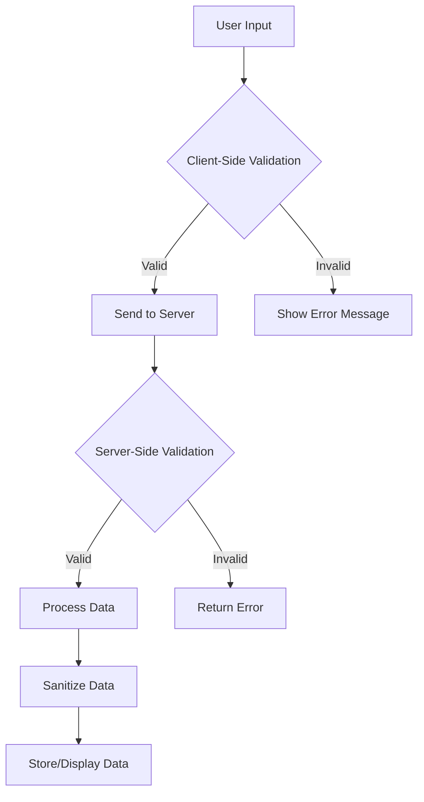

## 13.2 Input Validation and Sanitization

In the realm of software development, particularly when dealing with user inputs, ensuring the security and integrity of your application is paramount. Input validation and sanitization are critical components in safeguarding applications against various types of attacks, such as injection attacks. In this section, we will explore the concepts of input validation and sanitization, delve into their importance, and demonstrate how to implement them effectively in Dart and Flutter applications.

### Understanding Input Validation and Sanitization

**Input Validation** is the process of ensuring that user input is clean, correct, and useful. It involves checking the data against a set of rules or criteria to determine if it is acceptable. This step is crucial in preventing malicious data from entering your system.

**Sanitization**, on the other hand, involves cleaning up the input data to remove or neutralize any potentially harmful content. This is particularly important when dealing with data that will be displayed to users or stored in a database.

#### Why Input Validation and Sanitization Matter

1. **Security**: Protects against injection attacks, such as SQL injection, cross-site scripting (XSS), and command injection.
2. **Data Integrity**: Ensures that the data entering your system is consistent and reliable.
3. **User Experience**: Provides feedback to users when their input is incorrect, enhancing the overall experience.
4. **System Stability**: Prevents unexpected behavior or crashes caused by invalid data.

### Types of Input Validation

1. **Client-Side Validation**: Performed in the user's browser before the data is sent to the server. It provides immediate feedback to users but should not be relied upon solely for security.
2. **Server-Side Validation**: Conducted on the server after the data is received. It is essential for security as it cannot be bypassed by the user.
3. **Contextual Validation**: Ensures that the data is valid within the context it is used. For example, an email address should be validated differently than a phone number.

### Implementing Input Validation in Flutter

Flutter provides a robust framework for implementing input validation through its form widgets and validation techniques. Let's explore how to implement validators in Flutter.

#### Using Flutter's Form and TextFormField Widgets

Flutter's `Form` and `TextFormField` widgets are powerful tools for handling input validation. Here's a basic example:

```dart
import 'package:flutter/material.dart';

void main() => runApp(MyApp());

class MyApp extends StatelessWidget {
  @override
  Widget build(BuildContext context) {
    return MaterialApp(
      home: Scaffold(
        appBar: AppBar(title: Text('Input Validation Example')),
        body: MyCustomForm(),
      ),
    );
  }
}

class MyCustomForm extends StatefulWidget {
  @override
  _MyCustomFormState createState() => _MyCustomFormState();
}

class _MyCustomFormState extends State<MyCustomForm> {
  final _formKey = GlobalKey<FormState>();

  @override
  Widget build(BuildContext context) {
    return Form(
      key: _formKey,
      child: Column(
        crossAxisAlignment: CrossAxisAlignment.start,
        children: <Widget>[
          TextFormField(
            decoration: const InputDecoration(
              hintText: 'Enter your email',
            ),
            validator: (value) {
              if (value == null || value.isEmpty) {
                return 'Please enter some text';
              }
              if (!RegExp(r'^[^@]+@[^@]+\.[^@]+').hasMatch(value)) {
                return 'Please enter a valid email address';
              }
              return null;
            },
          ),
          Padding(
            padding: const EdgeInsets.symmetric(vertical: 16.0),
            child: ElevatedButton(
              onPressed: () {
                if (_formKey.currentState!.validate()) {
                  ScaffoldMessenger.of(context).showSnackBar(
                    SnackBar(content: Text('Processing Data')),
                  );
                }
              },
              child: Text('Submit'),
            ),
          ),
        ],
      ),
    );
  }
}
```

**Explanation**:
- **Form Widget**: Acts as a container for form fields and manages their state.
- **TextFormField Widget**: Provides a text input field with validation capabilities.
- **Validator Function**: Checks if the input is empty or matches a regular expression for email validation.

#### Custom Validators

You can create custom validators to handle specific validation logic. Here's an example of a custom validator for a password field:

```dart
String? validatePassword(String? value) {
  if (value == null || value.isEmpty) {
    return 'Please enter a password';
  }
  if (value.length < 8) {
    return 'Password must be at least 8 characters long';
  }
  if (!RegExp(r'[A-Z]').hasMatch(value)) {
    return 'Password must contain at least one uppercase letter';
  }
  if (!RegExp(r'[0-9]').hasMatch(value)) {
    return 'Password must contain at least one number';
  }
  return null;
}
```

### Sanitizing Input in Dart

Sanitization is crucial when dealing with data that will be displayed or stored. It involves removing or escaping potentially harmful characters. Here are some common sanitization techniques:

1. **Escaping HTML**: Convert special characters to HTML entities to prevent XSS attacks.
2. **Removing Special Characters**: Strip out characters that are not needed or could be harmful.
3. **Encoding Data**: Encode data before storing or displaying it.

#### Example: HTML Escaping

```dart
String sanitizeHtml(String input) {
  return input.replaceAllMapped(RegExp(r'[&<>"\']'), (match) {
    switch (match[0]) {
      case '&':
        return '&amp;';
      case '<':
        return '&lt;';
      case '>':
        return '&gt;';
      case '"':
        return '&quot;';
      case '\'':
        return '&#39;';
      default:
        return match[0]!;
    }
  });
}
```

### Protecting Against Injection Attacks

Injection attacks occur when an attacker is able to insert malicious code into a program. Proper input validation and sanitization can mitigate these risks.

#### SQL Injection

SQL injection is a common attack where an attacker can execute arbitrary SQL code on a database. To prevent this, always use parameterized queries or prepared statements.

#### Example: Preventing SQL Injection

```dart
import 'package:mysql1/mysql1.dart';

Future<void> insertUser(String username, String password) async {
  final conn = await MySqlConnection.connect(ConnectionSettings(
    host: 'localhost',
    port: 3306,
    user: 'user',
    db: 'database',
    password: 'password',
  ));

  var result = await conn.query(
    'INSERT INTO users (username, password) VALUES (?, ?)',
    [username, password],
  );

  await conn.close();
}
```

**Explanation**:
- **Parameterized Queries**: Use placeholders (`?`) in the SQL statement and pass the actual values separately to prevent injection.

### Visualizing Input Validation and Sanitization Workflow

To better understand the process of input validation and sanitization, let's visualize the workflow using a flowchart.



**Description**: This flowchart illustrates the process of validating and sanitizing user input. It begins with client-side validation, followed by server-side validation, and ends with data sanitization before storage or display.

### Best Practices for Input Validation and Sanitization

1. **Validate on Both Client and Server**: While client-side validation improves user experience, server-side validation is essential for security.
2. **Use Built-in Validators**: Leverage Flutter's built-in validators whenever possible for common validation tasks.
3. **Create Custom Validators**: For specific validation needs, create custom validators that encapsulate your logic.
4. **Sanitize All User Input**: Always sanitize user input before storing or displaying it to prevent injection attacks.
5. **Keep Validation Logic Separate**: Maintain separation of concerns by keeping validation logic separate from business logic.

### Try It Yourself

Experiment with the code examples provided by modifying the validation logic or adding new fields to the form. Try creating custom validators for different input types, such as phone numbers or postal codes. This hands-on practice will reinforce your understanding of input validation and sanitization in Flutter.

### References and Further Reading

- [Flutter Documentation: Forms](https://flutter.dev/docs/cookbook/forms/validation)
- [OWASP: Input Validation](https://owasp.org/www-community/Input_Validation)
- [Dart Regular Expressions](https://dart.dev/guides/libraries/library-tour#regular-expressions)

### Knowledge Check

- What is the difference between input validation and sanitization?
- Why is server-side validation crucial for security?
- How can parameterized queries prevent SQL injection attacks?

### Embrace the Journey

Remember, mastering input validation and sanitization is a journey. As you continue to develop applications, you'll encounter new challenges and learn new techniques. Stay curious, keep experimenting, and enjoy the process of building secure and robust applications.

## Quiz Time!



### What is the primary purpose of input validation?

- [x] To ensure user input is clean, correct, and useful
- [ ] To display data to users
- [ ] To store data in a database
- [ ] To enhance application performance

> **Explanation:** Input validation ensures that user input is clean, correct, and useful, preventing malicious data from entering the system.

### Which type of validation should not be solely relied upon for security?

- [ ] Server-Side Validation
- [x] Client-Side Validation
- [ ] Contextual Validation
- [ ] None of the above

> **Explanation:** Client-side validation can be bypassed by users, so it should not be solely relied upon for security.

### What is the role of sanitization in input handling?

- [ ] To validate user input
- [x] To clean up input data and remove harmful content
- [ ] To enhance user experience
- [ ] To store data efficiently

> **Explanation:** Sanitization involves cleaning up input data to remove or neutralize potentially harmful content.

### How can SQL injection attacks be prevented?

- [ ] By using client-side validation
- [ ] By storing data in a database
- [x] By using parameterized queries or prepared statements
- [ ] By displaying data to users

> **Explanation:** Parameterized queries or prepared statements prevent SQL injection by separating SQL code from data.

### Which of the following is a common sanitization technique?

- [x] Escaping HTML
- [ ] Using client-side validation
- [ ] Storing data in a database
- [ ] Displaying data to users

> **Explanation:** Escaping HTML is a common sanitization technique to prevent XSS attacks.

### What is a custom validator in Flutter?

- [ ] A built-in validator for common tasks
- [x] A user-defined function for specific validation logic
- [ ] A tool for sanitizing data
- [ ] A method for storing data

> **Explanation:** A custom validator is a user-defined function that encapsulates specific validation logic.

### Why is it important to keep validation logic separate from business logic?

- [ ] To enhance user experience
- [ ] To store data efficiently
- [x] To maintain separation of concerns
- [ ] To display data to users

> **Explanation:** Keeping validation logic separate from business logic maintains separation of concerns, making the code more organized and maintainable.

### What does the `TextFormField` widget provide in Flutter?

- [x] A text input field with validation capabilities
- [ ] A tool for sanitizing data
- [ ] A method for storing data
- [ ] A way to display data to users

> **Explanation:** The `TextFormField` widget provides a text input field with built-in validation capabilities.

### What is the purpose of the `Form` widget in Flutter?

- [ ] To sanitize data
- [x] To act as a container for form fields and manage their state
- [ ] To store data in a database
- [ ] To display data to users

> **Explanation:** The `Form` widget acts as a container for form fields and manages their state in Flutter.

### True or False: Sanitization is only necessary for data that will be stored in a database.

- [ ] True
- [x] False

> **Explanation:** Sanitization is necessary for any data that will be stored or displayed, not just data stored in a database.




