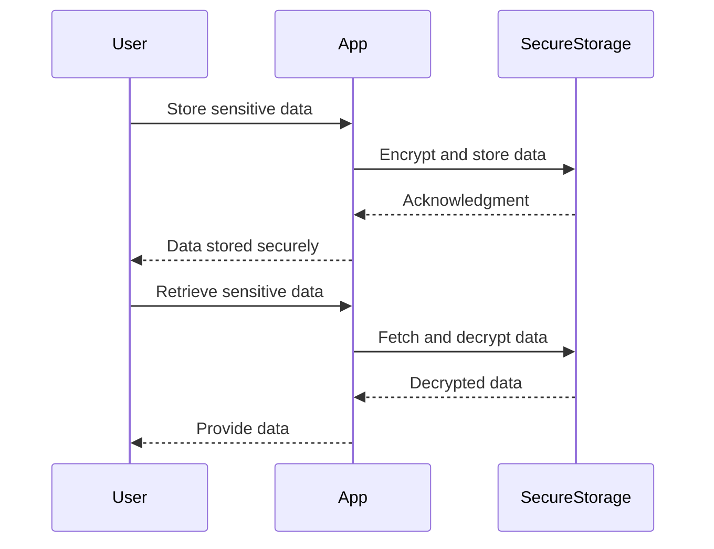

## 13.3 Secure Data Storage

In today's digital landscape, securing sensitive data is paramount for any application, especially those handling personal information, financial data, or confidential business details. In this section, we will explore the best practices and techniques for secure data storage in Dart and Flutter applications. We will cover encryption, key management, and the use of packages like `flutter_secure_storage` to ensure your data remains protected.

### Understanding the Importance of Secure Data Storage

Before diving into the technical aspects, it's crucial to understand why secure data storage is essential:

- **Data Breaches**: Unauthorized access to sensitive data can lead to data breaches, resulting in financial loss, legal consequences, and damage to reputation.
- **Compliance**: Many industries are subject to regulations (e.g., GDPR, HIPAA) that mandate secure data handling practices.
- **User Trust**: Users expect their data to be handled securely. Failing to do so can erode trust and lead to user attrition.

### Encrypting Sensitive Data

Encryption is the process of converting data into a format that cannot be easily understood by unauthorized individuals. In Flutter, we can use various encryption techniques to protect sensitive data.

#### Symmetric vs. Asymmetric Encryption

- **Symmetric Encryption**: Uses the same key for both encryption and decryption. It's faster but requires secure key management.
- **Asymmetric Encryption**: Uses a pair of keys (public and private). It's more secure for key exchange but slower than symmetric encryption.

#### Using the `flutter_secure_storage` Package

The `flutter_secure_storage` package provides a simple API for storing key-value pairs securely. It uses platform-specific secure storage mechanisms, such as the Keychain on iOS and the Keystore on Android.

```dart
import 'package:flutter_secure_storage/flutter_secure_storage.dart';

final storage = FlutterSecureStorage();

// Storing data
await storage.write(key: 'username', value: 'encrypted_username');

// Reading data
String? username = await storage.read(key: 'username');

// Deleting data
await storage.delete(key: 'username');
```

**Key Points**:
- Data is encrypted and stored securely on the device.
- The package abstracts platform-specific details, making it easy to use.

### Key Management

Proper key management is crucial for maintaining the security of encrypted data. Here are some best practices:

#### Key Generation

- **Use Strong Keys**: Ensure keys are of sufficient length and complexity.
- **Randomness**: Use cryptographically secure random number generators for key generation.

#### Key Storage

- **Secure Storage**: Use secure storage solutions like `flutter_secure_storage` for storing keys.
- **Environment Variables**: Avoid hardcoding keys in your source code. Use environment variables or secure storage.

#### Key Rotation

- **Regular Rotation**: Periodically rotate keys to minimize the impact of a compromised key.
- **Automated Processes**: Implement automated processes for key rotation and distribution.

### Implementing Secure Data Storage in Flutter

Let's explore a practical implementation of secure data storage in a Flutter application.

#### Step 1: Setting Up the Project

Create a new Flutter project and add the `flutter_secure_storage` package to your `pubspec.yaml` file:

```yaml
dependencies:
  flutter:
    sdk: flutter
  flutter_secure_storage: ^5.0.2
```

#### Step 2: Encrypting and Storing Data

Create a service class to handle secure data storage:

```dart
import 'package:flutter_secure_storage/flutter_secure_storage.dart';

class SecureStorageService {
  final FlutterSecureStorage _storage = FlutterSecureStorage();

  Future<void> storeData(String key, String value) async {
    await _storage.write(key: key, value: value);
  }

  Future<String?> retrieveData(String key) async {
    return await _storage.read(key: key);
  }

  Future<void> deleteData(String key) async {
    await _storage.delete(key: key);
  }
}
```

#### Step 3: Using the Secure Storage Service

In your Flutter application, use the `SecureStorageService` to store and retrieve sensitive data:

```dart
import 'package:flutter/material.dart';
import 'secure_storage_service.dart';

void main() {
  runApp(MyApp());
}

class MyApp extends StatelessWidget {
  final SecureStorageService _secureStorageService = SecureStorageService();

  @override
  Widget build(BuildContext context) {
    return MaterialApp(
      home: Scaffold(
        appBar: AppBar(title: Text('Secure Data Storage')),
        body: Center(
          child: Column(
            mainAxisAlignment: MainAxisAlignment.center,
            children: <Widget>[
              ElevatedButton(
                onPressed: () async {
                  await _secureStorageService.storeData('token', 'secure_token');
                  print('Data stored securely');
                },
                child: Text('Store Data'),
              ),
              ElevatedButton(
                onPressed: () async {
                  String? token = await _secureStorageService.retrieveData('token');
                  print('Retrieved token: $token');
                },
                child: Text('Retrieve Data'),
              ),
              ElevatedButton(
                onPressed: () async {
                  await _secureStorageService.deleteData('token');
                  print('Data deleted');
                },
                child: Text('Delete Data'),
              ),
            ],
          ),
        ),
      ),
    );
  }
}
```

### Best Practices for Secure Data Storage

- **Minimal Data Storage**: Only store data that is absolutely necessary.
- **Data Encryption**: Always encrypt sensitive data before storing it.
- **Access Control**: Implement strict access controls to limit who can access sensitive data.
- **Regular Audits**: Conduct regular security audits to identify and mitigate vulnerabilities.

### Visualizing Secure Data Storage Workflow

To better understand the secure data storage workflow, let's visualize the process using a sequence diagram.



**Diagram Explanation**:
- The user initiates the storage or retrieval of sensitive data.
- The app encrypts data before storing it in secure storage.
- When retrieving data, the app fetches and decrypts it before providing it to the user.

### Try It Yourself

Experiment with the secure data storage implementation by modifying the code:

- **Add More Data**: Extend the `SecureStorageService` to handle additional data types.
- **Implement Key Rotation**: Add functionality to rotate encryption keys periodically.
- **Enhance Security**: Integrate additional security measures, such as biometric authentication.

### References and Further Reading

- [Flutter Secure Storage Documentation](https://pub.dev/packages/flutter_secure_storage)
- [OWASP Mobile Security Testing Guide](https://owasp.org/www-project-mobile-security-testing-guide/)
- [NIST Guidelines on Key Management](https://csrc.nist.gov/publications/detail/sp/800-57-part-1/rev-5/final)

### Knowledge Check

To reinforce your understanding of secure data storage, consider the following questions:

- What are the differences between symmetric and asymmetric encryption?
- Why is key management important in secure data storage?
- How does the `flutter_secure_storage` package enhance data security in Flutter applications?

### Embrace the Journey

Remember, securing data is an ongoing process. As you continue to develop Flutter applications, keep security at the forefront of your design and implementation decisions. Stay curious, keep learning, and enjoy the journey of building secure and reliable applications!

## Quiz Time!



### What is the primary purpose of encryption in data storage?

- [x] To convert data into a format that cannot be easily understood by unauthorized individuals
- [ ] To compress data for efficient storage
- [ ] To enhance data readability
- [ ] To format data for database storage

> **Explanation:** Encryption is used to protect data by converting it into a format that is unreadable without the appropriate decryption key.

### Which package is commonly used for secure data storage in Flutter?

- [x] flutter_secure_storage
- [ ] flutter_data_storage
- [ ] secure_flutter_storage
- [ ] flutter_encryption

> **Explanation:** The `flutter_secure_storage` package is widely used for securely storing key-value pairs in Flutter applications.

### What is a key difference between symmetric and asymmetric encryption?

- [x] Symmetric encryption uses the same key for encryption and decryption, while asymmetric encryption uses a pair of keys.
- [ ] Symmetric encryption is slower than asymmetric encryption.
- [ ] Asymmetric encryption uses the same key for encryption and decryption.
- [ ] Symmetric encryption is more secure than asymmetric encryption.

> **Explanation:** Symmetric encryption uses a single key for both encryption and decryption, whereas asymmetric encryption uses a pair of keys (public and private).

### Why is key management important in secure data storage?

- [x] To ensure encryption keys are stored and handled securely
- [ ] To increase the speed of data retrieval
- [ ] To reduce the size of stored data
- [ ] To simplify data storage processes

> **Explanation:** Key management is crucial for maintaining the security of encrypted data by ensuring keys are stored and handled securely.

### What is a best practice for storing encryption keys?

- [x] Use secure storage solutions like `flutter_secure_storage`
- [ ] Hardcode keys in the source code
- [ ] Store keys in plain text files
- [ ] Share keys publicly for transparency

> **Explanation:** Secure storage solutions like `flutter_secure_storage` should be used to store encryption keys securely.

### What is the benefit of key rotation in secure data storage?

- [x] It minimizes the impact of a compromised key
- [ ] It increases data storage capacity
- [ ] It simplifies encryption processes
- [ ] It reduces data redundancy

> **Explanation:** Regular key rotation minimizes the impact of a compromised key by ensuring that keys are periodically changed.

### How does the `flutter_secure_storage` package enhance data security?

- [x] By encrypting data and storing it securely on the device
- [ ] By compressing data for efficient storage
- [ ] By formatting data for database storage
- [ ] By increasing data readability

> **Explanation:** The `flutter_secure_storage` package encrypts data and uses platform-specific secure storage mechanisms to enhance data security.

### What is a key consideration when implementing secure data storage?

- [x] Implement strict access controls to limit data access
- [ ] Store all data in plain text for simplicity
- [ ] Avoid encrypting data to reduce complexity
- [ ] Use the same encryption key for all data

> **Explanation:** Implementing strict access controls is essential to limit who can access sensitive data and enhance security.

### What is the role of the `SecureStorageService` class in the provided code example?

- [x] To handle secure storage and retrieval of data
- [ ] To compress data for efficient storage
- [ ] To format data for database storage
- [ ] To increase data readability

> **Explanation:** The `SecureStorageService` class is responsible for securely storing and retrieving data using the `flutter_secure_storage` package.

### True or False: Asymmetric encryption is faster than symmetric encryption.

- [ ] True
- [x] False

> **Explanation:** Asymmetric encryption is generally slower than symmetric encryption due to the complexity of key pair operations.


