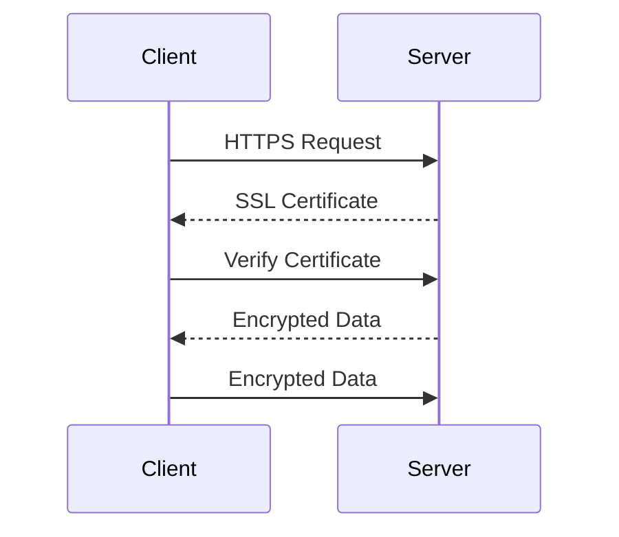

## 13.4 Secure Communication: HTTPS and Certificates in Dart and Flutter

In today's digital landscape, ensuring secure communication is paramount. As developers, we must safeguard data transmission between clients and servers to protect sensitive information from malicious actors. This section delves into the intricacies of secure communication in Dart and Flutter applications, focusing on HTTPS, SSL certificates, and certificate pinning to protect against man-in-the-middle attacks.

### Introduction to Secure Communication

Secure communication involves encrypting data transmitted over networks to prevent unauthorized access and tampering. HTTPS (Hypertext Transfer Protocol Secure) is the standard protocol for secure communication on the web. It combines HTTP with SSL/TLS (Secure Sockets Layer/Transport Layer Security) to encrypt data, ensuring confidentiality and integrity.

#### Why HTTPS Matters

- **Data Encryption**: HTTPS encrypts data, making it unreadable to eavesdroppers.
- **Data Integrity**: Ensures data is not altered during transmission.
- **Authentication**: Verifies the identity of the communicating parties.
- **Trust**: Builds user trust by displaying a secure padlock icon in browsers.

### Understanding SSL/TLS Certificates

SSL/TLS certificates are digital certificates that authenticate a website's identity and enable encrypted connections. They contain the website's public key and are issued by trusted Certificate Authorities (CAs).

#### Types of SSL Certificates

1. **Domain Validated (DV) Certificates**: Basic validation, verifying domain ownership.
2. **Organization Validated (OV) Certificates**: Includes organization details, providing more trust.
3. **Extended Validation (EV) Certificates**: Highest level of validation, displaying the organization's name in the browser's address bar.

### Implementing HTTPS in Dart and Flutter

To implement HTTPS in Dart and Flutter, we must configure our applications to use secure connections. This involves setting up SSL certificates on the server and ensuring the client communicates over HTTPS.

#### Configuring HTTPS on the Server

1. **Obtain an SSL Certificate**: Purchase or obtain a free SSL certificate from a trusted CA.
2. **Install the Certificate**: Configure the server to use the SSL certificate.
3. **Redirect HTTP to HTTPS**: Ensure all traffic is redirected to HTTPS.

#### Enforcing HTTPS in Flutter

In Flutter, we use the `http` package to make network requests. By default, it supports HTTPS, but we must ensure all endpoints use secure URLs.

```dart
import 'package:http/http.dart' as http;

Future<void> fetchData() async {
  final response = await http.get(Uri.parse('https://example.com/data'));

  if (response.statusCode == 200) {
    // Process the data
  } else {
    // Handle the error
  }
}
```

### Certificate Pinning in Flutter

Certificate pinning is a security technique that associates a host with its expected certificate or public key. It protects against man-in-the-middle attacks by ensuring the client only trusts specific certificates.

#### Implementing Certificate Pinning

To implement certificate pinning in Flutter, we use the `http` package with a custom `SecurityContext`.

```dart
import 'dart:io';
import 'package:http/io_client.dart';

Future<void> fetchDataWithPinning() async {
  final securityContext = SecurityContext(withTrustedRoots: false);
  securityContext.setTrustedCertificates('assets/certificates/cert.pem');

  final httpClient = HttpClient(context: securityContext);
  final ioClient = IOClient(httpClient);

  final response = await ioClient.get(Uri.parse('https://example.com/data'));

  if (response.statusCode == 200) {
    // Process the data
  } else {
    // Handle the error
  }
}
```

### Visualizing Secure Communication

To better understand secure communication, let's visualize the process using a sequence diagram.



**Diagram Description**: This sequence diagram illustrates the secure communication process between a client and a server using HTTPS. The client sends an HTTPS request, receives the server's SSL certificate, verifies it, and then exchanges encrypted data.

### Best Practices for Secure Communication

- **Use Strong Encryption**: Ensure SSL/TLS configurations use strong encryption algorithms.
- **Regularly Update Certificates**: Renew and update SSL certificates before expiration.
- **Monitor Certificate Validity**: Implement monitoring to detect certificate expiration or revocation.
- **Implement HSTS**: Use HTTP Strict Transport Security (HSTS) to enforce HTTPS connections.
- **Avoid Mixed Content**: Ensure all resources (scripts, images) are loaded over HTTPS.

### Common Pitfalls and How to Avoid Them

- **Ignoring Certificate Validation**: Always validate SSL certificates to prevent man-in-the-middle attacks.
- **Using Self-Signed Certificates**: Avoid using self-signed certificates in production environments.
- **Neglecting Certificate Pinning**: Implement certificate pinning to enhance security.

### Try It Yourself

Experiment with the provided code examples by modifying the URLs and testing with different SSL certificates. Try implementing certificate pinning with a self-signed certificate to understand the process.

### Further Reading and Resources

- [MDN Web Docs: HTTPS](https://developer.mozilla.org/en-US/docs/Web/HTTP/Overview)
- [OWASP: Transport Layer Protection Cheat Sheet](https://cheatsheetseries.owasp.org/cheatsheets/Transport_Layer_Protection_Cheat_Sheet.html)
- [SSL Labs: SSL Server Test](https://www.ssllabs.com/ssltest/)

### Knowledge Check

- What is the primary purpose of HTTPS?
- How does certificate pinning protect against man-in-the-middle attacks?
- Why is it important to regularly update SSL certificates?

### Embrace the Journey

Remember, secure communication is a critical aspect of application development. As you progress, you'll encounter more complex scenarios requiring advanced security measures. Keep learning, stay vigilant, and prioritize security in your applications.

## Quiz Time!



### What is the primary purpose of HTTPS?

- [x] To encrypt data transmitted over the network
- [ ] To speed up data transmission
- [ ] To reduce server load
- [ ] To increase data redundancy

> **Explanation:** HTTPS encrypts data to ensure secure transmission over the network, protecting it from unauthorized access.

### How does certificate pinning enhance security?

- [x] By associating a host with its expected certificate
- [ ] By increasing data transmission speed
- [ ] By reducing server load
- [ ] By encrypting data

> **Explanation:** Certificate pinning associates a host with its expected certificate, preventing man-in-the-middle attacks.

### Which of the following is a type of SSL certificate?

- [x] Domain Validated (DV)
- [ ] Server Validated (SV)
- [ ] Client Validated (CV)
- [ ] Network Validated (NV)

> **Explanation:** Domain Validated (DV) is a type of SSL certificate that verifies domain ownership.

### What is the role of a Certificate Authority (CA)?

- [x] To issue and verify SSL certificates
- [ ] To encrypt data
- [ ] To manage server load
- [ ] To increase data redundancy

> **Explanation:** Certificate Authorities issue and verify SSL certificates, ensuring the authenticity of websites.

### Why is it important to avoid mixed content on a webpage?

- [x] To ensure all resources are loaded over HTTPS
- [ ] To increase page load speed
- [ ] To reduce server load
- [ ] To improve SEO

> **Explanation:** Mixed content can compromise security by loading some resources over HTTP, so it's important to ensure all resources are loaded over HTTPS.

### What does HSTS stand for?

- [x] HTTP Strict Transport Security
- [ ] Hypertext Secure Transmission
- [ ] High-Speed Transport Security
- [ ] Hypertext Secure Transfer

> **Explanation:** HSTS stands for HTTP Strict Transport Security, a policy to enforce HTTPS connections.

### What is a common pitfall when implementing HTTPS?

- [x] Ignoring certificate validation
- [ ] Using strong encryption
- [ ] Regularly updating certificates
- [ ] Implementing HSTS

> **Explanation:** Ignoring certificate validation can lead to security vulnerabilities, such as man-in-the-middle attacks.

### How can you test the security of your SSL configuration?

- [x] Use SSL Labs' SSL Server Test
- [ ] Increase server load
- [ ] Reduce data redundancy
- [ ] Use self-signed certificates

> **Explanation:** SSL Labs' SSL Server Test is a tool to test the security of your SSL configuration.

### What is the benefit of using EV certificates?

- [x] They provide the highest level of validation
- [ ] They are the cheapest option
- [ ] They increase data transmission speed
- [ ] They reduce server load

> **Explanation:** Extended Validation (EV) certificates provide the highest level of validation, displaying the organization's name in the browser's address bar.

### True or False: Self-signed certificates are recommended for production environments.

- [ ] True
- [x] False

> **Explanation:** Self-signed certificates are not recommended for production environments as they do not provide the same level of trust as certificates issued by a trusted CA.


