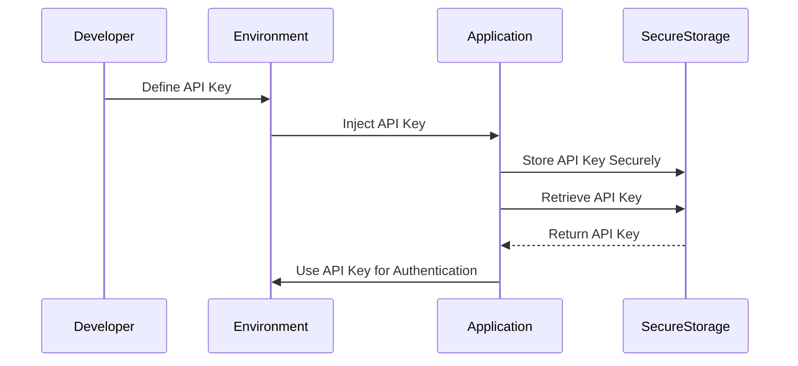

## 13.5 Managing Tokens and Secrets

In the world of software development, particularly in mobile and web applications, managing tokens and secrets securely is crucial. Tokens, such as API keys, OAuth tokens, and other sensitive information, are often required for authentication and authorization. However, improper handling of these secrets can lead to security vulnerabilities, such as unauthorized access and data breaches. In this section, we will explore best practices for managing tokens and secrets in Dart and Flutter applications, focusing on safe handling of API keys, avoiding hardcoding, and using secure storage and environment variables.

### Introduction to Tokens and Secrets

Tokens and secrets are integral to modern application development. They serve as credentials that allow applications to access resources, authenticate users, and perform secure operations. Here are some common types of tokens and secrets:

- **API Keys**: Unique identifiers used to authenticate requests associated with your project.
- **OAuth Tokens**: Used for authentication and authorization in OAuth-based systems.
- **JWT (JSON Web Tokens)**: Compact, URL-safe tokens used for secure information exchange.
- **Client Secrets**: Confidential keys used in OAuth flows to authenticate the client application.

#### Why Secure Management Matters

Managing tokens and secrets securely is essential to protect sensitive data and prevent unauthorized access. Exposing these secrets can lead to:

- **Data Breaches**: Unauthorized access to sensitive data.
- **Service Abuse**: Malicious actors using your API keys to consume resources.
- **Reputation Damage**: Loss of trust from users and stakeholders.

### Safe Handling of API Keys

API keys are often used to authenticate requests to third-party services. However, hardcoding API keys directly into your application's source code is a common mistake that can lead to security vulnerabilities. Let's explore how to handle API keys safely.

#### Avoid Hardcoding API Keys

Hardcoding API keys in your source code is risky because it exposes them to anyone who has access to your codebase. Instead, consider the following approaches:

1. **Environment Variables**: Store API keys in environment variables and access them at runtime.
2. **Secure Storage**: Use secure storage solutions to store API keys and retrieve them securely.
3. **Configuration Files**: Store API keys in configuration files that are not included in version control.

#### Using Environment Variables

Environment variables provide a secure way to manage API keys and other secrets. They allow you to inject secrets at build time, keeping them out of your source code. Here's how you can use environment variables in a Dart or Flutter application:

1. **Define Environment Variables**: Set environment variables in your development and production environments.

   ```bash
   export API_KEY=your_api_key_here
   ```

2. **Access Environment Variables**: Use the `dotenv` package to access environment variables in your Dart or Flutter application.

   ```dart
   import 'package:flutter_dotenv/flutter_dotenv.dart';

   void main() async {
     await dotenv.load(fileName: ".env");
     String apiKey = dotenv.env['API_KEY'] ?? '';
     print('API Key: $apiKey');
   }
   ```

3. **Secure Your `.env` File**: Ensure that your `.env` file is not included in version control by adding it to your `.gitignore` file.

   ```plaintext
   # .gitignore
   .env
   ```

#### Secure Storage Solutions

Secure storage solutions provide a way to store sensitive information securely on the device. In Flutter, you can use the `flutter_secure_storage` package to store API keys and other secrets securely.

1. **Add Dependency**: Add the `flutter_secure_storage` package to your `pubspec.yaml` file.

   ```yaml
   dependencies:
     flutter_secure_storage: ^5.0.2
   ```

2. **Store and Retrieve Secrets**: Use the `flutter_secure_storage` package to store and retrieve secrets securely.

   ```dart
   import 'package:flutter_secure_storage/flutter_secure_storage.dart';

   final storage = FlutterSecureStorage();

   // Store API Key
   await storage.write(key: 'api_key', value: 'your_api_key_here');

   // Retrieve API Key
   String? apiKey = await storage.read(key: 'api_key');
   print('API Key: $apiKey');
   ```

3. **Platform-Specific Implementations**: The `flutter_secure_storage` package uses platform-specific implementations to store data securely, such as Keychain on iOS and EncryptedSharedPreferences on Android.

### Environment Variables: Injecting Secrets at Build Time Securely

Environment variables are a powerful tool for managing secrets securely. They allow you to inject secrets at build time, keeping them out of your source code and version control. Let's explore how to use environment variables effectively in Dart and Flutter applications.

#### Setting Up Environment Variables

1. **Define Environment Variables**: Set environment variables in your development and production environments. This can be done using a `.env` file or directly in your shell.

   ```bash
   export API_KEY=your_api_key_here
   ```

2. **Use a `.env` File**: Create a `.env` file in your project directory to define environment variables.

   ```plaintext
   # .env
   API_KEY=your_api_key_here
   ```

3. **Load Environment Variables**: Use the `dotenv` package to load environment variables from the `.env` file.

   ```dart
   import 'package:flutter_dotenv/flutter_dotenv.dart';

   void main() async {
     await dotenv.load(fileName: ".env");
     String apiKey = dotenv.env['API_KEY'] ?? '';
     print('API Key: $apiKey');
   }
   ```

#### Best Practices for Using Environment Variables

- **Keep Secrets Out of Version Control**: Ensure that your `.env` file is not included in version control by adding it to your `.gitignore` file.
- **Use Different Variables for Different Environments**: Define separate environment variables for development, testing, and production environments.
- **Secure Your Build Environment**: Ensure that your build environment is secure and that only authorized personnel have access to it.

### Secure Storage: Storing Secrets Securely

Secure storage solutions provide a way to store sensitive information securely on the device. In Flutter, you can use the `flutter_secure_storage` package to store API keys and other secrets securely.

#### Using `flutter_secure_storage`

1. **Add Dependency**: Add the `flutter_secure_storage` package to your `pubspec.yaml` file.

   ```yaml
   dependencies:
     flutter_secure_storage: ^5.0.2
   ```

2. **Store and Retrieve Secrets**: Use the `flutter_secure_storage` package to store and retrieve secrets securely.

   ```dart
   import 'package:flutter_secure_storage/flutter_secure_storage.dart';

   final storage = FlutterSecureStorage();

   // Store API Key
   await storage.write(key: 'api_key', value: 'your_api_key_here');

   // Retrieve API Key
   String? apiKey = await storage.read(key: 'api_key');
   print('API Key: $apiKey');
   ```

3. **Platform-Specific Implementations**: The `flutter_secure_storage` package uses platform-specific implementations to store data securely, such as Keychain on iOS and EncryptedSharedPreferences on Android.

#### Best Practices for Secure Storage

- **Encrypt Sensitive Data**: Ensure that sensitive data is encrypted before storing it.
- **Use Strong Encryption Algorithms**: Use strong encryption algorithms to protect sensitive data.
- **Regularly Rotate Secrets**: Regularly rotate secrets to minimize the impact of a potential breach.

### Visualizing Secure Token Management

To better understand the process of managing tokens and secrets securely, let's visualize the workflow using a sequence diagram.



**Diagram Description**: This sequence diagram illustrates the process of managing API keys securely. The developer defines the API key in the environment, which is then injected into the application. The application stores the API key securely using secure storage and retrieves it when needed for authentication.

### Design Considerations

When managing tokens and secrets, consider the following design considerations:

- **Security**: Ensure that tokens and secrets are stored securely and accessed only by authorized personnel.
- **Scalability**: Design your solution to scale with your application's growth.
- **Maintainability**: Use a consistent approach to managing tokens and secrets across your application.

### Differences and Similarities

Managing tokens and secrets is often confused with other security practices, such as encryption and authentication. Here's how they differ:

- **Encryption**: Encryption is the process of converting data into a secure format that can only be read by authorized parties. Managing tokens and secrets involves securely storing and accessing these credentials.
- **Authentication**: Authentication is the process of verifying the identity of a user or application. Tokens and secrets are often used in authentication processes.

### Try It Yourself

To reinforce your understanding of managing tokens and secrets, try the following exercises:

1. **Experiment with Environment Variables**: Create a new Flutter project and use environment variables to manage API keys. Try accessing the API keys in different parts of your application.

2. **Implement Secure Storage**: Use the `flutter_secure_storage` package to store and retrieve secrets securely. Experiment with different encryption algorithms and observe their impact on performance.

3. **Rotate Secrets Regularly**: Implement a mechanism to rotate secrets regularly and observe how it affects your application's security.

### Knowledge Check

- **What are some common types of tokens and secrets used in applications?**
- **Why is it important to manage tokens and secrets securely?**
- **What are some best practices for using environment variables to manage secrets?**
- **How can you use the `flutter_secure_storage` package to store secrets securely?**

### Embrace the Journey

Remember, managing tokens and secrets securely is just one aspect of building secure applications. As you progress, you'll encounter more complex security challenges. Keep experimenting, stay curious, and enjoy the journey!

## Quiz Time!



### What is a common mistake when handling API keys in applications?

- [x] Hardcoding API keys in source code
- [ ] Using environment variables
- [ ] Storing API keys in secure storage
- [ ] Using configuration files

> **Explanation:** Hardcoding API keys in source code is a common mistake that can lead to security vulnerabilities.

### Which package can be used to access environment variables in a Dart or Flutter application?

- [x] dotenv
- [ ] flutter_secure_storage
- [ ] shared_preferences
- [ ] path_provider

> **Explanation:** The `dotenv` package is used to access environment variables in a Dart or Flutter application.

### What is the purpose of using secure storage solutions in Flutter?

- [x] To store sensitive information securely on the device
- [ ] To access environment variables
- [ ] To manage application state
- [ ] To handle network requests

> **Explanation:** Secure storage solutions are used to store sensitive information securely on the device.

### Which of the following is a best practice for using environment variables?

- [x] Keep secrets out of version control
- [ ] Hardcode secrets in the source code
- [ ] Share secrets publicly
- [ ] Use the same secrets for all environments

> **Explanation:** Keeping secrets out of version control is a best practice for using environment variables.

### What is the `flutter_secure_storage` package used for?

- [x] Storing and retrieving secrets securely
- [ ] Accessing environment variables
- [ ] Managing application state
- [ ] Handling network requests

> **Explanation:** The `flutter_secure_storage` package is used for storing and retrieving secrets securely.

### What is a key benefit of using environment variables for managing secrets?

- [x] They keep secrets out of the source code
- [ ] They make secrets publicly accessible
- [ ] They simplify application state management
- [ ] They improve network performance

> **Explanation:** Environment variables keep secrets out of the source code, enhancing security.

### How can you ensure that your `.env` file is not included in version control?

- [x] Add it to your `.gitignore` file
- [ ] Hardcode secrets in the source code
- [ ] Share the `.env` file publicly
- [ ] Use the same secrets for all environments

> **Explanation:** Adding the `.env` file to your `.gitignore` file ensures it is not included in version control.

### What is a common use case for OAuth tokens?

- [x] Authentication and authorization
- [ ] Storing application state
- [ ] Managing network requests
- [ ] Accessing environment variables

> **Explanation:** OAuth tokens are commonly used for authentication and authorization.

### Which of the following is a secure way to manage API keys?

- [x] Using secure storage solutions
- [ ] Hardcoding them in the source code
- [ ] Sharing them publicly
- [ ] Using the same keys for all environments

> **Explanation:** Using secure storage solutions is a secure way to manage API keys.

### True or False: Managing tokens and secrets securely is only important for large applications.

- [ ] True
- [x] False

> **Explanation:** Managing tokens and secrets securely is important for applications of all sizes to prevent security vulnerabilities.


