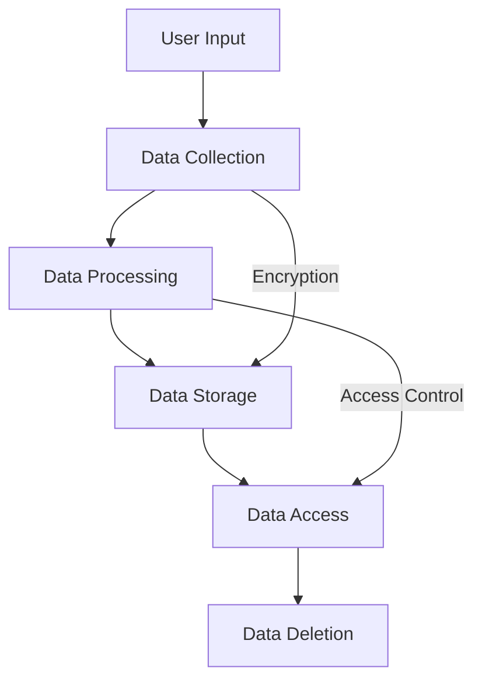

## 13.6 Dealing with User Data and Privacy

In today's digital age, user data privacy is a paramount concern for developers and users alike. As Flutter developers, we must ensure that our applications not only provide a seamless user experience but also respect and protect user data. This section will guide you through the essential practices for handling user data and privacy in Flutter applications, focusing on compliance with regulations like the General Data Protection Regulation (GDPR) and the California Consumer Privacy Act (CCPA).

### Understanding User Data Privacy

User data privacy refers to the protection of personal information that users share with applications. This includes any data that can identify an individual, such as names, email addresses, phone numbers, and even location data. Ensuring user data privacy involves implementing measures to protect this information from unauthorized access and misuse.

#### Key Concepts in User Data Privacy

- **Personal Data**: Any information related to an identified or identifiable person.
- **Data Processing**: Any operation performed on personal data, such as collection, storage, or sharing.
- **Data Subject**: The individual whose personal data is being processed.
- **Data Controller**: The entity that determines the purposes and means of processing personal data.
- **Data Processor**: The entity that processes data on behalf of the data controller.

### Compliance with Regulations

Compliance with privacy regulations is crucial for any application that handles user data. Two of the most significant regulations are the GDPR and the CCPA.

#### General Data Protection Regulation (GDPR)

The GDPR is a comprehensive data protection law that applies to all organizations processing personal data of individuals within the European Union (EU). Key principles of the GDPR include:

- **Lawfulness, Fairness, and Transparency**: Data must be processed lawfully, fairly, and transparently.
- **Purpose Limitation**: Data must be collected for specified, explicit, and legitimate purposes.
- **Data Minimization**: Data collected should be adequate, relevant, and limited to what is necessary.
- **Accuracy**: Data must be accurate and kept up to date.
- **Storage Limitation**: Data should be kept in a form that permits identification of data subjects for no longer than necessary.
- **Integrity and Confidentiality**: Data must be processed securely to prevent unauthorized access or processing.

#### California Consumer Privacy Act (CCPA)

The CCPA is a state statute intended to enhance privacy rights and consumer protection for residents of California, USA. Key aspects include:

- **Right to Know**: Consumers have the right to know what personal data is being collected and how it is used.
- **Right to Delete**: Consumers can request the deletion of their personal data.
- **Right to Opt-Out**: Consumers can opt-out of the sale of their personal data.
- **Non-Discrimination**: Consumers should not be discriminated against for exercising their privacy rights.

### Implementing User Consent

User consent is a fundamental aspect of data privacy. It involves obtaining permission from users before collecting or processing their personal data. In Flutter applications, this can be achieved through clear and concise consent forms or dialogs.

#### Designing Effective Consent Forms

- **Clarity**: Use simple language to explain what data is being collected and why.
- **Granularity**: Allow users to consent to specific data processing activities.
- **Revocability**: Provide users with the option to withdraw consent at any time.

#### Example: Implementing a Consent Dialog in Flutter

```dart
import 'package:flutter/material.dart';

class ConsentDialog extends StatelessWidget {
  @override
  Widget build(BuildContext context) {
    return AlertDialog(
      title: Text('User Consent'),
      content: Text(
        'We value your privacy. Please consent to the collection of your data for a better user experience.',
      ),
      actions: [
        TextButton(
          onPressed: () {
            // Handle consent acceptance
            Navigator.of(context).pop(true);
          },
          child: Text('Accept'),
        ),
        TextButton(
          onPressed: () {
            // Handle consent rejection
            Navigator.of(context).pop(false);
          },
          child: Text('Decline'),
        ),
      ],
    );
  }
}
```

### Secure Data Storage

Storing user data securely is critical to maintaining privacy. Flutter provides several options for secure data storage, including:

- **SharedPreferences**: For storing simple key-value pairs.
- **SQLite**: For structured data storage.
- **EncryptedSharedPreferences**: For storing sensitive data securely.

#### Example: Using EncryptedSharedPreferences

```dart
import 'package:flutter_secure_storage/flutter_secure_storage.dart';

final storage = FlutterSecureStorage();

// Write data
await storage.write(key: 'userToken', value: 'secureToken123');

// Read data
String? token = await storage.read(key: 'userToken');

// Delete data
await storage.delete(key: 'userToken');
```

### Providing Data Control to Users

Empowering users with control over their data is a key aspect of privacy. This includes allowing users to view, edit, or delete their data.

#### Implementing Data Access and Deletion

- **Data Access**: Provide users with a way to view the data you have collected about them.
- **Data Deletion**: Allow users to delete their data if they choose to do so.

#### Example: Implementing Data Deletion in Flutter

```dart
import 'package:flutter/material.dart';

class DataDeletionScreen extends StatelessWidget {
  final Function onDelete;

  DataDeletionScreen({required this.onDelete});

  @override
  Widget build(BuildContext context) {
    return Scaffold(
      appBar: AppBar(
        title: Text('Delete Your Data'),
      ),
      body: Center(
        child: ElevatedButton(
          onPressed: () {
            // Call the onDelete function to delete user data
            onDelete();
          },
          child: Text('Delete My Data'),
        ),
      ),
    );
  }
}
```

### Ensuring Data Security

Data security involves protecting user data from unauthorized access and breaches. This can be achieved through:

- **Encryption**: Encrypt data both in transit and at rest.
- **Access Controls**: Implement strict access controls to limit who can access user data.
- **Regular Audits**: Conduct regular security audits to identify and address vulnerabilities.

### Visualizing Data Flow and Security

To better understand how data flows through your application and where security measures should be applied, consider using diagrams to visualize these processes.



**Diagram Description**: This flowchart illustrates the flow of user data through a Flutter application, highlighting key security measures such as encryption and access control.

### Best Practices for User Data Privacy

- **Minimize Data Collection**: Collect only the data necessary for your application's functionality.
- **Anonymize Data**: Where possible, anonymize data to protect user identities.
- **Educate Users**: Provide clear information about how their data is used and protected.
- **Stay Informed**: Keep up to date with changes in privacy regulations and best practices.

### References and Further Reading

- [GDPR Overview](https://gdpr-info.eu/)
- [CCPA Overview](https://oag.ca.gov/privacy/ccpa)
- [Flutter Secure Storage](https://pub.dev/packages/flutter_secure_storage)

### Knowledge Check

- What are the key principles of GDPR?
- How can you implement user consent in a Flutter application?
- What are some best practices for secure data storage in Flutter?

### Embrace the Journey

Remember, ensuring user data privacy is an ongoing process. As you continue to develop your Flutter applications, keep privacy at the forefront of your design and implementation decisions. Stay curious, keep learning, and strive to create applications that respect and protect user data.

## Quiz Time!



### What is the primary goal of user data privacy?

- [x] To protect personal information from unauthorized access and misuse
- [ ] To increase application performance
- [ ] To enhance user interface design
- [ ] To reduce application size

> **Explanation:** User data privacy aims to protect personal information from unauthorized access and misuse, ensuring that users' personal data is handled securely and responsibly.

### Which regulation applies to the protection of personal data within the European Union?

- [x] GDPR
- [ ] CCPA
- [ ] HIPAA
- [ ] COPPA

> **Explanation:** The General Data Protection Regulation (GDPR) is a comprehensive data protection law that applies to all organizations processing personal data of individuals within the European Union.

### What is a key aspect of the CCPA?

- [x] Right to Know
- [ ] Data Minimization
- [ ] Purpose Limitation
- [ ] Data Anonymization

> **Explanation:** The CCPA grants consumers the right to know what personal data is being collected and how it is used, among other rights.

### How can you implement user consent in a Flutter application?

- [x] By using consent forms or dialogs
- [ ] By automatically collecting data
- [ ] By encrypting all data
- [ ] By using third-party libraries

> **Explanation:** User consent can be implemented in a Flutter application through clear and concise consent forms or dialogs that explain what data is being collected and why.

### What is a best practice for secure data storage in Flutter?

- [x] Use EncryptedSharedPreferences
- [ ] Store data in plain text
- [ ] Use global variables
- [ ] Avoid data storage

> **Explanation:** Using EncryptedSharedPreferences is a best practice for secure data storage in Flutter, as it ensures that sensitive data is stored securely.

### What is the purpose of data encryption?

- [x] To protect data from unauthorized access
- [ ] To increase data processing speed
- [ ] To reduce data storage size
- [ ] To enhance user interface design

> **Explanation:** Data encryption protects data from unauthorized access by converting it into a secure format that can only be read by authorized parties.

### What should you do to empower users with control over their data?

- [x] Allow users to view, edit, or delete their data
- [ ] Automatically update user data
- [ ] Restrict user access to their data
- [ ] Store data indefinitely

> **Explanation:** Empowering users with control over their data involves allowing them to view, edit, or delete their data, ensuring they have control over their personal information.

### What is a key principle of data minimization?

- [x] Collect only the data necessary for your application's functionality
- [ ] Collect as much data as possible
- [ ] Share data with third parties
- [ ] Store data indefinitely

> **Explanation:** Data minimization involves collecting only the data necessary for your application's functionality, reducing the risk of data breaches and enhancing user privacy.

### How can you ensure data security in your application?

- [x] Implement encryption and access controls
- [ ] Store data in plain text
- [ ] Share data with third parties
- [ ] Avoid data storage

> **Explanation:** Ensuring data security involves implementing encryption and access controls to protect user data from unauthorized access and breaches.

### True or False: User data privacy is a one-time implementation process.

- [ ] True
- [x] False

> **Explanation:** User data privacy is an ongoing process that requires continuous attention and updates to ensure compliance with regulations and protection against new threats.


