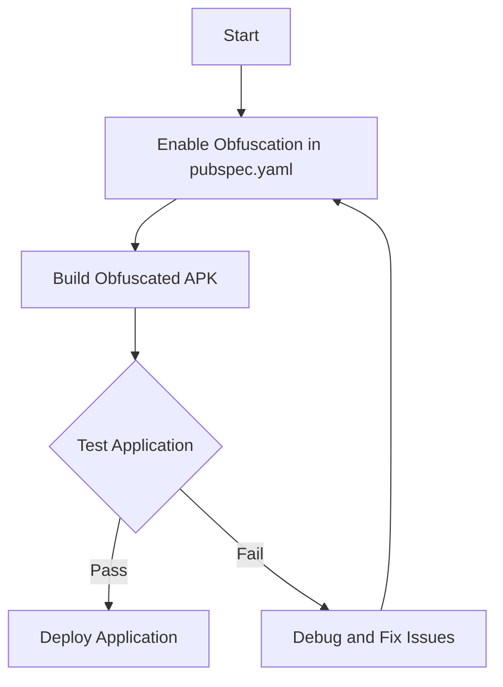

## 13.7 Obfuscation and Code Protection

In the digital age, protecting your intellectual property (IP) is crucial, especially when developing applications with Dart and Flutter. Obfuscation and code protection are essential strategies to deter reverse engineering and unauthorized access to your code. This section explores the concepts, techniques, and tools available for obfuscating and protecting your Dart and Flutter applications.

### Understanding Obfuscation

**Obfuscation** is the process of transforming code into a version that is difficult to understand, while retaining its functionality. The primary goal is to make it challenging for attackers to reverse-engineer the code, thereby protecting your intellectual property and sensitive logic.

#### Why Obfuscate?

1. **Protect Intellectual Property**: Prevent competitors from stealing your innovative algorithms and business logic.
2. **Enhance Security**: Obfuscation adds a layer of security by making it harder for attackers to find vulnerabilities.
3. **Compliance**: Some industries require obfuscation as part of their security compliance measures.

### Obfuscation Techniques

There are several techniques used in obfuscation, each with its own strengths and weaknesses:

1. **Renaming**: Change the names of classes, methods, and variables to meaningless identifiers.
2. **Control Flow Obfuscation**: Alter the control flow of the program to make it less readable.
3. **String Encryption**: Encrypt strings in the code to prevent easy access to sensitive information.
4. **Code Flattening**: Transform the code structure to a less intuitive form.
5. **Dead Code Insertion**: Add non-functional code to confuse decompilers.

### Implementing Obfuscation in Dart

Dart provides built-in support for obfuscation, which can be enabled during the build process. This is particularly useful for Flutter applications, where protecting the client-side code is crucial.

#### Enabling Obfuscation in Flutter

To enable obfuscation in a Flutter project, you need to modify the build configuration. Here’s how you can do it:

```yaml
flutter:
  build:
    obfuscate: true
    split-debug-info: /path/to/debug-info
```

- **`obfuscate: true`**: This flag enables obfuscation.
- **`split-debug-info`**: This option helps in generating symbol files that can be used to de-obfuscate stack traces.

#### Building an Obfuscated APK

To build an obfuscated APK, use the following command:

```bash
flutter build apk --obfuscate --split-debug-info=/<project-name>/debug-info
```

This command generates an APK with obfuscated code and stores the debug information in the specified directory.

### Code Protection Strategies

Beyond obfuscation, there are additional strategies to protect your code:

1. **Code Signing**: Ensure that your application is signed with a valid certificate to prevent tampering.
2. **Secure Communication**: Use HTTPS and other secure protocols to protect data in transit.
3. **Access Control**: Implement robust authentication and authorization mechanisms.
4. **Regular Updates**: Keep your application and dependencies up-to-date to mitigate vulnerabilities.

### Tools for Obfuscation and Code Protection

Several tools can assist in obfuscating and protecting Dart and Flutter applications:

1. **ProGuard**: While primarily used for Java, ProGuard can be integrated into Flutter projects for additional obfuscation.
2. **R8**: A replacement for ProGuard, offering more advanced obfuscation and optimization features.
3. **Dart2js**: Converts Dart code to JavaScript, with options for minification and obfuscation.

### Best Practices for Obfuscation

1. **Test Thoroughly**: Ensure that obfuscation does not break your application’s functionality.
2. **Use Symbol Files**: Keep symbol files secure to de-obfuscate stack traces during debugging.
3. **Combine Techniques**: Use multiple obfuscation techniques for enhanced protection.
4. **Monitor and Update**: Regularly review and update your obfuscation strategy to counter new threats.

### Visualizing the Obfuscation Process

To better understand the obfuscation process, consider the following flowchart:



**Figure 1**: The obfuscation process flowchart illustrates the steps involved in enabling and testing obfuscation in a Flutter application.

### Try It Yourself

Experiment with obfuscation by modifying the build configuration in your Flutter project. Try enabling and disabling obfuscation to observe the differences in the generated APK size and structure. Consider adding additional obfuscation techniques, such as string encryption, to further protect your code.

### Knowledge Check

- **What is the primary goal of obfuscation?**
- **How can you enable obfuscation in a Flutter project?**
- **Name two tools that can assist in obfuscating Dart applications.**

### Summary

Obfuscation and code protection are critical components of securing your Dart and Flutter applications. By understanding and implementing these techniques, you can safeguard your intellectual property and enhance the security of your applications. Remember, this is just the beginning. As you progress, you'll build more secure and robust applications. Keep experimenting, stay curious, and enjoy the journey!

## Quiz Time!



### What is the primary purpose of code obfuscation?

- [x] To make the code difficult to understand and reverse-engineer
- [ ] To improve code readability
- [ ] To increase application performance
- [ ] To reduce code size

> **Explanation:** The primary purpose of code obfuscation is to make the code difficult to understand and reverse-engineer, thereby protecting intellectual property.

### Which of the following is a technique used in code obfuscation?

- [x] Renaming
- [ ] Code beautification
- [ ] Code documentation
- [ ] Code refactoring

> **Explanation:** Renaming is a common technique used in code obfuscation to change the names of classes, methods, and variables to meaningless identifiers.

### How can you enable obfuscation in a Flutter project?

- [x] By setting `obfuscate: true` in the `pubspec.yaml` file
- [ ] By using the `flutter clean` command
- [ ] By disabling debug mode
- [ ] By using the `flutter run` command

> **Explanation:** Obfuscation can be enabled in a Flutter project by setting `obfuscate: true` in the `pubspec.yaml` file.

### What is the role of the `split-debug-info` option in Flutter obfuscation?

- [x] It helps in generating symbol files for de-obfuscating stack traces
- [ ] It increases the application size
- [ ] It disables obfuscation
- [ ] It enhances application performance

> **Explanation:** The `split-debug-info` option helps in generating symbol files that can be used to de-obfuscate stack traces during debugging.

### Which tool is primarily used for Java but can be integrated into Flutter projects for obfuscation?

- [x] ProGuard
- [ ] Dart2js
- [ ] R8
- [ ] JSHint

> **Explanation:** ProGuard is primarily used for Java but can be integrated into Flutter projects for additional obfuscation.

### What is a key benefit of obfuscating your code?

- [x] Protecting intellectual property
- [ ] Improving code readability
- [ ] Reducing application size
- [ ] Enhancing user interface

> **Explanation:** A key benefit of obfuscating your code is protecting intellectual property by making it difficult for attackers to reverse-engineer the code.

### Which of the following is NOT a code protection strategy?

- [x] Code beautification
- [ ] Code signing
- [ ] Secure communication
- [ ] Access control

> **Explanation:** Code beautification is not a code protection strategy. Code signing, secure communication, and access control are strategies used to protect code.

### What should you do after enabling obfuscation in your application?

- [x] Test thoroughly to ensure functionality is not broken
- [ ] Disable all security features
- [ ] Remove all comments from the code
- [ ] Increase the application size

> **Explanation:** After enabling obfuscation, it is important to test thoroughly to ensure that the application's functionality is not broken.

### Which of the following is a best practice for obfuscation?

- [x] Use symbol files to de-obfuscate stack traces
- [ ] Disable all security features
- [ ] Remove all comments from the code
- [ ] Increase the application size

> **Explanation:** Using symbol files to de-obfuscate stack traces is a best practice for obfuscation, as it helps in debugging.

### True or False: Obfuscation guarantees complete security for your application.

- [ ] True
- [x] False

> **Explanation:** False. While obfuscation adds a layer of security, it does not guarantee complete security for your application. It is one of many strategies used to protect code.


