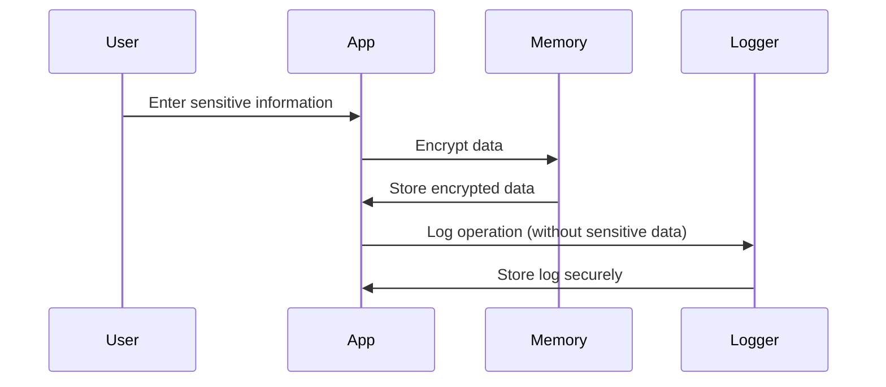

## 13.8 Handling Sensitive Information

In today's digital age, protecting sensitive information is paramount for any application, especially those built with Dart and Flutter. As developers, we must ensure that our applications handle data securely, both in memory and during logging. This section will guide you through best practices for managing sensitive information, focusing on in-memory security and logging practices.

### Introduction to Sensitive Information Handling

Sensitive information refers to any data that, if disclosed, could lead to harm or identity theft. This includes personal data like names, addresses, social security numbers, credit card details, and more. In the context of software development, handling such information securely is crucial to maintaining user trust and complying with legal regulations like GDPR or CCPA.

### In-Memory Security

In-memory security involves minimizing the exposure of sensitive data while it is stored in the application's memory. This is critical because memory can be accessed by malicious actors if not properly secured.

#### Why In-Memory Security Matters

When sensitive data is loaded into memory, it becomes vulnerable to various attacks, such as memory scraping or buffer overflow attacks. Ensuring that sensitive data is protected in memory helps prevent unauthorized access and data breaches.

#### Strategies for In-Memory Security

1. **Data Minimization**: Only load the necessary data into memory. Avoid storing sensitive information unless absolutely required.

2. **Data Encryption**: Encrypt sensitive data before storing it in memory. Use strong encryption algorithms to ensure data confidentiality.

3. **Secure Data Deletion**: Overwrite sensitive data in memory before deallocating it. This prevents data remnants from being accessed after deletion.

4. **Use of Secure Libraries**: Leverage secure libraries that handle sensitive data appropriately. These libraries often include built-in security measures.

5. **Avoid Hardcoding Sensitive Data**: Never hardcode sensitive information like API keys or passwords in your source code. Use environment variables or secure vaults instead.

6. **Regular Security Audits**: Conduct regular security audits to identify and mitigate potential vulnerabilities in your application's memory handling.

#### Code Example: Encrypting Data in Memory

Let's look at a simple example of encrypting sensitive data in memory using Dart's `encrypt` package.

```dart
import 'package:encrypt/encrypt.dart' as encrypt;

void main() {
  final key = encrypt.Key.fromLength(32);
  final iv = encrypt.IV.fromLength(16);

  final encrypter = encrypt.Encrypter(encrypt.AES(key));

  final sensitiveData = 'Sensitive Information';
  final encryptedData = encrypter.encrypt(sensitiveData, iv: iv);

  print('Encrypted Data: ${encryptedData.base64}');

  // Decrypting the data
  final decryptedData = encrypter.decrypt(encryptedData, iv: iv);
  print('Decrypted Data: $decryptedData');
}
```

In this example, we use the `encrypt` package to encrypt and decrypt sensitive information. The data is encrypted before being stored in memory, ensuring its confidentiality.

### Logging Practices

Logging is an essential part of application development, providing insights into application behavior and aiding in debugging. However, logging sensitive information can lead to data leaks if logs are accessed by unauthorized individuals.

#### Why Logging Practices Matter

Logs often contain detailed information about application operations. If sensitive data is logged, it can be exposed to anyone with access to the logs, leading to potential data breaches.

#### Best Practices for Secure Logging

1. **Avoid Logging Sensitive Information**: Never log sensitive data such as passwords, credit card numbers, or personal identification information.

2. **Use Log Redaction**: Implement log redaction to mask or remove sensitive information from logs.

3. **Secure Log Storage**: Store logs in a secure location with restricted access. Use encryption to protect log files.

4. **Log Rotation and Retention Policies**: Implement log rotation and retention policies to manage log size and duration. Regularly archive or delete old logs.

5. **Audit Logging**: Enable audit logging to track access to logs and detect unauthorized access attempts.

6. **Use Logging Libraries**: Utilize logging libraries that support secure logging practices, such as `logger` in Dart.

#### Code Example: Secure Logging with Dart's `logger` Package

Here's an example of using the `logger` package to implement secure logging practices.

```dart
import 'package:logger/logger.dart';

void main() {
  var logger = Logger(
    printer: PrettyPrinter(),
  );

  // Example of logging without sensitive information
  logger.i('User logged in successfully.');

  // Avoid logging sensitive information
  var sensitiveData = 'Sensitive Information';
  logger.w('Attempt to log sensitive data: [REDACTED]');
}
```

In this example, we use the `logger` package to log messages without exposing sensitive information. The sensitive data is redacted before logging.

### Visualizing Secure Data Handling

To better understand the flow of secure data handling, let's visualize the process using a sequence diagram.



This diagram illustrates the process of handling sensitive information securely. The data is encrypted before being stored in memory, and logging is performed without exposing sensitive data.

### Knowledge Check

Let's pause for a moment and reflect on what we've learned. Consider the following questions:

- Why is it important to encrypt sensitive data in memory?
- What are some best practices for secure logging?
- How can you ensure that sensitive data is not exposed in logs?

### Embrace the Journey

Remember, handling sensitive information securely is an ongoing process. As you continue to develop applications, keep security at the forefront of your mind. Regularly review and update your security practices to stay ahead of potential threats.

### References and Further Reading

For more information on handling sensitive information securely, consider the following resources:

- [OWASP Secure Coding Practices](https://owasp.org/www-project-secure-coding-practices-quick-reference-guide/)
- [Dart's `encrypt` Package Documentation](https://pub.dev/packages/encrypt)
- [Logger Package Documentation](https://pub.dev/packages/logger)

### Quiz Time!



### Why is in-memory security important?

- [x] To prevent unauthorized access to sensitive data
- [ ] To improve application performance
- [ ] To reduce memory usage
- [ ] To enhance user experience

> **Explanation:** In-memory security is crucial to prevent unauthorized access to sensitive data stored in memory.

### What is a best practice for logging sensitive information?

- [ ] Log all sensitive information for debugging
- [x] Avoid logging sensitive information
- [ ] Store logs in plain text
- [ ] Share logs with all team members

> **Explanation:** Avoid logging sensitive information to prevent data exposure through logs.

### How can you securely store logs?

- [x] Use encryption and restrict access
- [ ] Store logs in a public directory
- [ ] Disable log rotation
- [ ] Keep logs indefinitely

> **Explanation:** Secure log storage involves using encryption and restricting access to logs.

### What is the purpose of log redaction?

- [x] To mask or remove sensitive information from logs
- [ ] To increase log file size
- [ ] To improve log readability
- [ ] To enhance application performance

> **Explanation:** Log redaction is used to mask or remove sensitive information from logs.

### Which package can be used for encrypting data in Dart?

- [x] `encrypt`
- [ ] `http`
- [ ] `path`
- [ ] `flutter`

> **Explanation:** The `encrypt` package is used for encrypting data in Dart.

### What should you do before deallocating sensitive data in memory?

- [x] Overwrite it
- [ ] Log it
- [ ] Share it
- [ ] Ignore it

> **Explanation:** Overwriting sensitive data before deallocation prevents data remnants from being accessed.

### What is a benefit of using secure libraries?

- [x] They include built-in security measures
- [ ] They increase application size
- [ ] They slow down application performance
- [ ] They require more code

> **Explanation:** Secure libraries often include built-in security measures to handle sensitive data appropriately.

### What is a key consideration for log retention policies?

- [x] Regularly archive or delete old logs
- [ ] Keep logs indefinitely
- [ ] Store logs in plain text
- [ ] Disable log rotation

> **Explanation:** Log retention policies should include regularly archiving or deleting old logs to manage log size and duration.

### How can you ensure sensitive data is not exposed in logs?

- [x] Implement log redaction
- [ ] Log all data for transparency
- [ ] Share logs with all team members
- [ ] Store logs in a public directory

> **Explanation:** Implementing log redaction helps ensure sensitive data is not exposed in logs.

### True or False: Hardcoding sensitive data in source code is a secure practice.

- [ ] True
- [x] False

> **Explanation:** Hardcoding sensitive data in source code is not secure and should be avoided.



By following these best practices, you can ensure that your Dart and Flutter applications handle sensitive information securely, protecting both your users and your application from potential threats. Keep experimenting, stay curious, and enjoy the journey of mastering secure development!
