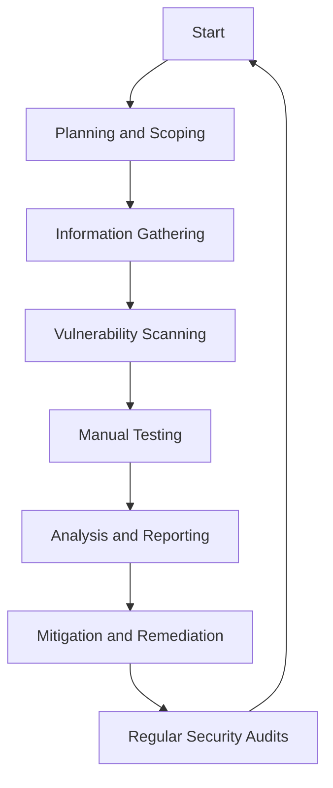

## 13.9 Security Testing and Best Practices

In the ever-evolving landscape of software development, security remains a paramount concern. As Dart and Flutter continue to gain traction for building cross-platform applications, ensuring the security of these applications is crucial. This section delves into the intricacies of security testing and best practices, providing you with the knowledge to safeguard your applications against potential threats.

### Introduction to Security Testing

Security testing is a process designed to uncover vulnerabilities, threats, and risks in software applications. It aims to ensure that the software is free from any loopholes that could be exploited by attackers. In the context of Dart and Flutter, security testing involves a combination of automated tools and manual techniques to identify and mitigate security risks.

#### Key Objectives of Security Testing

1. **Identify Vulnerabilities**: Detect potential security weaknesses in the application.
2. **Assess Impact**: Evaluate the potential impact of identified vulnerabilities.
3. **Mitigate Risks**: Implement measures to address and reduce security risks.
4. **Ensure Compliance**: Adhere to industry standards and regulations.

### Vulnerability Assessment

A vulnerability assessment is a systematic review of security weaknesses in an information system. It evaluates if the system is susceptible to any known vulnerabilities, assigns severity levels to those vulnerabilities, and recommends remediation or mitigation, if and whenever needed.

#### Steps in Vulnerability Assessment

1. **Planning and Scoping**: Define the scope of the assessment, including the systems and applications to be tested.
2. **Information Gathering**: Collect data about the application, including architecture, data flow, and dependencies.
3. **Vulnerability Scanning**: Use automated tools to scan for known vulnerabilities.
4. **Manual Testing**: Conduct manual tests to identify vulnerabilities that automated tools may miss.
5. **Analysis and Reporting**: Analyze the findings and prepare a detailed report with recommendations.

#### Tools for Vulnerability Assessment

- **OWASP ZAP**: An open-source tool for finding vulnerabilities in web applications.
- **Burp Suite**: A comprehensive platform for performing security testing of web applications.
- **Nessus**: A widely used vulnerability scanner that helps identify vulnerabilities, configuration issues, and malware.

### Secure Coding Practices

Secure coding practices are guidelines and techniques used to write code that is resistant to vulnerabilities and attacks. By following these practices, developers can reduce the risk of security breaches.

#### Key Secure Coding Practices

1. **Input Validation**: Always validate and sanitize user inputs to prevent injection attacks.
2. **Authentication and Authorization**: Implement robust authentication and authorization mechanisms to control access.
3. **Data Encryption**: Use encryption to protect sensitive data both at rest and in transit.
4. **Error Handling**: Handle errors gracefully without exposing sensitive information.
5. **Session Management**: Securely manage user sessions to prevent session hijacking.

#### Example: Input Validation in Dart

```dart
// Example of input validation in Dart
String sanitizeInput(String input) {
  // Remove any potentially harmful characters
  return input.replaceAll(RegExp(r'[^\w\s]'), '');
}

void main() {
  String userInput = "<script>alert('XSS');</script>";
  String safeInput = sanitizeInput(userInput);
  print(safeInput); // Output: scriptalertXSSscript
}
```

### Security Testing Techniques

Security testing involves various techniques to ensure comprehensive coverage of potential vulnerabilities. These techniques can be broadly categorized into static and dynamic testing.

#### Static Application Security Testing (SAST)

SAST involves analyzing the source code for vulnerabilities without executing the program. It helps identify security flaws early in the development lifecycle.

- **Code Review**: Manually review the code to identify security issues.
- **Static Analysis Tools**: Use tools like SonarQube to automatically scan the code for vulnerabilities.

#### Dynamic Application Security Testing (DAST)

DAST involves testing the application in a runtime environment to identify vulnerabilities that occur during execution.

- **Penetration Testing**: Simulate attacks to identify vulnerabilities.
- **Fuzz Testing**: Input random data to the application to find unexpected behavior.

### Best Practices for Security Testing

Implementing best practices in security testing ensures a robust security posture for your Dart and Flutter applications.

#### Regular Security Audits

Conduct regular security audits to identify and address vulnerabilities. This involves reviewing the application's security posture and making necessary improvements.

#### Continuous Integration and Continuous Deployment (CI/CD)

Integrate security testing into your CI/CD pipeline to ensure that security checks are performed automatically with every code change.

#### Security Training for Developers

Provide security training for developers to raise awareness about common security issues and best practices.

#### Threat Modeling

Perform threat modeling to identify potential threats and design security measures to mitigate them.

### Security Testing in Flutter

Flutter applications require specific considerations for security testing due to their unique architecture and cross-platform nature.

#### Secure Storage

Use secure storage solutions to store sensitive data, such as user credentials and tokens.

- **flutter_secure_storage**: A Flutter plugin for storing data securely on both Android and iOS.

#### Network Security

Ensure secure communication between the Flutter app and backend services.

- **HTTPS**: Always use HTTPS for network communication to encrypt data in transit.
- **Certificate Pinning**: Implement certificate pinning to prevent man-in-the-middle attacks.

#### Code Obfuscation

Obfuscate the Flutter application's code to make it difficult for attackers to reverse-engineer.

- **dart_obfuscator**: A tool for obfuscating Dart code to protect intellectual property.

### Visualizing Security Testing Workflow

Below is a diagram that illustrates the workflow of security testing in Dart and Flutter applications.



### Knowledge Check

To reinforce your understanding of security testing and best practices, consider the following questions:

1. What are the key objectives of security testing?
2. How does vulnerability assessment differ from penetration testing?
3. Why is input validation important in secure coding practices?
4. What are the benefits of integrating security testing into the CI/CD pipeline?
5. How can Flutter developers ensure secure storage of sensitive data?

### Conclusion

Security testing and best practices are essential components of the software development lifecycle. By implementing robust security measures and continuously testing for vulnerabilities, you can protect your Dart and Flutter applications from potential threats. Remember, security is an ongoing process, and staying informed about the latest security trends and techniques is crucial for maintaining a secure application.

## Quiz Time!



### What is the primary goal of security testing?

- [x] To identify and mitigate vulnerabilities in an application
- [ ] To improve application performance
- [ ] To enhance user interface design
- [ ] To increase application scalability

> **Explanation:** The primary goal of security testing is to identify and mitigate vulnerabilities in an application to protect it from potential threats.

### Which tool is commonly used for vulnerability scanning?

- [x] OWASP ZAP
- [ ] Flutter Inspector
- [ ] Dart Analyzer
- [ ] Firebase

> **Explanation:** OWASP ZAP is a widely used tool for vulnerability scanning in web applications.

### What is the purpose of input validation?

- [x] To prevent injection attacks by sanitizing user inputs
- [ ] To enhance application performance
- [ ] To improve code readability
- [ ] To increase application scalability

> **Explanation:** Input validation is crucial for preventing injection attacks by ensuring that user inputs are sanitized and safe for processing.

### What is the benefit of using HTTPS in network communication?

- [x] To encrypt data in transit and prevent eavesdropping
- [ ] To improve application performance
- [ ] To enhance user interface design
- [ ] To increase application scalability

> **Explanation:** HTTPS encrypts data in transit, providing a secure communication channel and preventing eavesdropping.

### Which practice helps prevent session hijacking?

- [x] Secure session management
- [ ] Code obfuscation
- [ ] Input validation
- [ ] Data encryption

> **Explanation:** Secure session management helps prevent session hijacking by ensuring that user sessions are managed securely.

### What is the role of threat modeling in security testing?

- [x] To identify potential threats and design mitigation measures
- [ ] To improve application performance
- [ ] To enhance user interface design
- [ ] To increase application scalability

> **Explanation:** Threat modeling involves identifying potential threats and designing security measures to mitigate them.

### Which tool is used for code obfuscation in Dart?

- [x] dart_obfuscator
- [ ] Flutter Inspector
- [ ] Dart Analyzer
- [ ] Firebase

> **Explanation:** dart_obfuscator is a tool used for obfuscating Dart code to protect intellectual property.

### What is the purpose of continuous integration in security testing?

- [x] To automate security checks with every code change
- [ ] To improve application performance
- [ ] To enhance user interface design
- [ ] To increase application scalability

> **Explanation:** Continuous integration automates security checks with every code change, ensuring that security is maintained throughout the development process.

### Why is secure storage important in Flutter applications?

- [x] To protect sensitive data such as user credentials and tokens
- [ ] To improve application performance
- [ ] To enhance user interface design
- [ ] To increase application scalability

> **Explanation:** Secure storage is important for protecting sensitive data, such as user credentials and tokens, in Flutter applications.

### True or False: Security testing is a one-time process.

- [ ] True
- [x] False

> **Explanation:** Security testing is an ongoing process that requires regular updates and assessments to ensure the application remains secure.


