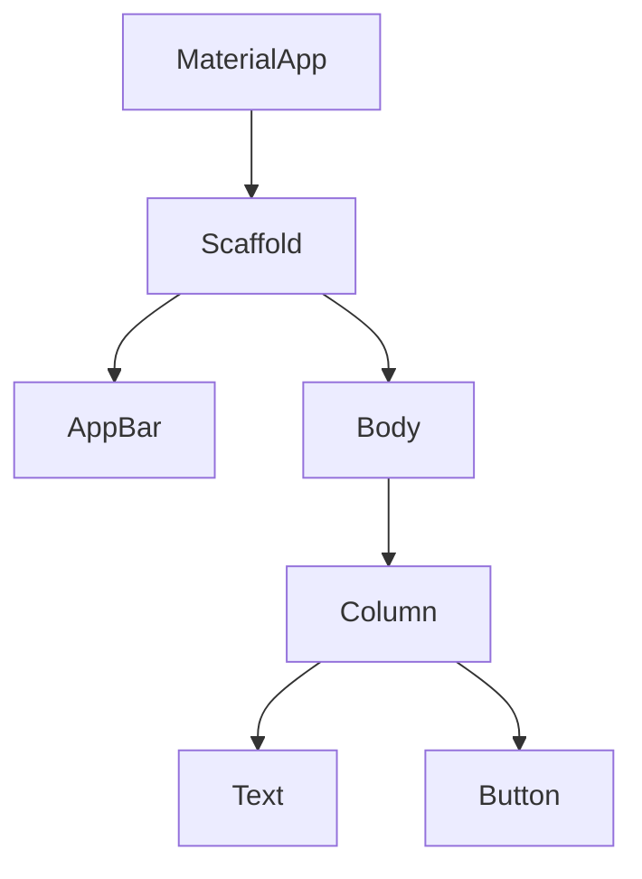
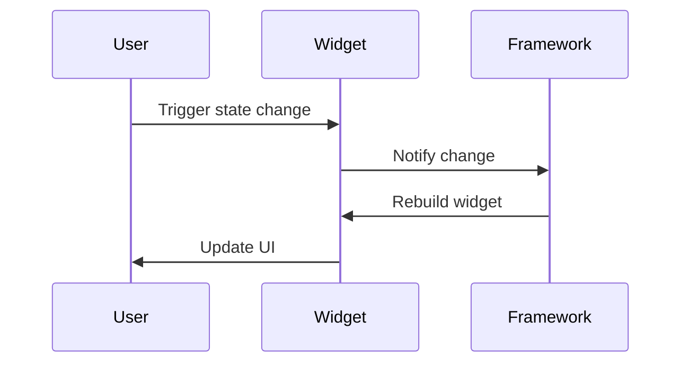

## 14.1 Widget Build Optimization in Flutter

In the world of Flutter development, optimizing widget builds is crucial for creating high-performance applications. As Flutter applications grow in complexity, the need to ensure smooth and efficient rendering becomes paramount. This section delves into the intricacies of widget build optimization, focusing on reducing unnecessary rebuilds and employing efficient build methods. By mastering these techniques, you can significantly enhance the performance of your Flutter applications.

### Understanding the Flutter Build Process

Before diving into optimization techniques, it's essential to understand how Flutter's build process works. In Flutter, the UI is built using a tree of widgets. Each widget describes a part of the user interface, and the framework efficiently renders these widgets on the screen.

#### The Widget Tree

The widget tree is a hierarchical structure where each widget is a node. The root node is typically the `MaterialApp` or `CupertinoApp`, and each child widget represents a part of the UI.



*Figure 1: A simple widget tree structure.*

#### The Build Method

Every widget has a `build` method that describes how to display the widget in terms of other, lower-level widgets. The `build` method is called whenever the widget needs to be rendered or re-rendered.

### Reducing Rebuilds

One of the most effective ways to optimize widget builds is by reducing unnecessary rebuilds. Rebuilds occur when the framework needs to update the UI in response to changes in the application state. While some rebuilds are necessary, excessive rebuilds can lead to performance bottlenecks.

#### Using `const` Constructors

One of the simplest yet most effective ways to reduce rebuilds is by using `const` constructors. A `const` constructor creates a compile-time constant, meaning the widget is immutable and can be reused without rebuilding.

```dart
class MyWidget extends StatelessWidget {
  const MyWidget({Key? key}) : super(key: key);

  @override
  Widget build(BuildContext context) {
    return const Text('Hello, World!');
  }
}
```

*Code Example 1: Using a `const` constructor to create an immutable widget.*

By marking widgets as `const`, you inform the Flutter framework that these widgets will not change, allowing it to optimize rendering by reusing the widget instance.

#### Splitting Widgets

Another technique to reduce rebuilds is to split large widgets into smaller, more manageable ones. This approach, known as widget decomposition, helps isolate changes to specific parts of the UI, minimizing the number of widgets that need to be rebuilt.

```dart
class ParentWidget extends StatelessWidget {
  @override
  Widget build(BuildContext context) {
    return Column(
      children: [
        const StaticWidget(),
        DynamicWidget(),
      ],
    );
  }
}

class StaticWidget extends StatelessWidget {
  const StaticWidget({Key? key}) : super(key: key);

  @override
  Widget build(BuildContext context) {
    return const Text('I am static');
  }
}

class DynamicWidget extends StatelessWidget {
  @override
  Widget build(BuildContext context) {
    return Text('I am dynamic');
  }
}
```

*Code Example 2: Splitting widgets to isolate static and dynamic parts.*

In this example, `StaticWidget` is marked as `const`, ensuring it doesn't rebuild unnecessarily, while `DynamicWidget` can change and rebuild independently.

### Efficient Build Methods

Efficient build methods are crucial for optimizing performance. Avoiding heavy computations during builds can significantly enhance the responsiveness of your application.

#### Avoiding Heavy Computations

The `build` method should be lightweight and free of heavy computations. Performing intensive tasks during the build process can lead to jank and slow rendering.

```dart
class HeavyComputationWidget extends StatelessWidget {
  @override
  Widget build(BuildContext context) {
    // Avoid doing this in the build method
    final result = performHeavyComputation();

    return Text('Result: $result');
  }

  int performHeavyComputation() {
    // Simulate a heavy computation
    return List.generate(1000000, (index) => index).reduce((a, b) => a + b);
  }
}
```

*Code Example 3: Avoid heavy computations in the build method.*

Instead, perform such computations outside the build method, perhaps in an asynchronous manner or using state management solutions to handle the results.

#### Leveraging State Management

State management solutions like `Provider`, `BLoC`, or `Riverpod` can help manage application state efficiently, ensuring that only the necessary parts of the UI are rebuilt when the state changes.

```dart
class CounterProvider with ChangeNotifier {
  int _count = 0;

  int get count => _count;

  void increment() {
    _count++;
    notifyListeners();
  }
}

class CounterWidget extends StatelessWidget {
  @override
  Widget build(BuildContext context) {
    final counter = Provider.of<CounterProvider>(context);

    return Column(
      children: [
        Text('Count: ${counter.count}'),
        ElevatedButton(
          onPressed: counter.increment,
          child: const Text('Increment'),
        ),
      ],
    );
  }
}
```

*Code Example 4: Using `Provider` for efficient state management.*

By using `Provider`, we ensure that only the widgets that depend on the `CounterProvider` are rebuilt when the count changes.

### Visualizing Widget Rebuilds

Understanding when and why widgets rebuild is crucial for optimization. Flutter provides tools like the `Flutter Inspector` to visualize widget rebuilds.



*Figure 2: Sequence of events during a widget rebuild.*

Using the `Flutter Inspector`, you can identify widgets that rebuild frequently and optimize them by applying the techniques discussed.

### Try It Yourself

Experiment with the code examples provided. Try marking different widgets as `const` and observe the impact on rebuilds. Split complex widgets into smaller ones and use state management solutions to handle state changes efficiently.

### Knowledge Check

- What is the purpose of using `const` constructors in Flutter?
- How can splitting widgets help reduce rebuilds?
- Why should heavy computations be avoided in the build method?
- How does state management contribute to efficient widget builds?

### Conclusion

Optimizing widget builds in Flutter is a critical aspect of performance optimization. By reducing unnecessary rebuilds and employing efficient build methods, you can create smooth and responsive applications. Remember, this is just the beginning. As you progress, you'll discover more advanced techniques to further enhance your Flutter development skills. Keep experimenting, stay curious, and enjoy the journey!

## Quiz Time!



### What is the primary benefit of using `const` constructors in Flutter?

- [x] Reducing unnecessary widget rebuilds
- [ ] Improving widget styling
- [ ] Simplifying widget hierarchy
- [ ] Enhancing widget interactivity

> **Explanation:** `const` constructors create compile-time constants, allowing widgets to be reused without rebuilding, thus reducing unnecessary rebuilds.

### How does splitting widgets help in optimization?

- [x] Isolates changes to specific parts of the UI
- [ ] Increases the number of widgets
- [ ] Makes the code more complex
- [ ] Reduces the need for state management

> **Explanation:** Splitting widgets isolates changes, minimizing the number of widgets that need to be rebuilt.

### Why should heavy computations be avoided in the build method?

- [x] To prevent jank and slow rendering
- [ ] To increase the complexity of the build method
- [ ] To ensure widgets are rebuilt frequently
- [ ] To make the build method more interactive

> **Explanation:** Heavy computations can lead to jank and slow rendering, so they should be avoided in the build method.

### Which state management solution is mentioned for efficient state handling?

- [x] Provider
- [ ] Redux
- [ ] MobX
- [ ] GetX

> **Explanation:** The `Provider` package is mentioned as a solution for efficient state management in Flutter.

### What tool does Flutter provide to visualize widget rebuilds?

- [x] Flutter Inspector
- [ ] Dart Analyzer
- [ ] Widget Builder
- [ ] State Manager

> **Explanation:** The `Flutter Inspector` is a tool provided by Flutter to visualize widget rebuilds and optimize performance.

### What is the role of the `build` method in a widget?

- [x] Describes how to display the widget
- [ ] Handles user input
- [ ] Manages application state
- [ ] Performs network requests

> **Explanation:** The `build` method describes how to display the widget in terms of other widgets.

### What is a common technique to reduce rebuilds in Flutter?

- [x] Using `const` constructors
- [ ] Increasing widget depth
- [ ] Adding more stateful widgets
- [ ] Removing all state management

> **Explanation:** Using `const` constructors is a common technique to reduce unnecessary widget rebuilds.

### How can state management solutions improve widget build efficiency?

- [x] By ensuring only necessary parts of the UI are rebuilt
- [ ] By increasing the number of rebuilds
- [ ] By making the UI more complex
- [ ] By removing all state dependencies

> **Explanation:** State management solutions ensure that only the necessary parts of the UI are rebuilt when the state changes.

### What is the impact of marking a widget as `const`?

- [x] The widget becomes immutable and reusable
- [ ] The widget becomes interactive
- [ ] The widget's style changes
- [ ] The widget's hierarchy is simplified

> **Explanation:** Marking a widget as `const` makes it immutable and reusable, reducing rebuilds.

### True or False: Splitting widgets into smaller ones always increases performance.

- [ ] True
- [x] False

> **Explanation:** While splitting widgets can reduce rebuilds, it doesn't always increase performance. It depends on how the widgets are used and managed.




