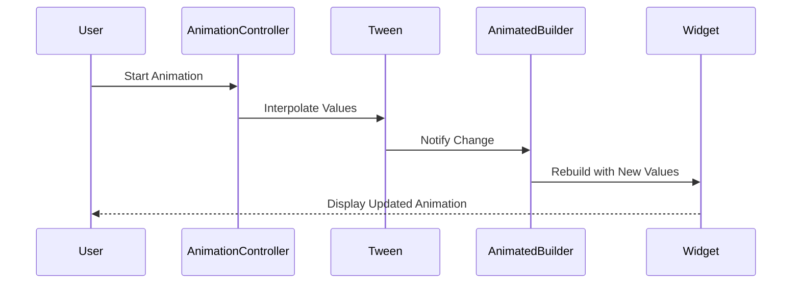

## 14.10 Best Practices for Smooth Animations

Animations are a crucial aspect of modern mobile applications, enhancing user experience by providing visual feedback and making interactions more intuitive. In Flutter, achieving smooth animations is essential to maintain a high-quality user experience. This section will guide you through best practices for creating smooth animations in Flutter, focusing on maintaining high frame rates and optimizing animations using Dart's capabilities.

### Understanding Flutter's Animation Framework

Before diving into best practices, it's important to understand Flutter's animation framework. Flutter provides a rich set of tools for creating animations, including:

- **AnimationController**: Manages the animation's duration and progress.
- **Tween**: Defines the interpolation between the start and end values.
- **AnimatedBuilder**: A widget that rebuilds when the animation changes.
- **Animation**: Represents the current state of an animation.

These components work together to create animations that are both efficient and easy to implement.

### Maintaining High Frame Rates

Maintaining a high frame rate is crucial for smooth animations. Flutter aims to render animations at 60 frames per second (fps) on most devices, which means each frame should be rendered in approximately 16 milliseconds. Here are some strategies to achieve this:

#### Reducing Work Per Frame

1. **Minimize Layout Changes**: Avoid unnecessary layout changes during animations. Use widgets like `AnimatedBuilder` to isolate changes to only the parts of the UI that need to be updated.

2. **Use Efficient Widgets**: Choose widgets that are optimized for performance. For example, prefer `Container` over `Stack` when possible, as `Container` is less computationally expensive.

3. **Precompute Values**: Precompute values that are used in animations to reduce the computational load during each frame. For example, calculate the positions of elements before starting the animation.

4. **Avoid Expensive Operations**: Operations like network requests or complex calculations should not be performed during animations. Offload these tasks to background threads or perform them before starting the animation.

#### Optimizing Animations

1. **Use Tween Animations**: Tween animations are efficient because they interpolate between two values. Use `Tween` and `AnimationController` to create smooth transitions.

2. **Leverage Implicit Animations**: Flutter provides implicit animations like `AnimatedOpacity` and `AnimatedContainer` that handle the animation details for you. These are optimized for performance and easy to use.

3. **Limit Repaints**: Use `RepaintBoundary` to limit the area of the screen that needs to be repainted during animations. This can significantly improve performance by reducing the workload on the GPU.

4. **Profile and Optimize**: Use Flutter's performance profiling tools to identify bottlenecks in your animations. The `Flutter DevTools` provides insights into frame rendering times and helps pinpoint areas for optimization.

### Code Example: Smooth Animation with AnimatedBuilder

Let's explore a code example that demonstrates a smooth animation using `AnimatedBuilder`:

```dart
import 'package:flutter/material.dart';

class SmoothAnimationExample extends StatefulWidget {
  @override
  _SmoothAnimationExampleState createState() => _SmoothAnimationExampleState();
}

class _SmoothAnimationExampleState extends State<SmoothAnimationExample> with SingleTickerProviderStateMixin {
  AnimationController _controller;
  Animation<double> _animation;

  @override
  void initState() {
    super.initState();
    _controller = AnimationController(
      duration: const Duration(seconds: 2),
      vsync: this,
    )..repeat(reverse: true);

    _animation = Tween<double>(begin: 0, end: 300).animate(_controller);
  }

  @override
  void dispose() {
    _controller.dispose();
    super.dispose();
  }

  @override
  Widget build(BuildContext context) {
    return Scaffold(
      appBar: AppBar(title: Text('Smooth Animation Example')),
      body: Center(
        child: AnimatedBuilder(
          animation: _animation,
          builder: (context, child) {
            return Container(
              width: _animation.value,
              height: _animation.value,
              color: Colors.blue,
            );
          },
        ),
      ),
    );
  }
}
```

In this example, we use `AnimatedBuilder` to create a smooth animation that scales a square from 0 to 300 pixels. The `AnimationController` manages the animation's duration and progress, while the `Tween` defines the interpolation between the start and end values.

### Visualizing Animation Workflow

To better understand the animation workflow in Flutter, let's visualize the process using a Mermaid.js sequence diagram:



This diagram illustrates the flow of an animation in Flutter, from the user initiating the animation to the widget being updated with new values.

### Best Practices for Animation Performance

1. **Use Hardware Acceleration**: Flutter automatically uses hardware acceleration for animations. Ensure your animations are GPU-friendly by avoiding complex operations on the CPU.

2. **Optimize Image Assets**: Use appropriately sized images and consider using vector graphics (e.g., SVG) for scalable assets. This reduces the load on the GPU and improves performance.

3. **Avoid Overdraw**: Overdraw occurs when pixels are drawn multiple times in a single frame. Use tools like `Flutter DevTools` to identify and reduce overdraw in your animations.

4. **Utilize Custom Paint**: For complex animations, consider using `CustomPaint` and `CustomPainter` to draw directly on the canvas. This provides more control over rendering and can improve performance.

5. **Manage State Efficiently**: Use state management solutions like `Provider` or `BLoC` to efficiently manage state changes during animations. This ensures that only necessary parts of the UI are updated.

### Try It Yourself: Experiment with Animations

To deepen your understanding of smooth animations in Flutter, try modifying the code example above:

- Change the duration of the animation to see how it affects smoothness.
- Experiment with different `Tween` values to create various animation effects.
- Add additional widgets to the animation and observe the impact on performance.

### Knowledge Check

- What is the role of `AnimationController` in Flutter animations?
- How can `RepaintBoundary` improve animation performance?
- What are the benefits of using implicit animations in Flutter?

### Summary

Achieving smooth animations in Flutter requires a combination of efficient coding practices and leveraging Flutter's powerful animation framework. By maintaining high frame rates, optimizing animations, and using tools like `Flutter DevTools`, you can create visually appealing and performant animations in your Flutter applications. Remember, this is just the beginning. As you continue to explore Flutter's animation capabilities, you'll discover new techniques and strategies to enhance your user interfaces. Keep experimenting, stay curious, and enjoy the journey!

## Quiz Time!



### What is the primary purpose of the AnimationController in Flutter?

- [x] To manage the animation's duration and progress
- [ ] To define the start and end values of an animation
- [ ] To rebuild the widget tree during animations
- [ ] To handle user input during animations

> **Explanation:** The AnimationController is responsible for managing the animation's duration and progress, allowing you to control the animation's lifecycle.

### How can RepaintBoundary improve animation performance?

- [x] By limiting the area of the screen that needs to be repainted
- [ ] By increasing the frame rate of animations
- [ ] By reducing the number of widgets in the widget tree
- [ ] By optimizing image assets for animations

> **Explanation:** RepaintBoundary helps improve performance by limiting the area of the screen that needs to be repainted during animations, reducing the workload on the GPU.

### What is the benefit of using implicit animations in Flutter?

- [x] They handle the animation details for you and are optimized for performance
- [ ] They allow for more complex animations with custom logic
- [ ] They provide more control over the animation's lifecycle
- [ ] They require less code to implement than explicit animations

> **Explanation:** Implicit animations in Flutter handle the animation details for you and are optimized for performance, making them easy to use and efficient.

### Which tool can be used to identify overdraw in Flutter animations?

- [x] Flutter DevTools
- [ ] Dart Analyzer
- [ ] Visual Studio Code
- [ ] Android Studio

> **Explanation:** Flutter DevTools provides insights into frame rendering times and helps identify overdraw in animations, allowing you to optimize performance.

### What is the role of Tween in Flutter animations?

- [x] To define the interpolation between the start and end values
- [ ] To manage the animation's duration and progress
- [ ] To rebuild the widget tree during animations
- [ ] To handle user input during animations

> **Explanation:** Tween defines the interpolation between the start and end values of an animation, allowing for smooth transitions.

### Why is it important to maintain high frame rates in animations?

- [x] To ensure smooth and visually appealing animations
- [ ] To reduce the computational load on the CPU
- [ ] To increase the number of widgets in the widget tree
- [ ] To optimize image assets for animations

> **Explanation:** Maintaining high frame rates is crucial for smooth and visually appealing animations, providing a better user experience.

### How can you optimize image assets for animations in Flutter?

- [x] Use appropriately sized images and consider using vector graphics
- [ ] Increase the resolution of images for better quality
- [ ] Use raster graphics for all image assets
- [ ] Avoid using images in animations

> **Explanation:** Using appropriately sized images and considering vector graphics can reduce the load on the GPU and improve animation performance.

### What is the benefit of using CustomPaint for complex animations?

- [x] It provides more control over rendering and can improve performance
- [ ] It simplifies the animation logic and reduces code complexity
- [ ] It automatically optimizes animations for performance
- [ ] It handles user input during animations

> **Explanation:** CustomPaint provides more control over rendering, allowing for optimized performance in complex animations.

### How can state management solutions like Provider improve animation performance?

- [x] By efficiently managing state changes during animations
- [ ] By reducing the number of widgets in the widget tree
- [ ] By increasing the frame rate of animations
- [ ] By optimizing image assets for animations

> **Explanation:** State management solutions like Provider efficiently manage state changes during animations, ensuring that only necessary parts of the UI are updated.

### True or False: Overdraw occurs when pixels are drawn multiple times in a single frame.

- [x] True
- [ ] False

> **Explanation:** Overdraw occurs when pixels are drawn multiple times in a single frame, which can negatively impact performance.


