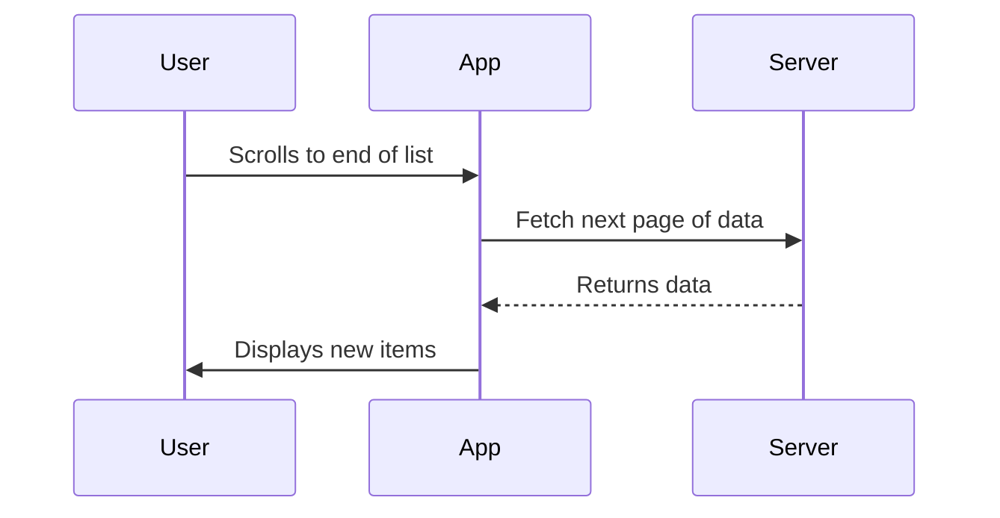

## 14.2 Lazy Loading and Pagination

In the world of mobile application development, performance and user experience are paramount. As applications grow in complexity and data volume, developers face the challenge of efficiently managing and displaying large datasets. This is where lazy loading and pagination come into play. These techniques are essential for optimizing performance and ensuring a smooth user experience, especially in data-intensive applications.

### Understanding Lazy Loading and Pagination

**Lazy Loading** is a design pattern that delays the loading of resources until they are actually needed. This approach is particularly useful in applications that handle large datasets or media files, as it reduces initial load time and memory consumption. By loading data on demand, lazy loading enhances application performance and responsiveness.

**Pagination**, on the other hand, is a technique used to divide a dataset into discrete pages or chunks. This allows users to navigate through data in manageable portions, improving both performance and usability. Pagination is often used in conjunction with lazy loading to further optimize data retrieval and display.

### The Importance of Lazy Loading and Pagination in Flutter

Flutter, a popular framework for building cross-platform mobile applications, provides several tools and widgets to implement lazy loading and pagination effectively. By leveraging these tools, developers can create applications that are not only performant but also provide a seamless user experience.

In this section, we will explore how to implement lazy loading and pagination in Flutter using `ListView.builder` and `FutureBuilder`. We will also discuss best practices for optimizing performance and enhancing user experience in Flutter applications.

### Implementing Lazy Loading with ListView.builder

`ListView.builder` is a powerful widget in Flutter that allows developers to create scrollable lists with lazy loading capabilities. Unlike `ListView`, which requires all items to be created upfront, `ListView.builder` creates items on demand as they are scrolled into view. This approach significantly reduces memory usage and improves performance, especially for large datasets.

#### Key Features of ListView.builder

- **Efficient Memory Usage**: By creating items only when they are needed, `ListView.builder` minimizes memory consumption.
- **Dynamic Item Creation**: Items are created dynamically based on the scroll position, allowing for efficient handling of large datasets.
- **Customizable Item Builder**: Developers can define custom item builders to create complex list items with ease.

#### Code Example: Implementing Lazy Loading with ListView.builder

Let's explore a simple example of using `ListView.builder` to implement lazy loading in a Flutter application.

```dart
import 'package:flutter/material.dart';

void main() => runApp(MyApp());

class MyApp extends StatelessWidget {
  @override
  Widget build(BuildContext context) {
    return MaterialApp(
      home: Scaffold(
        appBar: AppBar(title: Text('Lazy Loading with ListView.builder')),
        body: LazyLoadingList(),
      ),
    );
  }
}

class LazyLoadingList extends StatelessWidget {
  final List<String> items = List<String>.generate(1000, (i) => "Item $i");

  @override
  Widget build(BuildContext context) {
    return ListView.builder(
      itemCount: items.length,
      itemBuilder: (context, index) {
        return ListTile(
          title: Text(items[index]),
        );
      },
    );
  }
}
```

In this example, we create a list of 1000 items and use `ListView.builder` to display them. The `itemBuilder` function is called only for the items that are visible on the screen, ensuring efficient memory usage.

### Enhancing User Experience with FutureBuilder

While `ListView.builder` is excellent for lazy loading, it does not handle asynchronous data fetching. This is where `FutureBuilder` comes into play. `FutureBuilder` is a widget that builds itself based on the latest snapshot of interaction with a `Future`. It is particularly useful for handling asynchronous data fetching and displaying loading indicators while data is being retrieved.

#### Key Features of FutureBuilder

- **Asynchronous Data Handling**: `FutureBuilder` allows developers to handle asynchronous data fetching with ease.
- **Loading Indicators**: Developers can display loading indicators while data is being fetched, improving user experience.
- **Error Handling**: `FutureBuilder` provides mechanisms for handling errors during data fetching.

#### Code Example: Using FutureBuilder for Asynchronous Data Fetching

Let's explore an example of using `FutureBuilder` to fetch data asynchronously and display it in a `ListView`.

```dart
import 'package:flutter/material.dart';
import 'dart:async';

void main() => runApp(MyApp());

class MyApp extends StatelessWidget {
  @override
  Widget build(BuildContext context) {
    return MaterialApp(
      home: Scaffold(
        appBar: AppBar(title: Text('FutureBuilder Example')),
        body: FutureDataList(),
      ),
    );
  }
}

class FutureDataList extends StatelessWidget {
  Future<List<String>> fetchData() async {
    await Future.delayed(Duration(seconds: 2)); // Simulate network delay
    return List<String>.generate(20, (i) => "Fetched Item $i");
  }

  @override
  Widget build(BuildContext context) {
    return FutureBuilder<List<String>>(
      future: fetchData(),
      builder: (context, snapshot) {
        if (snapshot.connectionState == ConnectionState.waiting) {
          return Center(child: CircularProgressIndicator());
        } else if (snapshot.hasError) {
          return Center(child: Text('Error: ${snapshot.error}'));
        } else {
          return ListView.builder(
            itemCount: snapshot.data!.length,
            itemBuilder: (context, index) {
              return ListTile(
                title: Text(snapshot.data![index]),
              );
            },
          );
        }
      },
    );
  }
}
```

In this example, we simulate a network delay using `Future.delayed` and fetch a list of items. `FutureBuilder` is used to handle the asynchronous data fetching and display a loading indicator while the data is being retrieved.

### Combining Lazy Loading and Pagination

Lazy loading and pagination are often used together to optimize data retrieval and display. By dividing data into pages and loading them on demand, developers can create applications that are both performant and user-friendly.

#### Implementing Pagination with ListView.builder

To implement pagination with `ListView.builder`, we can use a combination of lazy loading and data fetching. The idea is to load a fixed number of items initially and fetch more items as the user scrolls to the end of the list.

#### Code Example: Implementing Pagination with ListView.builder

Let's explore an example of implementing pagination with `ListView.builder`.

```dart
import 'package:flutter/material.dart';

void main() => runApp(MyApp());

class MyApp extends StatelessWidget {
  @override
  Widget build(BuildContext context) {
    return MaterialApp(
      home: Scaffold(
        appBar: AppBar(title: Text('Pagination Example')),
        body: PaginatedList(),
      ),
    );
  }
}

class PaginatedList extends StatefulWidget {
  @override
  _PaginatedListState createState() => _PaginatedListState();
}

class _PaginatedListState extends State<PaginatedList> {
  final List<String> _items = [];
  bool _isLoading = false;
  int _currentPage = 0;
  final int _itemsPerPage = 20;

  @override
  void initState() {
    super.initState();
    _fetchMoreItems();
  }

  Future<void> _fetchMoreItems() async {
    if (_isLoading) return;
    setState(() {
      _isLoading = true;
    });

    // Simulate network delay
    await Future.delayed(Duration(seconds: 2));

    List<String> newItems = List<String>.generate(
        _itemsPerPage, (i) => "Item ${_currentPage * _itemsPerPage + i}");
    setState(() {
      _items.addAll(newItems);
      _isLoading = false;
      _currentPage++;
    });
  }

  @override
  Widget build(BuildContext context) {
    return ListView.builder(
      itemCount: _items.length + 1,
      itemBuilder: (context, index) {
        if (index == _items.length) {
          _fetchMoreItems();
          return Center(child: CircularProgressIndicator());
        }
        return ListTile(
          title: Text(_items[index]),
        );
      },
    );
  }
}
```

In this example, we implement pagination by fetching a fixed number of items per page and loading more items as the user scrolls to the end of the list. A loading indicator is displayed while new items are being fetched.

### Best Practices for Lazy Loading and Pagination

To ensure optimal performance and user experience, consider the following best practices when implementing lazy loading and pagination in Flutter applications:

- **Optimize Data Fetching**: Use efficient data fetching techniques to minimize network latency and reduce load times.
- **Use Caching**: Implement caching mechanisms to store frequently accessed data locally, reducing the need for repeated network requests.
- **Handle Errors Gracefully**: Provide meaningful error messages and fallback mechanisms to handle network errors and data fetching issues.
- **Test on Real Devices**: Test your application on real devices to ensure smooth performance and responsiveness across different platforms and screen sizes.

### Visualizing Lazy Loading and Pagination

To better understand the flow of lazy loading and pagination, let's visualize the process using a sequence diagram.



This diagram illustrates the interaction between the user, the application, and the server during the lazy loading and pagination process. As the user scrolls to the end of the list, the application requests the next page of data from the server and displays the new items once they are retrieved.

### Try It Yourself

Now that we've explored lazy loading and pagination in Flutter, it's time to try it yourself. Experiment with the code examples provided and make modifications to suit your application's needs. Consider the following challenges:

- **Modify the Pagination Example**: Change the number of items per page and observe the impact on performance and user experience.
- **Implement Caching**: Add a caching mechanism to store fetched data locally and reduce network requests.
- **Handle Errors**: Implement error handling in the pagination example to display meaningful error messages when data fetching fails.

### Conclusion

Lazy loading and pagination are essential techniques for optimizing performance and enhancing user experience in Flutter applications. By leveraging `ListView.builder` and `FutureBuilder`, developers can efficiently manage large datasets and create applications that are both performant and user-friendly. Remember, this is just the beginning. As you progress, you'll build more complex and interactive applications. Keep experimenting, stay curious, and enjoy the journey!

## Quiz Time!



### What is the primary benefit of using lazy loading in Flutter applications?

- [x] Reduces initial load time and memory consumption
- [ ] Increases the complexity of the code
- [ ] Decreases application performance
- [ ] Requires more network requests

> **Explanation:** Lazy loading delays the loading of resources until they are needed, reducing initial load time and memory consumption.

### Which Flutter widget is commonly used for implementing lazy loading in lists?

- [x] ListView.builder
- [ ] ListView
- [ ] GridView
- [ ] Column

> **Explanation:** ListView.builder creates items on demand as they are scrolled into view, making it ideal for lazy loading.

### What is the role of FutureBuilder in Flutter?

- [x] Handles asynchronous data fetching and displays loading indicators
- [ ] Creates static lists
- [ ] Manages stateful widgets
- [ ] Optimizes image loading

> **Explanation:** FutureBuilder builds itself based on the latest snapshot of interaction with a Future, handling asynchronous data fetching and displaying loading indicators.

### How does pagination improve user experience in mobile applications?

- [x] Divides data into manageable portions for easier navigation
- [ ] Increases the number of network requests
- [ ] Reduces application performance
- [ ] Requires more memory

> **Explanation:** Pagination divides data into discrete pages, allowing users to navigate through data in manageable portions, improving performance and usability.

### In the pagination example, what triggers the fetching of more items?

- [x] Scrolling to the end of the list
- [ ] Clicking a button
- [ ] Opening the application
- [ ] Refreshing the page

> **Explanation:** In the pagination example, more items are fetched as the user scrolls to the end of the list.

### What is a best practice for optimizing data fetching in Flutter applications?

- [x] Use efficient data fetching techniques to minimize network latency
- [ ] Fetch all data at once
- [ ] Avoid using caching mechanisms
- [ ] Ignore error handling

> **Explanation:** Efficient data fetching techniques minimize network latency and reduce load times, optimizing performance.

### How can caching improve the performance of a Flutter application?

- [x] Reduces the need for repeated network requests
- [ ] Increases memory usage
- [ ] Slows down data retrieval
- [ ] Complicates error handling

> **Explanation:** Caching stores frequently accessed data locally, reducing the need for repeated network requests and improving performance.

### What should developers do to ensure smooth performance across different platforms?

- [x] Test the application on real devices
- [ ] Only test on emulators
- [ ] Ignore platform-specific optimizations
- [ ] Use the same code for all platforms

> **Explanation:** Testing on real devices ensures smooth performance and responsiveness across different platforms and screen sizes.

### Which of the following is NOT a feature of ListView.builder?

- [ ] Efficient memory usage
- [ ] Dynamic item creation
- [ ] Customizable item builder
- [x] Handles asynchronous data fetching

> **Explanation:** ListView.builder does not handle asynchronous data fetching; FutureBuilder is used for that purpose.

### True or False: Lazy loading and pagination are only useful for large datasets.

- [x] True
- [ ] False

> **Explanation:** Lazy loading and pagination are particularly useful for large datasets, as they optimize performance and enhance user experience by managing data efficiently.


