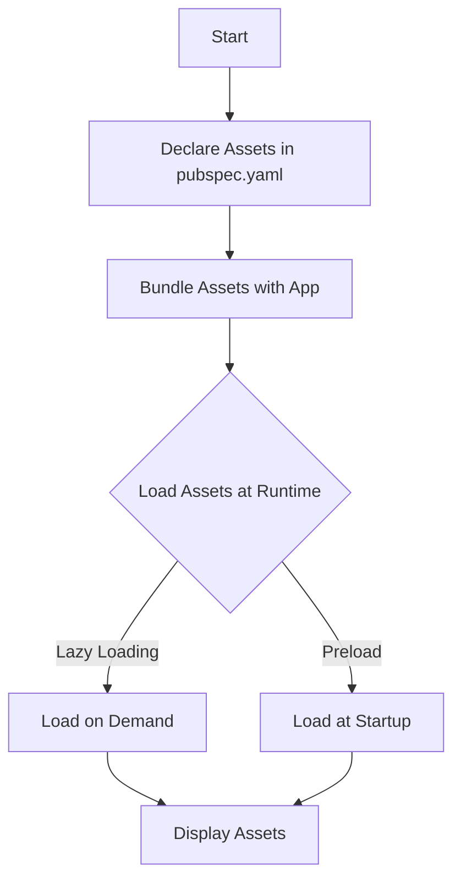

## 14.3 Image and Asset Optimization

In the realm of mobile app development, particularly with Flutter, optimizing images and assets is crucial for enhancing performance, reducing app size, and ensuring a smooth user experience. This section delves into the strategies and techniques for effective image and asset optimization, focusing on reducing app size, efficient asset loading, and managing assets for different screen densities.

### Introduction to Image and Asset Optimization

Image and asset optimization is a critical aspect of mobile app development. It involves compressing images, choosing the right formats, and managing assets efficiently to ensure that apps are lightweight, fast, and responsive. In Flutter, where the visual appeal is paramount, optimizing these resources can significantly impact the app's performance and user satisfaction.

### Reducing App Size

Reducing the size of your Flutter app is essential for several reasons: it decreases download times, saves storage space on users' devices, and can improve app performance. Let's explore some strategies to achieve this.

#### Compressing Images

Image compression is one of the most effective ways to reduce app size. By compressing images, you can significantly decrease their file size without compromising quality. There are two main types of image compression:

1. **Lossy Compression**: This method reduces file size by removing some image data, which can result in a slight loss of quality. Formats like JPEG use lossy compression.

2. **Lossless Compression**: This method reduces file size without losing any image data, preserving the original quality. Formats like PNG use lossless compression.

##### Tools for Image Compression

- **TinyPNG**: A popular tool for compressing PNG and JPEG images. It uses smart lossy compression techniques to reduce file size.
- **ImageMagick**: A command-line tool that provides a wide range of image manipulation capabilities, including compression.
- **Squoosh**: An open-source image compression web app by Google that supports various formats and compression levels.

##### Code Example: Using ImageMagick for Compression

```bash
convert input.jpg -quality 85 output.jpg

convert input.png -strip -quality 85 output.png
```

#### Choosing the Right Image Formats

Selecting the appropriate image format is crucial for balancing quality and file size. Here are some guidelines:

- **JPEG**: Best for photographs and images with gradients. It offers good compression with acceptable quality loss.
- **PNG**: Ideal for images with transparency or when lossless compression is required.
- **WebP**: A modern image format that provides superior compression for both lossy and lossless images. It's supported in Flutter and is a great choice for reducing app size.

#### Implementing WebP in Flutter

To use WebP images in your Flutter app, ensure that your assets are in the correct format and update your `pubspec.yaml` file to include them.

```yaml
flutter:
  assets:
    - assets/images/example.webp
```

### Efficient Asset Loading

Efficient asset loading is vital for improving app performance and reducing load times. Flutter provides several mechanisms to manage assets effectively.

#### Asset Bundling

Flutter's asset bundling feature allows you to package images and other resources with your app. This ensures that assets are available offline and can be loaded quickly.

##### Code Example: Declaring Assets in `pubspec.yaml`

```yaml
flutter:
  assets:
    - assets/images/
    - assets/icons/
```

#### Lazy Loading

Lazy loading is a technique where assets are loaded only when they are needed. This can significantly improve initial load times and reduce memory usage.

##### Implementing Lazy Loading in Flutter

Use the `Image.network` widget for images that need to be fetched from the internet. This widget supports lazy loading by default.

```dart
Image.network(
  'https://example.com/image.png',
  loadingBuilder: (BuildContext context, Widget child, ImageChunkEvent? loadingProgress) {
    if (loadingProgress == null) {
      return child;
    } else {
      return Center(
        child: CircularProgressIndicator(
          value: loadingProgress.expectedTotalBytes != null
              ? loadingProgress.cumulativeBytesLoaded / (loadingProgress.expectedTotalBytes ?? 1)
              : null,
        ),
      );
    }
  },
)
```

### Managing Assets for Different Screen Densities

Flutter supports multiple screen densities, allowing you to provide different asset versions for various device resolutions. This ensures that images appear crisp and clear on all devices.

#### Understanding Screen Densities

Screen density refers to the number of pixels within a physical area of the screen, usually measured in dots per inch (DPI). Flutter categorizes screen densities into:

- **ldpi** (low)
- **mdpi** (medium)
- **hdpi** (high)
- **xhdpi** (extra-high)
- **xxhdpi** (extra-extra-high)
- **xxxhdpi** (extra-extra-extra-high)

#### Providing Assets for Different Densities

To support different screen densities, create separate directories for each density and place appropriately sized images in each.

##### Directory Structure Example

```
assets/
  images/
    mdpi/
      icon.png
    hdpi/
      icon.png
    xhdpi/
      icon.png
```

##### Declaring Density-Specific Assets in `pubspec.yaml`

```yaml
flutter:
  assets:
    - assets/images/mdpi/icon.png
    - assets/images/hdpi/icon.png
    - assets/images/xhdpi/icon.png
```

### Advanced Techniques for Image and Asset Optimization

Beyond the basics, there are advanced techniques that can further optimize images and assets in Flutter applications.

#### Image Sprites

Image sprites combine multiple images into a single file, reducing the number of HTTP requests needed to load images. This can improve load times and reduce bandwidth usage.

##### Implementing Image Sprites

Use CSS or Flutter's `CustomPainter` to display specific parts of the sprite as needed.

#### Vector Graphics

Vector graphics, such as SVGs, are resolution-independent and can be scaled without losing quality. They are ideal for icons and simple illustrations.

##### Using SVGs in Flutter

To use SVGs in Flutter, add the `flutter_svg` package to your project.

```yaml
dependencies:
  flutter_svg: ^1.0.0
```

##### Code Example: Displaying an SVG

```dart
import 'package:flutter_svg/flutter_svg.dart';

SvgPicture.asset(
  'assets/icons/example.svg',
  width: 100,
  height: 100,
)
```

### Visualizing Asset Management in Flutter

To better understand how assets are managed in Flutter, let's visualize the process using a Mermaid.js diagram.



**Diagram Description**: This flowchart illustrates the process of managing assets in a Flutter application, from declaration in `pubspec.yaml` to runtime loading and display.

### Best Practices for Image and Asset Optimization

1. **Use Appropriate Formats**: Choose the right image format based on the use case (e.g., JPEG for photos, PNG for transparency, WebP for modern compression).
2. **Optimize Image Sizes**: Use tools to compress images without losing quality.
3. **Leverage Lazy Loading**: Load assets only when needed to improve performance.
4. **Support Multiple Densities**: Provide assets for different screen densities to ensure quality across devices.
5. **Consider Vector Graphics**: Use SVGs for icons and simple graphics to maintain quality at any size.
6. **Minimize HTTP Requests**: Use image sprites to reduce the number of requests needed to load images.

### Try It Yourself

Experiment with the concepts discussed in this section by optimizing images in your own Flutter project. Try compressing images, using WebP format, and implementing lazy loading. Observe the impact on app size and performance.

### Knowledge Check

- What are the differences between lossy and lossless compression?
- How does lazy loading improve app performance?
- Why is it important to provide assets for different screen densities?
- What are the benefits of using vector graphics in Flutter?

### Embrace the Journey

Remember, optimizing images and assets is an ongoing process. As you continue to develop your Flutter applications, keep experimenting with different techniques and tools to find the best solutions for your needs. Stay curious, and enjoy the journey of creating efficient and high-performing apps!

## Quiz Time!



### What is the primary benefit of using WebP format for images in Flutter?

- [x] Superior compression for both lossy and lossless images
- [ ] It is the only format supported by Flutter
- [ ] It provides better quality than PNG
- [ ] It is faster to load than JPEG

> **Explanation:** WebP offers superior compression for both lossy and lossless images, making it a great choice for reducing app size without compromising quality.

### Which tool is commonly used for image compression in Flutter development?

- [ ] Photoshop
- [x] TinyPNG
- [ ] Sketch
- [ ] Figma

> **Explanation:** TinyPNG is a popular tool for compressing PNG and JPEG images, using smart lossy compression techniques to reduce file size.

### What is lazy loading in the context of Flutter asset management?

- [x] Loading assets only when they are needed
- [ ] Preloading all assets at startup
- [ ] Loading assets in the background
- [ ] Loading assets in a random order

> **Explanation:** Lazy loading refers to loading assets only when they are needed, which can significantly improve initial load times and reduce memory usage.

### Why is it important to provide assets for different screen densities in Flutter?

- [x] To ensure images appear crisp and clear on all devices
- [ ] To reduce the number of assets needed
- [ ] To make the app compatible with older devices
- [ ] To improve app security

> **Explanation:** Providing assets for different screen densities ensures that images appear crisp and clear on all devices, enhancing the user experience.

### What is the advantage of using SVGs in Flutter applications?

- [x] They are resolution-independent and can be scaled without losing quality
- [ ] They are faster to load than JPEGs
- [ ] They are the only format supported by Flutter
- [ ] They are easier to create than PNGs

> **Explanation:** SVGs are resolution-independent and can be scaled without losing quality, making them ideal for icons and simple illustrations.

### How can image sprites improve app performance?

- [x] By reducing the number of HTTP requests needed to load images
- [ ] By increasing the quality of images
- [ ] By making images load faster
- [ ] By compressing images automatically

> **Explanation:** Image sprites combine multiple images into a single file, reducing the number of HTTP requests needed to load images, which can improve load times and reduce bandwidth usage.

### What is the role of `pubspec.yaml` in Flutter asset management?

- [x] It declares the assets to be bundled with the app
- [ ] It compresses images automatically
- [ ] It loads assets at runtime
- [ ] It manages app dependencies

> **Explanation:** The `pubspec.yaml` file declares the assets to be bundled with the app, ensuring they are available offline and can be loaded quickly.

### Which image format is best for photographs and images with gradients?

- [x] JPEG
- [ ] PNG
- [ ] SVG
- [ ] WebP

> **Explanation:** JPEG is best for photographs and images with gradients, offering good compression with acceptable quality loss.

### What is the main difference between lossy and lossless compression?

- [x] Lossy compression removes some image data, while lossless compression preserves all image data
- [ ] Lossy compression is faster than lossless compression
- [ ] Lossless compression reduces file size more than lossy compression
- [ ] Lossy compression is only used for audio files

> **Explanation:** Lossy compression removes some image data, which can result in a slight loss of quality, while lossless compression preserves all image data, maintaining the original quality.

### True or False: Vector graphics are ideal for complex images with many colors.

- [ ] True
- [x] False

> **Explanation:** Vector graphics are ideal for icons and simple illustrations, not complex images with many colors, as they are resolution-independent and can be scaled without losing quality.




