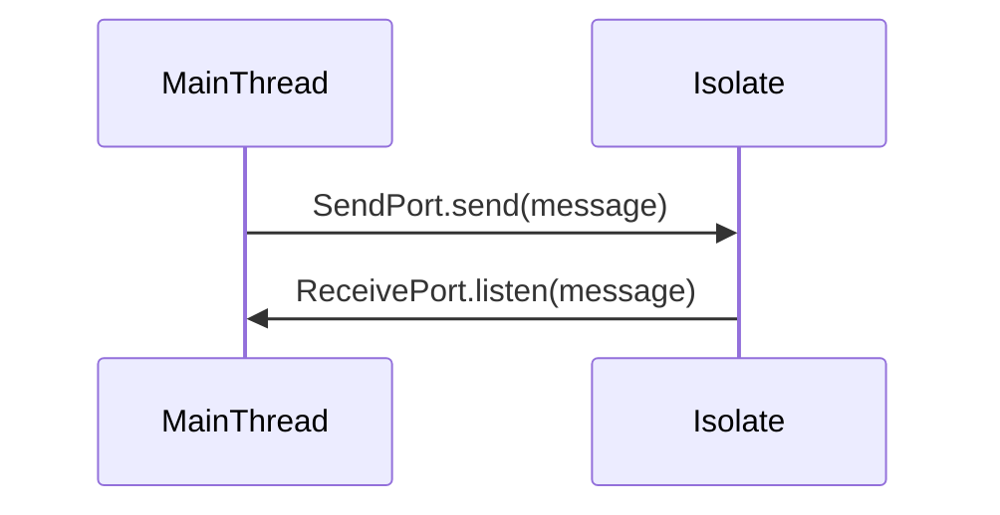
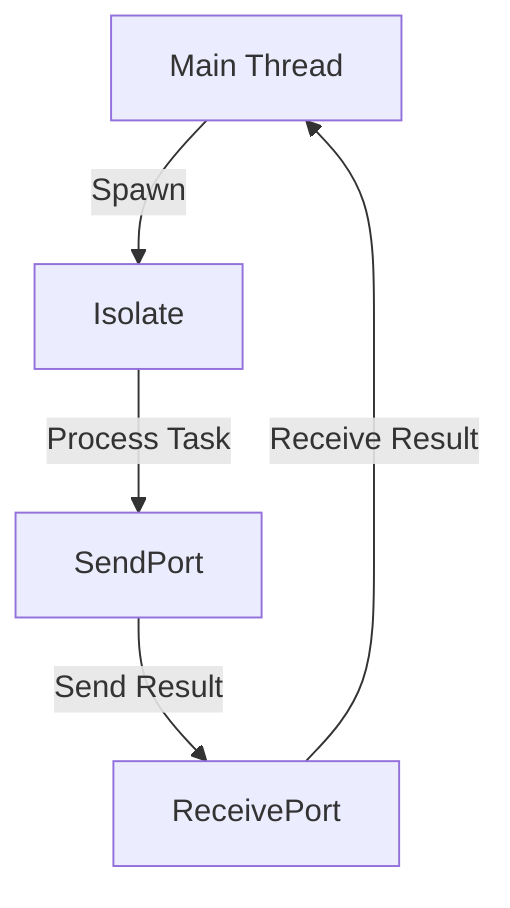

## 14.4 Efficient Use of Isolates

In the realm of Dart and Flutter development, efficient use of isolates is a cornerstone for achieving high-performance applications. Isolates are Dart's way of handling concurrency, allowing you to run multiple tasks in parallel without blocking the main thread. This section will delve into the intricacies of isolates, their role in parallel processing, and how to leverage them effectively using the `compute()` function in Flutter.

### Understanding Isolates in Dart

#### What are Isolates?

Isolates are independent workers that run in their own memory space. Unlike threads in other programming languages, isolates do not share memory, which eliminates the need for locks and reduces the risk of race conditions. Each isolate has its own event loop and can communicate with other isolates via message passing.

#### Why Use Isolates?

- **Concurrency**: Isolates enable concurrent execution of code, which is crucial for performance-intensive tasks.
- **Non-blocking UI**: By offloading heavy computations to isolates, you can keep the UI responsive.
- **Scalability**: Isolates can be scaled to handle multiple tasks simultaneously, making them ideal for complex applications.

### Parallel Processing with Isolates

#### Offloading Heavy Tasks

One of the primary uses of isolates is to offload heavy tasks that would otherwise block the main thread. This includes tasks like image processing, data parsing, and complex calculations.

**Example: Image Processing**

```dart
import 'dart:isolate';

void imageProcessing(SendPort sendPort) {
  // Perform heavy image processing task
  final result = 'Processed Image';
  sendPort.send(result);
}

void main() async {
  final receivePort = ReceivePort();
  await Isolate.spawn(imageProcessing, receivePort.sendPort);

  receivePort.listen((message) {
    print('Received: $message');
    receivePort.close();
  });
}
```

In this example, the `imageProcessing` function is executed in a separate isolate, allowing the main thread to remain responsive.

#### Communication Between Isolates

Isolates communicate via message passing. This is achieved using `SendPort` and `ReceivePort`. The `SendPort` is used to send messages to another isolate, while the `ReceivePort` listens for incoming messages.

**Diagram: Isolate Communication**



### Simplifying Isolate Usage with `compute()`

#### What is `compute()`?

The `compute()` function is a Flutter utility that simplifies the process of spawning isolates. It abstracts the complexity of managing `SendPort` and `ReceivePort`, making it easier to perform tasks in parallel.

#### Using `compute()` in Flutter

The `compute()` function takes two arguments: the function to be executed in the isolate and the argument to be passed to that function.

**Example: JSON Parsing**

```dart
import 'dart:convert';
import 'package:flutter/foundation.dart';

Future<Map<String, dynamic>> parseJson(String jsonString) async {
  return compute(_parseAndDecode, jsonString);
}

Map<String, dynamic> _parseAndDecode(String responseBody) {
  return jsonDecode(responseBody);
}

void main() async {
  final jsonString = '{"name": "John", "age": 30}';
  final result = await parseJson(jsonString);
  print(result); // Output: {name: John, age: 30}
}
```

In this example, the JSON parsing task is offloaded to an isolate using the `compute()` function, ensuring the main thread remains unblocked.

### Design Considerations for Using Isolates

#### When to Use Isolates

- **Heavy Computations**: Use isolates for tasks that require significant processing power.
- **I/O Operations**: Offload I/O operations to isolates to prevent blocking the main thread.
- **Background Tasks**: Run background tasks in isolates to improve application responsiveness.

#### Pitfalls to Avoid

- **Overhead**: Spawning isolates has an overhead. Avoid using isolates for lightweight tasks.
- **State Management**: Isolates do not share memory, so managing shared state can be challenging.
- **Message Passing**: Ensure efficient message passing to avoid bottlenecks.

### Advanced Isolate Techniques

#### Isolate Groups

Dart 2.15 introduced isolate groups, allowing isolates to share code and resources more efficiently. This reduces the overhead of spawning new isolates and improves performance.

#### Error Handling in Isolates

Handling errors in isolates requires careful consideration. Use `ReceivePort` to listen for error messages and handle them appropriately.

**Example: Error Handling**

```dart
import 'dart:isolate';

void faultyTask(SendPort sendPort) {
  try {
    throw Exception('An error occurred');
  } catch (e) {
    sendPort.send(e.toString());
  }
}

void main() async {
  final receivePort = ReceivePort();
  await Isolate.spawn(faultyTask, receivePort.sendPort);

  receivePort.listen((message) {
    print('Error: $message');
    receivePort.close();
  });
}
```

### Visualizing Isolate Workflow

**Diagram: Isolate Workflow**



This diagram illustrates the workflow of an isolate, from spawning to message passing and receiving results.

### Try It Yourself

Experiment with the provided code examples by modifying the tasks performed in the isolates. Try offloading different types of computations and observe the impact on application performance.

### References and Further Reading

- [Dart Isolates Documentation](https://dart.dev/guides/libraries/concurrency)
- [Flutter Compute Function](https://api.flutter.dev/flutter/foundation/compute.html)

### Knowledge Check

- What are isolates, and how do they differ from threads?
- How does the `compute()` function simplify isolate usage in Flutter?
- What are some common pitfalls to avoid when using isolates?

### Embrace the Journey

Remember, mastering isolates is a journey. As you experiment and gain experience, you'll unlock the full potential of Dart's concurrency model. Keep exploring, stay curious, and enjoy the process!

## Quiz Time!



### What is the primary purpose of using isolates in Dart?

- [x] To enable concurrent execution of code
- [ ] To share memory between tasks
- [ ] To simplify UI design
- [ ] To manage network requests

> **Explanation:** Isolates are used to enable concurrent execution of code without sharing memory, which helps in keeping the UI responsive.

### How do isolates communicate with each other?

- [x] Through message passing using SendPort and ReceivePort
- [ ] By sharing memory
- [ ] Using global variables
- [ ] Through direct method calls

> **Explanation:** Isolates communicate via message passing using SendPort and ReceivePort, as they do not share memory.

### What function in Flutter simplifies the use of isolates?

- [x] compute()
- [ ] spawn()
- [ ] run()
- [ ] execute()

> **Explanation:** The `compute()` function in Flutter simplifies the use of isolates by abstracting the complexity of message passing.

### What is a potential drawback of using isolates?

- [x] Overhead of spawning isolates
- [ ] Increased memory sharing
- [ ] Simplified error handling
- [ ] Direct access to UI components

> **Explanation:** Spawning isolates has an overhead, so they should not be used for lightweight tasks.

### Which of the following tasks is suitable for isolates?

- [x] Heavy computations
- [ ] Simple arithmetic operations
- [ ] UI rendering
- [ ] Network requests

> **Explanation:** Isolates are suitable for heavy computations that would otherwise block the main thread.

### What is the role of the `ReceivePort` in isolates?

- [x] To listen for incoming messages
- [ ] To send messages to other isolates
- [ ] To manage shared memory
- [ ] To execute tasks

> **Explanation:** The `ReceivePort` listens for incoming messages from other isolates.

### How can you handle errors in isolates?

- [x] By using ReceivePort to listen for error messages
- [ ] By catching exceptions globally
- [ ] By using shared memory
- [ ] By ignoring them

> **Explanation:** Errors in isolates can be handled by using ReceivePort to listen for error messages.

### What is a new feature introduced in Dart 2.15 related to isolates?

- [x] Isolate groups
- [ ] Shared memory
- [ ] Direct UI access
- [ ] Simplified error handling

> **Explanation:** Dart 2.15 introduced isolate groups, allowing isolates to share code and resources more efficiently.

### True or False: Isolates in Dart share memory.

- [ ] True
- [x] False

> **Explanation:** Isolates do not share memory; they communicate via message passing.

### What is the benefit of using the `compute()` function in Flutter?

- [x] It abstracts the complexity of managing SendPort and ReceivePort
- [ ] It allows direct memory sharing
- [ ] It simplifies UI design
- [ ] It manages network requests automatically

> **Explanation:** The `compute()` function abstracts the complexity of managing SendPort and ReceivePort, making it easier to perform tasks in parallel.




