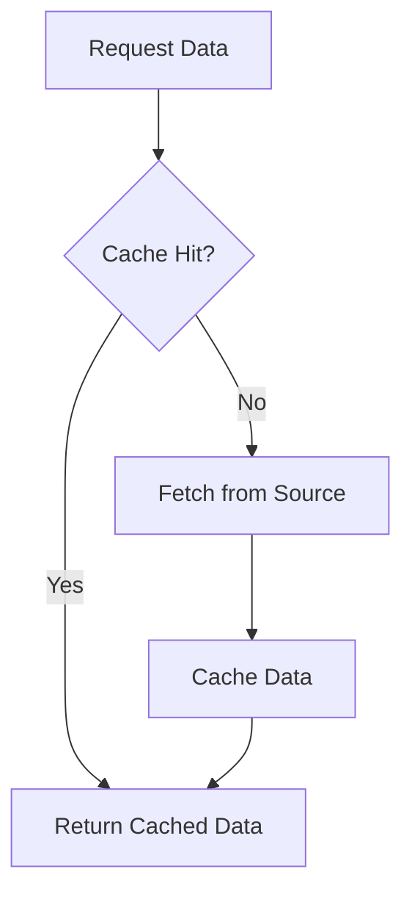

## 14.5 Caching Strategies

In the world of software development, especially in mobile and web applications, performance is a critical factor that can make or break user experience. One of the most effective ways to enhance performance and responsiveness is through caching. In this section, we will delve into caching strategies specifically tailored for Dart and Flutter applications. We will explore the concepts of in-memory and disk caching, discuss cache invalidation techniques, and provide best practices for implementing efficient caching mechanisms.

### Understanding Caching

Caching is a technique used to store copies of data in a temporary storage location, known as a cache, so that future requests for that data can be served faster. By reducing the need to fetch data from the original source repeatedly, caching can significantly improve application performance and reduce latency.

#### Key Concepts

- **Cache Hit**: When requested data is found in the cache, resulting in faster access.
- **Cache Miss**: When requested data is not found in the cache, requiring retrieval from the original source.
- **Cache Invalidation**: The process of removing outdated or stale data from the cache to ensure data freshness.

### Types of Caching

In Dart and Flutter applications, caching can be implemented in various forms, each with its own use cases and benefits. The two primary types of caching are in-memory caching and disk caching.

#### In-Memory Caching

In-memory caching stores data in the application's memory, allowing for extremely fast access times. This type of caching is ideal for data that is frequently accessed and can fit within the available memory.

**Advantages**:
- **Speed**: Accessing data from memory is much faster than fetching it from a disk or network.
- **Simplicity**: Implementing in-memory caching is straightforward and requires minimal setup.

**Disadvantages**:
- **Volatility**: Data is lost when the application is closed or crashes.
- **Limited Capacity**: The amount of data that can be cached is limited by the available memory.

**Example**: Using a simple map to cache data in memory.

```dart
class InMemoryCache<K, V> {
  final _cache = <K, V>{};

  void put(K key, V value) {
    _cache[key] = value;
  }

  V? get(K key) {
    return _cache[key];
  }

  void remove(K key) {
    _cache.remove(key);
  }

  void clear() {
    _cache.clear();
  }
}
```

#### Disk Caching

Disk caching involves storing data on the device's storage, allowing it to persist across application restarts. This type of caching is suitable for larger datasets or data that does not change frequently.

**Advantages**:
- **Persistence**: Data remains available even after the application is closed.
- **Capacity**: More data can be stored compared to in-memory caching.

**Disadvantages**:
- **Slower Access**: Reading from disk is slower than accessing memory.
- **Complexity**: Implementing disk caching requires handling file I/O operations.

**Example**: Using the `path_provider` and `dart:io` packages to implement disk caching.

```dart
import 'dart:io';
import 'package:path_provider/path_provider.dart';

class DiskCache {
  Future<File> _getFile(String key) async {
    final directory = await getApplicationDocumentsDirectory();
    return File('${directory.path}/$key.txt');
  }

  Future<void> put(String key, String value) async {
    final file = await _getFile(key);
    await file.writeAsString(value);
  }

  Future<String?> get(String key) async {
    try {
      final file = await _getFile(key);
      return await file.readAsString();
    } catch (e) {
      return null;
    }
  }

  Future<void> remove(String key) async {
    final file = await _getFile(key);
    if (await file.exists()) {
      await file.delete();
    }
  }
}
```

### Cache Invalidation

Cache invalidation is a crucial aspect of caching strategies, ensuring that the data served from the cache is up-to-date. There are several techniques for cache invalidation:

1. **Time-Based Invalidation**: Data is considered stale after a certain period and is automatically removed or refreshed.
2. **Event-Based Invalidation**: Data is invalidated based on specific events, such as a user action or a change in the underlying data source.
3. **Manual Invalidation**: Developers explicitly remove or update cached data when they know it has changed.

**Example**: Implementing time-based invalidation using a timestamp.

```dart
class TimeBasedCache<K, V> {
  final _cache = <K, _CacheEntry<V>>{};
  final Duration _expiryDuration;

  TimeBasedCache(this._expiryDuration);

  void put(K key, V value) {
    _cache[key] = _CacheEntry(value, DateTime.now());
  }

  V? get(K key) {
    final entry = _cache[key];
    if (entry != null && DateTime.now().difference(entry.timestamp) < _expiryDuration) {
      return entry.value;
    }
    _cache.remove(key);
    return null;
  }
}

class _CacheEntry<V> {
  final V value;
  final DateTime timestamp;

  _CacheEntry(this.value, this.timestamp);
}
```

### Best Practices for Caching in Dart and Flutter

1. **Choose the Right Cache Type**: Use in-memory caching for small, frequently accessed data and disk caching for larger, less frequently accessed data.
2. **Implement Cache Invalidation**: Ensure data freshness by using appropriate invalidation techniques.
3. **Monitor Cache Size**: Avoid excessive memory usage by monitoring and limiting the size of your cache.
4. **Use Efficient Data Structures**: Choose data structures that provide fast access and modification times.
5. **Profile and Optimize**: Use profiling tools to identify performance bottlenecks and optimize your caching strategy accordingly.

### Visualizing Caching Strategies

To better understand caching strategies, let's visualize the flow of data retrieval with and without caching.



**Description**: This diagram illustrates the decision-making process when retrieving data. If the data is found in the cache (cache hit), it is returned immediately. If not (cache miss), the data is fetched from the original source, cached, and then returned.

### Try It Yourself

Experiment with the provided code examples by modifying the cache expiration time or the data retrieval logic. Observe how these changes affect the performance and responsiveness of your application.

### References and Further Reading

- [Dart Documentation](https://dart.dev/guides)
- [Flutter Documentation](https://flutter.dev/docs)
- [Path Provider Package](https://pub.dev/packages/path_provider)

### Knowledge Check

- What are the advantages and disadvantages of in-memory caching?
- How does disk caching differ from in-memory caching?
- What are some common techniques for cache invalidation?

### Embrace the Journey

Remember, caching is a powerful tool that can significantly enhance the performance of your Dart and Flutter applications. As you continue to explore and implement caching strategies, you'll gain a deeper understanding of how to optimize your applications for speed and efficiency. Keep experimenting, stay curious, and enjoy the journey!

## Quiz Time!



### What is a cache hit?

- [x] When requested data is found in the cache
- [ ] When requested data is not found in the cache
- [ ] When data is fetched from the original source
- [ ] When data is removed from the cache

> **Explanation:** A cache hit occurs when the requested data is found in the cache, allowing for faster access.

### Which of the following is an advantage of in-memory caching?

- [x] Speed
- [ ] Persistence
- [ ] Complexity
- [ ] Slower Access

> **Explanation:** In-memory caching is fast because it stores data in the application's memory, allowing for quick access.

### What is cache invalidation?

- [x] The process of removing outdated data from the cache
- [ ] The process of adding new data to the cache
- [ ] The process of fetching data from the original source
- [ ] The process of storing data on disk

> **Explanation:** Cache invalidation involves removing outdated or stale data from the cache to ensure data freshness.

### Which caching type is suitable for larger datasets?

- [ ] In-memory caching
- [x] Disk caching
- [ ] Network caching
- [ ] Cloud caching

> **Explanation:** Disk caching is suitable for larger datasets as it allows data to persist across application restarts.

### What is a disadvantage of disk caching?

- [ ] Speed
- [x] Slower Access
- [ ] Simplicity
- [ ] Volatility

> **Explanation:** Disk caching involves reading from disk, which is slower than accessing data from memory.

### What is time-based invalidation?

- [x] Data is considered stale after a certain period
- [ ] Data is invalidated based on specific events
- [ ] Developers manually remove cached data
- [ ] Data is never invalidated

> **Explanation:** Time-based invalidation automatically removes or refreshes data after a specified period.

### How can you monitor cache size?

- [x] By limiting the number of entries
- [ ] By increasing memory usage
- [ ] By disabling cache invalidation
- [ ] By storing data on disk

> **Explanation:** Monitoring cache size involves limiting the number of entries to avoid excessive memory usage.

### What is the purpose of cache invalidation?

- [x] To ensure data freshness
- [ ] To increase cache size
- [ ] To reduce memory usage
- [ ] To slow down data access

> **Explanation:** Cache invalidation ensures that the data served from the cache is up-to-date.

### Which package is used for disk caching in Flutter?

- [x] path_provider
- [ ] http
- [ ] provider
- [ ] shared_preferences

> **Explanation:** The `path_provider` package is commonly used for accessing the device's file system for disk caching.

### True or False: In-memory caching is persistent across application restarts.

- [ ] True
- [x] False

> **Explanation:** In-memory caching is not persistent; data is lost when the application is closed or crashes.


