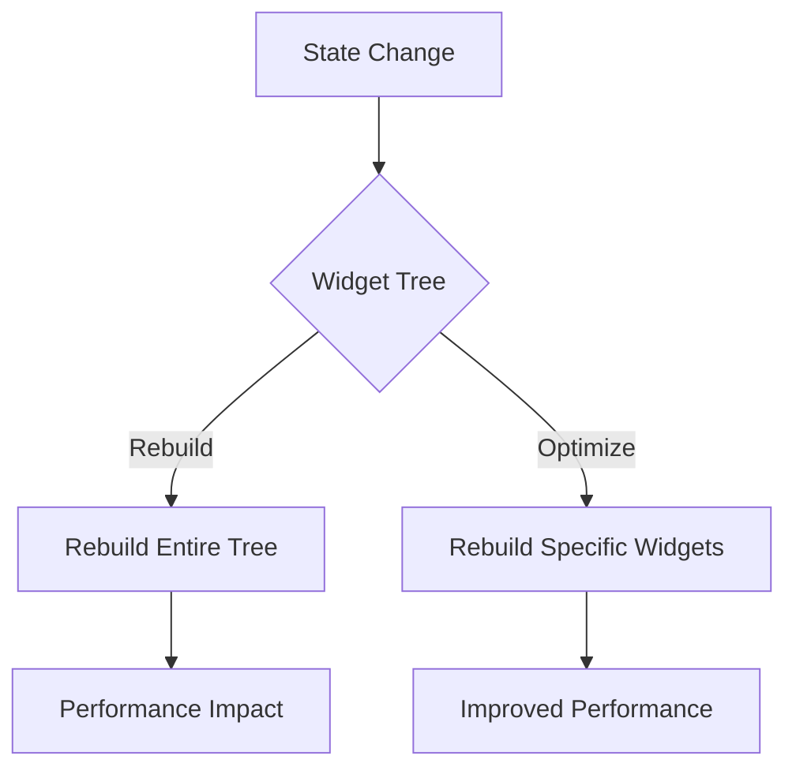

## 14.6 Reducing Widget Rebuilds

In Flutter development, one of the key challenges is managing widget rebuilds efficiently. Excessive rebuilds can lead to performance bottlenecks, affecting the responsiveness and smoothness of your application. In this section, we will delve into strategies for reducing widget rebuilds, focusing on optimizing state management and using keys effectively.

### Understanding Widget Rebuilds

Before we dive into optimization techniques, let's first understand what widget rebuilds are. In Flutter, the UI is built using a tree of widgets. Whenever the state of a widget changes, Flutter rebuilds the widget tree to reflect these changes. While this is a powerful feature, unnecessary rebuilds can degrade performance.

#### Why Widget Rebuilds Matter

Widget rebuilds are crucial because they determine how efficiently your app responds to state changes. Every rebuild consumes CPU resources, and excessive rebuilds can lead to jank, where the UI stutters or lags. Understanding when and why widgets rebuild is the first step in optimizing performance.

### Optimizing State Management

State management is at the heart of reducing widget rebuilds. By managing state effectively, you can control when and how widgets rebuild. Let's explore some state management techniques that can help optimize widget rebuilds.

#### Using `ChangeNotifier` and `Selector`

`ChangeNotifier` is a simple way to manage state in Flutter. It provides a lightweight mechanism for notifying listeners about changes. However, using `ChangeNotifier` alone can lead to unnecessary rebuilds if not used carefully. This is where `Selector` comes into play.

##### Implementing `ChangeNotifier`

Here's a basic example of using `ChangeNotifier`:

```dart
import 'package:flutter/material.dart';
import 'package:provider/provider.dart';

class Counter with ChangeNotifier {
  int _count = 0;

  int get count => _count;

  void increment() {
    _count++;
    notifyListeners();
  }
}

void main() {
  runApp(
    ChangeNotifierProvider(
      create: (context) => Counter(),
      child: MyApp(),
    ),
  );
}

class MyApp extends StatelessWidget {
  @override
  Widget build(BuildContext context) {
    return MaterialApp(
      home: Scaffold(
        appBar: AppBar(title: Text('Counter')),
        body: Center(
          child: Column(
            mainAxisAlignment: MainAxisAlignment.center,
            children: <Widget>[
              Text('You have pushed the button this many times:'),
              Consumer<Counter>(
                builder: (context, counter, child) {
                  return Text(
                    '${counter.count}',
                    style: Theme.of(context).textTheme.headline4,
                  );
                },
              ),
            ],
          ),
        ),
        floatingActionButton: FloatingActionButton(
          onPressed: () => context.read<Counter>().increment(),
          tooltip: 'Increment',
          child: Icon(Icons.add),
        ),
      ),
    );
  }
}
```

In this example, `ChangeNotifier` is used to manage the state of a counter. The `Consumer` widget listens for changes and rebuilds the UI when the counter value changes.

##### Introducing `Selector`

`Selector` is a powerful tool that allows you to rebuild only the parts of the widget tree that need to change. It listens to specific parts of the state and rebuilds only when those parts change.

```dart
Consumer<Counter>(
  builder: (context, counter, child) {
    return Text(
      '${counter.count}',
      style: Theme.of(context).textTheme.headline4,
    );
  },
)
```

Replace the `Consumer` with `Selector` to optimize rebuilds:

```dart
Selector<Counter, int>(
  selector: (context, counter) => counter.count,
  builder: (context, count, child) {
    return Text(
      '$count',
      style: Theme.of(context).textTheme.headline4,
    );
  },
)
```

By using `Selector`, you ensure that only the `Text` widget rebuilds when the `count` changes, reducing unnecessary rebuilds of other widgets.

### Using Keys: Preserving Widget State Efficiently

Keys are another essential tool for managing widget rebuilds. They help Flutter identify widgets uniquely, preserving their state across rebuilds.

#### Types of Keys

Flutter provides several types of keys, each serving a different purpose:

- **GlobalKey**: Used to access a widget's state across the widget tree.
- **LocalKey**: Used to differentiate widgets in the same build context.
- **ValueKey**: A simple key that uses a value to differentiate widgets.
- **ObjectKey**: Uses an object to differentiate widgets.

#### Implementing Keys

Here's an example demonstrating the use of `ValueKey`:

```dart
import 'package:flutter/material.dart';

void main() {
  runApp(MyApp());
}

class MyApp extends StatelessWidget {
  @override
  Widget build(BuildContext context) {
    return MaterialApp(
      home: Scaffold(
        appBar: AppBar(title: Text('Keys Example')),
        body: ListView(
          children: List.generate(5, (index) {
            return ListTile(
              key: ValueKey(index),
              title: Text('Item $index'),
            );
          }),
        ),
      ),
    );
  }
}
```

In this example, each `ListTile` is assigned a `ValueKey` based on its index. This ensures that Flutter can efficiently update the list when items are added or removed.

### Visualizing Widget Rebuilds

To better understand how widget rebuilds occur, let's visualize the process using a Mermaid.js diagram.



**Diagram Description**: This diagram illustrates the decision-making process in Flutter when a state change occurs. By optimizing state management and using keys, we can rebuild specific widgets instead of the entire tree, leading to improved performance.

### Best Practices for Reducing Widget Rebuilds

1. **Minimize State Changes**: Only trigger state changes when necessary. Avoid unnecessary calls to `setState` or `notifyListeners`.

2. **Use `Selector` Wisely**: Leverage `Selector` to rebuild only the parts of the UI that need to change.

3. **Implement Keys**: Use keys to preserve widget state and optimize list updates.

4. **Profile Your App**: Use Flutter's performance profiling tools to identify and address rebuild hotspots.

5. **Avoid Deep Widget Trees**: Keep widget trees shallow to minimize the impact of rebuilds.

6. **Leverage Stateless Widgets**: Use stateless widgets whenever possible to reduce the need for rebuilds.

### Try It Yourself

To solidify your understanding, try modifying the code examples provided. Experiment with different types of keys and observe how they affect widget rebuilds. Use `Selector` in various scenarios to see its impact on performance.

### Knowledge Check

- What is the primary purpose of using keys in Flutter?
- How does `Selector` help in reducing widget rebuilds?
- Why is it important to minimize state changes in a Flutter app?

### Summary

Reducing widget rebuilds is a crucial aspect of optimizing Flutter app performance. By effectively managing state and using keys, you can ensure that your app remains responsive and efficient. Remember, this is just the beginning. As you progress, you'll discover more advanced techniques for optimizing your Flutter applications. Keep experimenting, stay curious, and enjoy the journey!

## Quiz Time!



### What is the primary purpose of using keys in Flutter?

- [x] To preserve widget state across rebuilds
- [ ] To manage state changes
- [ ] To optimize rendering performance
- [ ] To handle user input

> **Explanation:** Keys are used to uniquely identify widgets and preserve their state across rebuilds.

### How does `Selector` help in reducing widget rebuilds?

- [x] By rebuilding only the parts of the UI that need to change
- [ ] By managing state changes
- [ ] By optimizing rendering performance
- [ ] By handling user input

> **Explanation:** `Selector` listens to specific parts of the state and rebuilds only when those parts change, reducing unnecessary rebuilds.

### Why is it important to minimize state changes in a Flutter app?

- [x] To reduce unnecessary widget rebuilds
- [ ] To improve rendering performance
- [ ] To handle user input efficiently
- [ ] To manage state changes

> **Explanation:** Minimizing state changes helps reduce unnecessary widget rebuilds, improving app performance.

### What type of key should be used to access a widget's state across the widget tree?

- [x] GlobalKey
- [ ] LocalKey
- [ ] ValueKey
- [ ] ObjectKey

> **Explanation:** `GlobalKey` is used to access a widget's state across the widget tree.

### Which of the following is a best practice for reducing widget rebuilds?

- [x] Use stateless widgets whenever possible
- [ ] Minimize the use of keys
- [ ] Avoid using `Selector`
- [ ] Trigger state changes frequently

> **Explanation:** Using stateless widgets whenever possible helps reduce the need for rebuilds.

### What is the impact of excessive widget rebuilds on app performance?

- [x] It can lead to jank and performance bottlenecks
- [ ] It improves rendering performance
- [ ] It enhances user experience
- [ ] It optimizes state management

> **Explanation:** Excessive widget rebuilds can lead to jank and performance bottlenecks, affecting app responsiveness.

### How can you profile your Flutter app to identify rebuild hotspots?

- [x] Use Flutter's performance profiling tools
- [ ] Use keys to optimize rendering
- [ ] Use `Selector` to manage state changes
- [ ] Use stateless widgets

> **Explanation:** Flutter's performance profiling tools help identify and address rebuild hotspots.

### What is the role of `ChangeNotifier` in state management?

- [x] It provides a mechanism for notifying listeners about state changes
- [ ] It optimizes rendering performance
- [ ] It handles user input
- [ ] It manages widget rebuilds

> **Explanation:** `ChangeNotifier` provides a mechanism for notifying listeners about state changes, helping manage state effectively.

### Which key type uses a value to differentiate widgets?

- [x] ValueKey
- [ ] GlobalKey
- [ ] LocalKey
- [ ] ObjectKey

> **Explanation:** `ValueKey` uses a value to differentiate widgets.

### True or False: Using `Selector` can help reduce unnecessary widget rebuilds.

- [x] True
- [ ] False

> **Explanation:** `Selector` helps reduce unnecessary widget rebuilds by listening to specific parts of the state and rebuilding only when those parts change.


