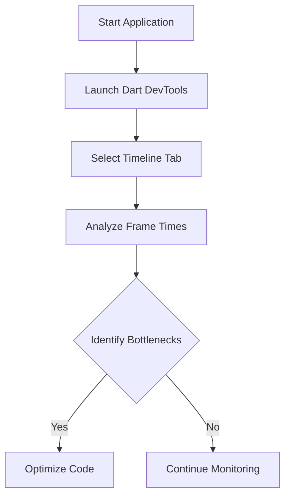
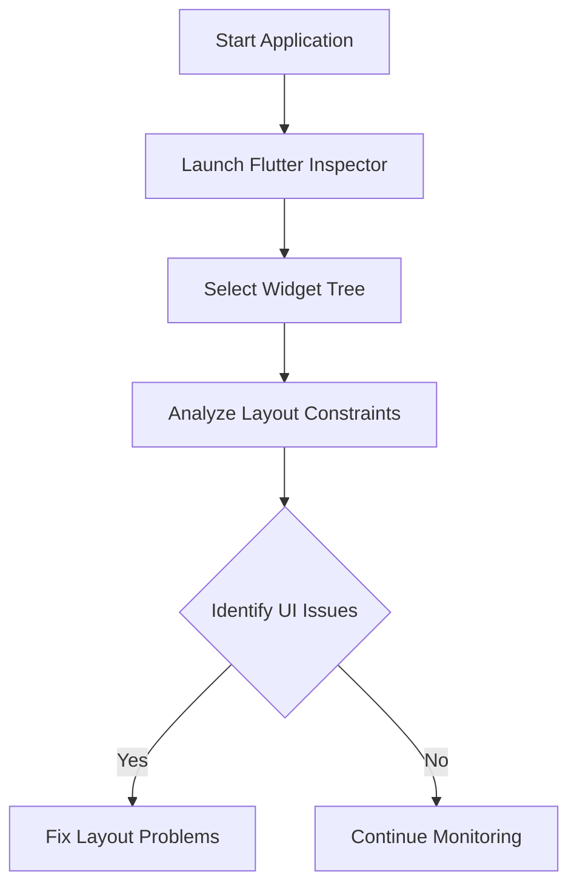
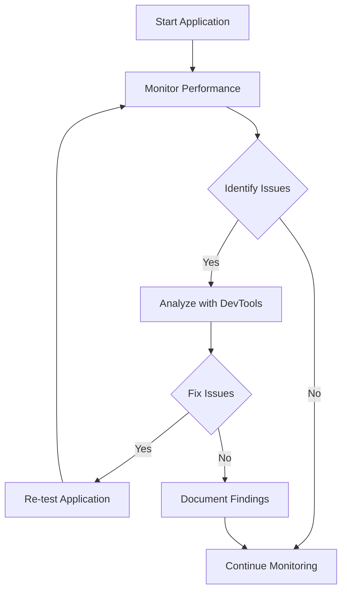

## 14.7 Profiling and Debugging Tools

In the realm of software development, particularly with Dart and Flutter, profiling and debugging are crucial processes that ensure your applications run smoothly and efficiently. This section delves into the tools and techniques available for profiling and debugging in Dart and Flutter, focusing on identifying bottlenecks and monitoring performance.

### Introduction to Profiling and Debugging

Profiling and debugging are two sides of the same coin, both essential for optimizing and maintaining high-quality software. Profiling involves analyzing your application's performance to identify areas that can be improved, such as memory usage, CPU load, and rendering times. Debugging, on the other hand, is the process of identifying and fixing bugs or errors in your code.

In Dart and Flutter, several tools are available to assist developers in these tasks, including Dart DevTools and Flutter Inspector. These tools provide insights into your application's behavior, allowing you to make informed decisions about performance optimization.

### Identifying Bottlenecks with Dart DevTools

Dart DevTools is a suite of performance and debugging tools for Dart and Flutter applications. It provides a comprehensive set of features to help you analyze and optimize your code.

#### Key Features of Dart DevTools

1. **Timeline View**: This feature allows you to visualize the execution of your application over time. It shows you the sequence of events, helping you identify which parts of your code are taking the most time to execute.

2. **Memory Profiling**: Dart DevTools provides detailed insights into your application's memory usage. You can track memory allocations and identify potential leaks or inefficient memory usage.

3. **CPU Profiling**: This feature helps you analyze the CPU usage of your application, identifying functions or methods that are consuming excessive processing power.

4. **Network Profiling**: Monitor network requests and responses to ensure your application is efficiently handling data transfers.

5. **Logging**: Dart DevTools integrates with the logging package to display logs generated by your application, helping you track down issues quickly.

#### Using Dart DevTools

To use Dart DevTools, you need to run your Flutter application in debug mode. Once your application is running, you can launch Dart DevTools from your IDE or by navigating to the URL provided in the console output.

```bash
flutter run --debug
```

After launching Dart DevTools, you can explore the various tabs to analyze different aspects of your application's performance. For example, the Timeline View can be used to identify slow frames or jank in your application.



### Flutter Inspector: Visualizing UI Performance

Flutter Inspector is a powerful tool for visualizing and diagnosing UI performance issues in Flutter applications. It provides a detailed view of your widget tree, allowing you to identify and fix layout issues.

#### Key Features of Flutter Inspector

1. **Widget Tree Visualization**: View the hierarchy of widgets in your application, making it easier to understand the structure and identify potential issues.

2. **Layout Explorer**: Analyze the layout constraints and properties of widgets to identify and fix layout problems.

3. **Performance Overlay**: Display a real-time overlay on your application to visualize frame rendering times and identify jank.

4. **Repaint Rainbow**: Highlight areas of your application that are being repainted, helping you identify unnecessary repaints.

#### Using Flutter Inspector

To use Flutter Inspector, you need to run your Flutter application in debug mode. Once your application is running, you can launch Flutter Inspector from your IDE or by using the Flutter DevTools.

```bash
flutter run --debug
```

After launching Flutter Inspector, you can explore the widget tree and use the Layout Explorer to analyze your application's UI performance.



### Performance Monitoring: Custom Metrics and Logs

In addition to using Dart DevTools and Flutter Inspector, you can implement custom metrics and logging to monitor your application's performance. This involves instrumenting your code to collect data on specific aspects of your application's behavior.

#### Implementing Custom Metrics

Custom metrics allow you to track specific performance indicators that are relevant to your application. For example, you might want to monitor the time it takes to load a particular screen or the number of network requests made during a session.

```dart
import 'package:flutter/material.dart';
import 'dart:developer' as developer;

void main() {
  runApp(MyApp());
}

class MyApp extends StatelessWidget {
  @override
  Widget build(BuildContext context) {
    return MaterialApp(
      home: HomeScreen(),
    );
  }
}

class HomeScreen extends StatefulWidget {
  @override
  _HomeScreenState createState() => _HomeScreenState();
}

class _HomeScreenState extends State<HomeScreen> {
  @override
  void initState() {
    super.initState();
    _startPerformanceTracking();
  }

  void _startPerformanceTracking() {
    final stopwatch = Stopwatch()..start();
    // Simulate a task
    Future.delayed(Duration(seconds: 2), () {
      stopwatch.stop();
      developer.log('Screen load time: ${stopwatch.elapsedMilliseconds}ms');
    });
  }

  @override
  Widget build(BuildContext context) {
    return Scaffold(
      appBar: AppBar(
        title: Text('Performance Monitoring'),
      ),
      body: Center(
        child: Text('Welcome to the Home Screen!'),
      ),
    );
  }
}
```

#### Implementing Logging

Logging is an essential part of performance monitoring, allowing you to track events and errors in your application. The `dart:developer` package provides a simple way to log messages in Dart and Flutter applications.

```dart
import 'dart:developer' as developer;

void logMessage(String message) {
  developer.log(message);
}

void main() {
  logMessage('Application started');
  // Your application code here
}
```

### Try It Yourself: Experimenting with Profiling and Debugging

To get hands-on experience with profiling and debugging in Dart and Flutter, try the following exercises:

1. **Identify Slow Frames**: Use Dart DevTools to identify slow frames in your application. Experiment with different optimizations to reduce frame times.

2. **Analyze Memory Usage**: Use Dart DevTools to analyze your application's memory usage. Identify potential memory leaks and implement fixes.

3. **Visualize Widget Tree**: Use Flutter Inspector to visualize your application's widget tree. Identify and fix any layout issues you find.

4. **Implement Custom Metrics**: Add custom metrics to your application to track specific performance indicators. Use these metrics to identify areas for improvement.

5. **Experiment with Logging**: Implement logging in your application to track events and errors. Use the logs to identify and fix issues in your code.

### Visualizing Performance Optimization

To better understand the process of performance optimization, consider the following flowchart, which outlines the steps involved in identifying and fixing performance issues in a Flutter application.



### References and Further Reading

For more information on profiling and debugging in Dart and Flutter, consider the following resources:

- [Dart DevTools Documentation](https://dart.dev/tools/dart-devtools)
- [Flutter Inspector Guide](https://flutter.dev/docs/development/tools/devtools/inspector)
- [Logging in Dart](https://dart.dev/guides/libraries/library-tour#dartdeveloper---logging)

### Knowledge Check

Before we wrap up, let's reinforce what we've learned with a few questions:

1. What is the primary purpose of profiling in software development?
2. How can Dart DevTools help identify memory leaks in your application?
3. What is the role of the Flutter Inspector in UI performance optimization?
4. How can custom metrics be used to monitor application performance?
5. Why is logging important in performance monitoring?

### Embrace the Journey

Remember, mastering profiling and debugging is a journey. As you continue to develop your skills, you'll become more adept at identifying and fixing performance issues in your Dart and Flutter applications. Keep experimenting, stay curious, and enjoy the process!

## Quiz Time!



### What is the primary purpose of profiling in software development?

- [x] To analyze and optimize application performance
- [ ] To write new features
- [ ] To manage user authentication
- [ ] To design user interfaces

> **Explanation:** Profiling is used to analyze and optimize the performance of an application by identifying bottlenecks and inefficiencies.

### Which tool provides a detailed view of the widget tree in Flutter applications?

- [x] Flutter Inspector
- [ ] Dart Analyzer
- [ ] Android Studio
- [ ] Xcode

> **Explanation:** Flutter Inspector provides a detailed view of the widget tree, helping developers visualize and diagnose UI performance issues.

### How can Dart DevTools help identify memory leaks?

- [x] By providing memory profiling features
- [ ] By generating code documentation
- [ ] By managing application state
- [ ] By compiling Dart code

> **Explanation:** Dart DevTools includes memory profiling features that allow developers to track memory usage and identify potential leaks.

### What is the role of custom metrics in performance monitoring?

- [x] To track specific performance indicators relevant to the application
- [ ] To manage user sessions
- [ ] To compile Dart code
- [ ] To design user interfaces

> **Explanation:** Custom metrics are used to track specific performance indicators, helping developers monitor and optimize application performance.

### Why is logging important in performance monitoring?

- [x] To track events and errors in the application
- [ ] To manage user authentication
- [ ] To design user interfaces
- [ ] To compile Dart code

> **Explanation:** Logging is important for tracking events and errors, providing valuable insights into the application's behavior and performance.

### What feature of Dart DevTools helps visualize the execution of an application over time?

- [x] Timeline View
- [ ] Memory Profiler
- [ ] Network Profiler
- [ ] CPU Profiler

> **Explanation:** The Timeline View in Dart DevTools helps visualize the execution of an application over time, showing the sequence of events.

### Which feature of Flutter Inspector highlights areas of the application that are being repainted?

- [x] Repaint Rainbow
- [ ] Widget Tree
- [ ] Layout Explorer
- [ ] Performance Overlay

> **Explanation:** The Repaint Rainbow feature highlights areas of the application that are being repainted, helping identify unnecessary repaints.

### How can you launch Dart DevTools?

- [x] By running the Flutter application in debug mode
- [ ] By compiling the application in release mode
- [ ] By using the Dart Analyzer
- [ ] By opening the Android Studio terminal

> **Explanation:** Dart DevTools can be launched by running the Flutter application in debug mode and accessing the provided URL.

### What is the purpose of the Performance Overlay in Flutter Inspector?

- [x] To visualize frame rendering times
- [ ] To manage application state
- [ ] To compile Dart code
- [ ] To design user interfaces

> **Explanation:** The Performance Overlay visualizes frame rendering times, helping developers identify jank and optimize UI performance.

### True or False: Custom metrics can only be used for tracking network requests.

- [ ] True
- [x] False

> **Explanation:** Custom metrics can be used to track a wide range of performance indicators, not just network requests.


