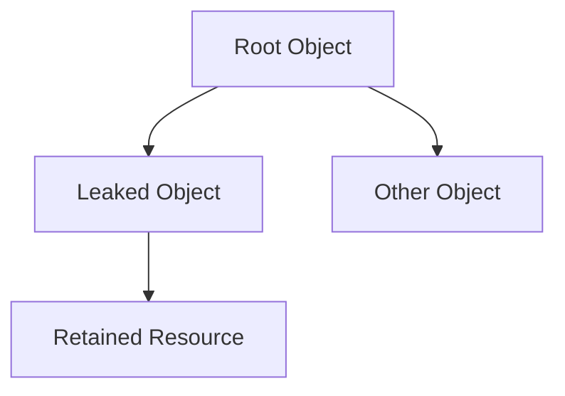

## 14.8 Memory Management and Leak Detection

In the realm of Dart and Flutter development, efficient memory management is crucial for creating high-performance applications. Memory leaks can lead to increased memory usage, degraded performance, and even application crashes. This section delves into the intricacies of memory management and leak detection, providing you with the knowledge and tools necessary to optimize your Flutter applications.

### Understanding Memory Management in Dart

Memory management in Dart involves the allocation, use, and release of memory resources. Dart, like many modern programming languages, uses a garbage collector to automatically manage memory. However, developers must still be vigilant to avoid memory leaks and ensure efficient resource use.

#### Key Concepts in Memory Management

- **Garbage Collection**: Dart's garbage collector automatically reclaims memory that is no longer in use. However, it cannot detect memory that is still referenced but no longer needed, leading to potential memory leaks.
- **Heap and Stack**: Understanding the difference between heap and stack memory is essential. The stack is used for static memory allocation, while the heap is used for dynamic memory allocation.
- **Object Lifecycle**: Knowing when and how objects are created, used, and destroyed is vital for effective memory management.

### Preventing Memory Leaks

Memory leaks occur when memory that is no longer needed is not released, leading to increased memory usage over time. In Flutter, common sources of memory leaks include improperly disposed controllers, unclosed streams, and lingering references.

#### Properly Disposing of Controllers and Subscriptions

Controllers and subscriptions are common in Flutter applications, especially when dealing with animations, streams, and other asynchronous operations. Failing to dispose of these resources can lead to memory leaks.

```dart
class MyWidget extends StatefulWidget {
  @override
  _MyWidgetState createState() => _MyWidgetState();
}

class _MyWidgetState extends State<MyWidget> {
  late AnimationController _controller;

  @override
  void initState() {
    super.initState();
    _controller = AnimationController(
      duration: const Duration(seconds: 2),
      vsync: this,
    );
  }

  @override
  void dispose() {
    _controller.dispose(); // Properly dispose of the controller
    super.dispose();
  }

  @override
  Widget build(BuildContext context) {
    return Container();
  }
}
```

**Key Takeaway**: Always dispose of controllers and subscriptions in the `dispose` method to prevent memory leaks.

#### Efficient Resource Use: Managing Images and Large Data Structures

Images and large data structures can consume significant memory resources. Efficient management of these resources is crucial for maintaining application performance.

- **Image Caching**: Use Flutter's built-in image caching to reduce memory usage and improve performance.
- **Lazy Loading**: Load images and data only when needed to minimize memory footprint.
- **Data Structures**: Use efficient data structures and algorithms to manage large datasets.

### Detecting Memory Leaks

Detecting memory leaks can be challenging, but several tools and techniques can help identify and resolve these issues.

#### Dart DevTools

Dart DevTools is a powerful suite of tools for debugging and profiling Dart applications. It includes a memory profiler that can help identify memory leaks.

- **Heap Snapshot**: Capture a snapshot of the heap to analyze memory usage.
- **Retaining Path**: Identify which objects are retaining memory and causing leaks.

#### Code Example: Using Dart DevTools

```dart
// Example code to demonstrate memory profiling
void main() {
  runApp(MyApp());
}

class MyApp extends StatelessWidget {
  @override
  Widget build(BuildContext context) {
    return MaterialApp(
      home: Scaffold(
        appBar: AppBar(
          title: Text('Memory Management Example'),
        ),
        body: MemoryIntensiveWidget(),
      ),
    );
  }
}

class MemoryIntensiveWidget extends StatelessWidget {
  @override
  Widget build(BuildContext context) {
    // Simulate memory-intensive operations
    List<int> largeList = List.generate(1000000, (index) => index);
    return Center(
      child: Text('Memory Intensive Operations'),
    );
  }
}
```

**Try It Yourself**: Use Dart DevTools to profile the above code and identify memory usage patterns.

#### Visualizing Memory Leaks

Visualizing memory leaks can help understand their impact and identify solutions. Use diagrams to represent object relationships and memory retention.



**Diagram Explanation**: The diagram shows a root object retaining a leaked object, which in turn retains a resource, leading to a memory leak.

### Best Practices for Memory Management

Implementing best practices for memory management can help prevent leaks and optimize performance.

- **Dispose Resources**: Always dispose of resources such as controllers, streams, and subscriptions.
- **Use Weak References**: Where applicable, use weak references to prevent unnecessary memory retention.
- **Optimize Data Structures**: Choose efficient data structures and algorithms to manage memory usage.
- **Profile Regularly**: Regularly profile your application using Dart DevTools to identify and resolve memory issues.

### Knowledge Check

- **Question**: What is the primary function of Dart's garbage collector?
  - **Answer**: To automatically reclaim memory that is no longer in use.

- **Question**: Why is it important to dispose of controllers in Flutter?
  - **Answer**: To prevent memory leaks by releasing resources that are no longer needed.

### Embrace the Journey

Remember, mastering memory management and leak detection is a continuous journey. As you develop more complex applications, you'll encounter new challenges and opportunities to optimize performance. Keep experimenting, stay curious, and enjoy the journey!

## Quiz Time!



### What is the primary function of Dart's garbage collector?

- [x] To automatically reclaim memory that is no longer in use
- [ ] To manage CPU usage
- [ ] To optimize network requests
- [ ] To handle user input

> **Explanation:** Dart's garbage collector automatically reclaims memory that is no longer in use, helping to manage memory efficiently.

### Why is it important to dispose of controllers in Flutter?

- [x] To prevent memory leaks
- [ ] To improve network performance
- [ ] To enhance UI responsiveness
- [ ] To reduce CPU usage

> **Explanation:** Disposing of controllers prevents memory leaks by releasing resources that are no longer needed.

### Which tool can be used to profile memory usage in Dart applications?

- [x] Dart DevTools
- [ ] Android Studio
- [ ] Xcode
- [ ] Visual Studio Code

> **Explanation:** Dart DevTools is a powerful suite of tools for debugging and profiling Dart applications, including memory profiling.

### What is a common source of memory leaks in Flutter applications?

- [x] Improperly disposed controllers
- [ ] Efficient data structures
- [ ] Optimized algorithms
- [ ] Properly managed images

> **Explanation:** Improperly disposed controllers are a common source of memory leaks in Flutter applications.

### How can you visualize memory leaks in Dart applications?

- [x] Using diagrams to represent object relationships
- [ ] By optimizing network requests
- [ ] By enhancing UI components
- [ ] By reducing CPU usage

> **Explanation:** Diagrams can help visualize object relationships and memory retention, aiding in the identification of memory leaks.

### What is the benefit of using weak references?

- [x] To prevent unnecessary memory retention
- [ ] To enhance UI responsiveness
- [ ] To improve network performance
- [ ] To reduce CPU usage

> **Explanation:** Weak references help prevent unnecessary memory retention, reducing the risk of memory leaks.

### What should you do regularly to identify memory issues?

- [x] Profile your application using Dart DevTools
- [ ] Optimize network requests
- [ ] Enhance UI components
- [ ] Reduce CPU usage

> **Explanation:** Regularly profiling your application using Dart DevTools helps identify and resolve memory issues.

### What is a heap snapshot used for?

- [x] To analyze memory usage
- [ ] To optimize network requests
- [ ] To enhance UI components
- [ ] To reduce CPU usage

> **Explanation:** A heap snapshot captures a snapshot of the heap to analyze memory usage and identify potential leaks.

### What is the difference between heap and stack memory?

- [x] Heap is for dynamic allocation, stack is for static allocation
- [ ] Stack is for dynamic allocation, heap is for static allocation
- [ ] Both are for dynamic allocation
- [ ] Both are for static allocation

> **Explanation:** The heap is used for dynamic memory allocation, while the stack is used for static memory allocation.

### True or False: Lazy loading can help minimize memory footprint.

- [x] True
- [ ] False

> **Explanation:** Lazy loading helps minimize memory footprint by loading resources only when needed.


