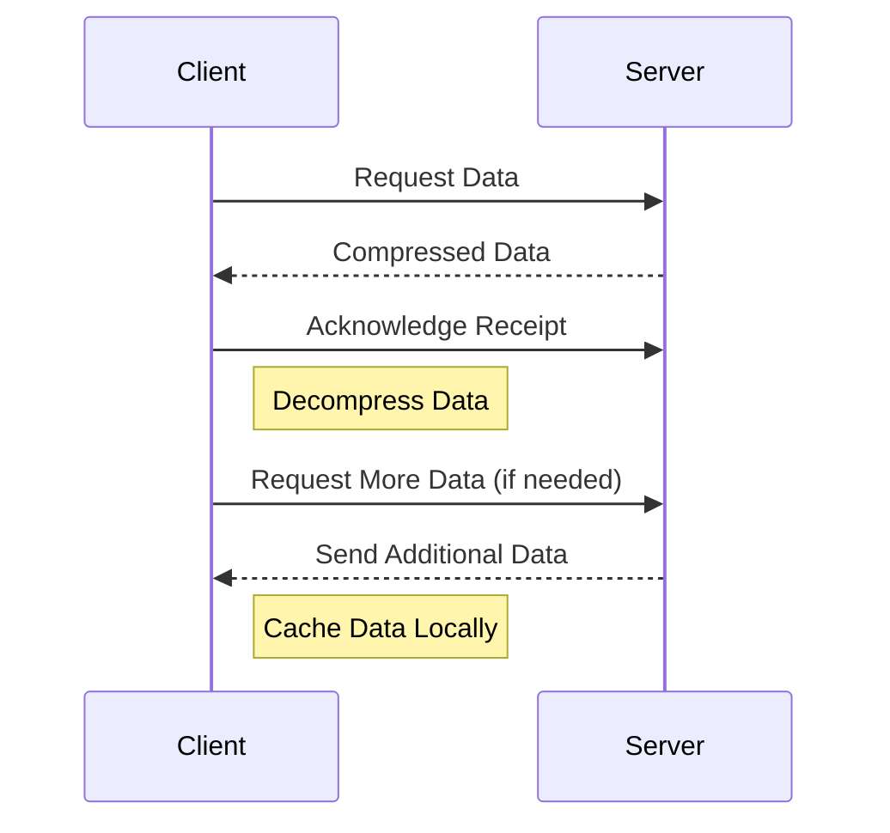

## 14.9 Network Performance Optimization

In the realm of mobile and web applications, network performance is a critical factor that can significantly impact user experience. In this section, we will delve into the intricacies of network performance optimization in Dart and Flutter applications. We will explore strategies for efficient data transfer, handling various network conditions, and implementing best practices to ensure high-performance network communication.

### Efficient Data Transfer

Efficient data transfer is paramount for optimizing network performance. It involves minimizing the amount of data sent over the network and ensuring that data is transmitted in the most efficient manner possible. Here are some strategies to achieve efficient data transfer:

#### 1. Compressing Data

Data compression is a technique used to reduce the size of data before transmission. This can significantly decrease the amount of bandwidth required and speed up data transfer. In Dart and Flutter, you can use libraries such as `gzip` to compress data.

```dart
import 'dart:convert';
import 'dart:io';

void compressData(String data) {
  // Convert the data to bytes
  List<int> dataBytes = utf8.encode(data);

  // Compress the data using gzip
  List<int> compressedData = gzip.encode(dataBytes);

  print('Original size: ${dataBytes.length}');
  print('Compressed size: ${compressedData.length}');
}

void main() {
  String data = 'This is a sample data to be compressed.';
  compressData(data);
}
```

In this example, we use the `gzip` library to compress a string of data. The original and compressed sizes are printed to demonstrate the reduction in data size.

#### 2. Optimizing APIs

Optimizing APIs involves designing them to be efficient and responsive. Here are some best practices for API optimization:

- **Use Pagination**: When dealing with large datasets, use pagination to send data in chunks rather than all at once. This reduces the load on the server and speeds up response times.

- **Implement Caching**: Cache frequently accessed data to reduce the need for repeated network requests. This can be done using HTTP caching headers or client-side caching mechanisms.

- **Minimize Payload Size**: Only send the necessary data in API responses. Avoid sending large amounts of unnecessary data by using fields selection or filtering.

- **Use Efficient Data Formats**: Choose efficient data formats such as JSON or Protocol Buffers for data serialization. These formats are lightweight and easy to parse.

#### 3. Using HTTP/2

HTTP/2 is a major revision of the HTTP network protocol that offers several performance improvements over HTTP/1.1. It allows for multiplexing multiple requests over a single connection, reducing latency and improving throughput.

To take advantage of HTTP/2 in Dart and Flutter, ensure that your server supports it and configure your HTTP client to use it.

```dart
import 'package:http/http.dart' as http;

void fetchData() async {
  var url = Uri.parse('https://example.com/data');
  var response = await http.get(url);

  if (response.statusCode == 200) {
    print('Data fetched successfully');
  } else {
    print('Failed to fetch data');
  }
}

void main() {
  fetchData();
}
```

In this example, we use the `http` package to make a GET request to a server. Ensure that the server supports HTTP/2 to benefit from its performance enhancements.

### Handling Various Network Conditions

Applications often need to operate under varying network conditions, from fast and reliable connections to slow and unreliable ones. Here are some strategies to handle different network conditions effectively:

#### 1. Adaptive Loading

Adaptive loading involves adjusting the amount of data loaded based on the network conditions. For example, load lower-resolution images or fewer data items when the network is slow.

```dart
import 'dart:io';

void loadDataBasedOnNetwork() {
  // Check the network speed
  bool isFastNetwork = checkNetworkSpeed();

  if (isFastNetwork) {
    // Load high-resolution images
    loadHighResolutionImages();
  } else {
    // Load low-resolution images
    loadLowResolutionImages();
  }
}

bool checkNetworkSpeed() {
  // Simulate network speed check
  return InternetAddress.lookup('example.com').then((result) {
    return result.isNotEmpty && result[0].rawAddress.isNotEmpty;
  }).catchError((error) {
    return false;
  });
}

void loadHighResolutionImages() {
  print('Loading high-resolution images');
}

void loadLowResolutionImages() {
  print('Loading low-resolution images');
}

void main() {
  loadDataBasedOnNetwork();
}
```

This example demonstrates adaptive loading by checking the network speed and loading different image resolutions accordingly.

#### 2. Offline Support

Providing offline support ensures that your application remains functional even when there is no network connection. This can be achieved by caching data locally and synchronizing it with the server when the connection is restored.

```dart
import 'package:shared_preferences/shared_preferences.dart';

void saveDataLocally(String data) async {
  SharedPreferences prefs = await SharedPreferences.getInstance();
  await prefs.setString('cachedData', data);
}

Future<String?> loadDataLocally() async {
  SharedPreferences prefs = await SharedPreferences.getInstance();
  return prefs.getString('cachedData');
}

void main() async {
  // Save data locally
  saveDataLocally('Sample data');

  // Load data locally
  String? data = await loadDataLocally();
  print('Loaded data: $data');
}
```

In this example, we use the `shared_preferences` package to cache data locally. This allows the application to access data even when offline.

#### 3. Retry Mechanism

Implementing a retry mechanism helps handle temporary network failures by retrying failed requests after a certain interval.

```dart
import 'dart:async';
import 'package:http/http.dart' as http;

Future<void> fetchDataWithRetry() async {
  int retryCount = 0;
  const int maxRetries = 3;
  const Duration retryInterval = Duration(seconds: 2);

  while (retryCount < maxRetries) {
    try {
      var url = Uri.parse('https://example.com/data');
      var response = await http.get(url);

      if (response.statusCode == 200) {
        print('Data fetched successfully');
        return;
      }
    } catch (e) {
      print('Failed to fetch data: $e');
    }

    retryCount++;
    print('Retrying... ($retryCount/$maxRetries)');
    await Future.delayed(retryInterval);
  }

  print('Failed to fetch data after $maxRetries retries');
}

void main() {
  fetchDataWithRetry();
}
```

This example demonstrates a simple retry mechanism that attempts to fetch data up to three times with a two-second interval between attempts.

### Best Practices for Network Performance Optimization

To ensure optimal network performance in your Dart and Flutter applications, consider the following best practices:

- **Monitor Network Performance**: Use tools and libraries to monitor network performance and identify bottlenecks. This can help you make informed decisions about optimization strategies.

- **Optimize Images and Media**: Compress images and media files to reduce their size without compromising quality. Use formats like WebP for images and H.264 for videos.

- **Use Content Delivery Networks (CDNs)**: CDNs can help distribute content closer to users, reducing latency and improving load times.

- **Implement Lazy Loading**: Load data and resources only when they are needed. This can reduce initial load times and improve perceived performance.

- **Minimize Network Requests**: Reduce the number of network requests by combining multiple requests into a single one or using batch processing.

- **Secure Network Communication**: Use HTTPS to encrypt data in transit and protect it from interception.

### Visualizing Network Performance Optimization

To better understand the process of network performance optimization, let's visualize the flow of data transfer and optimization strategies using a sequence diagram.



This sequence diagram illustrates the interaction between a client and a server during data transfer. The client requests data, the server sends compressed data, and the client acknowledges receipt. Additional data is requested and cached locally as needed.

### Knowledge Check

To reinforce your understanding of network performance optimization, consider the following questions:

- What are some strategies for compressing data in Dart and Flutter applications?
- How can you optimize APIs to improve network performance?
- What is adaptive loading, and how can it be implemented in Flutter applications?
- Why is offline support important, and how can it be achieved?
- What are some best practices for optimizing network performance in mobile applications?

### Embrace the Journey

Remember, optimizing network performance is an ongoing process that requires continuous monitoring and adjustment. As you implement these strategies, you'll enhance the user experience and ensure that your applications perform optimally under various network conditions. Keep experimenting, stay curious, and enjoy the journey of mastering network performance optimization in Dart and Flutter!

## Quiz Time!



### What is the primary benefit of compressing data before transmission?

- [x] Reducing the amount of bandwidth required
- [ ] Increasing the data size
- [ ] Slowing down the data transfer
- [ ] Making data unreadable

> **Explanation:** Compressing data reduces its size, which decreases the amount of bandwidth required for transmission and speeds up data transfer.

### Which of the following is a best practice for optimizing APIs?

- [x] Use pagination for large datasets
- [ ] Send all data at once
- [ ] Avoid caching data
- [ ] Use inefficient data formats

> **Explanation:** Pagination helps manage large datasets by sending data in chunks, reducing server load and improving response times.

### What is the purpose of adaptive loading?

- [x] Adjusting data loading based on network conditions
- [ ] Loading all data regardless of network speed
- [ ] Ignoring network conditions
- [ ] Loading data only when offline

> **Explanation:** Adaptive loading adjusts the amount of data loaded based on network conditions, improving performance on slow networks.

### How can offline support be achieved in Flutter applications?

- [x] Caching data locally
- [ ] Ignoring network failures
- [ ] Always requiring an internet connection
- [ ] Using only online data sources

> **Explanation:** Offline support can be achieved by caching data locally, allowing the application to function without an internet connection.

### What is a retry mechanism used for?

- [x] Handling temporary network failures
- [ ] Ignoring failed requests
- [ ] Sending duplicate requests
- [ ] Reducing server load

> **Explanation:** A retry mechanism handles temporary network failures by retrying failed requests after a certain interval.

### Which protocol offers performance improvements over HTTP/1.1?

- [x] HTTP/2
- [ ] FTP
- [ ] SMTP
- [ ] TCP

> **Explanation:** HTTP/2 offers performance improvements over HTTP/1.1, such as multiplexing multiple requests over a single connection.

### What is the benefit of using a Content Delivery Network (CDN)?

- [x] Reducing latency by distributing content closer to users
- [ ] Increasing server load
- [ ] Slowing down content delivery
- [ ] Making content unavailable

> **Explanation:** CDNs reduce latency by distributing content closer to users, improving load times and performance.

### What is lazy loading?

- [x] Loading data and resources only when needed
- [ ] Loading all data at once
- [ ] Ignoring data loading
- [ ] Loading data in advance

> **Explanation:** Lazy loading involves loading data and resources only when they are needed, reducing initial load times and improving performance.

### Why is it important to secure network communication?

- [x] To protect data from interception
- [ ] To slow down data transfer
- [ ] To increase data size
- [ ] To make data unreadable

> **Explanation:** Securing network communication with HTTPS encrypts data in transit, protecting it from interception and ensuring privacy.

### True or False: Monitoring network performance is unnecessary for optimization.

- [ ] True
- [x] False

> **Explanation:** Monitoring network performance is essential for identifying bottlenecks and making informed decisions about optimization strategies.


